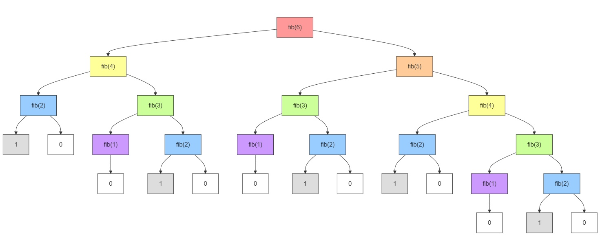
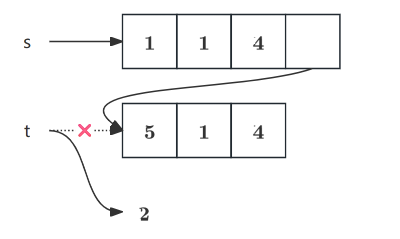
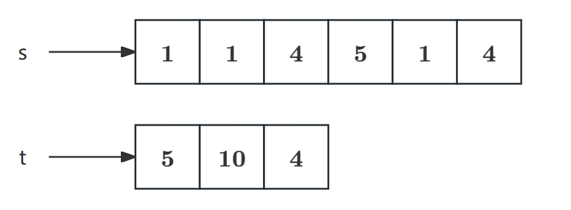
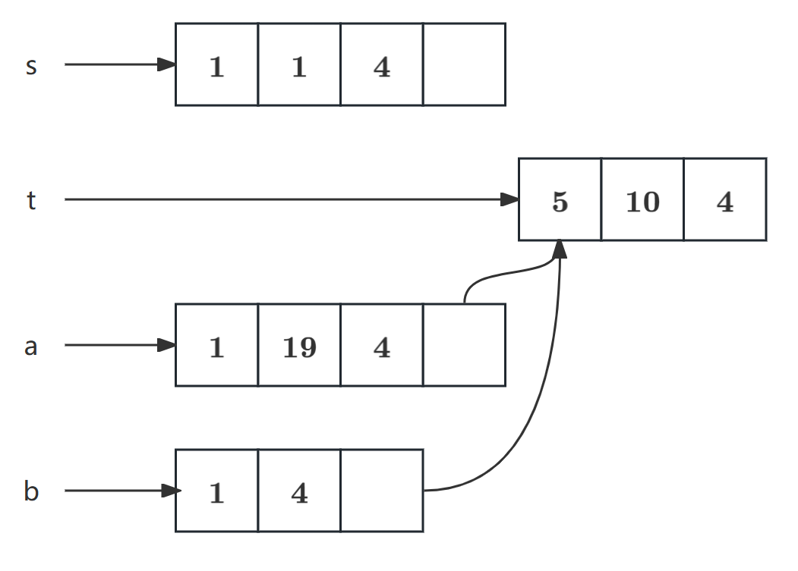
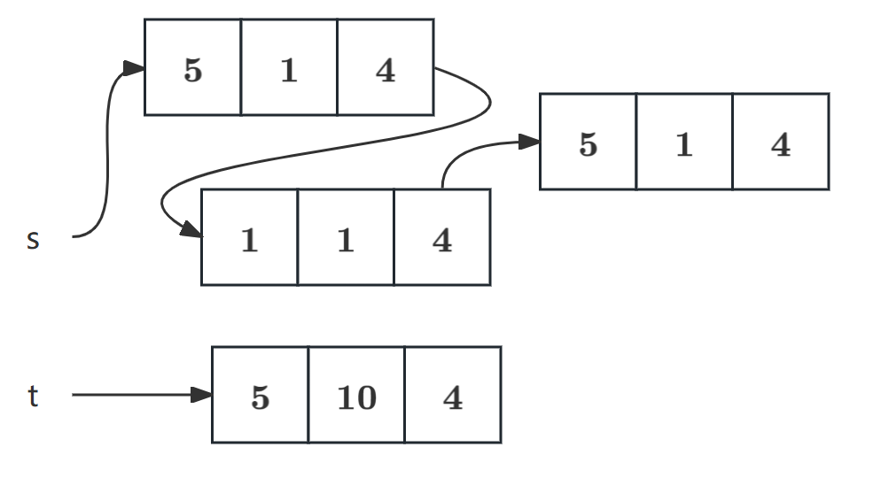
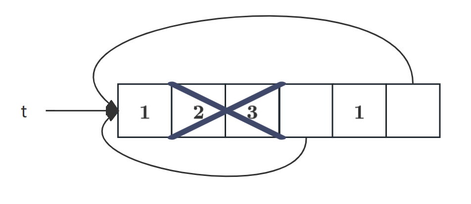

> 注：本节内容比较杂，主要用于收尾教材第二章内容。
# 对象系统应用：实现链表与树
+ 之前我们已经用python自带的`list`实现了[链表](/posts/computer-science/cs61a/cs61a-chapter-6/#链表linked-lists)与[树](/posts/computer-science/cs61a/cs61a-chapter-6/#树trees)，现在我们来自己定义链表类与树类。
<Note type="info" title="OOP的好处">
  使用对象系统定义的好处是，我们不需要考虑其属性的具体数据类型，无论是列表、元组或是字典都可以兼容。
</Note>
+ 这里我们直接拿homework里的代码实现解释：<Spoiler title="你知道的太多了">懒得手搓</Spoiler>
> 这里主要是为了展示对象系统的可拓展性与灵活性，真正实用性不如其他语言~~拿这个肯定过不了OJ~~
## 链表类（Linked-list Class）
```python
class Link:
    """A linked list.

    >>> s = Link(1)
    >>> s.first
    1
    >>> s.rest is Link.empty
    True
    >>> s = Link(2, Link(3, Link(4)))
    >>> s.first = 5
    >>> s.rest.first = 6
    >>> s.rest.rest = Link.empty
    >>> s                                    # Displays the contents of repr(s)
    Link(5, Link(6))
    >>> s.rest = Link(7, Link(Link(8, Link(9))))
    >>> s
    Link(5, Link(7, Link(Link(8, Link(9)))))
    >>> print(s)                             # Prints str(s)
    (5 7 (8 9))
    """
    empty = () # 设置空链表

    def __init__(self, first, rest=empty):
        assert rest is Link.empty or isinstance(rest, Link) # 保证rest是链表或空链表
        self.first = first
        self.rest = rest

    def __repr__(self):
        """输出链表的表示。"""
        if self.rest is not Link.empty:
            rest_repr = ', ' + repr(self.rest)
        else:
            rest_repr = ''
        return 'Link(' + repr(self.first) + rest_repr + ')'

    def __str__(self):
        """形式化输出链表。"""
        string = '('
        while self.rest is not Link.empty:
            string += str(self.first) + ' '
            self = self.rest
        return string + str(self.first) + ')'
```
基于这个类，我们可以实现一些链表的功能，比如：
1. `range`功能（返回连续整数构成的链表）
    ```python
    def range_link(start, end):
    """Return a Link containing consecutive integers from start to end.
    >>> range_link(3, 6)
    Link(3,Link(4,Link(5)))
    """
    if start >= end:
        return Link.empty
    else:
        return Link(start, range_link(start +1, end))
    ```
2. `map`功能（对链表每个元素作用于函数）
    ```python
    def map_link(f,s):
        """Return a Link that contains f(x) for each x in Link s.
        >>> map_link(square, range_link(3, 6))
        Link(9,Link(16,Link(25)))
        """
        if s is Link.empty:
            return s
        else:
            return Link(f(s.first),map_link(f,s.rest))
    ```
3. `filter`功能（筛选满足特定条件的链表元素）
    ```python
    def filter_link(f, s):
        """Return a Link that contains only the elements x of Link s for which f(x) is a true value.
        >>> filter_link(odd,range_link(3, 6))
        Link(3,Link(5))
        """
        if s is Link.empty:
            return s
        filtered_rest = filter_link(f, s.rest)
        if f(s.first):
            return Link(s.first, filtered_rest)
        else:
            return filtered_rest
    ```
4. 构建有序链表（这里只给出插入函数）
```python
def add(s,v):
    """Add v to s, returning modified s."""
    assert s is not List.empty
    if s.first > v:
        s.first,s.rest = v , Link(s.first,s.rest)
    elif s.first < v and empty(s.rest):
        s.rest = Link(v)
    elif s.first < v:
        add(s.rest, v)
    return s
```
## 树类（Tree Class）
树类的实现就不多解释了，代码还是比较清晰的：
```python
class Tree:
    """A tree has a label and a list of branches.

    >>> t = Tree(3, [Tree(2, [Tree(5)]), Tree(4)])
    >>> t.label
    3
    >>> t.branches[0].label
    2
    >>> t.branches[1].is_leaf()
    True
    """
    def __init__(self, label, branches=[]):
        self.label = label
        for branch in branches:
            assert isinstance(branch, Tree)
        self.branches = list(branches)

    def is_leaf(self):
        return not self.branches

    def __repr__(self):
        if self.branches:
            branch_str = ', ' + repr(self.branches)
        else:
            branch_str = ''
        return 'Tree({0}{1})'.format(repr(self.label), branch_str)

    def __str__(self):
        return '\n'.join(self.indented())

    def indented(self):
        """按结构输出"""
        lines = []
        for b in self.branches:
            for line in b.indented():
                lines.append('  ' + line)
        return [str(self.label)] + lines
    
    def leaves(t):
        if t.is_leaf():
            return [t.label]
        else:
            all_leaves = []
            for b in t.branches:
                all_leaves.extend(label(b))
            return all_leaves

    def height(t):
        if t.is_leaf():
            return 0
        else:
            return 1 + max([height(b) for b in t.branches])
```
# 效率（Efficiency）
+ 下面我们对程序的效率进行分析，并尝试进行优化。这里的效率是指程序运行所需要的资源，包括运行时间与内存。
<Spoiler title="你知道的太多了">实际上就是时间与空间复杂度，学过数据结构的可以跳过</Spoiler>
## 测量效率
+ 直接测量程序的运行时间与内存是比较困难的，因为这与计算机自身的配置有关。但我们也可以通过程序本身对程序效率进行相对测量，比如衡量程序的操作次数。
+ 以下面的递归程序为例：
    ```python
    >>> def fib(n):
            if n == 0:
                return 0
            elif n == 1:
                return 1
            else:
                return fib(n - 2) + fib(n - 1)
    >>> fib(6)
    8
    ```
    下面将程序计算`fib(6)`的过程进行图示：
    
    这个结构就像一棵树，程序从根节点`fib(6)`开始，对整棵树进行遍历，最终得到结果。
+ 然而，这种算法的效率是很低的，因为其使用了大量冗余计算（如大量的`fib(2)`和`fib(1)`）。我们可以设计一个统计函数调用次数的函数：
    ```python
    >>> def count(f):
            def counted(n):
                counted.call_count += 1
                return f(n)
            counted.call_count = 0
            return counted
    ```
    运行结果：
    ```python
    >>> fib = count(fib)
    >>> fib(19)
    4181
    >>> fib.call_count
    13529
    ```
    可以看到，调用函数的次数增长甚至比斐波那契数列本身还快（可以证明其增长速率为指数级）
+ 上面的调用次数主要影响的是时间，而对于空间的衡量则需要了解python解释器的结构。
之前我们提到python中函数的调用与返回可以用栈帧（frame）表示，实际上对于每一个栈帧，其在函数首次调用时被创建并激活，而当其返回值到上一级时被回收。
+ 具体而言，对于上面的`fib`函数，其所需要的最大空间与其递归树的最大深度成正比（其最大深度实际上就是输入参数本身）。因此，`fib`函数的空间需求是较低的（相比时间而言）。
## 记忆化（Memoization）
+ 那么如何对这一函数进行优化呢？对于这种树递归的过程，我们常常可以用记忆化的方法提高效率。简单而言，程序会在函数返回时记录当前参数对应的返回值，以便在下次调用时直接使用。
+ 我们可以编写以下记忆化代码：
    ```python
    >>> def memo(f):
            cache = {}
            def memorized(n):
                if n not in cache:
                    cache[n] = f(n)
                return cache[n]
            return memorized
    ```
    使用例：
    ```python
    >>> counted_fib = count(fib)
    >>> fib = memo(count_fib)
    >>> fib(19)
    4181
    >>> counted_fib.call_count
    20
    >>> fib(34)
    5702887
    >>> counted_fib.call_count
    35
    ```
    可以看到函数的实际调用次数明显下降到了线性水平。
## 增长阶数（Orders of Growth）
+ 在衡量程序运行的效率时，我们会重点考察其与输入规模的关系（不考虑其他因素，且不考虑系数及常数项）。
+ 以下面这个程序为例：
    ```python
    from math import sqrt
    def count_factors(n):
        sqrt_n = sqrt(n)
        k, factors = 1, 0
        while k < sqrt_n:
            if n % k == 0:
                factors += 2
            k += 1
        if k * k == n:
            factors += 1
        return factors

    result = count_factors(576)
    ```
    这个函数计算了输入参数$n$的所有不超过$\sqrt{n}$的因子总数。其中，函数执行操作的总次数为：
    $$
    f(n)=w\times\sqrt{n}+v
    $$
    其中$w$为`while`语句内的操作数，$v$为`while`语句之外的操作数。
    而在实际计算效率中，我们会选择忽略`w`与`v`，只关注$f(n)$的增长量级（这里为$\sqrt{n}$）。
+ 因此，我们使用$\Theta$表示算法的渐近性能，而用$R(n)$表示与参数$n$相关的资源量（时间或内存）。
+ 二者的关系：如果存在正数$k_1$和$k_2$（与$n$无关），使得对于任何大于某个最小值$m$的$n$，成立如下不等式：
    $$
    k_1\cdot f(n)\leq R(n)\leq k_2\cdot f(n)
    $$
    则称$R(n)$的增长阶为$\Theta(f(n))$。比如上面的函数增长阶即为$\Theta(\sqrt{n})$。
    > 当然一些情况下也用$O(f(n))$表示，此时就只考虑下界。
## 增长类别
+ 下面给出一些确定增长阶的原则：
    1. 常数项：常数项不会对增长阶产生影响，即使常数很大。（因为总存在对应的上下界）
    2. 对数：对数的底数不会影响增长阶（如$\log_2(n)$与$\log_{10}(n)$的增长阶相同），因为改变底数相当于乘以常数。
    3. 嵌套：当算法存在嵌套操作（如嵌套循环）时，其增长阶是内部增长阶与外部增长阶的乘积。
    4. 低阶项：当$n\to\infty$时，次数最高的项会占增长阶的主导，所以一般我们不考虑低于最高次数的项。
+ 通过这些原则，我们可以列出以下常见增长阶：
    |类别|表示|
    |:-:|:-:|
    |常数|$\Theta(1)$|
    |对数|$\Theta(\log_n)$|
    |线性|$\Theta(n)$|
    |平方|$\Theta(n^2)$|
    |指数|$\Theta(b^n)$|

# 集合（Set）
+ 除了列表，元组，字典之外，python还支持第四种内置容器：集合。与数学中的集合一样，其使用大括号表示，且没有重复元素，具有无序性：
```python
>>> s = {3, 2, 1, 4, 4}
>>> s
{1, 2, 3, 4}
```
+ python中的集合还支持以下操作：
    + 是否属于集合`in`；
    + 集合大小`len`；
    + 计算并集`union`；
    + 计算交集`intersection`等。（更多功能可见[Documentation: set](https://docs.python.org/3/library/stdtypes.html#set)）
    
    示例：
    ```python
    >>> 3 in s
    True
    >>> len(s)
    4
    >>> s.union({1, 5})
    {1, 2, 3, 4, 5}
    >>> s.intersection({6, 5, 4, 3})
    {3, 4}
    ```
> 教材中还讲了利用链表与树实现集合，笔者觉得有点复杂，还涉及到平衡二叉树的知识，故作略，待CS61B上再处理。
+ 当然，与`list`不同，`set`内的元素不能是可变数据（如列表，字典或其他集合）。
不过我们可以使用`frozenset`，其在创建后就无法增删元素，但其可以作为字典的键，或者作为其他集合的元素：
    ```python
    fs = frozenset([1, 2])
    d = {fs: "ok"}   
    s = {frozenset([1,2]), frozenset([3,4])}  
    ```
    其他功能均与`set`相同。

# 列表的图示
+ 下面我们通过例子展示如何通过可视化列表解释列表的操作：
+ 定义列表：
```python
s = [1,1,4]
t = [5,1,4]
```
|代码|结果|图示|
|:---:|:---:|:---:|
|`s.append(t)` <br/> `t = 2`|`s: [1,1,4,[5,1,4]]` <br/> `t: 2`||
|`s.extend(t)` <br/> `t[1] = 0`|`s: [1,1,4,5,1,4]`<br/>`t: [5,0,4]`||
|`a = s + [t]`<br/>`b = A[1:]`<br/>`A[1] = 9`<br/>`B[2][1] = 0`|`s: [1,1,4]`<br/>`t: [5,0,4]`<br/>`a: [1,9,4,[5,0,4]]`<br/>`b: [1,4,[5,0,4]]`||
|`s[0:0] = t`<br/>`s[5:] = t`<br/>`t[1] = 0`|`s: [5,1,4,1,1,5,1,4]`<br/> `t: [5,0,4]`||
|`t = s.pop()`|`s: [1,1]`<br/>`t: 4`||
|`t.extend(t)`<br/>`t.remove(5)`|`s: [1,1,4]`<br/>`t: [1,4,5,1,4]`||
|`s[:1] = []`<br/>`t[0:3] = []`|`s: [1,4]`<br/>`t: []`||
|`t = [1,2,3]`<br/>`t[1:3] =[t]`<br/>`t.extend(t)`|`t = [1,[...],1,[...]]`||
____
<Text type="rainbow">CS61A前半部分完结！</Text>

