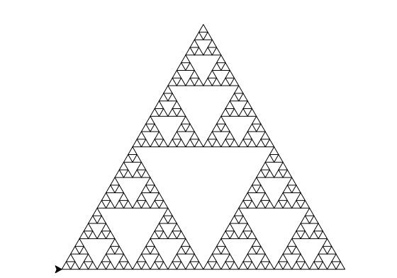

本节我们将介绍Scheme表达式的基本表示和用法。
## 表达式
+ 在Scheme中，表达式的结构为：`(操作符 操作数1 操作数2 ...)`【前缀表示法】。
    + 操作符本身可理解为一个函数（在Scheme中称为**过程（procedure）**），而操作数则可以理解为函数的参数，所以其本身也可以再嵌套表达式（类似函数的调用）。
+ 示例：
```scheme
(quotient 10 2)
(+ (* 3 5) (- 10 6))
```
+ 另外，表达式也可以写成多行（这样结构更清晰）：
```scheme
(+ (* 3
      (+ (* 2 4)
         (+ 3 5)))
   (+ (- 10 7)
      6))
```
+ 在对表达式求值时，和python类似，程序会先计算操作数的值，然后将其作为参数使用操作符进行求值。（若有嵌套则递归求值）
### 条件语句
+ Scheme中`if`语句的结构为：`(if <测试条件> <then分支> <else分支>)`。
    + 根据测试条件（数或表达式的值）决定执行：如果测试条件为真，则执行`<then分支>`，否则执行`<else分支>`。
+ 测试条件示例：`(>= 2 1)`，等价于`if 2 >= 1`。
    + scheme中也内置了一些测试条件，比如`number?`（判断是否为数字），`zero?`（判断是否为0），`integer?`（判断是否为整数）等。
+ Scheme中用`#t`代表`True`，`#f`代表`False`，我们可以用逻辑表达式对条件进行组合，比如：
    ```scheme
    > (and (>= 2 1) (< 2 3))
    #t
    > (or #f (< 2 3))
    #t
    > (not (= (+ 1 1) 3))
    #t
    ```
+ 对于多个`if`判断语句（`if-elif-else`结构），可以使用`cond`：
    <div className="code-compare">
    ```scheme
    (cond ((> x 10) (print 'big))
          ((> x 5) (print 'medium))
          (else (print 'small)))
    ```

    ```python
    if x > 10:
        print('big')
    elif x > 5:
        print('medium')
    else:
        print('small')
    ```
    </div>
    > 当然，上面条件分支里面的`print`也可以统一提到外面。
### 其他特殊语句
+ `begin`：begin用于顺序执行多个表达式，并返回最后一个表达式的值：
<div className="code-compare">
```scheme
(cond ((> x 10) (begin (print 'big) (print 'guy)))
      (else (begin (print 'small) (print 'fry))))

```

```python
if x > 10:
    print('big')
    print('guy')
else:
    print('small')
    print('fry')
```
</div>
+ `let`：与`define`类似，但只用于临时定义变量（定义所在语句执行后变量释放），可用于定义局部变量：
```scheme
(define c (let ((A 3)
                (b (+ 2 2)))
               (sqrt (+ (* a a) (* b b)))))
```
上面语句执行输出`5`后，`a`和`b`就释放了。
## 定义
+ 我们可以使用`define`作为操作符定义变量：
    ```scheme
    > (define pi 3.14)
    > (* pi 2)
    6.28
    ```
+ 还可以用`define`来定义函数（过程）：
    ```scheme
    > (define (square x) (* x x))
    > (square 16)
    256
    ```
    其定义格式为：`(define (<name> <formal parameters>) <body>)`，其中`<body>`为一个表达式，`<name>`为函数名称，`<formal parameters>`为函数参数（可以多个）。
    + 我们还可以像python一样定义嵌套函数，使用递归：
    ```scheme
    (define (sqrt x)
      (define (good-enough? guess)
        (< (abs (- (square guess) x)) 0.001))
      (define (improve guess)
        (average guess (/ x guess)))
      (define (sqrt-iter guess)
        (if (good-enough? guess)
            guess
            (sqrt-iter (improve guess))))
      (sqrt-iter 1.0))
    (sqrt 9) 
    ```
    作为对照，我们给出相应的python版本：
    ```python
    def sqrt(x):
        def good_enough(guess):
            return abs(guess**2 - x) < 0.001
        def improve(guess):
            return (guess + x / guess) / 2
        def sqrt_iter(guess):
            if good_enough(guess):
                return guess
            else:
                return sqrt_iter(improve(guess))
        return sqrt_iter(1.0)
    print(sqrt(9))
    ```
+ 使用`lambda`可以定义匿名函数：
    + 格式为：`(lambda (<formal-parameters>) <body>)`，除了不需要函数名称之外与`define`基本相同；
    + 下面两种定义等价：
    ```scheme
    (define (plus4 x) (+ x 4))
    (define plus4 (lambda (x) (+ x 4)))
    ```
    + `lambda`函数在定义时也可直接作为运算符被使用：
    ```scheme
    > ((lambda (x y z) (+ x y (square z))) 1 2 3)
    12
    ```
## 复合类型
+ 在Scheme中还有一种内置的数据结构`pair`（可理解为两个元素构成的数组），其通过操作符`cons`构建，元素通过`car`和`cdr`进行访问：
    ```scheme
    > (define x (cons 1 2))
    > x
    (1 . 2)
    > (car x)
    1
    > (cdr x)
    2
    ```
    <Note type="primary" title="有趣的知识">
    关于`cons`，`car`，`cdr`名称的来源：
    + `cons`源自**cons**truction；
    + `car`源自**C**ontents of the **A**ddress part of **R**egister number；（寄存器编号地址部分的内容）
    + `cdr`源自**C**ontents of the **D**ecrement part of **R**egister number；（寄存器减量部分的内容）
    
    这些名字最初来源于Lisp首次被实现所使用的硬件环境中内存空间的名字。
    </Note>
+ 基于`pair`，Scheme还提供了`list`这一数据结构（可理解为链表+列表）。使用示例如下：
    ```scheme
    > (cons 1
        (cons 2
            (cons 3
                  (cons 4 '()))))
    (1 2 3 4)
    > (list 1 2 3 4)
    (1 2 3 4)
    > (define one-through-four (list 1 2 3 4))
    > (car one-through-four)
    1
    > (cdr one-through-four)
    (2 3 4)
    > (car (cdr one-through-four))
    2
    > (cons 10 one-through-four)
    (10 1 2 3 4)
    > (cons one-through-four 5)
    ((1 2 3 4) . 5)
    ```
    > 注：在scheme中，空表用`'()`表示，而在Common Lisp中，空表则可用`nil`表示。
    + 可使用`null?`判断`list`是否为空。由此我们可以定义取`list`长度和根据索引取元素的函数：
    ```scheme
    > (define (length items)
        (if (null? items)
            0
            (+ 1 (length (cdr items)))))
    > (define (getitem items n)
        (if (= n 0)
            (car items)
            (getitem (cdr items) (- n 1))))

    > (define squares (list 1 4 9 16 25))
    > (length squares)
    5
    > (getitem squares 3)
    16
    ```
+ 对于`list`，再补充一些常用操作符（可对照python）：
    + `(append s t ...)`：将多个列表拼接；
    + `(map f s)`：对`s`中的每个元素分别调用`f`，并将结果组成一个列表；
    + `(filter f s)`：对`s`的每个元素调用`f`，并将返回结果为真的`s`元素组成一个列表；
    + `(apply f s)`：将列表`s`的所有元素作为参数，并调用`f`。
## 符号数据
+ 前面我们的所有操作数基本都是数字（或变量）组成的，但Scheme也能将符号本身作为操作数据（类似字符串），只需要在符号之前加一个单引号：
    ```scheme
    > (define a 1)
    > (define b 2)
    > (list a b)
    (1 2)
    > (list 'a 'b)
    (a b)
    > (list 'a b)
    (a 2)
    ```
+ 当然，关键字符号本身也可以作为操作数：
    ```scheme
    > (list 'define 'list)
    (define list)
    ```
+ 而如果在括号外面加单引号，就可以将括号内的所有内容作为符号组成列表：
    ```scheme
    > (car '(a b c))
    a
    > (cdr '(a b c))
    (b c)
    ```
___
除了以上的功能，Scheme还提供了许多其他的功能（可见[manual](https://man.scheme.org/)），不过目前的功能已经能让我们实现许多我们之前涉及的概念了。
> 补充：Scheme语言添加单行注释使用`;`符号，与python的`#`等价。
## 绘制图形
+ 虽然Scheme本身不支持绘图，但Lisp的另一种方言——Logo具有绘图功能（被称为Turtle Graphics）。
    + 具体而言，程序可以控制一个“海龟”从一个画布的中心出发，根据特定的程序命令来移动和转向，并在它移动的过程中留下轨迹。
    + 比如：`fd 20`（向前20个单位），`rt 144`（向右旋转144度），`penup`和`pendown`（控制是否留下轨迹）等。
+ 当然python也继承了这一功能，可见[官方文档](https://docs.python.org/zh-cn/3/library/turtle.html)。
    + 下面使用python的turtle库绘制谢尔宾斯基三角形：
    ```python
    import turtle

    t = turtle.Turtle()
    t.speed("fastest")
    t.penup()
    t.goto(-200, -150) 
    t.pendown()

    def repeat(k, fn):
        """重复执行函数 fn k 次"""
        for _ in range(k):
            fn()

    def tri(fn):
        """执行 fn 三次，每次之后左转 120 度"""
        repeat(3, lambda: (fn(), t.left(120)))

    def leg(d, k):
        """递归绘制一条边"""
        sier(d / 2, k - 1)
        t.penup()
        t.forward(d)
        t.pendown()

    def sier(d, k):
        """绘制谢尔宾斯基三角形，边长 d，递归深度 k"""
        tri(lambda: t.forward(d) if k == 1 else leg(d, k))

    sier(400, 6)

    turtle.done()
    ```
    得到结果如下：