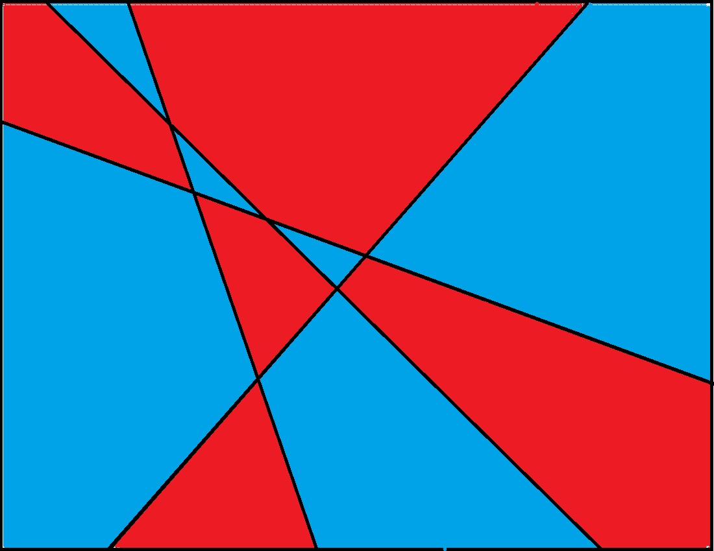
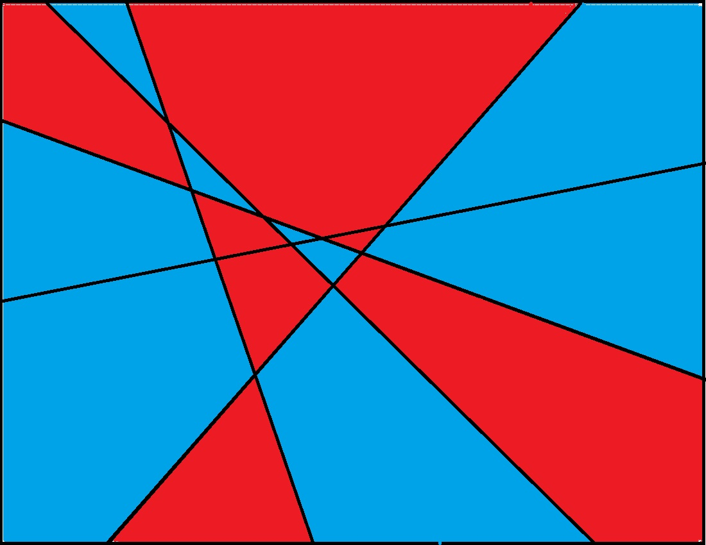
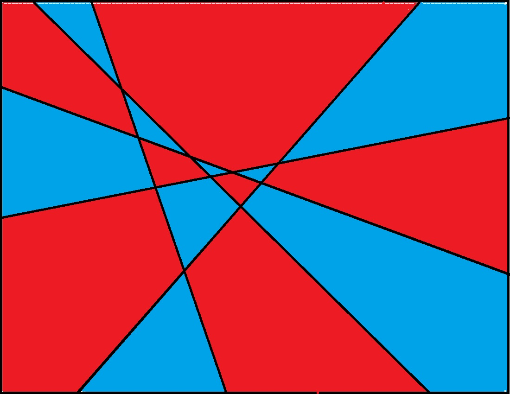

# 数学归纳法(Mathematical Induction)
+ 归纳法的重要性：
  + 在分析程序的递归部分时，会使用到归纳法
  + 分析循环时，也会用到归纳法
+ 数学归纳法常用于证明某个的命题对于任意$n$（通常是自然数）成立。
+ 数学归纳法的要素：
  + **归纳假设(Induction Hypothesis)：** 假设命题在$n=k$时成立(为后面归纳步提供条件)
  + **归纳步(Inductive step)：** 即命题满足当$n=k$时成立，那么$n=k+1$时也成立
    + 这样可以得到$n\geq k$时命题均成立
  + **初始条件(Base case)：** 结合命题的初始条件，确定$k$的初始值$k_{0}$
  + 由此可得命题在$n\geq k_{0}$时均成立，即命题成立。
## 例1：平面染色问题
+ 将一个平面区域用$n$条直线分割，证明：只需用两种颜色便可以把相邻区域区分开，即整个平面只需要用两个颜色划分区域。
[](https://see-math.math.tamu.edu/SEE-ProgDescAct/articles/MapColoring/MapColoring-Students.html)
+ 证明：
  + 初始条件：当$n=0$和$n=1$时，结论显然成立（$n=0$时只要一个颜色，$n=1$时一侧用一个颜色）
  + 归纳假设：假设命题在$n=k$时成立($k\geq 1$)，下证$n=k+1$时也成立
  + 归纳步骤：
    + 取$n=k$时的染色图 
    + 在图上加入第$k+1$条直线 
    + 让直线一侧的区域颜色保持不变，让直线另一侧区域颜色取反 
    + 这样得到新的染色图，满足命题的要求（因为以新加的线为界的两个区域颜色不同，而以旧的线为界的两个区域已经满足颜色不同）
  + 证明完成。
# 加强归纳假设
+ 有时原始命题不太容易用数学归纳法证明，但如果将命题的条件加强，或许可以使证明更加容易，并且加强后的命题可以推得原始命题成立。
## 例2
+ 证明：对于任意$n\geq 1$，前$n$个奇数之和是完全平方数。
  + 初始条件：当$n=1$时，$1$是完全平方数，成立。
  + 归纳假设（原始）：假设命题在$n=k$时成立($k\geq 1$)，即前$k$个奇数之和为完全平方数，设为$m^2$。
  + 归纳步骤：
    + 前$k+1$个奇数之和为$m^2+2k+1$。
+ 此时我们会发现似乎推进不下去了，我们无法证明$m^2+2k+1$一定是完全平方数。
+ 于是我们换个思路，先试试前几个奇数的和，尝试寻找规律：
  + $n=1$时，$1=1^2$，
  + $n=2$时，$1+3=2^2$，
  + $n=3$时，$1+3+5=3^2$，
  + $n=4$时，$1+3+5+7=4^2$
+ 我们惊喜地发现，似乎前$n$个奇数的和恰好等于$n^2$！那么我们就可以重新确定命题：
+ 命题（加强）：对于任意$n\geq 1$，前$n$个奇数之和等于$n^2$。
+ 证明：
  + 初始条件：当$n=1$时，$1=1^2$，成立。
  + 归纳假设（加强）：假设命题在$n=k$时成立($k\geq 1$)，即前$k$个奇数之和等于$k^2$。
  + 归纳步骤：前$k+1$个奇数之和为$k^2+2k+1=(k+1)^2$，故命题在$n=k+1$时成立。
  + 证明完成。
## 例3
+ 证明：对于任意$n\geq 1$，$\sum_{i=1}^n \frac{1}{i^2}\leq 2$。
  + 如果尝试直接使用数学归纳法：
    + 初始条件：当$n=1$时，$1\leq 2$，成立。
    + 归纳假设：假设命题在$n=k$时成立($k\geq 1$)，即$\sum_{i=1}^k \frac{1}{i^2}\leq 2$。
    + 归纳步骤：
      + $\sum_{i=1}^{k+1} \frac{1}{i^2}=\sum_{i=1}^k\frac{1}{i^2}+ \frac{1}{(k+1)^2}$。
      + 但如果$\sum_{i=1}^k \frac{1}{i^2} >2-\frac{1}{(k+1)^2}$，那么$\sum_{i=1}^{k+1} \frac{1}{i^2}>2$，命题在$n=k+1$时就不成立。
+ 如何规避上面的情况？我们需要加强一下命题：
+ 命题（加强）：对于任意$n\geq 1$，$\sum_{i=1}^n \frac{1}{i^2}\leq 2-\frac{1}{n}$。
  + 证明：
    + 初始条件：当$n=1$时，$1\leq 2-\frac{1}{1}$，成立。
    + 归纳假设：假设命题在$n=k$时成立($k\geq 1$)，即$\sum_{i=1}^k \frac{1}{i^2}\leq 2-\frac{1}{k}$。
    + 归纳步骤：
      + $\sum_{i=1}^{k+1} \frac{1}{i^2}=\sum_{i=1}^k\frac{1}{i^2}+ \frac{1}{(k+1)^2} \leq 2-\frac{1}{k}+\frac{1}{(k+1)^2}$,
      + 又$2-\frac{1}{k}+\frac{1}{(k+1)^2}<2-\frac{1}{k}+\frac{1}{k(k+1)}=2-\frac{1}{k+1}$，故$\sum_{i=1}^{k+1} \frac{1}{i^2}\leq 2-\frac{1}{k+1}$，即命题在$n=k+1$时成立。
    + 证明完成。
# 弱归纳 vs 强归纳(Simple Induction vs. Strong Induction)
+ 在原有数学归纳法（可称为弱归纳法）的基础上，稍作改动：
  + 初始条件和归纳步骤不变；
  + 归纳假设改为：假设$n=1,2,\cdots,k$时命题均成立（即$\land_{i=0}^k P(k)$为真）
  + 这样得到的归纳称为强归纳。
+ 本质上和弱归纳法没什么区别，但因为归纳假设条件更强，在证明一些命题时会有更高的效率    
  ~~其实这两种归纳法就是第一数学归纳法和第二数学归纳法~~
## 例4
+ 证明：任意大于$1$的整数$n$都可以表示为一个或多个质数的乘积。
+ 设命题$P(n)$为：整数$n$可以表示为一个或多个质数的乘积，下证$n\geq 2$时$P(n)$均为真。
+ 证明：
  + 初始条件：$n=2$时，$2$为质数，故$P(2)$为真。
  + 归纳假设：假设$P(n)$在$2\leq n\leq k$时均为真。
  + 归纳步骤：
    + 对于$P(n+1)$,
      1. $n+1$是质数，那么$P(n+1)$一定为真
      2. $n+1$不是质数，那么它一定能分解为两个比它小的数的乘积，即$n+1=xy (2\leq x,y <n+1)$
      3. 又由归纳假设，$P(x)$和$P(y)$均为真，故$xy$一定可以分为若干个质数的乘积，即$P(n+1)$为真。
  + 证明完成。
+ 注：我们会发现，如果只用弱归纳法，无法顺利推得命题成立（因为“$P(x)$和$P(y)$均为真”这个条件无法直接得到）
+ 另一方面，我们也可以发现，如果将$P(2)\land P(3)\land\cdots \land P(n)$看作$Q(n)$，那么对$Q(n)$的归纳就可以用弱归纳法了。（即弱归纳和强归纳等价）
# 归纳，递归，与编程(Recursion, programming and induction)
+ 归纳与递归之间有很紧密的联系，下面我们以两个例子说明：
## 例5：斐波那契数列(Fibonacci sequence)
+ 我们直接列出斐波那契数列${F(n)}$的递推式：
  + $F(0)=0$
  + $F(1)=1$
  + $F(n)=F(n-1)+F(n-2) (n\geq 2)$
+ 事实上，我们可以证明，当$n$足够大时，$F(n)$会以指数级增长。
  + 具体来说，当$n\geq 3$时，$F(n)\geq 2^{\frac{n-1}{2}}$.
  + 我们可以用数学归纳法证明：
    + $n=3$时，$F(3)=2\geq 2^1$，$n=4$时，$F(4)=2\geq 1.5=2\sqrt{2}$
    + 假设$n=k,k+1 (k\geq 3)$时均成立，那么$F(k+2)=F(k)+F(k+1)\geq 2^{\frac{k-1}{2}}+2^{\frac{k}{2}}=2^{\frac{k-1}{2}}\times(1+\sqrt{2})>2^{\frac{k-1}{2}}\times 2=2^{\frac{k+1}{2}}$，故$n=k+2$时成立。
    + 证明完成。
+ 下面我们尝试写一段计算斐波那契数列第$n$项的递归程序：
```python
def F(n):
  if (n==0): return 0
  elif (n==1): return 1
  else: return F(n-1) + F(n-2)
```
+ 可以用归纳法证明：以上程序的运行次数至少为$F(n)$的值！
+ 所以以上递归算法的效率很低，我们尝试进行一些改进（事实上，这是一个典型地将尾递归算法改为递推算法的例子）：
```python
def F_2(n):
  if (n==0): return 0
  if (n==1): return 1
  a = 1
  b = 0
  for k in range(2,n+1):
    temp = a
    a = a + b
    b = temp
  return a
```
+ 这次程序的运算次数降到了$n$。

## 例6：二分查找(Binary Search)
+ 以在一个字典$D$中查找一个特定的单词$W$为例
+ 伪代码：
```
// 前提: W是需要查找的单词，而D是一个字典的一部分（至少有1页）
// 后置条件: 结果返回单词W的定义，或者返回“未找到W”
findWord(W，D){
  // 初始条件
  if (D恰好只有1页)
    直接在D中暴力搜索W;
    如果找到W,返回它的定义;否则返回“未找到W”;
  // 递归条件
  设W'为D中间页的第一个词;
  if (W在W'之前)
    return findWord(D的前半部分)
  else
    return findWord(D的后半部分)
}
```
+ 以下用强归纳法证明`findWord()`这个算法是合理的（即要么返回单词W的定义，要么就返回“未找到W”）：
  + 设$n$为$D$的页数，
  + 初始条件：$n=1$，则由代码`if (D恰好只有1页)`部分可知符合要求；
  + 归纳假设：假设`findWord()`对任意$1\leq n\leq `$均合理；
  + 归纳步骤：
    + 我们需要证明$n=k+1$时`findWord()`合理；
    + 由代码`设W'为D中间页的第一个词;`及后面部分可知，W要么在W'的前半部分，要么在W'后半部分；
    + 此时D的页数变少($\leq k$)，满足归纳假设，故能否返回合理的结果。
  + 证明完成。
# 错误的归纳法证明
+ 有时，错误的归纳证明会得到荒谬的结论。下面用一个经典的例子阐述（这个例子由著名数学家George Pólya提出）。
## 例7：所有马颜色相同？
+ 以下为数学归纳的过程：
  + 初始条件：设$n$为马的数量，那么$n=1$时，命题显然成立；
  + 归纳假设：$n=k$时命题成立（即任意$k$匹马颜色相同）
  + 归纳步骤：
    + 将$k+1$匹马列为$\{h_{1},h_{2},\cdots,h_{k+1}\}$
    + 那么由归纳假设，$\{h_{1},h_{2},\cdots,h_{k}\}$与$\{h_{2},h_{3},\cdots,h_{k+1}\}$ 两组马各自都有相同的颜色。
    + 而又因为$\{h_{2},h_{3},\cdots,h_{k}\}$同时属于这两个集合，所以$\{h_{1},h_{2},\cdots,h_{k+1}\}$颜色均相同，即$n=k+1$时命题成立
  + 证明完成……了吗？
+ 问题出在哪？实际上，问题就出在初始条件的设定：
+ 我们只得到了$n=1$是命题成立，但当$n=2$时，$\{h_{1}\}$和$\{h_{2}\}$中间就没有重叠部分，所以它们颜色可以不同。
+ 所以，在进行数学归纳法时，一定要确保命题推理的“多米诺骨牌”不要中断。
# 关于归纳法的补充
## 归纳法的源头：皮亚诺公理
+ 皮亚诺公理(peano's axioms)是由皮亚诺提出的一种自然数的公理化体系，用符号逻辑描述“自然数”的本质：
+ 形式如下(以$0$为第一个自然数)：
  1. $0$属于自然数；
  2. 对于每一个自然数$n$，都存在一个后继数$S(n)$，也是自然数；
  3. $0$ 不是任何数的后继数($\forall n,S(n)\neq 0$)
  4. 不同的数有不同的后继($m\neq n\Longrightarrow S(m)\neq S(n)$)
  5. **归纳公理(Induction Axiom)**：对于任意性质$P(n)$，若$P(0)$成立，且对任意自然数$k$，若$P(k)$成立则$P(S(k))$成立，那么对所有自然数$n$，$P(n)$都成立。
+ 可以看出，在这套公理体系下，数学归纳法被假定为自然数的基本性质。
## 归纳法原理的等价原理：最小数原理
+ 最小数原理(Well-ordering principle)：任意非空自然数子集$S\subseteq\mathbb{N}$都存在最小元素。
+ 从最小数原理推导到数学归纳法：
  + 设$P(n)$为一个命题，满足$P(0)$成立，且对任意$k$，$P(k)$成立时，$P(k+1)$也成立。证明对所有$n$，$P(n)$成立。
  + 证明：
    + 假设命题不成立，即存在使$P(n)$不成立的自然数组成非空集合$A$；
    + 由最小数原理，$A$存在最小元素$m$；
    + 因为$P(0)$成立，故$m\neq 0$，所以存在$k=m-1$；
    + 又$P(m)$为最小的不成立命题，所以$P(k)$成立。由归纳假设，$P(k+1)$成立，即$P(m)$成立。
    + 推出矛盾，故$A$为空集，即对所有$n$，$P(n)$均成立。
  + 证明完成。