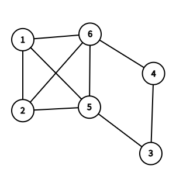
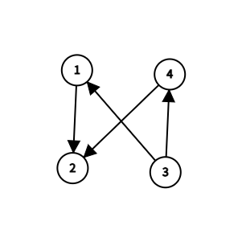
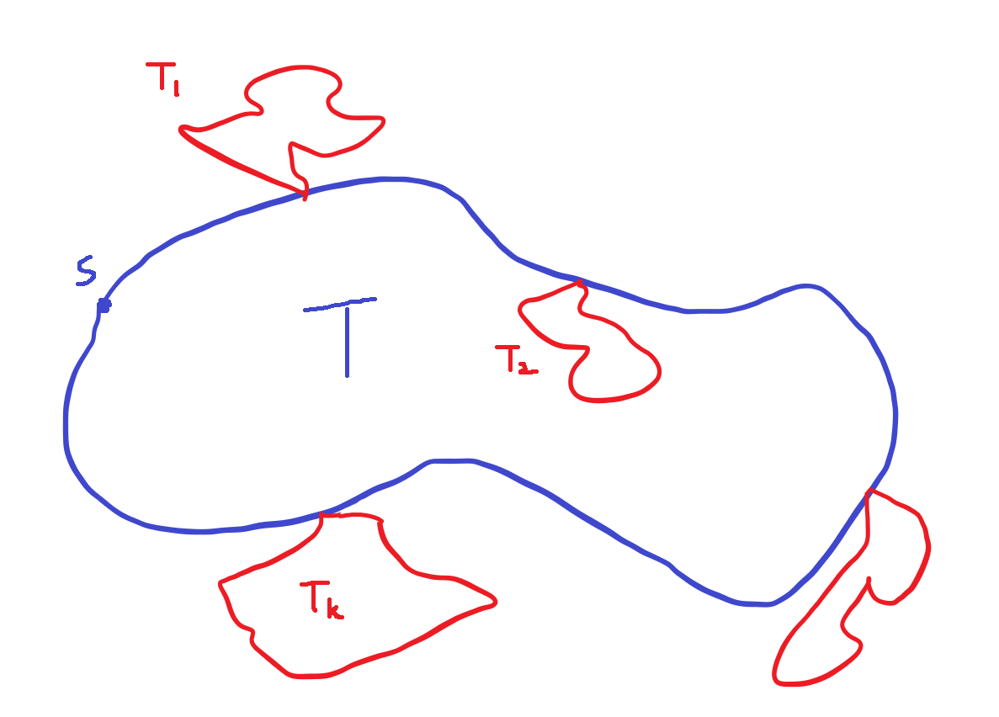
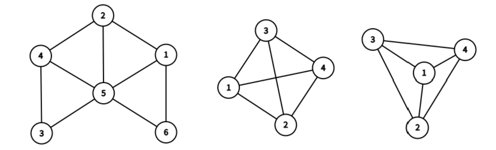
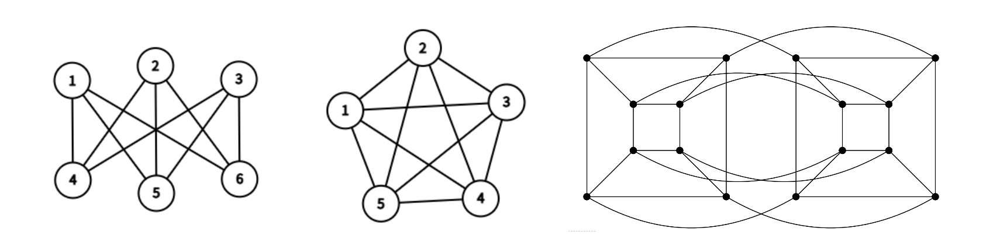
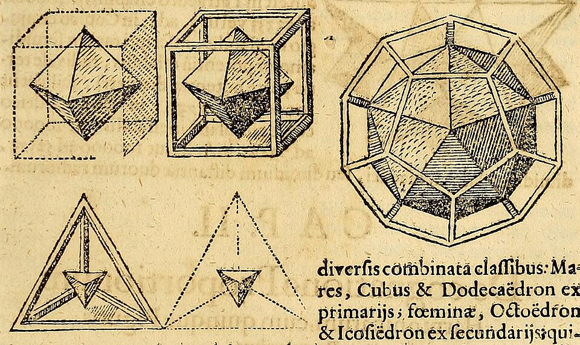
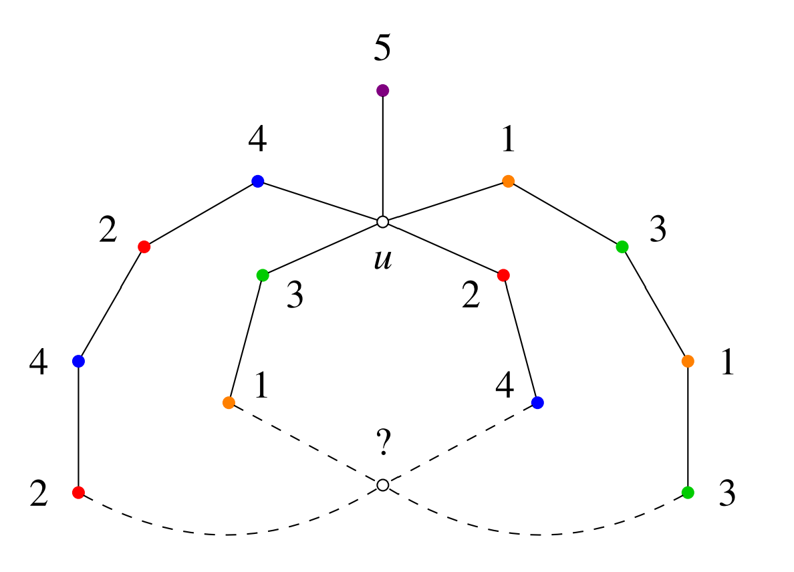
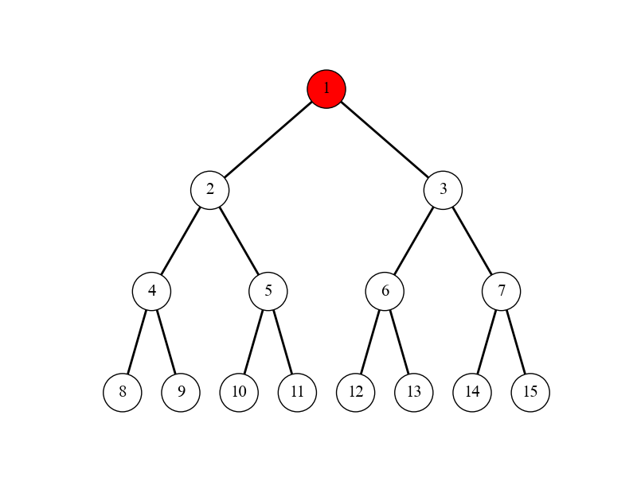

# Introduction of Graph Theory
+ 从本节开始，我们将讨论图论中的一些知识。在开始之前，首先明确：图论在计算机科学中有什么用？
  + 图（Graphs）适合用于将大数据（big data）及之间的关系抽象化（abstraction，即使用一个简单的模型提取复杂情况的本质）
  + 图论对于进一步理解并应用归纳法有很大的作用。
+ 在现实生活中，很多地方都存在图（当存在大量关系时也被称为网络network），比如互联网，地图，大脑的神经元网络，社交网络等……
+ 图论可以解决许多问题：网页搜索推荐（Pagerank），染色问题，排线问题等。
+ 目前公认的图论起源是1736年欧拉关于哥尼斯堡七桥问题的文章。他将陆地与桥的关系抽象为点与线，将七桥问题抽象为一笔画问题，使得对于问题的证明更加简单。（这也是拓扑学的起源）
# 正式定义
## 无向图(undirected graph)
+ 对于一个（无向）图而言，它包含两个集合：顶点集$V$和边集$E$。顾名思义，顶点集包含图里的所有顶点，而边集包含图里的所有边。
+ 以下图为例：
在这张图中，$V=\{1,2,3,4,5,6\}$，$E=\{\{1,2\},\{1,5\},\{1,6\},\{2,5\},\{2,6\},\{3,4\},\{3,5\},\{4,6\},\{5,6\}\}$
+ 当然，实际上$E$实际上可以有重复的元素（如上面的七桥问题就是），但为了方便起见，我们不考虑重复元素的情况，将$E$视为集合。
## 有向图(directed graph)
+ 在无向图的基础上，我们还可以规定每条线的方向（起点与终点），这样就得到了有向图。图例如下：

则在这张图中，$V=\{1,2,3,4\}$，$E=\{(1,2),(3,1),(3,4),(4,2)\}$
+ 这里$E$是$V\times V$的子集（回顾：$U\times V=\{(u,v)\mid u\in U,v\in V\}$）
+ 注意到，在有向图中，如果$(a,b)\in E$，那么$(b,a)\not\in E$。相应的，如果$(a,b)\in E$且$(b,a)\in E$，则对应的图为无向图。这是我们用$\{a,b\}$作为$E$的元素。
+ 将$V$和$E$归结，我们将图（包括无向图与有向图）定义为$G=(V,E)$。
## 相邻点(neighbours)，度(degree)与自环(self-loop)
+ 当两个顶点之间有边直接相连，则称两个顶点为相邻点，这样的边则被称为邻边。
+ 如果$G$为一个无向图，则图中顶点$u$的度为与$u$相连的边的数量，即$degree(u)=|\{v\in V:\{u,v\}\in E\}|$
  + 如果$u$的度为$0$，则称$u$为孤立顶点(isolated vertex)。
+ 如果$G$为有向图，那么图中每个顶点都会有两个度：**入度(in-degree)** 和**出度(out-degree)**。入度是指向$u$的边的数量，而出度是从$u$指出的边的数量。
+ 自环是指在图中起点与终点均为同一点的边（$\{u,u\}$或$(u,u)$）。一般而言，自环不会提供额外的信息，所以除非特别说明，我们默认图没有自环。
## 路径(path)，线路(walk)，环(cycle)与回路(tour或circuit)
+ 假设$G$为无向图。则一条路径可以被表示为一系列边的序列（如$\{v_1,v_2\},\{v_2,v_3\},\cdots,\{v_{n-1},v_n\}$，$v_1$到$v_n$两两不同，此时我们称$v_1$和$v_n$之间存在一条路径）。这里的路径要求不重复经过同一个顶点，所以也称为简单路径(simple path)。
+ 如果路径的起点与终点为相邻点（即存在$\{v_n,v_1\}$），那么路径加上起点与终点相连的边构成了一个环。此时就只记录环的起点。
+ 如果从$v_1$和$v_n$，允许有重复经过的顶点，那么这样的边序列被称为线路。
+ 类似环与路径的关系，如果允许环中有重复经过的顶点，那么就称为回路。
+ 特别地，如果一条线路恰好包含了图的所有边一次，那么就称为欧拉线路（Eulerian walk）；如果一个回路恰好包含图的所有边一次，就称为欧拉回路（Eulerian tour或Eulerian circuit）。
## 连通性(Connectivity)
+ 连通性是图论中的一个重要概念。如果一个图中任意两个顶点之间都存在一条路径，那么就称这张图是连通的。
+ 对于不连通的图，如果它的部分节点组成的图连通，那么就将这些节点的集合称为连通分量(connected components)。任何无向图都可以分解为若干个连通分量的组合。
+ 对于有向图，情况更加复杂，这里不做讨论。
# 解决七桥问题：欧拉定理
+ 七桥问题可以抽象为以下的形式：给定一个无向图$G$，是否存在一个欧拉回路？为引出下面的欧拉定理，我们补充一个定义：
  + 偶度图(even degree graph)：图中的每一个顶点的度数均为偶数。
## 欧拉定理及其证明
+ 欧拉定理(Euler’s Theorem)：无向图$G=(V,E)$具有欧拉回路当且仅当$G$为偶度图且连通（除了可能的孤立点）。
为了证明这个定理，我们需要从两个方向进行证明（即充分性与必要性）：
### 充分性证明
即：无向图$G$具有欧拉回路$\Longrightarrow G$为偶度图且连通。
+ 我们可以使用直接证明法：
  + 首先是连通性。由于$G$具有欧拉回路，所以$G$的每一个有邻边的顶点都包含在回路内，因而除孤立点外，其他所有顶点都在回路内，即$G$除孤立点外连通；
  + 然后证明每个顶点的度数为偶数。注意到在欧拉回路中，每一个顶点（除起点外）都通过一条邻边访问到，再通过另一条邻边离开，这两条邻边可以组成一个配对。而对于起点而言，由于回路最终还是回到起点，所以可以将起始的边与结束的边配对。这样图中每一个顶点的邻边都能被配对，即度数为偶数。
### 必要性证明
即：无向图$G$为偶度图且连通$\Longrightarrow G$具有欧拉回路
+ 我们使用递归与归纳法证明：
  + 定义函数$FindTour(G,s)$，尝试在$G$中寻找一个回路（不一定是欧拉回路）。具体而言，它会以顶点$s$为回路起点，不断寻找一条与当前顶点相连接且未被遍历的边，并将当前顶点更新到这条边的另一端，直到无法再找到与当前顶点相连接且未被遍历的边为止。
  + 下面证明$FindTour(G,s)$最终一定会在$s$顶点停止。由归纳可得$FindTour(G,s)$遍历过程中任意顶点$v\neq s$，在抵达$v$时$v$被遍历的邻边数量一定为奇数。而又因为图中每一个顶点的邻边数量为偶数，所以至少会有一条未被遍历的邻边，即$FindTour(G,s)$不会在$v$顶点停止。所以最终$FindTour(G,s)$只能在$s$顶点停止。
+ 我们设$FindTour(G,s)$返回值为其遍历到$s$顶点所经过的回路（不一定是欧拉回路）。
  + 现在设计一个算法$Euler(G,s)$，目标是使其返回从顶点$s$出发得到的一条欧拉回路；再定义一个操作$Splice(T,T_1,T_2,\cdots,T_k)$，其中$T,T_1,T_2,\cdots,T_k$均为$G$的一个连通分量，且$T$与$T_1,T_2,\cdots,T_k$各有且只有一个公共顶点（这些顶点互不相同），$T_1,T_2,\cdots,T_k$两两之间没有公共顶点。    
  示意图如下：
  $Splice(T,T_1,T_2,\cdots,T_k)$的输出为一个简单回路$T'$，它将$T_1,T_2,\cdots,T_k$通过$T$串联在一起。
+ 接下来我们对$G$的大小进行归纳。这里我们使用的指标为$G$的边数$m$。
  + 初始条件：$m=0$时，$G$为空，所以没有回路。
  + 归纳假设：$Euler(G,s)$可以为任何边数不超过$m$的连通偶度图构造欧拉回路。
  + 归纳步骤：    
    假设$G$有$m+1$条边。那么由于$FindTour(G,s)$可以找到一条回路$T$，现在$G$中属于$T$的边去掉，剩下的部分可以被分为若干个连通分量$G_1,G_2,\cdots,G_k$（这些连通分量的边数不超过$m$）。而因为$G$和$T$的每个节点都有偶数条邻边，所以去掉$T$后剩下的所有节点仍然有偶数条邻边，则由归纳假设，对于每个连通分量，存在欧拉回路$Euler(G_k,s_k)$。将$s_k$设置为$G_k$与$T$的公共顶点，则通过$Splice$操作，可以将$G$中的所有边都遍历到，因而构成了欧拉回路。
# 平面性，欧拉公式与染色问题（Planarity, Euler’s Formula, Coloring）
## 树(Trees)
+ 这里我们简要给出树的定义：树是一种连通且无环的图。（可以证明：在含有环的无向连通图中，删除环的任意一条边，图的连通性都不会被破坏。）
+ 树也有一些等价定义：如顶点数大于边数的图，删除任意一条边都会破坏连通性的图等。（也可以证明：有$n$个顶点的树有且仅有$n-1$条边，这些证明过程都将在后续详细给出）
## 平面图(Planar graphs)
+ 如果一个图可以在平面上画出，且没有交叉的边，那么它就被称为平面图。如下图所示，这些图都是平面图（中间的虽然有交叉边，但可以转化为右边的形式）：

+ 而下面这些图都不属于平面图：

其中左上图也被记为$K_{3,3}$（即顶点分为两个各含$3$个顶点的子集，同一子集内任何两点都不相邻（没有边相连），不同子集合内任何两点都相邻（有边相连））；正上方的图被记为$K_5$（含有$5$个顶点的完全图）；右上方的图是一个超立方体的拓扑图。
+ 特别地，我们将形如$K_{n,m}$的图称为**二分图(bipartite graph)**。则右上方的超立方体拓扑图也属于二分图。   
关于这些图的平面性及非平面性证明将会在后续给出。（注：此处给出的图像只是图的一种表现形式，实际一张图的表现形式不唯一）
+ 对于平面图，除了可以确定它的顶点数$v$和边数$e$外，还可以确定它的面数（记为$f$，即平面图划分出的区域，其中一个是无限区域，其他均为有限区域）。比如，上述平面图中第一个的面数$f=5$，第二个和第三个的面数均为$f=4$。
+ 由此，我们可以引出下面这个重要公式：
## 欧拉公式：$v+f=e+2$
+ 早在古希腊时期，人们就已经在多面体上发现了这一规律，但无法证明它。而在18世纪，欧拉发现这一规律无法直接使用多面体进行归纳证明，需要将多面体推广为平面图。   
+ 下面我们就证明：对于任意平面连通图，有$v+f=e+2$。
  + 尝试在边数$e$上进行归纳。当$e=0$时，$v$和$f$都只能为$1$，公式显然成立。
  + 如果这个平面连通图是树，那么有$f=1$，$e=v-1$（后续会证明）；
  + 如果这个平面连通图不是树，那么它就存在环。对于每一个环，删去环中任意一条边，那么这个图的边数$e$和面数$f$会同时减$1$。重复这一过程直到图中没有环，那么就与树的情况相同。由树的情形满足得到非树情形也满足。
  + 证明完成。
+ 接下来我们进一步探讨平面图中$e$和$v$的关系。对于平面图中的每一个面，记它以顺时针得到的所有界边数为$s_i$。那么，因为图中的每一条边都被计算两次（一条边的两侧各被计算一次），所以有以下等式：
  $$\sum_{i=1}^fs_i=2e
  $$
  又注意到，平面图中任意两点间都只有一条边，另外我们假设图中至少有两条边（即至少三个顶点），那么每个面都至少有三个界边（即$s_i\geq 3$）。综合前面的等式，我们得到：$3f\geq 2e$。将不等式代入欧拉公式中，即得：
  $$
  e\leq 3v-6
  $$
  这告诉了我们一个重要结论：平面图是 **稀疏(sparse)** 的，在顶点数确定的条件下，边数存在限制。特别是当$v$比较大时，$3v-6$和理论最大边数$\frac{v(v-1)}{2}$相比就小了很多。
+ 利用这个判定不等式，我们可以得到$K_5$不是平面图，但还不能证明$K_{3,3}$不是平面图。对此，我们可以用更严格的限制条件：对于$K_{m,n}$形式的图，不应该存在封闭的三角形（如果存在则与两个点集各自没有边连接矛盾），于是可得$4f\geq 2e$，平面图条件可加强为$e\leq 2v-4$，而$K_{3,3}$的边数为$9>2\times 6-4=8$，最终得到$K_{3,3}$不是平面图。
+ 实际上，对于图的非平面性判定，有以下著名的定理：   
**库拉托夫斯基（Kuratowski）定理**：对于一个图，它是非平面图当且仅当它包含同胚于$K_5$和$K_{3,3}$的子图。（这两个$K$就是源自Kuratowski）
如上面的超立方体的拓扑图，它就包含了$K_{3,3}$的同胚子图，因此它就不是一个平面图。（关于同胚的概念暂时不细究，可以理解为两个图可以通过一定方式互相转换，而不改变其根本结构）
+ 关于定理的证明，这里不详细展开（实际上，必要性的证明非常显然（即当一个图包含同胚于$K_5$和$K_{3,3}$的子图，那么它必然不是平面图），而充分性的证明则比较困难，可以参考以下文档：[Proof of Kuratowaki' Theorem](https://www.math.cmu.edu/~mradclif/teaching/228F16/Kuratowski.pdf)）
## 对偶与染色(Duality and coloring)
### 对偶图
+ 同样，早在古希腊，人们就发现正多面体之间存在一些对偶性：如正八面体(octahedron)与立方体(cube)互为对偶（一个正多面体的面对应另一个正多面体的点），正四面体与自身对偶，如下图（出自开普勒《宇宙和谐论》，图源维基百科）：
+ 我们尝试用图论中的概念解释这种现象：   
  取一个平面图$G$，要求它没有度数为$2$的顶点以及两侧均为同一面的边。接着画一个新的图$G^*$——先在每个面内取一个顶点，然后对所有有公共边的两个面对应的两个顶点用边连接。可以得到$G^*$也是一个平面图，也称为$G$的对偶图。对$G^*$再进行上述操作，会得到：$(G^*)^*=G$。
+ 可以证明：所有连通的平面图都具有对偶图（也包括有度数为$2$的顶点或有两侧均为同一面的边的图，但证明比较复杂，再此不赘述）。这一性质可以得到一个重要的等价性推论：   
  **“对一个地图进行染色，要求有公共邻边的图不同色”** 与 **“对一个连通平面图的顶点进行染色，要求相连的顶点不同色”** 等价。（注：之后笔者会用“地图”代表对面进行染色的图，以便和对顶点进行染色的图进行区分）
### 染色问题
+ 我们再使用上面提到的二分图(bipartite graph)的概念，可以得到以下结论：对于一个可以用两个颜色染色的地图，它等价于一个二分图（这很显然，因为对于二分图，我们对两个点集分别染上不同的颜色即可）。
+ 由此我们还可以得出：含有奇数条边的环的平面图一定不是一个二分图。下面证明：
  + 取图中任意一顶点$x$，以$x$为中心，向外染色：$x$的相邻点染成红色，它们的未染色相邻点然成蓝色，以此类推；
  + 如果无法完成染色问题，则说明有相邻的点被染成了同一种颜色（设为顶点$u$和$v$）。
  + 那么可以将$x\rightarrow u$，$u\rightarrow v$，$v\rightarrow x$看成一个环。由于$u$和$v$被染成一种颜色，说明$x\rightarrow u$和$v\rightarrow x$两个边数的差必为偶数（那么和也为偶数）。再加上$u\rightarrow v$的一条边，这个环的边数就为奇数。
  + 证明完成。
+ 对于染色问题，著名的“四色定理”证明了任意平面图都至多只需要四种颜色染色。这里我们证明一个稍弱一点的命题：
+ **五色定理**：任意平面图都可以被五种颜色染色。
  + 在证明之前，首先给出一个结论：在平面图中任意选取只由两种颜色染色的点集（要求构成一个连通分量），将它们的颜色互换仍然构成一个合法染色方案。
  + 接下来我们对顶点数$v$进行归纳证明：
    + 初始条件无需赘述（可自行构造证明），归纳假设即为顶点数为$v-1$时五色定理成立；
    + 对于一个平面图$G$，可以证明它一定存在一个度数不超过$5$的顶点（因为如果所有顶点度数都大于$5$，那么就与不等式$e\leq 3v-6$矛盾）；
    + 于是我们假设顶点$u$的度数不超过$5$。如果它的度数不超过$4$，那么可以在去掉$u$构成的平面图的染色方案的基础上对$u$染上与它邻点均不同的颜色（第五种颜色）即可；
    + 下面我们讨论$u$的度数恰好为$5$的情况。假设它的五个相邻点为$a,b,c,d,e$（按顺时针标记），分别被染成颜色$c_1,c_2,c_3,c_4,c_5$。    
    于是，如果$a$和$c$之间不存在一条只由$c_1$和$c_3$构成的路径，那么就可以将$c$染成$c_1$，而将$c_3$留给$u$；    
    同理，如果$b$和$d$之间不存在一条只由$c_2$和$c_4$构成的路径，那么就可以将$c$染成$c_2$，而将$c_4$留给$u$；  
    如果$a$和$c$之间存在一条只由$c_1$和$c_3$构成的路径，且$b$和$d$之间也存在一条只由$c_2$和$c_4$构成的路径，那么由平面性可知这两条路径必然在一个顶点相交（如下图所示），这导致这个顶点的颜色无法确定（$\{c_1,c_3\}\cap\{c_2,c_4\}=\emptyset$），故不会产生这种情况。
    
  + 证明完成。
# 一些重要类型的图：树、完全图和超立方体图
+ 这里我们将讨论一些在实际应用中非常有用的图。
## 完全图
我们前面已经接触到了完全图（$K_5$），下面对完全图进行正式定义：
+ 在完全图中，任意两个顶点之间均有边相连，所以在给定顶点数$n$的条件下，完全图是唯一的（记为$K_n$）。于是我们可以写出：
  $$K_n=(V,E)\hspace{2em}|V|=n,E=\{\{v_i,v_j\}\mid v_i\neq v_j,v_i,v_j\in V\}
  $$
+ 经过计算可知，完全图$K_n$的边数为$\frac{n(n-1)}{2}$。而要破坏它的连通性，至少需要删去$n-1$条边（即将一个顶点的所有领边删去）。
+ 当然，我们也可以定义完全有向图：对于有向图中的任意两个顶点$u$和$v$，$(u,v),(v,u)\in E$。
## 树
重新回到树的讨论中。如果说完全图是一个极端（边数最多）的话，那么树可以看作是另一个极端——满足连通性条件下边数最少的图。
+ 之前提到，对于$G=(V,E)$是树，存在一些等价定义，列举如下：
  + $G$为连通无环图；
  + $G$连通且有$n-1$条边（其中$n=|V|$）；
  + $G$连通，且删去$G$中任意一条边都会破坏$G$的连通性；
  + $G$无环，且$G$增加任意一条边都会构成一个环。
### 有根树(rooted tree)与无根树(unrooted tree)
+ 就像现实中树的结构一样，我们引入“有根树”的概念。如下图所示：

+ 在有根树中，存在一个**根节点(root)**，它位于树的顶部。处于树最底部的节点被称为**叶节点(leaves)**。剩下的处于中间位置的被称为内部节点(internal nodes)。
相对的，无根树就没有根节点的定义，所有度数为$1$的节点都为叶节点。（可以用类比有向图与无向图的关系，有根树确定了节点间的“父子”关系，就像有向图一样，而无根树就类似无向图）
+ 另外，在有根树中，定义其深度($d$，depth)为根节点到叶节点之间的最远路径长度。由此，可以定义有根树中每一个节点所在的层($k$，level)，即根节点到此节点之间的路径长度（$k\in\{0,1,2,\cdots,d\}$）
+ 有根树在研究一些问题时非常有用，比如细胞分裂，遗传图谱，快速搜索（二分搜索树）等。
### 树的性质
我们使用归纳法证明上述树的前两个定义等价：$G$为连通无环图$\Longleftrightarrow G$连通且有$n-1$条边（其中$n=|V|$）
+ 先证明：$G$为连通无环图$\Longrightarrow G$连通且有$n-1$条边
  + 初始条件：$n=1$时，$G$只有一个节点，没有边，显然成立。
  + 归纳假设：假设命题在$1\leq n\leq k$时成立。
  + 归纳步骤：
    + 现在令$n=k+1$。在$G$中任意删去一个节点$v\in V$和与$v$相连的边，得到一个新的图$G'$。显然$G'$是无环的，但它不一定连通。
    + 如果$G'$是连通的，那么由归纳假设，它有$k-1$条边。现在将$v$加回来，那么最多只能增加一条边（因为如果增加更多的边，就说明$v$与$G'$中多个点相连，构成环，与条件矛盾）所以最终得到$G$的边数为$k-1+1=k$。
    + 如果$G'$不连通，那么$G'$一定由若干个连通分量构成（设为$G_1,G_2,\cdots,G_m$，每个连通分量的节点数为$v_1,v_2,\cdots,v_m,\sum_{i=1}^mv_i=k$）。因为这$m$个连通分量均无环，故由归纳假设，这$m$个连通分量的边数和为$\sum_{i=1}^m(v_i-1)=k-m$。现在将$v$加回来，那么为了使$G$连通且无环，$v$只能分别对这$m$个连通分量中取一点相连。最终得到$G$的边数为$k-m+m=k$。
  + 归纳证明完成。
  + 当然，对于这个命题，还有另一种比较简洁的归纳方法：由于$G$是一个连通无环图，在图中取一条最长的简单路径$v_0\rightarrow v_1\rightarrow \cdots\rightarrow v_m$，则可以断定$v_0$的度数为$1$（如果不然，那么存在边$\{v_0,u\}$，且$u$不在这条路径上，则$u\rightarrow v_0\rightarrow v_1\rightarrow \cdots\rightarrow v_m$可构成一条更长的路径，产生矛盾）。将$v_0$删去，得到$G'$一定是连通无环图。接下来就和上述$G'$连通情况相同了。
+ 再证明：$G$连通且有$n-1$条边$\Longrightarrow G$为连通无环图
  + 使用反证法证明：假设$G$连通，有$n-1$条边，且有环。那么，根据环的定义，删去环中任意一条边都不会破坏图的连通性，所以我们得到了新的只有$n-2$条边的图$G'$。然而，$G'$必然不连通（证明见下），因而产生矛盾，原命题成立。
  + 为什么有$n$个点与$n-2$条边的图一定不连通：   
    + 我们先证明一个引理：含有$n$个点与$k$条边的图至少会有$n-k$个连通分量。
    + 使用归纳法证明：
    + 当$k=0$时，命题显然成立。
    + 假设$0\leq m\leq k$时命题均成立，现在令$m=k+1$。因为在图中加入一条边后，连通分量的数量要么不变（连接的两个点属于同一个连通分量），要么减$1$（连接的两个点属于不同连通分量）。因而由归纳假设，含有$n$个点与$k+1$条边的图至少有$n-k-1=n-(k+1)$个连通分量。
    + 归纳证明完成。由此，带入$k=n-2$得，含有$n$个点与$n-2$条边的图至少会有两个连通分量，即$G'$不连通。
+ 证明完成。~~another art of induction~~
## 超立方体（图）
在现实生活中，构建通信网络由于需要保证稳定性并防止“瓶颈”（两个连通分量间只有一条边相连），需要大量节点之间的强连接。如果使用完全图的形式，那么就需要大量连接线，成本过高。为解决这一问题，工程师们使用了超立方体构建网络，大大降低了成本。
### 定义
+ 对于$n$维超立方体$G=(V,E)$，我们将点集$V$进行二进制编码：$V=\{0,1\}^n$，即每一个点$v$均为一个二进制串$(a_0a_1\cdots a_n)_2$。而对应的边集$E$定义为：$\{\{x,y\}\mid x=x_0x_1\cdots x_n,y=y_0y_1\cdots y_n,\exists i\in \{1,\cdots,n\}\hspace{0.5em}s.t.\hspace{0.5em}x_i\neq y_i\hspace{0.5em}and\hspace{0.5em} \forall j\neq i,x_j=y_j \}$（即相邻的顶点有且只有一位二进制码不同）
+ 当然，我们也可以用递归的方式进行定义：
  + 首先定义“0-子立方体”和“1-子立方体”：前者中所有顶点编码形式为$0x$（$x\in \{0,1\}^{n-1}$）,后者对应为$1x$（$x\in \{0,1\}^{n-1}$）。接着将“0-子立方体”与“1-子立方体”中对应的点（即$x$序列相同的点）相连接，就构建出$n$维超立方体。
### 超立方体的性质
1. $n$维超立方体的顶点数为$2^n$（显然由二进制码定义即得）。
2. $n$维超立方体的边数为$n2^{n-1}$。
   + 证法1：对于超立方体的每一个顶点，它都有$n$个相邻点（由其二进制码每一位各自变化构成），所以类似完全图，总边数为$\frac{n\times 2^n}{2}=n2^{n-1}$
   + 证法2：由超立方体的递归定义可知，设$n$维超立方体的边数为$E_N$,有$E_n=2E_{n-1}+2^{n-1}$。又因为$E_1=1$，故可归纳得出$E_n=n2^{n-1}$。
3. 超立方体具有良好的连通性（不像树那样破坏连通性只要删去一条边）
   + 这里我们证明以下命题：     
   将$n$维超立方体的顶点集$V$分为$S$和$V-S$，并假设$|S|\leq |V-S|$（即$S$的顶点数不超过$2^{n-1}$）。记连接$S$和$V-S$的边集为$E_s$（即$E_s\coloneqq \{\{u,v\}\in E\mid u\in S\hspace{0.5em}and\hspace{0.5em}v\in V-S\}$），那么有$|E_s|\geq |S|$。
   + 我们使用归纳法证明：
     + 初始条件：$n=1$时，一维超立方体图中有两个点$0,1$和一条边$\{0,1\}$。$|S|\leq 2^0=1$，所以$|S|=0$或$|S|=1$。$|S|=0$时显然成立，$|S|=1$时$S$可为$\{0\}$或$\{1\}$（对应$V-S$为$\{1\}$或$\{0\}$），那么$E_s=\{0,1\},|E_s|=1=|S|$，命题成立。
     + 归纳假设：假设命题对任意$1\leq n\leq k$成立。
     + 归纳步骤：令$n=k+1$。我们将点集$S$分为两个集合：$S=S_0\cap S_1$，$S_0$属于$n$维超立方体的“0-子立方体”，$S_0$属于$n$维超立方体的“1-子立方体”。接着我们进行分类讨论：
     + 情况1：$|S_0|\leq 2^{k-1}$且$|S_1|\leq 2^{k-1}$    
      这样对每个子立方体，满足归纳假设，故至少有$|S_0|$条边连接$S_0$和它在“0-子立方体”上的补集（$S_1$同理）。所以将两个子立方体加起来，得到$S$和$V-S$之间相连的边数至少为$|S_0|+|S_1|=|S|$，命题成立。
     + 情况2：$|S_0|>2^{k-1}$     
      这里我们就不能直接对$S_0$套用归纳假设，但是我们可以对$S_1$和$V_0-S_1$（这里$V_0$是“0-子立方体”的全体点集）套用归纳假设（因为$|S_1|<|S|-2^{k-1}\leq 2^{k-1},|V_0-S_0|<2^{k}-2^{k-1}=2^{k-1}$），即得：至少有$|S_1|$条边连接$S_1$和它在“1-子立方体”上的补集，且至少有$|V_0-S_0|=2^{k}-|S_0|$条边连接$V_0-S_0$和它在“0-子立方体”上的补集（即$S_0$）。    
      另外，我们再考虑连接两个子立方体且属于$E_s$的边。由于每一个“0-子立方体”里的点$0x$都和“1-子立方体”里的点$1x$相连接，所以可以得到至少有$|S_0|-|S_1|$条属于$E_s$的边将两个子立方体连接。由此可得$|E_s|\geq 2^k-|S_0|+|S_1|+|S_0|-|S_1|\geq|S|$，命题成立。
    + 证明完成。