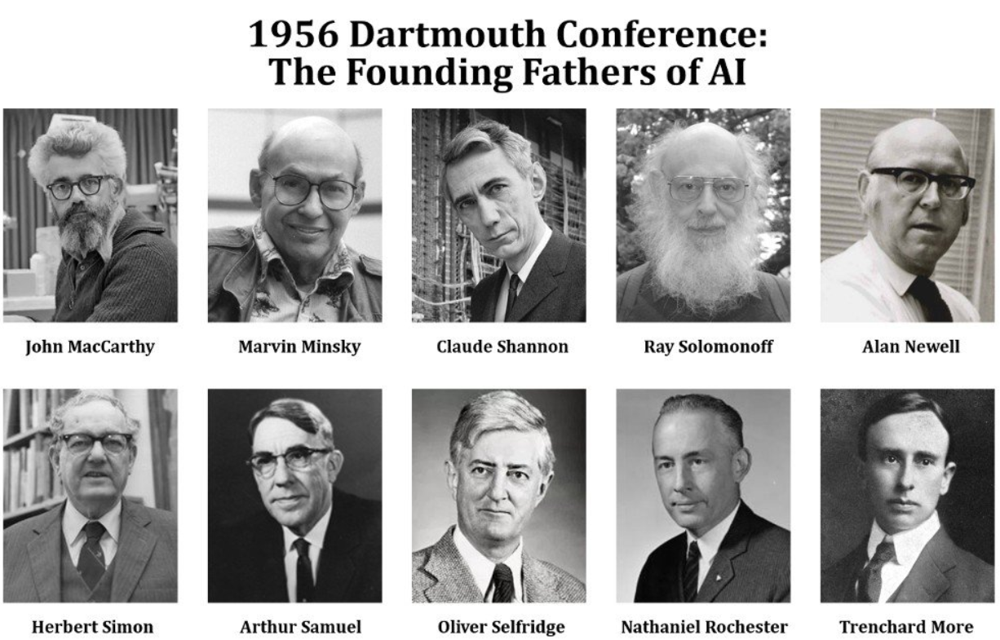
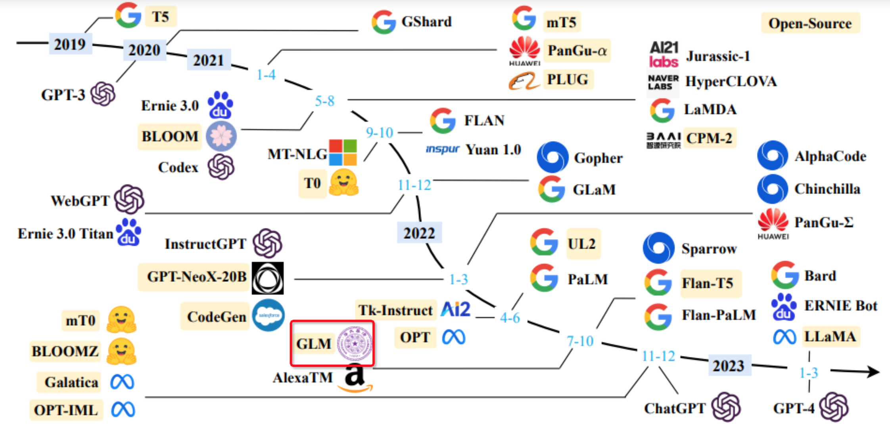
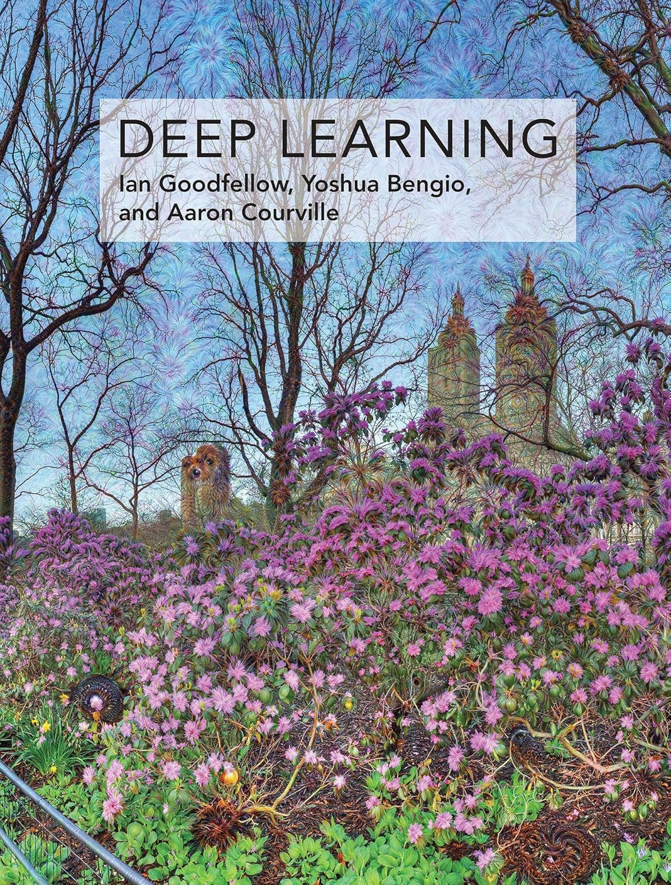

# 人工智能的基本内涵
+ 在2023年前，谈起人工智能，首先想到：
  + 智能语音+自然语言处理（NLP）
  + 虚拟现实技术（VR,AR）
  + 计算机视觉（CV）    
  + 生物特征识别 (指纹、虹膜识别，etc.)
  + ...
**趋势：逐渐应用于现实生活**
+ 如今，谈起人工智能：
  + 各种大语言模型（LLM）（ChatGPT,Deepseek,...）
  + 文生图，图生图，文生视频... (Midjurney,Stable Diffusion,...)
  + 2025年，LLM进一步进化

## 人工智能的定义
* 能够执行通常需要人类智能的任务的计算机系统的理论和技术，例如视觉感知，语音识别，决策和语言之间的翻译
> Artificial Intelligence is the theory and development of computer systems able to perform tasks normally requiring human intelligence，such as visual perception,speech recognition,decision-making,and translation between languages.                        ——Oxford Dictionary

# 人工智能的发展历程
## 人工智能的诞生（1943－1956）
   * 0-1人工神经网络模型（McCulloch and Pitts 1943）
     * 利用逻辑运算来模拟神经元的触发机制
   * 第一台神经网络计算机（马文明斯基，1950）
   * 图灵和香农提出并实现自动下棋程序（1950-1952）
   * 阿兰图灵提出**图灵测试**：（1950）
     * 如果一台机器能够与人类开展对话而不能被辨别出机器身份，那么这台机器就具有智能。
## 人工智能的诞生（1956）
   * 达特茅斯人工智能夏季研究项目（达特茅斯工作坊）
  
## 第一次AI热潮：推论搜索期(60－70年代)
   * 强化学习，游戏训练（贪吃蛇，俄罗斯方块...）
   * 第一次工智能浪潮，主要围绕推论和搜索来解决特定问题，但是在日常生活中没有什么用处。
## 第二次AI热潮：专家系统（80－90年代）
   * 致力于向计算机灌输“知识”,使其更加智能化
   * 输出受限于专家知识库，泛化能力差 （人的逻辑能力与泛化能力都更强）
## 第三次AI热潮：机器学习期（1993－2020）
   * 典型例子： 1997年IBM“深蓝”战胜国际象棋世界冠军，2016年谷歌AlphaGo战胜围棋世界冠军
   * 在摩尔定律下，计算机性能不断突破。深度学习、云计算、大数据、机器学习、自然语言和机器视觉等领域发展迅速，人工智能迎来第三次高潮。
   * 但人工智能仍然局限于一些特定领域，无法完成一些跨领域任务 
## 第四次AI热潮：生成式人工智能期（2020－）
   * 人工智能模型： 从鉴别，预测到生成
  
   * 已经能够进行一些推理任务（图片推理，视频推理，文献总结...）以及完成一些考试任务

# 人工智能发展面临的挑战
## AI有哪些应用风险？
  + 隐私泄露
  + 敏感和违法内容
  + 错误回答
  + 真假难辨
  + 版权问题
  + 作弊问题
  + ...
## AI偏见问题
  * 机器学习通过大量的案创来实现学习。
  * 人类的偏见既存在于数据也存在与技术。
  * 算法偏见主要有：
    * 交互偏见：interaction bias（交互数据的偏颇）
    * 潜在偏见：latent bias（潜意识的偏见，例如物理学家是男性）
    * 选择偏见：selection bias（选择的数据不一定具有代表性）
## 大模型偏见问题典型案例：简历推荐
   * 彭博社用GPT3.5生成8份不同的简历
   * 人为修改简历，让8人的教育水平、工作经验、工作岗位等相当
   * 人为修改每个人的名字，让这些名字体现种族色彩
   * 排序1000次后，黑人的简历往往被排在最后
   + 其他偏见：
     + 性别和区域偏见
     + 名字导致的偏见（不同区域名字的特征不同）
     + 语言之间的偏见
        + 描述词选择的偏见
        + 性别角色选择的偏见
        + 对话主题的偏见
     + **这些偏见大多来源于作为数据创造者的人类自身的偏见** 
## AI道德伦理问题（如使用LLM完成作业与科研）
   1. 科研人员应对科研成果负最终责任
       * AI系统既不是作者，也不是共同作者；
       * 科研人员不能在科学研究过程中使用生成式AI创建的捏造材料，如伪造、篡改或操纵原始研究数据。
   2. 应透明地使用生成式人工智能
       * 科研人员应详细说明在研究过程中主要使用了哪些生成式AI工具
   3. 在与AI工具共享敏感或受保护信息时，要特别注意隐私、保密及知识产权相关的问题
       * 科研人员应保护未发表或敏感的作品
## AI对人的影响：基于LLM的编程提示反馈

# 人工智能的应用场景
| “AI+”  |        |  |
| :-----: | :------: | :------: |
| AI+文旅      | AI+传媒        |  AI+教育       |
| AI+能源      | AI+医药        | AI+金融        |

# 人工智能的工作机制
## 现代AI的基本要素
  + 数据
  + 算法
  + 场景
  + 算力
**互相作用，相互制约**
## 现代AI基本工作流程
  + 数据→建模→预测/生成
  + ML和DL的主要区别：ML需要人工数据标注，而DL基于数据本身自主标注数据
  + 例1：鉴别类任务（区分猫狗，手写体识别）
  + 例2：生成式任务：文字生成
    + GPT:Generative Pre-trained Transformer生成式预训练变换神经网络
    + G-生成式：不是简单的0/1预测 而是生成新的内容
    + P-预训练：基础模型已经训练好，可迁移使用，无需自己从头训练
    + T-变换网络：一种处理自然语言的神经网络模型
  + 其他任务：文生图，生成对抗网络（GAN）
## GPT的训练过程（OpenAI）
  + 预训练：能解和生成长文本
    + 需要海量数据与算力资源
    + 冗余数据与模型算法效率是需要解决的问题
  + 有监督微调：具备基本问答、翻译等功能 （SFT）
    + 给出示例问答数据，让模型模仿和学习如何回答。
    + prompt微调
  + 奖励建模：利用大规模标记数据提升性能
    + 基于人类的反馈进一步提升问答的质量。（RAHF）
    + 训练一个奖励模型，可以对答案进行高低评分。
  + 强化学习：综合性能再提升
    + 用奖励模型对回答进行评分，通过强化学习让模型输出高分回答。

## 人工智能实践平台与环境搭建
* Anaconda开发环境安装
  * 略，网上都有教程。
  * 官方网址：[Anaconda](www.anaconda.com)
  * miniconda也可以
* 可视化数据挖掘软件Orange
  * 官方网址：[Orange](https://orangedatamining.com/)
* Google colab（用于白嫖算力）（**需科学上网**）
  * 官方网址：[Google_colab](https://colab.research.google.com/)

## 附：机器学习/人工智能/大模型相关书籍与视频推荐
**书籍：**  
+ 吴飞 著. 人工智能导论：模型与算法，北京：高等教育出版社，2021

+ 张奇、桂韬、郑锐、黄萱菁：大规模语言模型：从理论与实践（第2版），电子工业出版社，2025

+ 周志华 著. 机器学习, 北京: 清华大学出版社, 2016年1月. (**西瓜书**)

+ Ian Goodfellow and Yoshua Bengio and Aaron Courville.Deep Learning,MIT Press,2016.(**花书**)

**视频：**  
[什么是GPT？-by 3blue1brown](https://www.bilibili.com/video/BV13z421U7cs)
[哈佛CS50](https://cs50.harvard.edu/ai/)
~~[李宏毅机器学习教程](https://www.bilibili.com/video/BV1YsqSY8EiW)~~