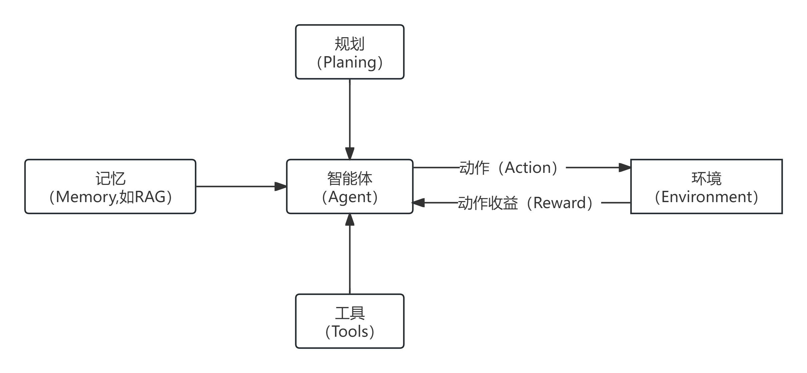
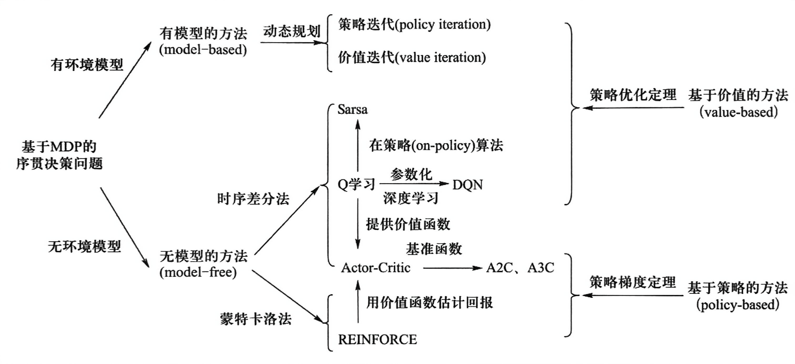

+ 目前智能体主要分为两类：
  + 角色扮演智能体（Role-playing Agents）：使用系统prompt设定智能体角色，让智能体模仿这一角色与用户进行交互；
  + 强化学习智能体（RL Agent）：使用强化学习的方式（下面会详细描述）与环境交互，并通过环境反馈更新策略。
+ 多智能体强化学习（MARL）：
  + 如果多智能体没有与环境交互，只是调用多个大模型，那么其本质仍为角色扮演。但这种形式再多次交互后智能体会逐渐忘记其初始设定；
  + 现在的智能体除了与环境交互之外，还会附带其他模块，如下图：
    + 记忆：上下文、长短时记忆、规则等
    + 工具：将指令转化为具体操作（可集成）
    + 规划：基于记忆与工具
# 强化学习问题定义
## 强化学习里的概念
+ **智能体（agent）**：智能体是强化学习算法的主体，它能够根据经验做出主观判断并执行动作，是整个智能系统的核心。
+ **环境（environment）**：智能体以外的一切统称为环境，环境在与智能体的交互中，能被智能体所采取的动作影响，同时环境也能向智能体反馈状态和奖励。
+ **状态（state）**：状态可以理解为智能体对环境的一种理解和编码，通常包含了对智能体所采取决策产生影响的信息。
+ **动作（action）**：动作是智能体对环境产生影响的方式。
+ **策略（policy）**：策略是智能体在所处状态下去执行某个动作的依据，即给定一个状态，智能体可根据一个策略来选择应该采取的动作。
+ **奖励（reward）**：奖励是智能体序贯式采取一系列动作后从环境获得的收益。
  + 注：这里指结果奖励，另外还有过程奖励（即在智能体执行每一个动作时得到的收益）
### 与监督学习、无监督学习的区别
| |有监督学习|无监督学习|强化学习|
|:-:|:---:|:---:|:---:|
|**学习依据**|基于监督信息|基于对数据结构的假设|基于评估|
|**数据来源**|一次给定|一次给定|在时序交互中产生|
|**决策过程**|单步决策（如分类和识别等）|无|序贯决策（如棋类博弈）|
|**学习目标**|样本到语义标签的映射|数据的分布模式|选择能够获取最大收益的状态到动作的映射
## 强化学习的特点
+ 基于评估：强化学习利用环境评估当前策略，以此为依据进行优化
+ 交互性：强化学习的数据在与环境的交互中产生
+ 序列决策过程：智能主体在与环境的交互中需要作出一系列的决策，这些决策往往是前后关联的
+ 注：现实中强化学习问题往往还具有奖励滞后，基于采样的评估等特点。
## 马尔科夫决策过程
+ 以机器人在棋盘格移动为例：
  + 在下图网格中，假设有一个机器人位于$s_1$，其每一步只能向上或向右移动一格，跃出方格会被惩罚（且游戏停止）。如何使用强化学习找到一种策略，使机器人从$s_1$到达$s_9$？
    |$s_7$|$s_8$|$s_9$|
    |:--:|:--:|:--:|
    |$s_4$|$s_5$|$s_6$|
    |$s_1$|$s_2$|$s_3$|
### 离散马尔可夫过程(Discrete Markov Process)
+ 一个随机过程实际上是一列随时间变化的随机变量，其中当时间是离散量时，一个随机过程可以表示为$\{X_t\}_{t=0,1,2,\cdots}$，其中每个$X_t$都是一个随机变量，这被称为离散随机过程。
+ 马尔可夫链(Markov Chain)：满足马尔可夫性(Markov Property)的离散随机过程，也被称为离散马尔科夫过程。这一过程具有无记忆性：
  $$
  P(X_{t+1}=x_{t+1}\mid X_0=x_0,X_1=x_1,\cdots,X_t=x_t)=P(X_{t+1}=x_{t+1}\mid X_t=x_t)
  $$
  即$t+1$时刻状态仅与$t$时刻状态相关。
### 马尔可夫奖励过程（Markov Reward Process）
+ 为了在序列决策中对目标进行优化，在马尔可夫随机过程框架中加入了奖励机制：
  + 奖励函数$R:S\times S\mapsto\mathbb{R}$，其中$R(S_t,S_{t+1})$描述了从第$t$步状态转移到第$t+1$步状态所获得奖励；
  + 在一个序列决策过程中，不同状态之间的转移产生了一系列的奖励$(R_1,R_2,\cdots)$，其中$R_{t+1}$为$R(S_t,S_{t+1})$的简便记法。
+ 引入奖励机制，就可以衡量任意序列的优劣，即对序列决策进行评价。
+ 问题：给定两个因为状态转移而产生的奖励序列$(1,1,0,0)$和$(0,0,1,1)$，哪个序列决策更好？
  + 为了比较不同的奖励序列，定义**反馈（return）**，用来反映累加奖励：
    $$
    G_t=R_{t+1}+\gamma R_{t+2}+\gamma^2 R_{t+3}+\cdots
    $$
    其中$\gamma$为折扣系数（discount factor），满足$\gamma\in [0,1]$
  + 反馈值反映了某个时刻后所得到累加奖励，当衰退系数小于$1$时，越是遥远的未来对累加反馈的贡献越少
  + 对于上述问题，假设$\gamma=0.99$：
    + $(1,1,0,0):G_0=1+0.99\times 1+0.99^2\times 0+0.99^3\times 0 =1.99$
    + $(0,0,1,1):G_0=0+0.99\times 0+0.99^2\times 1 +0.99\times 3 \times 1 =1.9504$
    + 故$(0,0,1,1)$序列决策更好。
+ 使用离散马尔可夫过程描述机器人移动问题：
  + 随机变量序列$\{S_t\}_{t=0,1,2,\cdots}$：$S_t$表示机器人第$t$步的位置，每个随机变量$S_t$的取值范围为$S=\{s_1,s_2,\cdots,s_9,s_d\}$（其中$s_d$表示越界状态）
  + 状态转移概率：$Pr(S_{t+1}\mid S_t)$满足马尔可夫性
  + 定义奖励函数$R(S_t,S_{t+1})$：从$S_t$到$S_{t+1}$所获得奖励，其取值为：$R_1$到$R_8$为$0$，$R_9$为$1$，越界时为$-1$
  + 定义衰退系数：$\gamma\in[0,1]$
+ 综合以上信息，可用$MRP=\{S,Pr,R,\gamma\}$来刻画马尔科夫奖励过程。
+ 然而，这个模型不能体现机器人能动性，仍然缺乏与环境进行进行交互的手段。
### 引入动作（Action）
+ 在强化学习问题中，智能主体与环境交互过程中可自主决定所采取的动作，不同动作会对环境产生不同影响，为此：
  + 定义智能主体能够采取的动作集合为$A$
  + 由于不同的动作对环境造成的影响不同，因此状态转移概率定义为$Pr(S_{t+1}\mid S_t,a_t)$，其中$a_t\in A$为第$t$步采取的动作
  + 奖励可能受动作的影响，因此修改奖励函数为$R(S_t,a_t,S_{t+1})$
+ 注：
  + 动作集合$A$可以是有限的，也可以是无限的
  + 状态转移可以是确定（deterministic）的，也可以是随机概率性（stochastic）的。
  + 确定状态转移相当于发生从$S_t$到$S_{t+1}$的转移概率为$1$
+ 由此我们对上述离散马尔科夫过程进行修改：
  + 增加动作集合：$A=\{\text{上},\text{右}\}$
  + 状态转移概率修改为$Pr(S_{t+1}\mid S_t,a_t)$：满足马尔可夫性，其中$a_t\in A$。
  + 奖励函数修改为$R(S_t,a_t,S_{t+1})$
  + 随机变量序列与衰退系数不变
+ 综合以上信息，可通过$MDP=\{S,A,Pr,R,\gamma\}$来刻画马尔科夫决策过程
  + 马尔可夫决策过程可用如下序列来表示：
  $$
  S_0\xrightarrow[A_0]{R_1}S_1\xrightarrow[A_1]{R_2}S_2\xrightarrow[A_2]{R_3}S_3\xrightarrow[A_3]{R_4}\cdots
  $$
  + 马尔科夫过程中产生的状态序列称为**轨迹(trajectory)**，可如下表示：
    $$
    (S_0, a_0,R_1,S_1,a_1,R_2,\cdots,S_T)
    $$
    轨迹长度可以是无限的，也可以有终止状态$S_T$。有终止状态的问题叫做分段的（即存在回合的）（episodic），否则叫做持续的（continuing）。
  + 在机器人移动问题中，初始状态$S_0=s_1$，终止状态为$S_T\in\{s_9,s_d\}$.
### 强化学习中的策略学习
+ 马尔可夫决策过程$MDP=\{S,A,Pr,R,\gamma\}$对环境进行了描述，那么
智能主体如何与环境交互而完成任务？——需要进行策略学习！
+ 策略函数：
  + 策略函数$\pi:S\times A\mapsto[0,1]$，其中$\pi(s,a)$的值表示在状态$s$下采取动作$a$的概率。
  + 策略函数的输出可以是确定的，即给定$s$情况下，只有一个动作$a$使得概率$\pi(s,a)$取值为$1$（别无选择）。对于确定的策略，记为$a=\pi(s)$。
+ 如何进行策略学习：
  + 一个好的策略是在当前状态下采取了一个行动后，该行动能够在未来收到最大化的反馈：即让$G_t=R_{t+1}+\gamma R_{t+2}+\gamma^2 R_{t+3}+\cdots$最大化
  + 一个好的策略函数应该能够使得智能体在采取了一系列行动后可得到最佳奖励
+ 为了对策略函数$\pi$进行评估，定义：
   + **价值函数（Value Function）**$V:S\mapsto R$，其中$V_\pi(s)=\mathbb{E}_\pi[G_t\mid S_t=s]$，即在第$t$步状态为$s$时，按照策略$\pi$行动后在未来所获得反馈值的期望；
      + 由马尔可夫性，未来的状态和奖励只与当前状态相关，与$t$无关。因此$t$取任意值该等式均成立，如“逢山开路，遇水搭桥”。
   + **动作-价值函数(Action-Value Function)** $q:S\times A\mapsto R$，其中$q_\pi(s,a)=\mathbb{E}[G_t\mid S_t=S,A_t=a]$表示在第$t$步状态为$s$时，按照策略$\pi$采取动作$a$后，在未来所获得反馈值的期望。
+ 这样，策略学习转换为如下优化问题：寻找一个最优策略$\pi^*$，对任意$s\in S$使得$V_{\pi^*}(s)$值最大
## 最终定义
+ 综合以上概念分析，我们可以对强化学习问题进行如下定义：   
  **给定一个马尔可夫决策过程$MDP=\{S,A,Pr,R,\gamma\}$，学习一个最优策略$\pi^*$，对任意$s\in S$使得$V_{\pi^*}(s)$值最大。**
+ 价值函数和动作-价值函数反映了智能体在某一策略下所对应状态序列获得回报的期望，它比回报本身更加准确地刻画了智能体的目标。
+ 价值函数和动作-价值函数的定义之所以能够成立，离不开决策过程所具有的马尔可夫性，即当位于当前状态$s$时，无论当前时刻$t$的取值是多少，一个策略回报值的期望是一定的（当前状态只与前一状态有关，与时间无关）。
## 贝尔曼方程
+ 贝尔曼方程（Bellman Equation）也被称作动态规划方程（Dynamic Programming Equation），由理查德·贝尔曼（Richard Bellman）提出。
+ 推导：
  + 价值函数：
    $$
    \begin{equation}
    \begin{aligned}
    V_\pi(s)&=\mathbb{E}_\pi[R_{t+1}+\gamma R_{t+2}+\gamma^2 R_{t+3}+\cdots\mid S_t=s]\\
    &=\mathbb{E}_{a\sim \pi(s,\cdot)}[\mathbb{E}_{\pi}[R_{t+1} +\gamma R_{t+2} +\cdots\mid S_t=s,A_t=a]]\\
    &=\sum_{a\in A}\pi(s,a)\times q_\pi(s,a)
    \end{aligned}
    \end{equation}
    $$
    其中$\pi(s,a)$为在策略$\pi$下采取动作$a$的概率，$q_\pi(s,a)$为采取动作$a$后带来的回报期望。
  + 动作-价值函数： 
    $$
    \begin{equation}
    \begin{aligned}
    q_\pi(s,a)&=\mathbb{E}[R_{t+1}+\gamma R_{t+2}+\gamma^2 R_{t+3}+\cdots\mid S_t=S,A_t=a]\\
    &=\mathbb{E}_{s'\sim P(\cdot\mid S,a)}[R(s,a,s')+\gamma \mathbb{E}_{\pi}[R_{t+2} +\gamma R_{t+3} +\cdots\mid S_{t+1}=s']]\\
    &=\sum_{s'\in S}P(s'\mid s,a)\times[R(s,a,s')+\gamma\times V_\pi(s')]
    \end{aligned}
    \end{equation}
    $$
    其中$P(s'\mid s,a)$为在状态$s$采取行动$a$进入状态$s'$的概率，$R(s,a,s')$为在$s$采取$a$进入$s'$得到的回报，$V_\pi(s')$为在$s'$获得的回报期望。
  + 将$(2)$式代入$(1)$式中，得到价值函数的递推方程：
    $$
    \begin{equation}
    \begin{aligned}
    V_{\pi}(s)&=\sum_{a\in A}\pi(s,a)\sum_{s'\in S}P(s'|s,a)\left[R(s,a,s')+\gamma V_{\pi}(s')\right] \\
    &=\mathbb{E}_{a\sim\pi(s,\cdot)}\mathbb{E}_{s'\sim P(\cdot|s,a)}[R(s,a,s')+\gamma V_{\pi}(s')]
    \end{aligned}
    \end{equation}
    $$
    这说明，价值函数取值与时间没有关系，只与策略$\pi$、在策略$\pi$下从某个状态转移到其后续状态所取得的回报以及在后续所得回报有关。
  + 再将$(1)$式代入$(2)$式中，得到动作-价值函数的递推方程：
    $$
    \begin{equation}
    \begin{aligned}
    & q_{\pi}(s,a)=\sum_{s'\in S}P(s'|s,a)[R(s,a,s')+\gamma\sum_{a'\in A}\pi(s',a')q_{\pi}(s',a')]\\
    & =\mathbb{E}_{s'\sim P(\cdot|s,a)}[R(s,a,s')+\gamma\mathbb{E}_{a'\sim\pi(s',\cdot)}[q_\pi(s',a')]]
    \end{aligned}
    \end{equation}
    $$
    这说明，动作-价值函数取值同样与时间没有关系，而是与瞬时奖励和下一步的状态和动作有关。
+ 上述$(3)$式和$(4)$式分别为价值函数与动作-价值函数的贝尔曼方程。
+ 贝尔曼方程描述了价值函数或动作-价值函数的递推关系，是研究强化学习问题的重要手段。
  + 其中价值函数的贝尔曼方程描述了当前状态价值函数和其后续状态价值函数之间的关系，即当前状态价值函数等于瞬时奖励的期望加上后续状态的（折扣）价值函数的期望。
  + 而动作-价值函数的贝尔曼方程描述了当前动作-价值函数和其后续动作-价值函数之间的关系，即当前状态下的动作价值函数等于瞬时奖励的期望加上后续状态的（折扣）动作-价值函数的期望。 
+ 在实际中，需要计算得到最优策略以指导智能体在当前状态如何选择一个可获得最大回报的动作。求解最优策略的一种方法就是去求解最优的价值函数或最优的动作-价值函数（即**基于价值方法，value-based approach**）。一旦找到了最优的价值函数或动作-价值函数，自然而然也就是找到最优策略。当然，在强化学习中还有 **基于策略（policy-based）** 和 **基于模型（model-based）** 等不同方法。
# 基于价值的强化学习
## 策略迭代的基本模式
+ 为了求解最优策略$\pi^*$，以下是一种思路：从一个任意的策略开始，首先计算该策略下价值函数（或动作-价值函数），然后根据价值函数调整改进策略使其更优，不断迭代这个过程直到策略收敛。
+ 通过策略计算价值函数的过程叫做**策略评估（policy evaluation）**，通过价值函数优化策略的过程叫做**策略优化（policy improvement）**，策略评估和策略优化交替进行的强化学习求解方法叫做**通用策略迭代（Generalized Policy Iteration,GPI）**。
### 策略优化定理
在讨论如何优化策略之前，首先需要明确什么是“更好”的策略。
+ 对于确定的策略$\pi$和$\pi'$，如果对于任意状态$s\in S$，
  $$
  q_\pi(s,\pi'(s)) \geq q_\pi(s,\pi(s))
  $$
  那么对于任意状态$s\in S$，有
  $$
  V_\pi'(s)\geq V_\pi(s)
  $$
  即策略$\pi'$不比$\pi$差。注：不等式左侧的含义是只在当前这一步将动作修改为$\pi'(s)$，未来的动作仍然按照$π$的指导进行。
+ 给定当前策略$\pi$、价值函数$V_\pi$和行动-价值函数$q_\pi$时，可如下构造新的策略$\pi'$，只要$\pi'$满足如下条件:
    $$
    \pi'(s)=\operatorname*{argmax}_aq_\pi(s,a)\hspace{1em}\forall s\in S
    $$
    $\pi'$便是对$\pi$的一个改进。于是对于任意$s\in S$，有
    $$
    \begin{aligned}
    q_\pi(s,\pi'(s))&=q_\pi(s,\operatorname*{argmax}_aq_\pi(s,a))\\
    &=\operatorname*{max}_aq_\pi(s,a)\geq q_\pi(s,\pi(s))
    \end{aligned}
    $$
## 强化学习中的策略评估方法
+ 假定当前策略为$\pi$，策略评估指的是根据策略$\pi$来计算相应的价值函数$V_\pi$或动作-价值函数$q_\pi$。这里将介绍在状态集合有限前提下三种常见的策略评估方法，它们分别是基于**动态规划**的方法、基于**蒙特卡洛采样**的方法和 **时序差分（temporal difference）** 法。
### 动态规划（DP）
+ 核心思想：使用迭代的方法求解贝尔曼方程组
+ 算法流程：
  + 初始化$V_\pi$函数；
  + 循环（直到$V_\pi$收敛）：
    + 枚举$s\in S$；
    + 更新$V_\pi(s)\leftarrow \sum_{a\in A}\pi(s,a)\sum_{s\in S'}P(s'\mid s,a)[R(s,a,s')+\gamma V_\pi(s')]$
+ 缺点：
  + 智能主体需要事先知道状态转移概率；
  + 无法处理状态集合大小无限的情况。
### 蒙特卡洛采样（MC）
+ 核心思想：大数定律——当样本足够大时，样本期望向均值收敛（这里样本代表策略轨迹的反馈$G_t$）
+ 算法流程：
  + 选择不同的起始状态，按照当前策略$\pi$采样若干轨迹记它们的集合为$D$；
  + 枚举$s\in S$；
    + 计算$D$中$s$每次出现时对应的反馈$G_1,G_2,\cdots,G_k$；（这些反馈对应的采样序列均从$s$出发）
    + 更新$V_\pi(s)\leftarrow\frac{1}{k}\sum_{i=1}^kG_i$
+ 优点：
  + 智能主体不必知道状态转移概率
  + 容易扩展到无限状态集合的问题中
+ 缺点：
  + 状态集合比较大时，一个状态在轨迹可能非常稀疏，不利于估计期望
  + 在实际问题中，最终反馈需要在终止状态才能知晓，导致反馈周期较长
### 时序差分（TD）
+ 可以看作蒙特卡罗方法和动态规划方法的有机结合
+ 算法流程：
  + 初始化$V_\pi$函数；
  + 循环（直到$V_\pi$收敛）：
    + 初始化$s$为初始状态；
    + 循环（直到$s$为终止状态）：
      + $a\sim\pi(s,\cdot)$；（选取动作集合中的一个动作）
      + 执行动作$a$，观察奖励$R$和下一个状态$s'$；
      + 更新$V_\pi(s)\leftarrow V_\pi(s)+\alpha[R(s,a,s')+\gamma V_\pi(s')-V_\pi(s)]$；
      + 更新$s\leftarrow s'$；
+ 时序差分算法与蒙特卡洛方法相似之处在于，时序差分方法从实际经验中获取信息，无需提前获知环境模型的全部信息。
+ 时序差分算法与动态规划方法的相似之处在于，时序差分方法能够利用前序已知信息来进行在线实时学习，无需等到整个片段结束（终止状态抵达）再进行价值函数的更新。
+ 实际上，时序差分算法中$V_\pi(s)$的更新表达式可化为：$(1-\alpha)V_\pi(s)+\alpha[R(s,a,s')+\gamma V_\pi(s')]$，其中$R(s,a,s')+\gamma V_\pi(s')$为学习得到的价值函数值（即时序差分目标）
+ 时序差分法和蒙特卡洛法都是通过采样若干个片段来进行价值函数更新的，但是时序差分法并非使用一个片段中的终止状态所提供的实际回报值来估计价值函数，而是根据下一个状态的价值函数来估计，这样就克服了采样轨迹的稀疏性可能带来样本方差较大的不足问题，同时也缩短了反馈周期。
## 策略优化方法：Q-learning
+ 基于时序差分评估方法进行优化：
+ 算法流程：
  + 初始化$V_\pi$函数；
  + 循环（直到$V_\pi$收敛）：
    + 初始化$s$为初始状态；
    + 循环（直到$s$为终止状态）：
      + $a=\argmax_{a'}q_\pi(s,a')$（选取动作-价值函数最优对应的动作）
      + 执行动作$a$，观察奖励$R$和下一个状态$s'$；
      + 更新$q_\pi(s,a)\leftarrow q_\pi(s,a)+\alpha[R+\gamma\max_{a'}q_\pi(s',a')-q_\pi(s,a)]$；
      + 更新$s\leftarrow s'$；
+ Q学习中直接记录和更新动作-价值函数$q_\pi$而不是价值函数$V_\pi$，这是因为策略优化要求已知动作-价值函数$q_\pi$，如果算法仍然记录价值函数$V_\pi$，在不知道状态转移概率的情况下将无法求出$q_\pi$。于是，Q学习中，只有动作-价值函数（即$q$函数）参与计算。
+ 然而，有时外部刺激不足以使智能体尝试新的策略（导致模型收敛后智能体仍无法到达目标状态），那么此时可以从内部入手为智能体改变固有策略来添加一个探索的动力。
### $\epsilon$-greedy策略
+ 为此，在Q学习中引入探索（exploration）与利用（exploitation）机制。这一机制用$\epsilon$贪心策略来代替$a=\argmax_{a'}q_\pi(s,a')$。
+ 用$\epsilon$贪心策略定义如下：在状态$s$，以$1-\epsilon$的概率来选择带来最大回报的动作，或者以$\epsilon$的概率来随机选择一个动作。表达式：
  $$
  \epsilon-\mathrm{greedy}_{\pi}(s)=\left\{
    \begin{aligned}
      &\argmax_a q_\pi(s,a),&\text{以}1-\epsilon\text{的概率}\\
      &\text{随机的}a\in A,&\text{以}\epsilon\text{的概率}
    \end{aligned}
    \right.
  $$
+ $\epsilon$贪心策略的解释：大体上遵循最优策略的决定，偶尔（以$\epsilon$的小概率）进行探索。像这样更新时的目标策略与采样策略
不同的方法，叫做 **离策略（off-policy）** 方法。
## 用神经网络拟合价值函数：Deep Q-learning
+ Q-learning的不足：
  + 状态数量太多时，有些状态可能始终无法采样到，因此对这些状态的$q$函数进行估计是很困难的
  + 状态数量无限时，不可能用一张表（数组）来记录$q$函数的值
+ 思路：将$q$函数参数化（parametrize），用一个非线性回归模型来拟合$q$函数，例如（深度）神经网络
  + 能够用有限的参数刻画无限的状态
  + 由于回归函数的连续性，没有探索过的状态也可通过周围的状态来估计
+ 算法流程：
  + 初始化$V_\pi$函数和参数$\theta$；
  + 循环（直到$V_\pi$收敛）：
    + 初始化$s$为初始状态；
    + 循环（直到$s$为终止状态）：
      + $a\sim\epsilon-\mathrm{greedy}_{\pi}(s;\theta)$（选取动作-价值函数最优对应的动作）
      + 执行动作$a$，观察奖励$R$和下一个状态$s'$；
      + 更新损失函数$\mathcal{L}(\theta)=\frac{1}{2}[R+\gamma\max_{a'}q_\pi(s',a';\theta)-q_\pi(s,a;\theta)]^2$；
      + 根据梯度$\frac{\partial\mathcal{L}(\theta)}{\partial\theta}$更新参数$\theta$
      + 更新$s\leftarrow s'$；
+ 损失函数刻画了$q$的估计值$R+\gamma\max_{a'}q_\pi(s',a';\theta)$与当前值的平方误差
+ 利用梯度下降法优化参数$\theta$
+ 如果用深度神经网络来拟合$q$函数，则算法称为深度Q学习或者深度强化学习
# 基于策略的强化学习
直接参数化策略函数，求解参数化的策略函数的梯度。  
具体的老师也没讲，以后再来探索吧~
# 深度强化学习的应用
+ 围棋博弈（AlphaGO）
+ 雅达利游戏
# 总结
强化学习关系图：

参考：
+ [【强化学习】十分钟学会Q-Learning和贝尔曼方程！](https://www.bilibili.com/video/BV1buxDzzE9P)
+ [LLM Powered Autonomous Agents](https://lilianweng.github.io/posts/2023-06-23-agent/)
___
《人工智能导论》终于结束了！只能说一言难尽吧，感觉这门课第一次开还是有些实验性质，作为第一批吃螃蟹的人，笔者感觉还是有不少地方可以改进（最主要的是课时太少啦！而且没有上机实验！）而且说实话大二上就学这些东西确实有些吃力（需要自学不少前置知识），笔者认为放在大三学更加合适（同时也建议设置为选修课而不是必修课……）。

当然上面也只是笔者的一些胡言乱语，仅供参考。不多说了，复习去了~