# 人工智能导论 第二节 
# 数据的感知
* 回顾： [现代AI的基本要素](/posts/computer-science/introduction-to-ai/人工智能导论-ch1-人工智能概述/#现代ai的基本要素)
## AI的感知系统
+ 本质：模拟人的感知
  * 环境感知（传感器→中枢→效应器）
  * 行为感知（机械臂，机器人...）
  * 应用：自动驾驶
## 数据感知的能力架构
  1. 数据感知
       * 软感知：包括埋点、爬虫和系统日志等
       * 硬感知：包括条形码/二维码、磁卡、RFID、OCR、图像、音视频、传感器等
  2. 数据接入
       * 接入方式：批次接入、实时接入、按需接入
       * 接入工具：CLI,Data Replication,Data Discovery,Message queue,Stream processing等
       *  产生结构化与非结构化数据
  3. 数据存储
       * 介质：各种SQL，DB，Graph等数据库

# 数据类型与表示
## 图像的数据表示
  1. 0-1 表示
    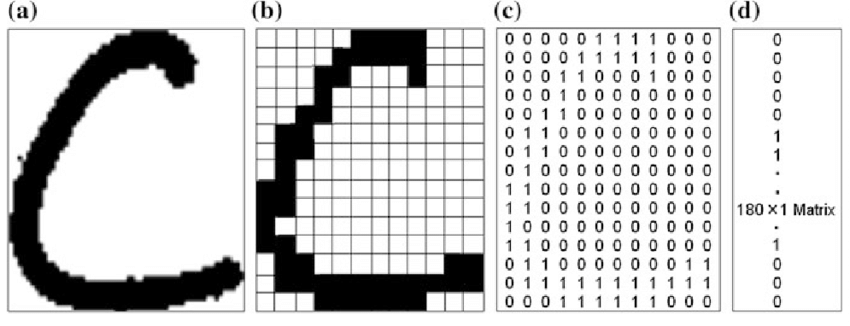
  2. 灰度表示
    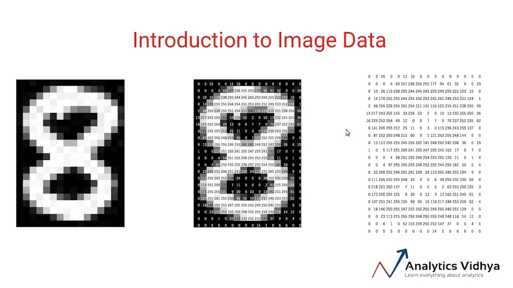
  3. RGB 表示
    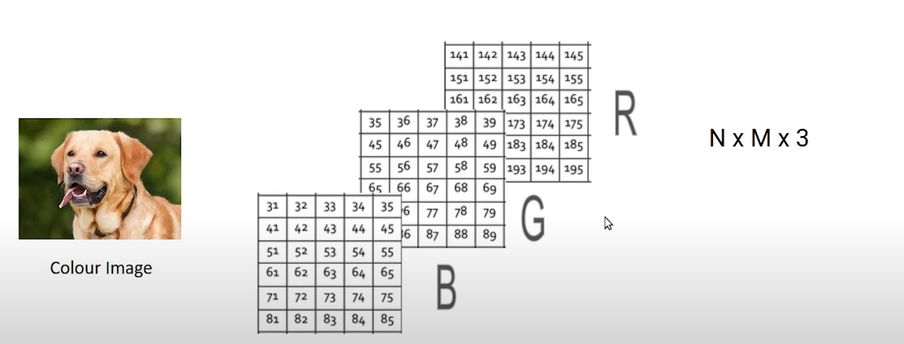
## 文本的数据表示
* 如何比较两个文档的相似性？
* 将相同的单词进行统计与编码(详见下“文本数据”)
## 语音的数据表示
+ 音频要素：时间&频率
+ 采样、量化与编码
+ 得到二进制流
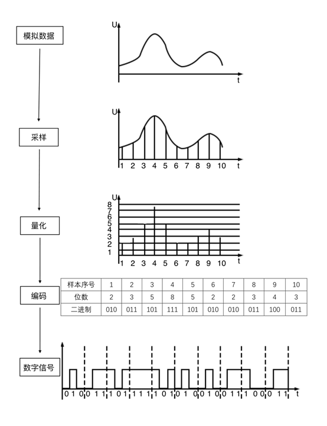

## 什么是数据（集）？
1. 数据集包含（数据）**对象objects**和对象的**属性attribute**
2. 对象：也称为记录，包括数据点data point，模式patterm，事件event，案例case，样本sample，观测observation或实体entity.
3. 属性：刻画对象的基本特性，它因对象而异，或随时间变化，也称为特征feature或变量variable。（特征组合可构成对象的画像）
  * 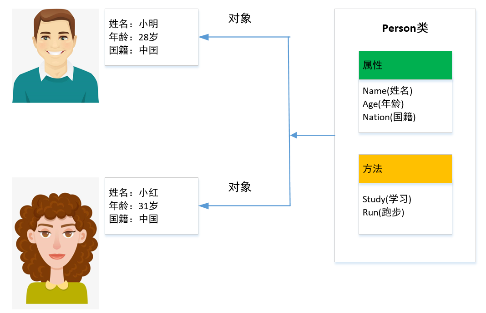
 **注：有时属性也可以作为对象（如在属性描述表格中）**
## 属性与属性值
1. 属性被赋予的数字或者符号称为属性值（attribute values）
2. **属性与属性值之间的区别：**
  + 相同的属性可以被赋予不同的属性值（取不同单位）
    + 例如，高度可以是尺也可以是米
  + 不同的属性可以被赋予相同类型的值
    + 例如：ID和年龄都可以是整型
  + 但是不同属性值的性质和表达的意义是不一样的
    + ID可以无限增长，但年龄有上下限
  * 因此，属性值是属性的一种在某种测量标度（measurement scale）下得到的值。
3. 属性的类型
 + **标称(Nominal)**
   + Examples：ID，颜色，邮编
 + **序数(Ordinal)**
   + Examples：排名，年龄（低，中，高），身高（高，中，矮）
 + **区间(Interval)**
   + Eamples：日期，温度
 + **比率(Ratio)**
   + Examples：年龄，质量，长度，电流
4. 属性值的四个性质
  + **相异性**：$= \neq$
  + **顺序性**：$> <$
  + **可加性**：$+ -$
  + **可乘性**: $\times \div$
| 属性类型 | 相异性 | 顺序性 | 可加性 | 可乘性 |
|----------|--------|--------|--------|--------|
| 标称（Nominal） | ✅ | ❌ | ❌ | ❌ |
| 序数（Ordinal） | ✅ | ✅ | ❌ | ❌ |
| 区间（Interval） | ✅ | ✅ | ✅ | ❌ |
| 比率（Ratio） | ✅ | ✅ | ✅ | ✅ |
|相关操作|众数，熵等操作|中值，百分位，秩相关等|均值，方差，泊松系数、t和F检验|集合平均，调和平均,百分比变差等|
5. 离散属性和连续属性
+ **离散属性（Discrete Attribute）**
  + 具有有限个值或无限可数个值
  + 例如：ID号，邮编，计效
  + 通常离散属性用整数变量表示
  + 注意：二元属性（0-1）是离散属性的一种特殊情况
+ **连续属性（Continuous Attribute）**
  + 取实数值的属性
  + 例如：温度，高度，重量
  + 实践中，实数值只能用有限的精度测量和表示
  + 通常，连续属性用浮点变量表示
## 数据集的类型
1. 数据集的一般特性
  + **维度**——维度灾难
    + 维度越高，数据挖掘的难度越大
  + **稀疏性**——大部分属性值为0
    + 稀疏性越强，数据挖掘的难度越大
  + **分辨率**——数据的精度
    + 分辨率越高，数据挖掘的难度越大
2. 数据记录
  + 数据集是记录的汇集，每个记录包含固定的属性
3. 数据矩阵
  + 如果一个数据集中所有数据对象都具有相同的属性集，则数据对象可看作多维空间中的向量。
  + 这样的数据集可以用一个$m\times n$的矩阵表示，其中$m$行表示$m$个数据对象，$n$列表示$n$个属性。这种矩阵称为数据矩阵或模式矩阵
  + 矩阵的案例
     + 彩色图片由红绿蓝三个通道的组合表示
     + 彩色图片看成三个二维的矩阵叠加而成（RGB）
4. 文本数据
  + 每个文本视作一个“词”向量，每个词是向量的一个属性（分量）
  + 每个属性的取值是对应词在文本中出现的次数
5. 事务数据
  + 一种特殊类型的记录数据，其中
    + 每一个记录（事务）涉及一系列的项.
    + 例如，顾客一次购物所购买的商品的集合就构成一个事务，而购买的商品是项
    + | TID       | Items |
      | :----: | :----------------------: |
      | 1        | Bread，Coke，Milk            |
      | 2        | Beer，Bread                   |
      | 3        | Beer，Coke,Diaper，Milk          |
      | 4        | Beer，Bread，Diaper，Milk           |
      | 5        | Coke，Diaper，Milk                |
6. 有序数据
  + 事务的序列
  + 在事务数据基础上增加时间因素，可用于时间序列预测（如购物推荐等）
  + 事例：
    + 基因组序列数据（AlphaFold，基因预测）
    + 空间温度数据（陆地与海洋每月平均气温）
## 数据结构
* 数据结构（Data Structure）：相互之间存在一种或多种特定关系的数据元素的集合
  * “特定关系”：数据元素间的**逻辑关系**或**逻辑结构**
  * 数据结构在计算机中的表示称为数据的**物理结构（存储结构）**
  * 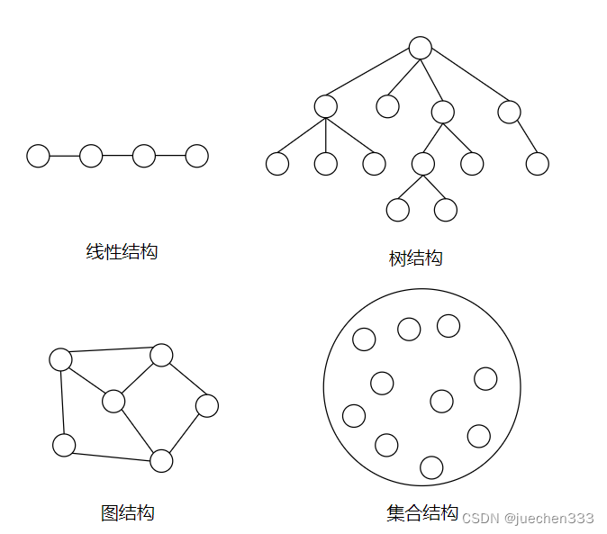
1. 线性结构
  * 说明：在此类文档管理的数学模型中，计算机处理的对象之间通常存在着一种最简单的线性关系，该数学模型称为线性模型。
  * 一般会进行线性运算
2. 非线性结构
  * 如树和图结构
  * 在进行搜索，决策与逻辑推断时常用（如：AlphaGo，智能交通，社交网络挖掘等）
## 相似性与相异性的度量
+ **相似性 Similarity**
  + 两个对象相似程度的数值度量（如余弦相似度）
  + 对象越相似，相似度越高
  + 在[0.1]范围内取值
+ **相异性 Dissimilarity**
  + 两个对象差异程度的数值度量
  + 对象越相似，相异度越低
  + 最小相异度为0
  + 无上限
+ 简单属性间的相似度与相异度
  + 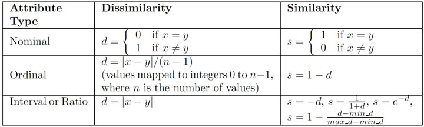
  + 说明：p和q是两个数据对象的属性值。

# 数据预处理
数据预处理步骤：
1. **数据分析**：
   数据分析涉及使用[汇总统计数据]{.red}和[分布]{.orange}来检查数据，以了解其结构、内容和质量。此步骤可以揭示对于知情预处理至关重要的模式、异常和相关性。
2. **数据清理**：
   数据清理可检测并纠正损坏或不准确的数据记录，例如错误、离群值、重复值和缺失值。[缺失数据插补]{.yellow}或[异常值修剪]{.green}等方法有助于确保数据集的准确性。
3. **数据缩减**：
   数据缩减旨在减少数据量，同时产生相同或相似的分析结果。降维、分箱、直方图、聚类和主成分分析等技术可以[简化数据，而不会丢失信息模式和趋势]{.aqua}。
4. **数据转换**：
   数据转换帮助修改数据以满足特定需求。它包含[聚合、标准化和排序等]{.blue}各种步骤，每个步骤在理解数据方面都发挥着至关重要的作用。
5. **数据丰富**：
   使用[附加来源或派生属性增强数据]{.purple}可以提供更多深度和背景，它涉及将人口统计信息纳入客户数据或将天气数据添加到销售数据中以考虑季节性影响。
6. **数据验证**：
   在进行分析之前，确保数据的完整性至关重要，数据验证检查数据是否满足特定标准，例如约束、关系和范围。它有助于[确认数据的准确性、完整性和可靠性]{.pink}。

# 数据相似性度量
## 欧氏距离
$$
dist = \sqrt { \sum _ { k = 1 } ^ { n } ( p _ { k } - q _ { k } ) ^ { 2 } }
$$
+ 其中$n$是属性维数，$p_{k}$和$q_{k}$分别是对象$p$和$q$在第$k$个属性的取值
+ 欧氏距离是对称的
## 闵式距离（闵可夫斯基距离）
$$
dist = ( \sum _ { k = 1 } ^ { n } | P _ { k } - q _ { k } | ^ { r } ) ^ { \frac { 1 } { r } }
$$
## 二元数据之间的相似性度量
+ 两个仅包含二元属性的对象之间的相似性度量称为**相似系数Similarity coefficient**
+ 设x和y是两个对象，都由n个属性构成，有如下四个量：
  + $M_{01}=x$取$0$且$y$取$1$的属性个数
  + $M_{10}=x$取$1$且$y$取$0$的属性个数
  + $M_{00}=x$取$0$且$y$取$0$的属性个数
  + $M_{11}=x$取$1$且$y$取$1$的属性个数
1. **简单匹配系数（SMC）**
    $SMC=$值匹配的属性个数/属性个数$=(M_{11}+M_{00})/(M_{01}+M_{10}+M_{11}+M_{00})$
2. **Jaccard系数** （适用于不考虑0-0匹配的情况）
  + 考虑一个事务矩阵，如果每个非对称的二元数值对应商品，1表示该商品被购买，0表示未被购买。
  + 即行表示顾客，列表示商品
  + 由于未被顾客购买的商品数量远远大于被购买的商品数量，因此基于SMC无法判断事务之间的相似性。
  + Jaccard系数计算：
    $J=$匹配的个数/不涉及$0-0$匹配的属性个数$=(M_{11})/(M_{01}+M_{10}+M_{00})$
3. **思考：**
文本通常用向量表示，向量的每个属性表示一个特定的词在文档中出现的次数或频率，其特点是具有相对较少的非零属性值，即稀疏性。那么是否可以用SMC或Jaccard系数来计算文本间的相似性？为什么？
+ 稀疏性使得SMC不适用
+ 非二元性使得Jaccard方法不适用
4. **余弦相似度**
+ 如果$d_{1}$，和$d_{2}$是两个文本向量，那么
$$
cos(d_{1},d_{2})=\frac{\langle d_{1}, d_{2} \rangle}{||d_{1}||*||d_{2}||}
$$
+ 其中$\langle d_{1}, d_{2} \rangle$表示向量内积，$||d||$是向量$d$的长度
## 相关性——两个对象之间的线性关系
1. 相关性指标
   + **期望**$\mathbb{E}[X] = \sum_{i} x_i P(X = x_i)$
   + **方差**$\operatorname{Var}(X) = \mathbb{E}[(X - \mathbb{E}[X])^2]$
   + **协方差**$\operatorname{Cov}(X, Y) = \mathbb{E}[(X - \mathbb{E}[X])(Y - \mathbb{E}[Y])]$
   + **相关系数**$\rho_{X,Y} = \frac{\operatorname{Cov}(X, Y)}{\sigma_X \sigma_Y}$
   + ***KL散度（衡量两个概率分布的差异性**）$D_{\text{KL}}(P \parallel Q) = \sum_{x \in \mathcal{X}} P(x) \log \frac{P(x)}{Q(x)}$
     + 在强化学习PPO模型中使用KL散度惩罚可以保证训练的稳定性（相关论文：[PPO](https://arxiv.org/pdf/1707.06347)）
2. 相关性可视化
  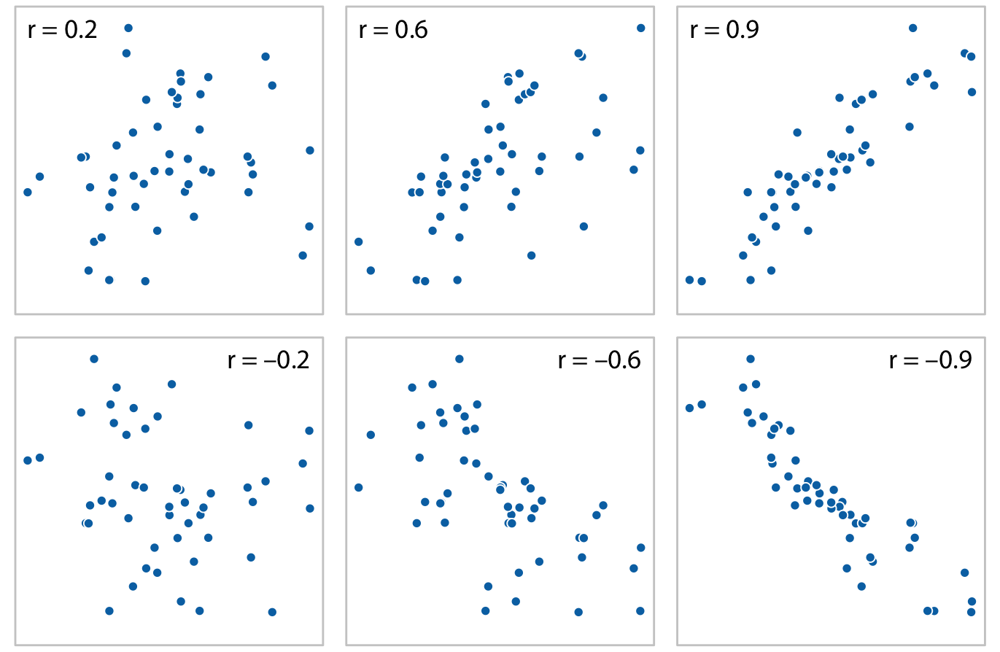
3. 相似度计算的问题
+ 当属性具有不同的**尺度**或**相关**时如何计算相似度？
  + 例如：在欧氏距离中，当使用‘年龄’和‘收入’这两个属性度量人的相似性，显然‘收入’占主导作用
+ 当对象包含不同类型属性时如何计算相似度？
  + 例如：同时含有定量属性和定性属性
+ 当属性具有不同的权值时如何计算相似度？
4. 距离度量的标准化距离——Mahalanobis距离（马氏距离）
$$
d_M(\mathbf{x}, \mathbf{y}) = \sqrt{(\mathbf{x} - \mathbf{y})^\top \mathbf{\Sigma}^{-1} (\mathbf{x} - \mathbf{y})}
$$
+ 其中：
$\mathbf{\Sigma}$为多维随机变量$x,y$的协方差矩阵：$\Sigma_{ij} = \mathrm{Cov}(X_i, Y_j) = \mathbb{E}[(X_i - \mathbb{E}[X_i])(Y_j - \mathbb{E}[Y_j])]$
# 数据可视化
## 可视化
+ 数据可视化是指以**图形**或**表格**的形式显示信息
+ 数据可视化的目标是形成可视化信息的人工解释和信息的意境模型
+ 数据可视化的动机
  + 人们能够快速吸取大量可视化信息
  + 可以发现一般的趋势或模式
  + 可以发现离群点和异常信息
+ 示例：略（图太多了，网上都可以找）
## 表示
+ 如何将数据映射成可视形式，即:将[数据对象、属性和联系]{.blue}映射成[可视的对象、属性和联系]{.red}.
1. [对象]{.red}的常用表示
   + 只考虑对象的单个分类属性，则通常根据该属性的值将对象进行分类。
   + 对象具有多个属性，则可以将对象表示为表的一行。
   + 二维或三维空间中的点。
2. [属性]{.blue}的常用表示
   + 连续属性可以映射成连续的图形特征，如渐变颜色等。
   + 分类属性，不同的属性不同的位置、颜色、形状等
   + 标称属性，使用与其值相关的固有图形特征
## 可视化图表
1. **直方图（histogram）**
   + 显示单个属性值的分布情况
   + 如果是分类属性，每个值在一个箱中.
   + 如果是连续属性，将值域划分成等宽箱
   + 例：
   + 三维直方图：显示两个属性值的联合分布情况
   + 例：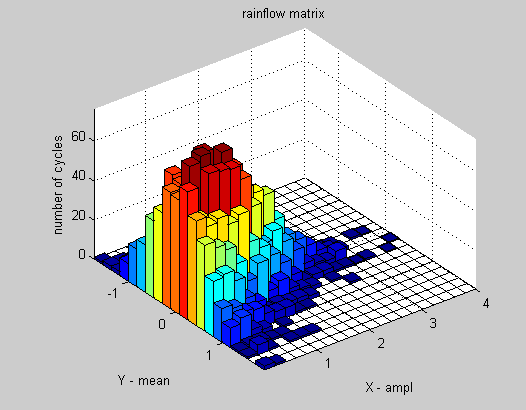
2. **盒状图（boxplot）**
  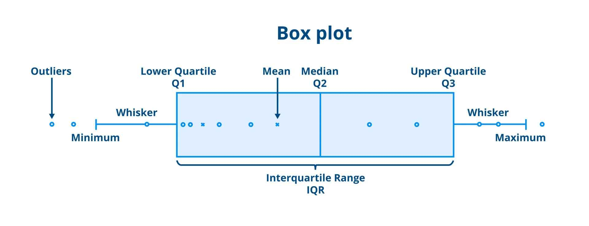
3. **饼图（pie chart）**
  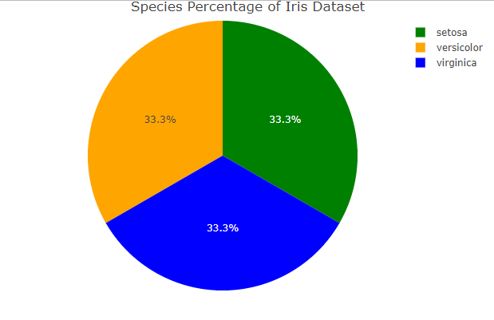
4. **累计分布函数图 CDF**
   + ⼀个累计分布函数显示点⼩于该值的概率
  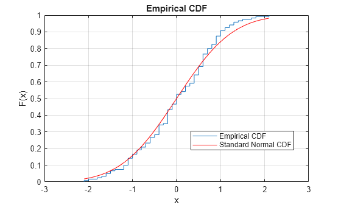
5. **散布图（散点图，scatter diagram）**
   + 使用数据对象两个属性值x和y作为坐标值，每个数据对象都作为平面上的一个点
   + 用途：
     + 图形化地显示两个属性之间的关系
     + 当类标号给出时，可以利用散布图考查两个属性将类分开的程度
   + 例：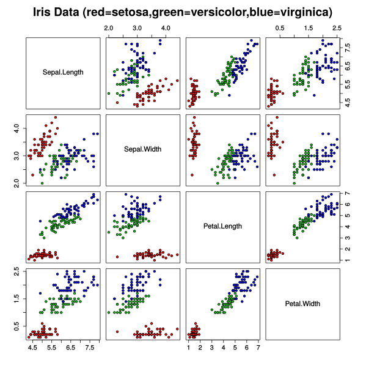
6. **等高线图（contour line plot）**
   + 对于某些三维数据，两个属性指定平面上的位置，而第三个属性具有连续值。
   + 常见例子：地面位置的海拔高度
   + 图略
7. **曲面图（surface plot）**
   + 常⽤于绘制函数曲⾯
   + 图略
8. **矢量场图（vector field）**
   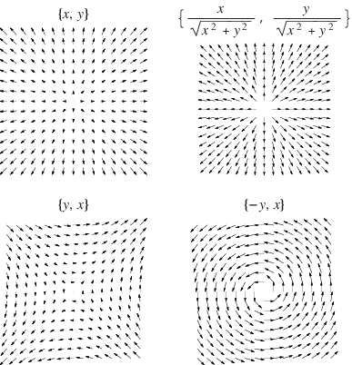
9. **高维数据可视化——矩阵图**
    + 将矩阵用图形的方式表现出来
    + 如果类标号已知，则重新排列数据矩阵的次序，使得某个类的所有对象聚集在一起
    + 如果不同的属性具有不同的值域，则可以对属性进行标准化
## 可视化原则（ACCENT原则）
+ 理解(Apprehension)
+ 清晰性(Clarity)
+ ⼀致性(Consistency)
+ 有效性(Efficiency)
+ 必要性(Necessity)
+ 真实性(Truthfulness)
## 可视化工具包
1. Python
   + [matplotlib](https://matplotlib.org/index.html)
   + [seaborn](https://seaborn.pydata.org/)
2. R
   + [ggplot2](https://ggplot2.tidyverse.org/)
3. [Orange](https://orangedatamining.com/)
4. [Apache_ECharts](https://echarts.apache.org/zh/index.html)
## 总结
* **汇总统计**
  * 频率，众数，均值，中位数，百分位数，极差，⽅差
* **可视化**
  * 直⽅图，盒装图，饼图，散布图，曲⾯图，平⾏坐标
# 数据管理与操作案例（以鸢尾花iris数据集为例）
以下图片均直接来自于PPT~~绝对不是因为我懒~~
1. Iris数据集的数据矩阵
   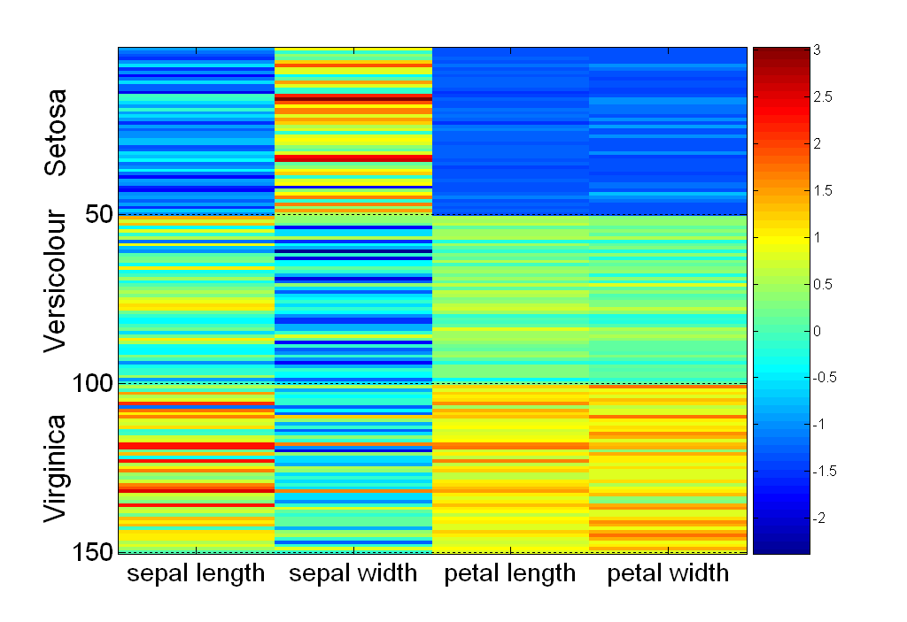
2. Iris数据集的相关矩阵
   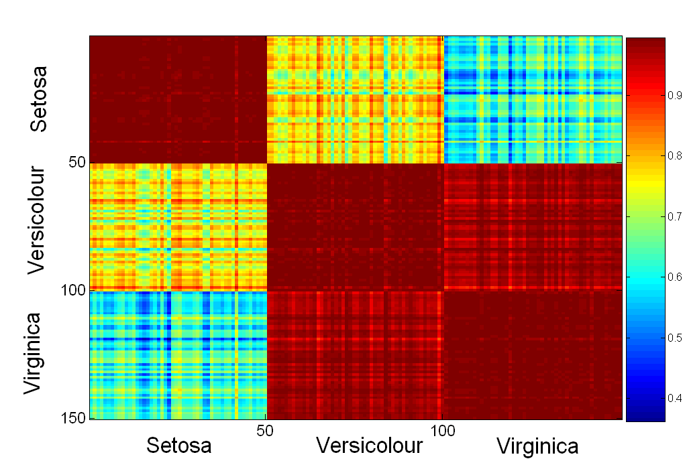
3. 平行坐标系Parallel Coordinates
   + 每个属性是一个坐标轴
   + 每个坐标轴之间是平行的，而不是正交的
   + 每个对象用一条线表示，而不是一个点
   + 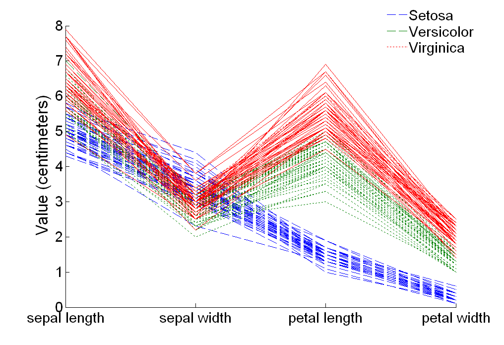
4. 星形坐标
   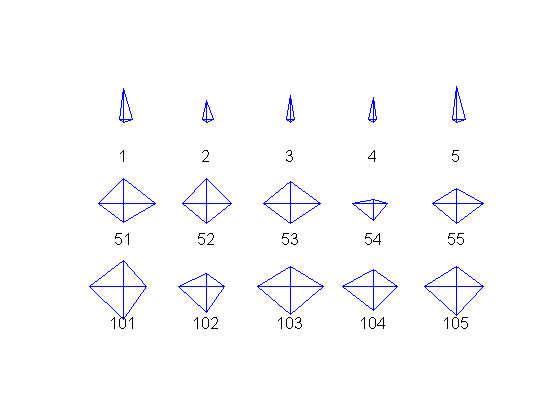
5. Chenoff脸
   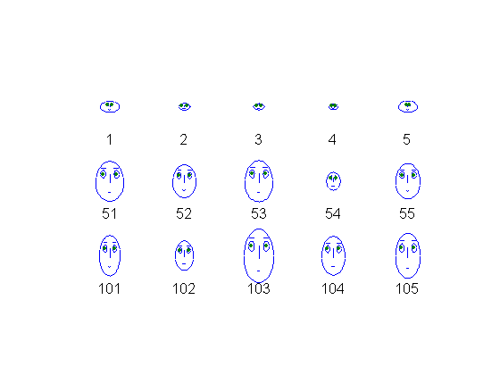
+ **星形坐标和Chenoff脸均适用于高维数据可视化**