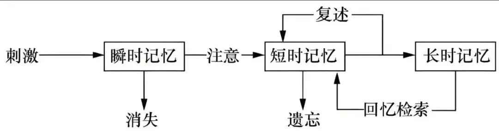

注1：从这一节开始，本笔记内容主要基于[《人工智能导论：模型与算法》（吴飞）](https://www.hep.com.cn/book/show/4603e86d-1627-4c26-849b-ce71123d5142)及其课件撰写。
注2：由于本节内容较多，故分为上下两部分，下部分请见：[人工智能导论 Ch.4 逻辑与推理（下）](/posts/computer-science/introduction-to-ai/人工智能导论-ch4-逻辑与推理下/)
注3：本节概念性较强，涉及比较多的离散数学，概率统计等内容，如果觉得比较困难可以暂时跳过，或先进行相关知识的学习(如CS70)后再回顾。
# 逻辑与推理是人工智能的核心问题
+ 人类思维活动的一个重要功能是逻辑推理，即通过**演绎和归纳**等手段对现有观测现象进行分析，得出判断。
+ 给人工智能（尤其是大模型）施加逻辑推理的管理可以有效降低其幻觉。
## 符号主义人工智能
+ 在人工智能发展初期，脱胎于逻辑推理的 **符号主义人工智能(symbolic AI)** 是人工智能研究的一种主流学派。
+ 在符号主义人工智能中，所有概念均可通过人类可理解的“符号”及符号之间的关系来表示。
  + 例如：如果使用符号$A$来表示对象概念，$\mathrm{IsCar}()$来表示某个对象是否为“汽车”，那么$\mathrm{IsCar}(A)$表示“$A$是一辆轿车”这样的概念。
  + 注意$\mathrm{IsCar}(A)$由对象$A$和$\mathrm{IsCar}()$两部分所构成。如果$A$是轿车，则$\mathrm{IsCar}(A)$为正确描述，否则为错误描述。
+ 符号主义人工智能方法基于如下假设：
  + 可通过逻辑方法来对符号及其关系进行计算，实现逻辑推理，解析符号所描述内容是否正确。
+ **Neuro-symbolic(神经符号)**：将神经网络和符号主义人工智能相结合的混合AI，可以将神经网络与符号主义的优势相结合。
+ 更多有关符号主义人工智能的介绍可参考以下链接：[符号主义人工智能-东南大学](https://palm.seu.edu.cn/xgeng/courses/introduction_to_ai/files/2-Symbolism.pdf)
## 记忆——逻辑推理的核心
+ 包括以下三种记忆：
+ |            |  瞬时记忆（感觉记忆）      | 工作记忆（短时记忆）      | 长时记忆 |
| :----: | :-----------: | :----------: | :----------------: |
| 获得方式     |   多通道感知           |         直觉、顿悟、因果等推理       | 先验、知识等         |
| 持续时间     |  $<5 sec$            |         $<30 sec$   | $1 sec \sim lifelong$                 |
+ 关系图：

# 命题逻辑(Propositional Logic)
+ 是应用一套形式化规则对以符号表示的描述性陈述进行推理的系统。
+ 在命题逻辑中，一个或真或假的描述性陈述被称为**原子命题**，对原子命题的内部结构不做任何解析。
+ 若干原子命题可通过逻辑运算符来构成复合命题。
+ 更多有关命题逻辑的解释，大部分可参见CS70 Chapter1相关内容：[CS70 Chapter1](/posts/computer-science/cs70/cs70-chapter-1/)，这里只进行一些补充：
1. 双向蕴含（$P\Longleftrightarrow Q$）的真值表：
   + | $P$ | $Q$     | $P\longleftrightarrow Q$ |
    | :-: | :-: | :-----------:   | 
    | F  | F  | T           |
    | F  | T  | F           |
    | T  | F  | F           |
    | T  | T  | T           |
   + 事实上，双向蕴含等价于： $(P\Longrightarrow Q) \land (Q\Longrightarrow P)$，或者“异或非”（在逻辑代数中）
2. 一些逻辑等价定律（除了[CS70 Chapter1](/posts/computer-science/cs70/cs70-chapter-1/)和上面提到的）：
   + **交互律：** $\alpha \land \beta \equiv \beta\land \alpha$,$\alpha \lor \beta \equiv \beta\lor \alpha$
   + **结合律：** $(\alpha \land \beta)\land \gamma \equiv \alpha \land (\beta\land \gamma)$,$(\alpha \lor \beta)\lor \gamma\equiv \alpha \lor (\beta\lor \gamma)$
   + **双重否定：** $\lnot(\lnot \alpha)\equiv \alpha$
   + **分配律：** $\alpha \lor (\beta \land \gamma)\equiv (\alpha \lor \beta)\land (\alpha \lor \gamma)$,$\alpha \land (\beta \lor \gamma)\equiv (\alpha \land \beta)\land (\alpha \land \gamma)$
3. 命题逻辑中的推理规则（以下“$\longrightarrow$”的意思是：如果前面的命题都成立，那么后面的命题也成立）
   + **假言推理(modus ponens):** $\alpha \Longrightarrow \beta,\alpha \longrightarrow \beta$ (即已知如果$\alpha$那么$\beta$，现在有$\alpha$，于是$\beta$)
   + **与消解(and-elimination):** $\alpha_{1}\land \alpha_{2}\land \cdots \land \alpha_{n} \longrightarrow \alpha_{i} (1\leq i \leq n)$
   + **与导入(and-introduction):** $\alpha_{1},\alpha_{2},\cdots,\alpha_{n} \longrightarrow \alpha_{1}\land \alpha_{2}\land \cdots \land \alpha_{n}$
   + **双重否定(double-negation elimination):** $\lnot\lnot \alpha\longrightarrow\alpha$
   + **单项消解或单项归结(unit resolution):** $\alpha \lor \beta,\lnot\beta \longrightarrow \alpha$ (即已知要么$\alpha$要么$\beta$，现在不是$\beta$，那就是$\alpha$)
   + **消解或归结(resolution):** 
     + $\alpha\lor\beta,\lnot\beta\lor\gamma \longrightarrow \alpha\lor\gamma$ (即无论$\beta$如何，都可以推出$\alpha$和$\gamma$之一)
     + (特别地，当$\gamma$为恒假命题时转化为单项消解或单项归结)
     + 一般形式：$\alpha_{1}\lor\alpha_{2}\lor\cdots\alpha_{n},\lnot\beta (\beta = \alpha_{k},1\leq k \leq n)\longrightarrow \alpha_{1}\lor\alpha_{2}\lor\cdots\lor\alpha_{k-1}\lor\alpha_{k+1}\lor\cdots\lor\alpha_{n}$
   + 应用例：
     + 已知$\alpha\lor\beta,\alpha\Longrightarrow\gamma,\beta\Longrightarrow\gamma$三个命题成立,证明命题$\gamma$成立
     + 证明过程：
     + | 编号 | 命题                       | 如何得到                    |
    | :-------------: | :----------------------------: | :-------------------------:   | 
    | 1    | $\alpha\lor\beta$     |   第1个条件|
    | 2    | $\lnot\alpha\lor\gamma$     |  第2个条件蕴含消除 |
    | 3    | $\lnot\beta\lor\gamma$    | 第3个条件蕴含消除   |
    | 4    | $\lnot\gamma$    |  假设命题$\gamma$不成立    |
    | 5    |  $\beta\lor\gamma$    |   1和3归结    |
    | 6    |  $\lnot\alpha$    |  2和4归结        |
    | 7    |  $\lnot\beta$    |  3和4归结        |
    | 8    |  $\gamma$    |  5和7归结（推出矛盾）  |
     + 结论：假设不成立，命题$\gamma$成立
    + 另外，如果在归结过程中出现命题和它的否命题同时成立，就说明条件无法同时满足（contradiction）。
4. 命题范式
   范式是把命题公式化归为一种标准的形式，范式最大的作用是可以进行两个命题的等价判定。
   + 有限个简单合取式构成的析取式称为**析取范式(disjunctive form)**
   + 由有限个简单析取式构成的合取式称为**合取范式(conjunctive form)**
   + 例：
     + 若$\alpha_{1},\alpha_{2},\cdots ,\alpha_{n}$均为析取式，则$\alpha_{1}\land \alpha_{2}\land \cdots \land \alpha_{n}$为合取范式
     + 若$\alpha_{1},\alpha_{2},\cdots ,\alpha_{n}$均为合取式，则$\alpha_{1}\lor \alpha_{2}\lor \cdots \lor \alpha_{n}$为析取范式
     + ~~简单来讲就是析代表或，合代表与~~
   + 析取范式与合取范式统称为**范式（normal form）**
   + 范式的性质：
     + 一个析取范式是不成立的，当且仅当它的每个简单合取式都不成立。
     + 一个合取范式是成立的，当且仅当它的每个简单析取式都是成立的。
     + 任一命题公式都存在着与之等值的析取范式与合取范式（注意：命题公式的析取范式与合取范式都不是唯一的）
   + （其实有点像数字逻辑里的最大项与最小项以及逻辑代数标准表达式）
# 谓词逻辑(Predicate Logic)
## 命题逻辑的局限性
在命题逻辑中，每个陈述句是最基本的单位（即原子命题），无法对原子命题进行分解。因此在命题逻辑中，不能表达局部与整体、一般与个别的关系。
+ 例如，对于苏格拉底的论断，虽然知道是正确的，但无法通过命题逻辑来进行推理判断。
  + $\alpha$：所有的人总是要死的  
    $\beta$：苏格拉底是人   
    $\gamma$：所以苏格拉底是要死的
  + 如果写成命题逻辑的形式，为$\alpha\lor\beta\longrightarrow\gamma$，但这不是有效的逻辑推理
  + 所以这种命题无法在命题逻辑的基础上进行推导
+ **根源：** 不同原子命题蕴含个体、群体和关系等内在丰富语义，命题逻辑无法表现内在丰富语义。因此，需要分析原子命题，分离其主语（个体或群体）和谓语（关系）。
  + 也就是说，需要引入更加强大的逻辑表示方法，这就是**谓词逻辑**
+ 在谓词逻辑中，将原子命题进一步细化，分解出个体、谓词和量词，来表达个体与总体的内在联系和数量关系，这就是谓词逻辑的研究内容。
## 谓词逻辑中的核心概念
  + **个体（variable）、谓词（predicate）**和**量词（quantifier）**
### 谓词与个体
  1. **个体：** 个体是指所研究领域中可以独立存在的具体或抽象的概念。
  2. **谓词：** 谓词是用来刻画个体属性或者描述个体之间关系存在性的元素，其值为真或为假。
  + 包含一个参数的谓词称为一元谓词，表示一元关系。包含多个参数的谓词称为多元谓词，表示个体之间的多元关系。
  + 例子：
    + $P(x)$表示：$r<r^2$
    + $P$是谓词，$x$是个体词，故称为变量，$x$的具体取值叫个体常项。比如$P(0.1)$和$P(0.02)$使得谓词为假。
    + 个体的取值范围为**个体域**。
  + 一般用大写字母$P,Q,R$等来表示谓词。上述$P(x)$描述了是否存在一个数，这个数小于自身平方这种关系。
  + 谓词中可以有若干个个体变量，如$\mathrm{father}(x,y)$表示$x$是$y$父亲。
  + $P(x)$是一元谓词（包含一个个体），$P(x_{1},x_{2}\cdots x_{n})$被称为n元谓词（包含若干个体）。
  + **谓词与函数的区别：**
    + 函数中个体变元用个体常量（来自定义域）代入后结果仍是[个体（值域）]{.red}，如定义函数$f(x)=x+10$，则$f(2)=12$
    + 谓词中个体变元用个体常量带入后就变成了命题，如$\mathrm{car}(x)$（$x$是车）这个谓词中$x$用吉普车代替，则$\mathrm{car}(\text{吉普车})$是命题。
    + 函数是从定义域到值域的映射；谓词是从定义域到$\{True,False\}$的映射。
### 量词
  + **量词**包括全称量词和存在量词。
  1. **全称量词(universal quantifier,$\forall$)：**   
     + 全称量词用符号$\forall$表示，表示一切的、凡是的、所有的、每一个等。
     + $\forall x$表示定义域中的所有个体，$\forall x,P(x)$表示定义域中的所有个体具有性质$P$
  2. **存在量词(existential quantifier,$\exists$)：**
     + 存在量词用符号$\exists$表示，表示存在、有一个、某些等。
     + $\exists x$表示定义域中存在一个或若干个个体，$\exists x,P(x)$表示定义域中存在一个个体或若干个体具有性质$P$。
### 约束变元与自由变元
  1. **约束变元：** 在全称量词或存在量词的约束条件下的变量符号称为约束变元。
  2. **自由变元：** 不受全称量词或存在量词约束的变量符号称为自由变元。
  3. (直观理解就是$\forall$和$\exists$对应的变量是约束变元，其他变量都是自由变元)
  4. 更多关于量词的解释可见[CS70 Chapter1](/posts/computer-science/cs70/cs70-chapter-1/)
### 定理：
  1. 在约束变元相同的情况下，量词的运算满足分配律。
  2. 当公式中存在多个量词时，若多个量词都是全称量词或者都是存在量词，则量词的位置可以互换；若多个量词中既有全称量词又有存在量词，则量词的位置不可以随意互换。~~反例可以在高等数学/数学分析课本上找到~~
### 项，原子谓词公式与合式公式
  1. **项(term)：** 描述对象的逻辑表达式，可由以下递归定义：
     + 常量符号与变量符号都是项；
     + 若$f(x_{1},x_{2},\cdots,x_{n})$是$n$元函数符号，$t_{1},t_{2},\cdots,t_{n}$是项，那么$f(t_{1},t_{2},\cdots,t_{n})$是项；
     + 有限次数地使用上述规则产生的符号串是项。
  2. **原子谓词公式(atomic formula)：** 若$P(x_{1},x_{2},\cdots,x_{n})$是$n$元谓词，$t_{1},t_{2},\cdots,t_{n}$是项，那么$P(t_{1},t_{2},\cdots,t_{n})$是原子谓词公式，简称原子公式。
  3. **合式公式(well-formed formula)：** 由逻辑联结词和原子公式构成的用于陈述事实的复杂语句，又称谓词公式。
### 推理规则
+ 设$A(x)$是谓词公式，$x$和$y$是变元，$a,c$是常量符号，则存在如下谓词逻辑中的推理规则：
  1. **全称量词消去(Universal Instantiation, UI)**：$(\forall x)A(x)\longrightarrow A(y)$
  2. **全称量词引入(Universal Generalization, UG)**：$A(y)\longrightarrow (\forall x)A(x)$
   + 注：这里$y$需为任意变元，不应该有存在量词或其他限制。
  3. **存在量词消去(Existential Instantiation, EI)**：$(\exists x)A(x)\longrightarrow A(c)$
   + 注：$c$应为新的常量符号，在之前的逻辑推导中不应出现。 
  4. **存在量词引入(Existential Generalization, EG)**：$A(a)\longrightarrow (\exists x)A(x)$
+ 具体的一个例子：
  + 前提：1)每架飞机或者停在地面或者飞在天空；2)并非每驾飞机都飞在天空
  + 结论：有些飞机停在地面
  + 形式化：$\mathrm{plane}(x)$：$x$是飞机；$\mathrm{in}\_\mathrm{ground}(x)$：$x$停在地面；$\mathrm{on}\_\mathrm{fly}(x)$：$x$飞在天空
    + 已知:$(\forall x)(\mathrm{plane}(x)\rightarrow \mathrm{in}\_\mathrm{ground}(x) \lor \mathrm{on}\_\mathrm{fly}(x)),(\lnot\forall x)(\mathrm{plane}(x)\rightarrow \mathrm{on}\_\mathrm{fly}(x))$
    + 请证明：$(\exists x)(\mathrm{plane}(x)\land \mathrm{in}\_\mathrm{ground}(x))$
  + 证明：
    1. $(\lnot\forall x)(\mathrm{plane}(x)\rightarrow \mathrm{on}\_\mathrm{fly}(x))$ （已知）
    2. $(\exists x)\lnot(\mathrm{plane}(x)\rightarrow \mathrm{on}\_\mathrm{fly}(x))$ （量词转换）
    3. $(\exists x)\lnot(\lnot \mathrm{plane}(x)\lor \mathrm{on}\_\mathrm{fly}(x))$  （蕴含消除）
    4. $(\exists x)(\mathrm{plane}(x)\land\lnot \mathrm{on}\_\mathrm{fly}(x))$ （反演律）
    5. $\mathrm{plane}(a)\land\lnot \mathrm{on}\_\mathrm{fly}(a)$ （EI）
    6. $\mathrm{plane}(a)$ （由5知）
    7. $\lnot \mathrm{on}\_\mathrm{fly}(a)$ （由5知）
    8. $(\forall x)(\mathrm{plane}(x)\rightarrow \mathrm{in}\_\mathrm{ground}(x) \lor \mathrm{on}\_\mathrm{fly}(x))$（已知）
    9. $\mathrm{plane}(a) \rightarrow \mathrm{in}\_\mathrm{ground}(a) \lor \mathrm{on}\_\mathrm{fly}(a)$（UI）
    10. $\mathrm{in}\_\mathrm{ground}(a)\lor \mathrm{on}\_\mathrm{fly}(a)$（由6和9知）
    11. $\mathrm{in}\_\mathrm{ground}(a)$（由7和10归结）
    12. $\mathrm{plane}(a) \land \mathrm{in}\_\mathrm{ground}(a)$（由6和11合取）
    13. $(\exists x)(\mathrm{plane}(x)\land \mathrm{in}\_\mathrm{ground}(x))$（EG）
## 专家系统(expert system)
+ 早期人工智能的一个重要分支
+ 构成：知识库+推理机
  + 对某个领域的自然语言、文本语句等信息进行逻辑化表示(machine readable knowledge)形成知识库；
  + 对于新的问题，现将其逻辑化（使机器能理解），再输入进推理机中；
  + 推理机根据知识库和问题进行推理，输出答案。
+ 比较著名的专家系统有智能语音专家系统Siri、智能诊断系统MYCIN等。
