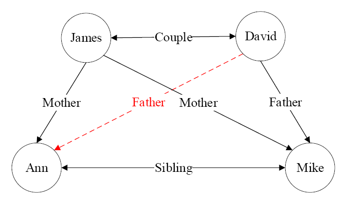
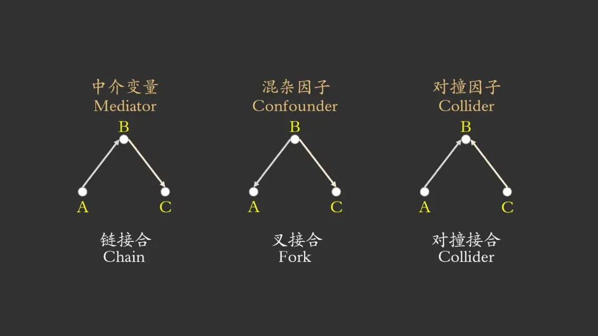
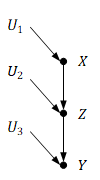
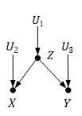
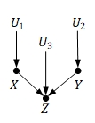

上部分：[人工智能导论 Ch.3 逻辑与推理（上）](/posts/computer-science/introduction-to-ai/人工智能导论-ch3-逻辑与推理上/)
# 知识图谱推理(Graph reasoning)
## 知识图谱的基本概念
+ 知识图谱可视为包含多种关系的图。在图中，每个节点是一个实体（如人名、地名、事件和活动等），任意两个节点之间的边表示这两个节点之间存在的关系。
+ 一般而言，可将知识图谱中任意两个相连节点及其连接边表示成一个**三元组(triplet)**，即($\mathrm{left}_\mathrm{node}, \mathrm{relation},\mathrm{right}_\mathrm{node}$)。
+ 知识图谱中存在连线的两个实体可表达为形如($\mathrm{left}_\mathrm{node}, \mathrm{relation},\mathrm{right}_\mathrm{node}$)的三元组形式，这种三元组也可以表示为 **一阶逻辑(firstorder logic,FOL)** 的形式，从而为基于知识图谱的推理创造了条件。
  + 例如从(奥巴马，出生地，夏威夷)和(夏威夷，属于，美国)两个三元组，可推理得到(奥巴马，国籍，美国)。
+ 可利用一阶谓词来表达刻画知识图谱中节点之间存在的关系，如下图中形如($\mathrm{James},\mathrm{Couple},\mathrm{David}$)的关系可用一阶逻辑的形式来描述，即$\mathrm{Couple}(\mathrm{James},\mathrm{David})$。
+ $\mathrm{Couple}(x,y)$是一阶谓词,$\mathrm{Couple}$是图中实体之间具有的关系，$x$和$y$是谓词变量。
+ 从图中已有关系可推知$\mathrm{David}$和$\mathrm{Ann}$具有父女关系，但这一关系在图中初始图（无红线）中并不存在，是需要推理的目标。
  + 转化为逻辑形式即为：已知$(\forall x)(\forall y)(\forall z)(\mathrm{Mother}(z,y)\land\mathrm{Couple}(x,z)\longrightarrow \mathrm{Father}(x,y))$，如何通过推理得到$\mathrm{Father}(\mathrm{David},\mathrm{Ann})$？这就到了归纳推理的范畴。
+ 更多关于知识图谱的概念解释可参见[南京大学-人工智能导论](https://www.lamda.nju.edu.cn/guolz/introai-slides-2024/lec6.pdf)
## 归纳学习：归纳逻辑程序设计（inductive logic programming,ILP）
+ **归纳逻辑程序设计（ILP）** 是机器学习和逻辑程序设计交叉领域的研究内容。
+ ILP使用一阶谓词逻辑进行知识表示，通过修改和扩充逻辑表达式对现有知识归纳，完成推理任务。
+ 作为ILP的代表性方法，**一阶归纳学习FOIL(First Order Inductive Learner)** 通过**序贯覆盖**实现规则推理。
### FOIL(First Order Inductive Learner)
+ 参见[南京大学-人工智能导论](https://www.lamda.nju.edu.cn/guolz/introai-slides-2024/lec6.pdf#page=24)
> byd老师直接跳过不讲了，我也看不懂呜呜呜（以后有机会再补）
### 其他知识图谱推理方法
+ 路径排序推理算法（PRA）
+ 基于分布式表示的知识推理（如TransE）
+ 基于神经网络的推理（如R-GCN）
# 因果推理(Causal Inference)
## 因果关系：
+ 哲学上把现象和现象之间那种“引起和被引起”的关系，叫做因果关系，其中引起某种现象产生的现象叫做原因，被某种现象引起的现象叫做结果。因果推理是一种重要推理手段，是人类智能的重要组成。
+ 思考：公鸡打鸣与太阳升起两者之间是否有因果关系？
## 辛普森悖论(Simpson's paradox)
### 经典案例：药物实验
+ 在实验中，男性和女性患者分别接受新药和安慰剂的治疗。结果如下表所示：
+ 表1：
  |指标 | 不用药 | 用药 |
  | :---: | :---: | :---: |
  | 恢复人数 | 289 | 273 |
  | 总人数 | 350 | 350 |
  | 恢复率(%) | 83 | 78 |
+ 表2：
  |指标 | 不用药 | 不用药 | 用药 | 用药 |
  | :---: | :---: | :---: | :---: | :---: |
  |性别分组 | 男性 | 女性 | 男性 | 女性 |
  | 恢复人数 | 234 | 55 | 81 | 192 |
  | 总人数 | 270 | 80 | 87 | 263 |
  | 恢复率(%) | 87 | 69 | 93 | 73 |
+ 由表可见，男性患者在服药组的痊愈率高于未服药组，而女性患者在服药组的痊愈率同样高于未服药组。然而，当将所有患者的数据合并时，服药组的整体痊愈率却低于未服药组。这种看似矛盾的结果就是辛普森悖论的体现，即在总体样本上成立的某种关系却在分组样本里恰好相反。
+ 从数学角度而言,上述悖论可写成初等数学不等式：$\frac{b}{a}<\frac{d}{c},\frac{b^{\prime}}{a^{\prime}}<\frac{d^{\prime}}{c^{\prime}},\frac{b+b^{\prime}}{a+a^{\prime}}>\frac{d+d^{\prime}}{c+c^{\prime}}$。
+ 辛普森悖论表明，在某些情况下，忽略潜在的“第三个变量”（本例中性别就是用药与否和恢复率之外的第三个变量），可能会改变已有的结论，而我们常常却一无所知。从观测结果中寻找引发结果的原因、考虑数据生成的过程，由果溯因，就是**因果推理**。
### 其他的案例
+ 冰淇淋和犯罪率：在夏天，冰淇淋销量上升，同时犯罪率也变高；（相关研究：[Eating Ice Cream Does Not Lead to Murder: Association, Correlation, and Causation](https://www.psichi.org/page/262EyeWinter21McMahanResearch)）
+ 巧克力与诺贝尔奖：吃巧克力越多的国家，获得诺贝尔奖的数量越多；（参考论文： [Chocolate Consumption,Cognitive Function,and Nobel Laureates](https://scottbarrykaufman.com/wp-content/uploads/2012/10/Messerli-2012.pdf)）
## 因果关系的三个层次
+ 根据Judea Pearl的书[the book of why](https://archive.illc.uva.nl/cil/uploaded_files/inlineitem/Pearl_Mackenzie_2018_The_Book_of_Why.pdf#page=30)，因果关系分为三个层次（“因果关系之梯”），自底到顶分别是：关联、干预、反事实推理。
### 最底层：关联(association)
+ 就是我们通常意义下所认识的深度学习在做的事情，通过观察到的数据找出变量之间的关联性。无法得出事件互相影响的方向，只知道两者相关，比如我们知道事件A发生时，事件B也发生，但不能挖掘出，是不是因为事件A的发生导致了事件B的发生。
+ 可观测性问题：What if we see A (what is?)
+ 数学形式： $P(y|A)$
### 第二层：干预(intervention)
+ 无法直接从观测数据就能得到关系，如“某个商品涨价会产生什么结果”。
+ 我们希望知道，当改变事件A时，事件B是否会随之改变。
+ 决策行动问题：What if we do A (what if?)
+ 数学形式：$P(y|do(A))$ (如果采取$A$行为，则$B$为真)
### 最高层：反事实(counter-factuals)
+ 某个事情已经发生了，则在相同环境中，这个事情不发生会带来怎样的新结果。
+ “执果索因”，如果想让事件B发生某种变化时，能否通过改变事件A来实现。
+ 想象与回顾问题：What if we did things differently (why?)
+ 数学形式：$P(y^{\prime}|A)$（如果$A$为真，则$B$将不同）
+ 应用：可以丰富图像（在图像生成中）
## 因果推理模型
### 结构因果模型
+ 结构因果模型由两组变量集合$U$和$V$以及一组函数$f$组成。其中，$f$是根据模型中其他变量取值而给$V$中每一个变量赋值的函数。
+ 结构因果模型中的原因：
  + 如果变量$X$出现在给变量$Y$赋值的函数中，则$X$是$Y$的**直接原因(direct cause)**。如果$X$是$Y$的直接原因或者其他原因，均称$X$是$Y$的原因。
+ $U$中的变量被称为**外生变量(exogenous variables)**,即这些变量处于模型之外，不对其阐述和解释；$V$中的变量称为**内生变量(endogenous variables)**。
### 因果图
+ 由Judea Pearl提出
+ 一般而言，因果图都是有向无环图（directed acyclic graphs, DAG），可用于描述数据的生成机制。这样描述变量联合分布或者数据生成机制的模型，被称为 **“贝叶斯网络”（Bayesian network）。**
+ 与结构因果模型结合使用效果更佳
+ 在因果图中，若变量$Y$是另一个变量$X$的孩子，则$X$是$Y$的直接原因；若$Y$是$X$的后代（可能隔好几代），则$X$是$Y$的潜在原因。
+ 联合概率分布：对于任意的有向无环图模型，模型中$d$个变量的联合概率分布由每个节点与其父节点之间条件概率$P(\mathrm{child}|\mathrm{parents})$的乘积给出：
$$
P(x_{1},x_{2},\cdots,x_{d})=\prod_{j=1}^d P(x_{j}|x_{pa(j)})
$$
  + 其中，$x_{pa(j)}$表示节点$x_j$的父节点集合（所有指向$x_{j}$的节点），如果$x_j$没有父节点则概率为$P(x_j)$。这里包含了变量之间某种普遍成立的独立性假设。
+ 基本结构：
    1. 链结构（chain）
         + 链是因果图的一种基本结构。它包含三个节点两条边，其中一条边由第一个节点指向第二个节点，另一条边由第二个节点指向第三个节点。
         + 条件独立性分析：在链式图$X\longrightarrow Z\longrightarrow Y$中， $X$和$Y$在给定$Z$时条件独立。
      
        + 数学推导：
        $$
        P(X,Y|Z)=\frac{P(X,Y,Z)}{P(Z)}=\frac{P(X)P(Z|X)P(Y|Z)}{P(Z)}=P(X|Z)P(Y|Z)
        $$
        + 也可以这样理解：在给定$Z$时，若$X$的取值发生变化，则为了维持$Z$的取值不变，$U_{2}$的取值会发生变化；而由于$Y$的取值只依赖于$Z$和$U_{3}$，但$Z$是给定的，因此$Y$的取值不会发生变化。也就是说，给定$Z$时，$X$的取值不会影响$Y$的取值，因此给定$Z$时，$X$和$Y$是条件独立的。
        + 定理：**(链中的条件独立性)** 对于变量$X$和$Y$，若$X$和$Y$之间只有一条单向的路径，变量$Z$是 **截断(intercept)** 该路径的集合中的任一变量，则在给定$Z$时，$X$和$Y$条件独立。
    2. 分连结构（叉结构，fork）
         + 分连也是因果图的一种基本结构。它包含三个节点两条边，两条边分别由第一个节点指向第二个节点和第三个节点。
         + 
         + 在分连结构中，给定$Z$时，$X$和$Y$的联合概率：
           + $P(X,Y|Z)=\frac{P(X,Y,Z)}{P(Z)}=\frac{P(Z)P(X|Z)P(Y|Z)}{P(Z)}=P(X|Z)P(Y|Z)$
           + 即在分连图$X\longleftarrow Z\longrightarrow Y$中， $X$和$Y$在给定$Z$时条件独立。
         + 定理：**(分连中的条件独立性)** 若变量$Z$是变量$X$和$Y$的共同原因，且$X$到$Y$只有一条路径，则在给定$Z$时，$X$和$Y$条件独立。
    3. 汇连结构（collider）
        + 汇连(又叫碰撞)也是因果图的一种基本结构。它包含三个节点两条边，两条边分别由第一个节点和第二个节点指向第三个节点。
      
        + 在汇连图$X\longrightarrow Z\longleftarrow Y$中， $X$和$Y$在给定$Z$时条件相关。（推导留给读者）
        + 可以这样理解：给定$Z$，当$X$的取值发生变化时，为了保证$Z$的取值不变，$Y$的取值也一定会发生变化，因而给定$Z$时，$Y$和$X$是相关的。
        + 定理：**(汇连中的条件独立性)** 若变量$Z$是变量$X$和$Y$的汇连节点，且$X$到$Y$只有一条路径，则$X$和$Y$相互独立，但在给定$Z$或$Z$的后代时，$X$和$Y$是相关的。
    4. D-分离(directional separation)：可用于判断任意两个节点的相关性和独立性。
         + 若存在一条路径将这两个节点（直接）连通，则称这两个节点是 **有向连接(d-connected)** 的，即这两个节点是相关的；
         + 若不存在这样的路径将这两个节点连通，则这两个节点不是有向连接的，则称这两个节点是 **有向分离的(d-separated)** ，即这两个节点相互独立。
         + 定理：路径$p$被限定集$Z$ **阻塞(block)** 当且仅当：
           + 路径$p$含有链结构$A\longrightarrow B\longrightarrow C$或分连结构$A\longleftarrow B\longrightarrow C$且中间节点$B$在$Z$中；
           + 路径$p$含有汇连结构$A\longrightarrow B\longleftarrow C$且汇连节点$B$及其后代都不在$Z$中。
           + 若$Z$阻塞了节点$X$和节点$Y$之间的每一条路径，则称给定$Z$时，$X$和$Y$是D-分离，即给定$Z$时，$X$和$Y$条件独立。
## 干预的因果效应
+ 干预(intervention)指的是固定(fix)系统中的变量，然后改变系统，观察其他变量的变化。
+ 为了与$X$自然取值$x$时进行区分，在对$X$进行干预时，引入“$do$算子”(do-calculus)，记作$do(X=x)$。
+ 具体而言，$P(Y = y|do(X=x))$表示的是对$X$进行干预，固定其值为$x$时，$Y = y$的概率。用统计学的术语来说，$P(Y = y|do(X=x))$反映的是如果将每一个$X$取值都固定为$x$时，$Y$的总体分布。
+ 以变量为条件是改变了看世界的角度，而干预则改变了世界本身
+ 因果效应差
  + 略，因为老师没讲，以后再补。
## 反事实模型(counterfactual model，也叫potential outcomes)
+ 反事实描述的是：假设存在一个虚拟的平行世界，里面的所有因素与现实世界一模一样，两个相同的个体他和“他”，分别在现实世界和平行世界中同时同地做了不同的选择，现在他知道了现实世界中的结果，他想知道平行世界中的那个“他”的选择所带来的结果。然而，平行世界并不存在。幸运的是，反事实将告诉他另一个“他”的选择所带来的结果。
+ 如果自变量$X$在反事实条件下具有不变性，那么它“对未来结果的假设并不会改变过去的选择”，即“早知如此，依旧当初”。
+ 与前述的干预的区别：
  + 干预计算的是概率分布，它的计算结果是一个概率；反事实计算的是在假设$X=x$下，$Y$的取值，它的计算结果是一个值。从实验者的角度来看，干预描述的是总体的行为；反事实描述的是在环境$U=u$下，某个个体的行为。
+ 反事实计算的三个步骤：
  1. **溯因(abduction)**：利用现有的证据$E$确定环境$U$；
  2. **动作(action)**：对模型$M$进行修改，移除等式$X$中的变量并将其替换为$X=x$，得到修正模型$M_{x}$；
  3. **预测(prediction)**：利用修正模型$M_{x}$和环境$U$计算反事实$Y_{x}(U)$的值。
### 统计学习与反事实推理的区别
+ 统计学习：从收集的观测数据中已经训练优化得到一个数据联合发布模型$P$
+ 反事实推理：因为模型变量出现了变化，因此需要在一个新的模型$P^{\prime}$下进行分析。

# 总结
逻辑与推理具有一定的区别。逻辑本身不承载推理的使命，而是研究什么是推理以及提出一些一般性的原则来保证推理结果的正确性，如归结法等。推理的方法有很多种，如演绎推理、归纳推理和因果推理等，在实际任务中，一般是多种推理方法叠加协同，完成特定任务。

> wc完全没想到这一节有恁多内容，快累死了......