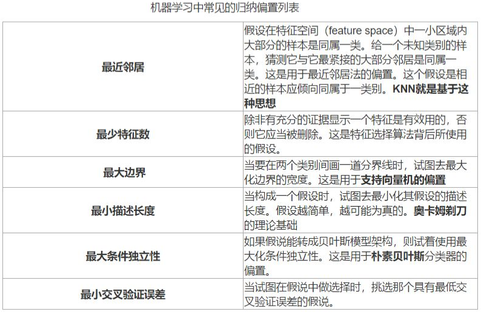
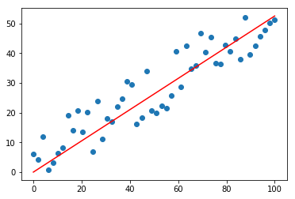
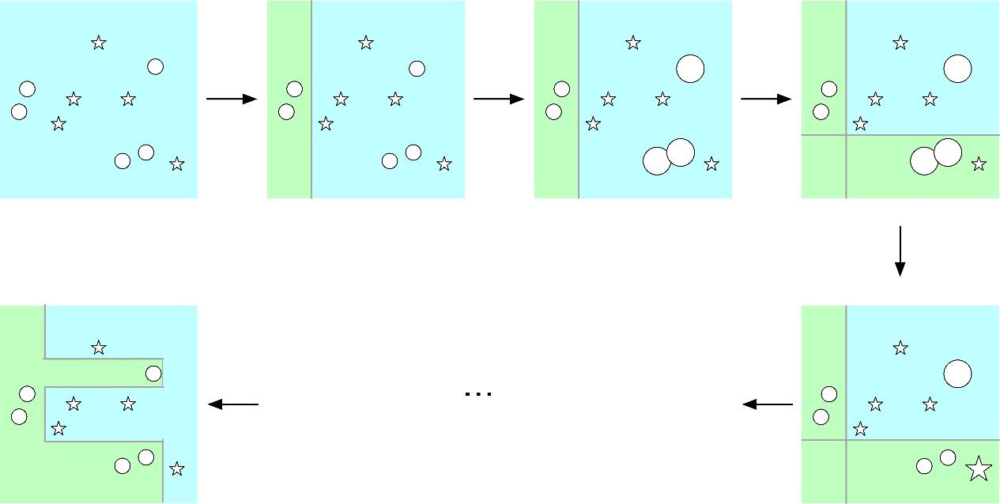
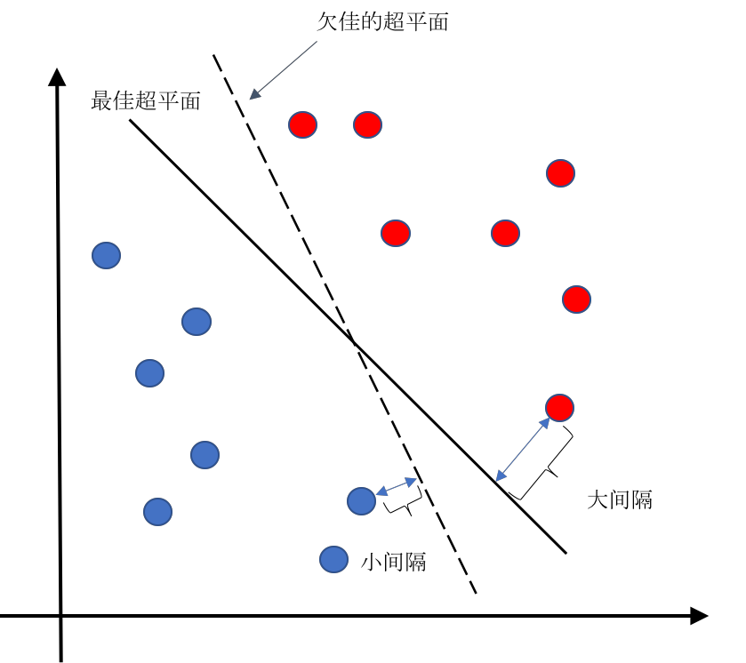
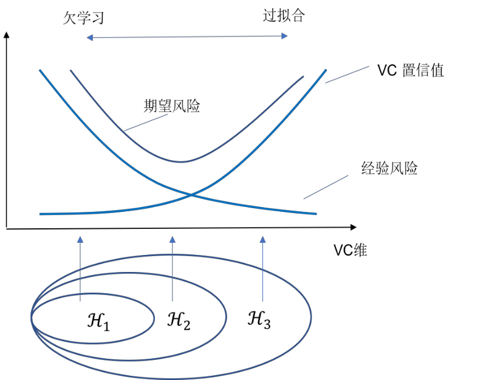
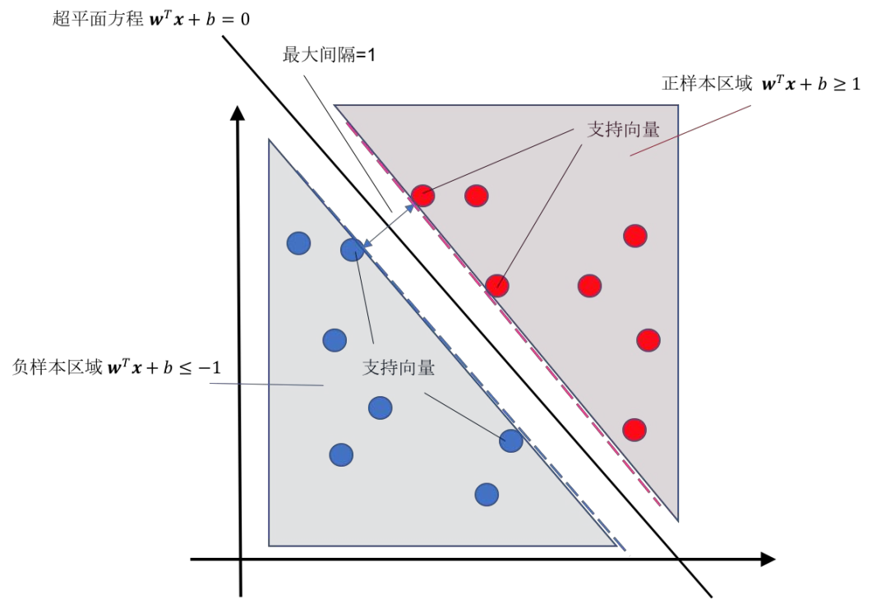

# 机器学习基本概念
## 机器学习的核心：归纳偏置(Inductive Bias，或称为归纳性偏好)
  + 归纳——从一些例子（如训练数据）中寻找共性、泛化，形成一个较通用的规则的过程；
  + 偏置——机器学习算法在学习过程中对某种类型假设的 **偏好**，也可理解为学习过程中需要去预测 “其未遇到过的输入” 的结果时所进行的一些帮助它做出选择的 **假设**。
  + 
## 机器学习的基本过程
  + 从原始数据中提取特征
  + 学习映射函数$f$
  + 通过映射函数$f$将原始数据映射到语义任务空间（属于希尔伯特空间），即寻找数据和任务目标之间的关系
## 机器学习典型例子
  + 基于图像数据进行类别分类
  + 基于文本数据进行情感分类
## 机器学习的分类
+ **监督学习(supervised learning)** ：数据有标签、一般为回归或分类等任务
  + 包括：决策树、朴素贝叶斯、SVM、KNN、Adaboost等
+ **非监督学习(un-supervised learning)** ：数据无标签、一般为聚类或若干降维任务
  + 包括：K-means，最大期望算法等，其中一个子分类是对比学习(Contrastive Learning)
+ 半监督学习(semi-supervised learning)：介于监督学习与半监督学习之间，部分数据有标签
  + 更接近现实情况（大量数据无法逐个标注）
+ **强化学习(reinforcement learning)** ：序列数据决策学习，一般为与从环境交互中学习
  + 如AlphaGo，无人驾驶等
## 机器学习：分类问题
+ 首先，提供具有标签的数据
+ 其次，映射函数$f$学习后得到隐含的模式，并进行挖掘和甄别
+ 最后，将具有特定特征的数据划分为特定类别
## 监督学习
### 监督学习的重要元素
1. 标注数据：标识了类别信息的数据（学什么）
2. 学习模型：如何学习得到映射模型（怎么学）
3. 损失函数：如何对学习结果进行度量（是否学到）
     + 是训练过程中主要改动的地方
### 损失函数
+ 在监督学习中，标注数据被划分为训练集，验证集和测试集
  + 训练集：用于训练学习模型
  + 验证集：在训练过程中验证模型的效果
  + 测试集：在训练完成后用于测试模型效果
+ 训练集中一共有$n$个标注数据，第$i$个标注数据记为$(x_i, y_i)$ ,其中第$i$个样本数据为$x_i$，$y_i$是$x_i$的标注信息。
+ 从训练数据中学习得到的映射函数记为$f$， $f$对$x_i$的预测结果记为$f(x_i)$ 。损失函数就是用来计算$x_i$真实值$y_i$与预测值$f(x_i)$之间差值的函数。
+ 很显然，在训练过程中希望映射函数在训练数据集上得到“损失”之和最小，即$\min \sum_{i=1}^n Loss(f(x_i),y_i)$
+ 常用损失函数：
  + 0-1损失函数：$Loss(y_i, f(x_i)) = \begin{cases}
                1, & f(x_i) \neq y_i \\
                0, & f(x_i) = y_i
                \end{cases}$
  + 平方损失函数：$Loss(y_i, f(x_i)) = (y_i - f(x_i))^2$
  + 绝对损失函数：$Loss(y_i, f(x_i)) = |y_i - f(x_i)|$
  + 对数（似然）损失函数：$Loss(y_i, P(y_i|x_i)) = -\log P(y_i|x_i)$
### 经验风险与期望风险
+ **经验风险(empirical risk)** ：训练集中数据产生的损失。经验风险越小说明学习模型对训练数据拟合程度越好。
+ **期望风险(expected risk)** ：当测试集中存在无穷多数据时产生的损失。期望风险越小，学习所得模型越好。
+ 映射函数训练目标：
  1.  **经验风险最小化(empirical risk minimization)** ：$\min_{f\in\Phi}\frac{1}{n}\sum_{i=1}^nLoss(y_i,f(x_i))$ （即$n$个训练样本平均损失最小）
      + 这里的$Loss()$函数一般使用 **交叉熵损失函数(cross entropy loss)**。
  2.  **期望风险最小化(expected risk minimization)** ：$\min_{f\in\Phi}\int_{x\times y}Loss(y,f(x))P(x,y)dxdy$
      + $P(x,y)$是数据的真实联合概率分布，描述了数据生成过程。
      + 积分表示对所有可能的$(x,y)$求期望，即模型在未知数据上的平均表现。
+ 期望风险是模型关于联合分布期望损失，经验风险是模型关于训练样本集平均损失。
+ 根据大数定律，当样本容量趋于无穷时，经验风险趋于期望风险。所以在实践中很自然用经验风险来估计期望风险。
+ 由于现实中训练样本数目有限，用经验风险估计期望风险并不理想（$P(x,y)$不容易计算），要对经验风险进行一定的约束。
### 过拟合(over-fitting)与欠拟合(under-fitting)
+ 模型泛化能力与经验风险、期望风险的关系：
  | 经验风险 | 期望风险 | 模型泛化能力 |
  |:---:|:---:|:---:|
  | 小（训练集上表现好） | 小（测试集上表现好） | 泛化能力强 |
  | 小（训练集上表现好） | 大（测试集上表现不好） | **过学习**（模型过于复杂） |
  | 大（训练集上表现不好） | 大（测试集上表现不好） | **欠学习** |
  | 大（训练集上表现不好） | 小（测试集上表现好） | “神仙算法” 或“黄梁美梦” |
+ 如何判断模型过拟合/欠拟合？
  + 在训练/测试过程中输出$Loss$函数值，综合判断。
+ 如何防止欠拟合（减小经验风险）？
  + 换性能更强的模型；
  + 给当前模型喂更多数据；
  + 调整损失函数。
+ 如何防止过拟合（减少期望风险）？
  + 见下文。
### 结构风险最小化(structural risk minimization)
+ 经验风险最小化：仅反映了局部数据
+ 期望风险最小化：无法得到全量数据
+ 结构风险最小化：
  + 为了防止过拟合，在经验风险上加上表示模型复杂度的**正则化项(regulatizer)** 或**惩罚项(penalty term)** ：
    + $\min_{f\in\Phi}\frac{1}{n}\sum_{i=1}^nLoss(y_i,f(x_i)) + \lambda J(f)$
    + 其中$Loss(y_i,f(x_i))$为经验风险，$\lambda J(f)$为模型复杂度
    + 这样可以在最小化经验风险与降低模型复杂度之间寻找平衡
  + 也可以使用$L1$范数正则化(LASSO正则化)：$\min_{f\in\Phi}\frac{1}{n}\sum_{i=1}^nLoss(y_i,f(x_i))+\lambda\|w\|_1$
    + 其中：
      + $\|w\|_1 = \sum_{j=1}^d |w_j|$ 是模型参数$w$的$L1$范数
      + $\lambda > 0$ 是正则化强度参数
      + $w$ 是模型的权重向量
    + 这样可以让数据稀疏化，以降低过拟合/欠拟合风险
### 监督学习的两种方法
+ 监督学习方法又可以分为 **生成方法(generative approach)** 和 **判别方法(discriminative approach)** 。所学到的模型分别称为 **生成模型(generative model)** 和 **判别模型(discriminative model)**.
1. 判别模型
   + 判别方法直接学习判别函数$f(X)$或者条件概率分布$P(Y|X)$作为预测的模型，即判别模型。
   + 判别模型关心在给定输入数据下，预测该数据的输出是什么。
   + 典型判别模型包括回归模型、神经网络、支持向量机和Ada boosting等。
2. 生成模型
   + 生成模型从数据中学习联合概率分布$P(X,Y)$（通过似然概率$P(X|Y)$和类概率$P(Y)$的乘积来求取）：
     + $P(Y|X)=\frac{P(X,Y)}{P(X)}$或者$P(Y|X)=\frac{P(X|Y)\times P(Y)}{P(X)}$ (注：似然概率$P(X|Y)$为计算导致样本$X$出现的模型参数值)
   + 典型方法为贝叶斯方法、隐马尔可夫链
   + 授之于鱼、不如授之于“渔”
   + 联合分布概率$P(X,Y)$或似然概率$P(X|Y)$求取很困难
# 回归分析
+ 分析不同变量之间存在关系的研究叫回归分析，刻画不同变量之间关系的模型被称为回归模型。
+ 一旦确定了回归模型，就可以进行预测等分析工作。
## 线性回归 (linear regression)
+ 回归（regression）一词的由来：
  + 源于英国生物学家兼统计学家高尔顿在研究父母身高与子女身高之间的关系时，发现父母平均身高每增加一个单位, 其成年子女平均身高只增加0.516个单位，它反映了这种“衰退(regression)”效应（“回归”到正常人平均身高）。
  + 虽然$x$和$y$之间并不总是具有“衰退”（回归）关系，但是“线性回归”这一名称就保留了下来了。
+ 线性回归的参数：需要从标注数据中学习得到(监督学习)
+ 注：以下回归参数推导过程不需要手推，会写代码套公式即可。
### 一元线性回归
+ 回归模型：$y=ax+b$
+ 
+ 求取：最佳回归模型是最小化残差平方和（Residual Sum of Squares，简称RSS）的均值，即要求$N$组$(x,y)$数据得到的残差平均值$\frac{1}{N}\Sigma(y-\widetilde{y})^2$最小。残差平均值最小只与参数$a$和$b$有关，最优解即是使得残差最小所对应的$a$和$b$的值。
+ 目标：寻找一组$a$和$b$，使得误差总和$L(a,b)=\sum_{i=1}^n(y_i-a\times x_i-b)^2$值最小。在线性回归中，解决如此目标的方法叫 **最小二乘法**。
+ 一般而言，要使函数具有最小值，可对$L(a,b)$的参数$a$和$b$分别求导，令其导数值为零，再求取参数$a$和$b$的取值。
  + 具体推导过程：
  $$
  \begin{aligned}
    &\frac{\partial L(a,b)}{\partial a}=\sum_{i=1}^n2(y_i-ax_i-b)(-x_i)=0 \\
    &\text{将}b=\bar{y}-a\bar{x}(\bar{y}=\frac{\sum_{i=1}^ny_i}{n},\bar{x}=\frac{\sum_{i=1}^nx_i}{n})\text{代入上式：} \\
    &\to\sum_{i=1}^n(y_i-ax_i-\bar{y}+a\bar{x})(x_i)=0 \\
    &\to\sum_{i=1}^n(y_ix_i-ax_ix_i-\bar{y}x_i+a\bar{x}x_i)=0\\
    &\to\sum_{i=1}^n(y_ix_i-\bar{y}x_i)-a\sum_{i=1}^n(x_ix_i-\bar{x}x_i)=0 \\
    &\to(\sum_{i=1}^nx_iy_i-n\bar{x}\bar{y})-a(\sum_{i=1}^nx_ix_i-n\bar{x}^2)=0 \\
    &\to a=\frac{\sum_{i=1}^nx_iy_i-n\bar{x}\bar{y}}{\sum_{i=1}^nx_ix_i-n\bar{x}^2}
  \end{aligned}
  $$
  $$
  \begin{aligned}
    & \frac{\partial L(a,b)}{\partial b}=\sum_{i=1}^n2(y_i-ax_i-b)(-1)=0 \\
    & \to\sum_{i=1}^n(y_i-ax_i-b)=0 \\
    & \to\sum_{i=1}^n(y_i)-a\sum_{i=1}^nx_i-\sum_{i=1}^nb=0 \\
    & \to n\overline{y}-an\overline{x}-nb=0 \\
    & \to b=\overline{y}-a\overline{x}
  \end{aligned}
  $$
+ 可以看出：只要给出了训练样本$(x_i, y_i) (i =1,\cdots,n)$,我们就可以从训练样本出发，建立一个线性回归方程，使得对训练样本数据而言，该线性回归方程预测的结果与样本标注结果之间的差值和最小。
### 多元线性回归
+ 多维数据特征中线性回归的问题定义如下：
  + 假设总共有$m$个训练数据$\{(x_i,y_i)\}_{i=1}^m$,其中$x_i=[x_{i,1},x_{i,2},\ldots,x_{i,D}]\in\mathbb{R}^D$,$D$为数据特征的维度,线性回归就是要找到一组参数$a=[a_0,a_1,...,a_D]$,使得线性函数：
  $$
  f(x_t)=a_0+\sum_{j=1}^Da_jx_{i,j}=a_0+a^Tx_i
  $$
+ 最小化均方误差函数(MSE): $J_m=\frac{1}{m}\sum_{i=1}^m(y_i-f(x_i))^2$
+ 为了方便,使用矩阵来表示所有的训练数据和数据标签：
$$
X=[x_1,...,x_m],\quad y=[y_1,...,y_m]
$$
+ 其中每一个数据$x_i$会扩展一个维度,其值为$1$,对应参数$a_0$。均方误差函数可以表示为：
$$
J_m(a)=\left(y-X^T\boldsymbol{a}\right)^T(\boldsymbol{y}-X^T\boldsymbol{a}) 
$$
+ 均方误差函数$J_n(\boldsymbol{a})$对所有参数$\boldsymbol{a}$求导可得：
$$
\nabla J(\boldsymbol{a})=-2X(y-X^T\boldsymbol{a}) 
$$
+ 因为均方误差函数$J_n(\boldsymbol{a})$是一个二次的凸函数,所以函数只存在一个极小值点,也同样是最小值点,所以令$\nabla J(a)=0$可得
$$
XX^T\boldsymbol{a}=X\boldsymbol{y} 
\boldsymbol{a}=\left(XX^T\right)^{-1}X\boldsymbol{y}
$$
### 逻辑斯蒂回归/对数几率回归
+ 线性回归一个明显的问题是对**离群点**（和大多数数据点距离较远的数据点，outlier）非常敏感，导致模型建模不稳定，使结果有偏，为了缓解这个问题（特别是在二分类场景中）带来的影响，可考虑**逻辑斯蒂回归(logistic regression)** 。
+ 逻辑斯蒂回归(logistic regression)就是在回归模型中引入 **sigmoid函数** 的一种非线性回归模型。Logistic回归模型可如下表示：
$$
y=\frac{1}{1+e^{-z}}=\frac{1}{1+e^{-(\mathbf{w}^T\mathbf{x}+\mathrm{b})}}\quad,\quad\text{其中}y\in(0,1),z=\mathbf{w}^T\mathbf{x}+\mathrm{b}
$$
+ 这里$\frac{1}{1+e^{-z}}$是sigmoid函数、$\mathbf{x}\in\mathbb{R}^d$是输入数据、$\mathbf{w}\in\mathbb{R}^d$和$b\in\mathbb{R}$是回归函数的参数。
+ 
+ Sigmoid函数的特点：
  + sigmoid函数是单调递增的，其值域为$(0,1)$，因此使sigmoid函数输出可作为概率值。在前面介绍的线性回归中，回归函数的值域一般为$(-\infty,+\infty)$
  + 对输入$z$范围没有限制，但当$z$大于一定数值后，函数输出无限趋近于$1$，而小于一定数值后，函数输出无限趋近于$0$。特别地，当$z=0$时，函数输出为$0.5$。这里$z$是输入数据$x$和回归函数参数$w$的内积结果（可视为$x$各维度进行加权叠加）
  + $x$各维度加权叠加之和结果取值在$0$附近时，函数输出值的变化幅度比较大（函数值变化陡峭），且是非线性变化。但是，各维度加权叠加之和结果取值很大或很小时，函数输出值几乎不变化，这是基于概率的一种认识与需要。
+ 逻辑斯蒂回归虽可用于对输入数据和输出结果之间复杂关系进行建模，但由于逻辑斯蒂回归函数的输出具有概率意义，使得逻辑斯蒂回归函数更多用于 **二分类问题**（$y = 1$表示输入数据$x$属于正例，$y = 0$表示输入数据$x$属于负例）\[对于多分类，可以使用softmax函数，原理类似，在此不赘述\]
+ $y=\frac{1}{1+e^{-(w^Tx+b)}}$可用来计算输入数据$x$属于正例的概率,这里$y$理解为输入数据$x$属于正例的概率、$1-y$理解为输入数据$x$为负例的概率，即$p(y = 1\mid x)$。
+ 我们现在对比值$\frac{p}{1-p}$取对数（即$\log\left(\frac{p}{1-p}\right)$）来表示输入数据$x$属于正例的概率。
  + $\frac{p}{1-p}$ 被称为 **几率(odds)** ,反映了输入数据$\mathbf{x}$作为正例的相对可能性。
  + $\frac{p}{1-p}$ 的 **对数几率(log odds)** 或logit函数可表示为$\log\left(\frac{p}{1-p}\right)$。
+ 显然,可以得到$p(y=1|\mathbf{x})=h_\theta(x)=\frac{1}{1+e^{-(\mathbf{w}^T\mathbf{x}+b)}}$和$p(y=0|\mathbf{x})=1-h_\theta(x)=\frac{e^{-(\mathbf{w}^T\mathbf{x}+\mathrm{b})}}{1+e^{-(\mathbf{w}^T\mathbf{x}+\mathrm{b})}}$。$\theta$表示模型参数（$\theta=\{\mathbf{w},b\}$）。于是有：
$$
\mathrm{logit}\left(p(y=1|x)\right)=\log\left(\frac{p(y=1|x)}{p(y=0|x)}\right)=\log\left(\frac{p}{1-p}\right)=\mathbf{w}^T\mathbf{x}+b
$$
+ 如果输入数据𝒙属于正例的概率大于其属于负例的概率，即$p(y = 1\mid x)>0.5$，则输入数据𝒙可被判断属于正例。这一结果等价于$\frac{p(y=1|x)}{p(y=0|x)}>1$，即
$\log\left(\frac{p(y=1|x)}{p(y=0|x)}\right)>\log1=0$，也就是$\mathbf{w}^T\mathbf{x}+b>0$成立。
+ 从这里可以看出，logistic回归是一个线性模型。在预测时，可以计算线性函数$\mathbf{w}^T\mathbf{x}+b$取值是否大于$0$来判断输入数据$x$的类别归属
# 决策树
+ 决策树是一种通过 **树形结构** 来进行分类的方法。在决策树中，树形结构中每个非叶子节点表示对分类目标在某个属性上的一个判断，每个分支代表基于该属性做出的一个判断，最后树形结构中每个叶子节点代表一种分类结果，所以决策树可以看作是一系列以叶子节点为输出的 **决策规则（Decision Rules）**
+ 例子：(虽然下面这图是个梗图，但也可以看作一种决策树)
+ 更一般地情况下，在构造决策树之前，会提供相应属性和决策的表格，通过机器学习训练得到决策树。
+ 构建决策树时划分属性的顺序选择是重要的。性能好的决策树随着划分不断进行，决策树分支结点样本集的“纯度”会越来越高，即其所包含样本尽可能属于相同类别。
  + 下面的信息熵就是一种衡量样本集“纯度”的指标。
## 信息熵(entropy)
+ 由“信息论之父”香农提出
+ 设有$K$个信息，其组成了集合样本$D$，记第$k$个信息发生的概率为$p_k(1 \leq k \leq K)$”。如下定义这$K$个信息的信息熵：
$$
E(D)=-\sum_{k=1}^k p_k \log_2 p_k
$$
+ $E(D)$值越小，表示$D$包含的信息越确定，也称$D$的纯度越高。需要指出，所有$p_k$累加起来的和为$1$。
## 信息增益
+ 得到信息熵后，就可以计算基于某种属性对样本集进行划分后的信息增益，公式如下：
$$
\mathrm{Gain}(D,A)=\mathrm{Ent}(D)-\sum_{i=1}^n\frac{|D_i|}{|D|}\mathrm{Ent}(D_i)
$$
+ 信息增益可以看作是在一定条件下，信息复杂度（不确定性）的减少程度
+ 我们可以通过比较不同属性信息增益的高低来选择最佳属性对原样本集进行划分，得到最大的“纯度”。如果划分后的不同子样本集都只存在同类样本，那么停止划分。
## 构建决策树：信息增益率
+ 一般而言，信息增益偏向选择分支多的属性,这在一些场合容易导致模型过拟合。为了解决这个问题，一个直接的想法是对分支过多进行惩罚，这就是另外一个“纯度”
衡量指标，信息增益率的核心思想。
+ 为了衡量信息增益率，我们需要计算划分行为本身带来的信息$\mathrm{info}$:
$$
\mathrm{info}=-\sum_{i=1}^n\frac{|D_i|}{|D|}\log_2\frac{|D_i|}{|D|}
$$
由此可得信息增益率$\mathrm{Gain-ratio}$计算公式：
$$
\mathrm{Gain-ratio}=\frac{\mathrm{Gain}(D,A)}{\mathrm{info}}
$$
+ 另一种计算更简易的度量指标是如下的$\mathrm{Gini}$系数：
$$
\mathrm{Gini}(\mathrm{D})=1-\sum_{k=1}^Kp_k^2
$$
相比于计算信息熵，计算更为容易。
# 线性区别分析（LDA）
+ 线性判别分析是一种基于监督学习的降维方法，也称为Fisher线性判别分析（fisher's discriminant analysis,FDA）
+ 对于一组具有标签信息的高维数据样本，LDA利用其类别信息，将其线性投影到一个低维空间上，在低维空间中同一类别样本尽可能靠近，不同类别样本尽可能彼此远离。（即“类内方差小，类间间隔大”）
## 符号定义
+ 假设样本集为$D=\{(x_1,y_1),(x_2,y_2),(x_3,y_3),\cdots,(x_N,y_N)\}$，样本$x_i\in\mathbb{R}^d$的类别标签为$y_i$。其中，$y_i$的取值范围是$\{\mathcal{C}_1,\mathcal{C}_2,\cdots,\mathcal{C}_K\}$，即一共有$K$类样本。
+ 定义$X$为所有样本构成集合、$N_i$为第$i$个类别所包含样本个数、$X_i$为第$i$类样本的集合、$m$为所有样本的均值向量、$m_i$为第$i$类样本的均值向量。$\sum_i$为第$i$类样本的协方差矩阵，其定义为：
$$
\textstyle\sum_i=\sum\limits_{x\in X_i} (x-m_i)(x-m_i)^T
$$
## 二分类问题
+ 分析$K=2$的情况。此时训练样本归属于$\mathcal{C}_1$和$\mathcal{C}_2$，通过以下线性函数投影到一维空间上：$y(x)=\mathbf{w}^Tx (\mathbf{w}\in\mathbb{R}^n)$
+ 投影之后类别$\mathcal{C}_1$的协方差矩阵$s_1$为：
$$
s_1=\sum_{x\in\mathcal{C}_1}\left(\mathbf{w}^Tx-\mathbf{w}^Tm_1\right)^2=\mathbf{w}^T\sum_{x\in\mathcal{C}_1}[(x-m_1)(x-m_1)^T]\mathbf{w}
$$
同理可得到投影之后类别$\mathcal{C}_2$的协方差矩阵$s_2$。
+ 投影后两个协方差矩阵$s_1$和$s_2$分别为$\mathbf{w}^T\sum_1\mathbf{w}$和$\mathbf{w}^T\sum_2\mathbf{w}$。$s_1$和$s_2$可用来衡量同一类别数据样本之间“分散程度”。为了使得归属于同一类别的样本数据在投影后的空间中尽可能靠近，需要最小化$s_1+s_2$取值。
+ 在投影之后的空间中，归属于两个类别的数据样本中心可分别如下计算：
$$
m_1=\mathbf{w}^Tm_1,\quad m_2=\mathbf{w}^Tm_2
$$
+ 这样，就可以通过$\|m_2-m_1\|_2^2$来衡量不同类别之间的距离。为了使得归属于不同类别的样本数据在投影后空间中尽可能彼此远离，需要最大化$\|m_2-m_1\|_2^2$的取值。
+ 同时考虑上面两点，就得到了需要最大化的目标$J(\mathbf{w})$，定义如下：
$$
J(\mathbf{w})=\frac{\|m_2-m_1\|_2^2}{s_1+s_2}
$$
把上述式子右边改写成与$\mathbf{w}$相关的式子：
$$
J(\mathbf{w})=\frac{\left\|\mathbf{w}^T(m_2-m_1)\right\|_2^2}{\mathbf{w}^T\Sigma_1\mathbf{w}+\mathbf{w}^T\Sigma_2\mathbf{w}}=\frac{\mathbf{w}^T(m_2-m_1)(m_2-m_1)^T\mathbf{w}}{\mathbf{w}^T(\Sigma_1+\Sigma_2)\mathbf{w}}=\frac{\mathbf{w}^TS_b\mathbf{w}}{\mathbf{w}^TS_\mathbf{w}\mathbf{w}}
$$
其中，$S_b$称为 **类间散度矩阵(between-class scatter matrix)** ，即衡量两个类别均值点之间的“分离”程度，可定义如下：
$$
S_b = (m_2 − m_1)(m_2 − m_1)^T
$$
$S_\mathbf{w}$则称为 **类内散度矩阵(within-class scatter matrix)** ，即衡量每个类别中数据点的“分离”程度，可定义如下：
$$
S_\mathbf{w}=\textstyle\sum_1+\textstyle\sum_2
$$
由于$J(\mathbf{w})$的分子和分母都是关于$\mathbf{w}$的二项式，因此最后的解只与$\mathbf{w}$的方向有关，与$\mathbf{w}$的长度无关，因此可令分母$\mathbf{w}^TS_\mathbf{w}\mathbf{w} = 1$，然后用拉格朗日乘子法来求解这个问题。
+ 对应拉格朗日函数为：
$$
L(\mathbf{w})=\mathbf{w}^TS_b\mathbf{w}-\lambda(\mathbf{w}^TS_\mathbf{w}\mathbf{w}-1)
$$
对$\mathbf{w}$求偏导并使其求导结果为零，可得$S_\mathbf{w}^{-1}S_b\mathbf{w}=\lambda \mathbf{w}$。由此可见，$\lambda$和$\mathbf{w}$分别是$S_\mathbf{w}^{-1}S_b$的特征根和特征向量，$S_\mathbf{w}^{-1}S_b\mathbf{w}=\lambda \mathbf{w}$ 也被称为 **Fisher线性判别（Fisher linear discrimination）** 。令实数$\lambda_\mathbf{w}=\left(m_2-m_1\right)^\mathrm{T}\mathbf{w}$，则可得：
$$
S_\mathbf{w}^{-1}S_b\mathbf{w}=S_\mathbf{w}^{-1}(m_2-m_1)\times\lambda_\mathbf{w}=\lambda \mathbf{w}
$$
由于对$\mathbf{w}$的放大和缩小操作不影响结果，因此可约去上式中的未知数$\lambda$和$\lambda_\mathbf{w}$，得到：$\mathbf{w}=S_\mathbf{w}^{-1}(m_2-m_1)$
## 多分类问题
+ 假设$n$个原始高维数据所构成的类别种类为$K$、每个原始数据被投影映射到低维空间中的维度为$r$。
+ 令投影矩阵$\mathbf{W}=\mathbf{w}_1, \mathbf{w}_2, \cdots , \mathbf{w}_r$ ，可知$\mathbf{W}$是一个$n\times r$矩阵。于是，$\mathbf{W}^Tm_i$为第$i$类样本数据中心在低维空间的投影结果，$\mathbf{W}^Tm_i\mathbf{W}$为第$i$类样本
数据协方差在低维空间的投影结果。
+ 类内散度矩阵$S_\mathbf{w}$重新定义如下：
$$
S_\mathbf{w}=\sum_{i=1}^K\Sigma_i\text{,其中}\Sigma_i=\sum_{x\in class}i(x-m_i)(x-m_i)^T
$$
在上式中，$m_i$是第$i$个类别中所包含样本数据的均值。
+ 类间散度矩阵$S_b$重新定义如下：
$$
S_b=\sum_{i=1}^K\frac{N_i}{N}(\boldsymbol{m}_i-\boldsymbol{m})(\boldsymbol{m}_i-\boldsymbol{m})^T
$$
+ 将多类LDA映射投影方向的优化目标$J(\mathbf{W})$改为：
$$
J(\mathbf{W})=\frac{\prod_{diag}\mathbf{W}^TS_b\mathbf{W}}{\prod_{diag}\mathbf{W}^TS_\mathbf{w}\mathbf{W}}
$$
其中，$\prod_{diag}\mathbb{A}$为矩阵$\mathbb{A}$主对角元素的乘积。
+ 继续对$J(\mathbf{W})$进行变形：
$$
J(\mathbf{W})=\frac{\prod_{diag}\mathbf{W}^TS_b\mathbf{W}}{\prod_{diag}\mathbf{W}^TS_\mathbf{w}\mathbf{W}}=\frac{\prod_{i=1}^r\mathbf{w}_i^TS_b\mathbf{w}_i}{\prod_{i=1}^r\mathbf{w}_i^TS_\mathbf{w}\mathbf{w}_i}=\prod_{i=1}^r\frac{\mathbf{w}_i^TS_b\mathbf{w}_i}{\mathbf{w}_i^TS_\mathbf{w}\mathbf{w}_i}
$$
显然需要使乘积式子中每个$\frac{\mathbf{w}_i^TS_b\mathbf{w}_i}{\mathbf{w}_i^TS_\mathbf{w}\mathbf{w}_i}$取值最大，这就是二分类问题的求解目标，即每一个$\mathbf{w}_i$都是$S_\mathbf{w}^{-1}S_b\mathbf{W}=\lambda \mathbf{W}$的一个解。
## 线性判别分析的降维步骤
+ 对线性判别分析的降维步骤描述如下：
  1. 计算数据样本集中每个类别样本的均值
  2. 计算类内散度矩阵$S_\mathbf{W}$和类间散度矩阵$S_b$
  3. 根据$S_\mathbf{w}^{-1}S_b\mathbf{W}=\lambda \mathbf{W}$来求解$S_\mathbf{w}^{-1}S_b$所对应前$r$个最大特征值所对应特征向量$(\mathbf{w}_1, \mathbf{w}_2, \cdots , \mathbf{w}_r)$ ，构成矩阵$\mathbf{W}$
  4. 通过矩阵$\mathbf{w}$将每个样本映射到低维空间，实现特征降维。
## 与主成分分析法的异同
|           | 线性判别分析        | 主成分分析 |
| :--------: | :--------------: | :---------------: |
| 是否需要样本标签          | 监督学习          | 无监督学习       |
| 降维方法             | 优化寻找特征向量$\mathbf{w}$                  | 优化寻找特征向量$\mathbf{w}$        |
| 目标         | 类内方差小、类间距离大              | 寻找投影后数据之间方差最大的投影方向 |
| 维度      | LDA降维后所得到维度是与数据样本的类别个数$K$有关   | PCA对高维数据降维后的维数是与原始数据特征维度相关  |
# Ada Boosting（自适应提升）
+ Ada Boosting(自适应提升)通过 **集成(ensemble)** 手段来达到提升(boosting)算法性能目的，该算法的核心思想是：对于一个复杂的分类任务，可以将其分解为若干子任务，然后将若干子任务完成方法综合，最终完成该复杂任务。
+ 具体而言，是将若干个 **弱分类器(weak classifiers)**（这里指错误率略低于50%的算法） 组合起来，形成一个 **强分类器(strong classifier)** 。（通俗来说就是“三个臭皮匠顶个诸葛亮”）
+ 该算法在1995年由Yoav Freund和Robert Schapire提出（论文：[AdaBoosting](https://www.face-rec.org/algorithms/Boosting-Ensemble/decision-theoretic_generalization.pdf)）
## 计算学习理论(Computational Learning Theory)
+ 可计算理论关心什么样的问题可以被计算(computable)。一个任务，如果是 **图灵可停机** 的，那么该任务可计算。可学习理论(learnability theory)关心什么样的任务是可以被习得，从而能被算法模型来完成。
+ Leslie Valiant (2010年图灵奖获得者)和其学生Michael Kearns两位学者提出了这个问题并进行了有益探索，逐渐完善了计算学习理论。
### 霍夫丁不等式(Hoeffding’s inequality)
+ 学习任务：统计某个电视节目在全国的收视率。
+ 方法：不可能去统计整个国家中每个人是否观看电视节目、进而算出收视率。只能抽样一部分人口，然后将抽样人口中观看该电视节目的比例作为该电视节目的全国收视率。
+ 霍夫丁不等式：全国人口中看该电视节目的人口比例（记作$x$）与抽样人口中观看该电视节目的人口比例（记作$y$）满足如下关系：
$P(|x-y|\geq\epsilon)\leq 2e^{-2N\epsilon^2}$($N$是采样人口总数、$\epsilon \in (0,1)$是所设定的可容忍误差范围)
+ 当$N$足够大时，“全国人口中电视节目收视率”与“样本人口中电视节目收视率”差值超过误差范围$\epsilon$的概率非常小。
### 概率近似正确(probably approximately correct, PAC)
+ 对于统计电视节目收视率这样的任务，可以通过不同的采样方法（即不同模型）来计算收视率。
+ 每个模型会产生不同的误差。
+ 问题：如果得到完成该任务的若干“弱模型”，是否可以将这些弱模型组合起来，形成一个“强模型”。该“强模型” 产生误差很小呢？这就是概率近似正确（PAC）要回答的问题。
+ 在概率近似正确背景下，有“强可学习模型”和“弱可学习模型”：
  + **强可学习(strongly learnable)**： 学习模型能够以较高精度对绝大多数样本完成识别分类任务
  + **弱可学习(weakly learnable)**： 学习模型仅能完成若干部分样本识别与分类，其精度略高于随机猜测。
+ 概率近似正确指出，强可学习和弱可学习是等价的，也就是说，如果已经发现了“弱学习算法”,可将其提升(boosting)为“强学习算法”。Ada Boosting算法就是这样的提升方法。具体而言，Ada Boosting将一系列弱分类器组合起来，构成一个强分类器。
## Ada Boosting算法
### 思路描述
Ada Boosting算法中两个核心问题：
+ 在每个弱分类器学习过程中，如何改变训练数据的权重：提高在上一轮中分类错误样本的权重。
+ 如何将一系列弱分类器组合成强分类器：通过加权多数表决方法来提高分类误差小的弱分类器的权重，让其在最终分类中起到更大作用。同时减少分类误差大的弱分类器的权重，让其在最终分类中仅起到较小作用。
+ 图示：
### 算法描述
1. 数据样本权重初始化   
    给定包含$N$个标注数据的训练集合$\Gamma,\Gamma=\{(x_1,y_1),\cdots ,(x_N,y_N)\}$，其中$x_i(1\leq i\leq N)\in X\subseteq \mathbb{R}^n,y_i\in Y=\{-1,1\}$。   
    Ada Boosting算法将从这些标注数据出发，训练得到一系列弱分类器，并将这些弱分类器线性组合得到一个强分类器。
    初始化每个训练样本的权重：$D_1=(w_{11},\cdots,w_{1i},\cdots,w_{1N})$,其中$w_{1i}=\frac{1}{N}(1\leq i\leq N)$
2. 分别训练$M$个基分类器  
   对$m=1,2,\cdots,M$：  
   a. 使用具有分布权重$D_m$的训练数据来学习得到第$m$个基分类器（弱分类器）$G_m$：
   $$
   G_m(x):X\rightarrow \{-1,1\}
   $$
   b. 计算$G_m(x)$在训练数据集上的分类误差：  
   $$
   err_m=\sum_{i=1}^N w_{mi}I(G_m(x_i)\neq y_i),I(\cdot)=\left\{
    \begin{array}{rcl}
    1     &      & G_m(x_i)\neq y_i\\
    0     &      & G_m(x_i)= y_i\\
    \end{array} \right.
   $$
   c. 计算弱分类器$G_m(x)$的权重：
   $$
   \alpha_m=\frac{1}{2}\ln\frac{1-err_m}{err_m}
   $$
   d. 更新训练样本数据的分布权重：  
   $D_{m+1}=w_{m+1,i}=\frac{w_{m,i}}{Z_m}e^{-\alpha_my_iG_m(x_i)}$，其中$Z_m$是归一化因子以使得$D_{m+1}$为概率分布，$Z_m=\sum_{i=1}^Nw_{m,i}e^{-\alpha_my_iG_m(x_i)}$
3. 以线性加权形式来组合弱分类器$f(x)$
   $$
   f(x)=\sum_{i=1}^M\alpha_mG_m(x)
   $$
   得到强分类器$G(x)$
   $$
   G(x)=sign(f(x))=sign(\sum_{i=1}^M\alpha_mG_m(x))
   $$
### 算法解释
+ 第$m$个弱分类器$G_m(x)$在训练数据集上产生的分类误差等于被错误分类的样本所具有权重的累加。
+ 对于第$m$个弱分类器$G_m(x)$的权重$\alpha_m$：
  + 当第$m$个弱分类器$G_m(x)$错误率为$1$，代表每个样本分类都出错，则$\alpha_m=\frac{1}{2}\ln\frac{1-err_m}{err_m}\rightarrow -\infty$，故给予第$m$个弱分类器$G_m(x)$很低的权重；
  + 当第$m$个弱分类器$G_m(x)$错误率为$\frac{1}{2}$，$\alpha_m=\frac{1}{2}\ln\frac{1-err_m}{err_m}=0$。如果错误率$err_m<\frac{1}{2}$，权重$\alpha_m>0$。由此可知权重$\alpha_m$随$err_m$减少而增大，即错误率越小的弱分类器会赋予更大权重；
+ 如果一个弱分类器的分类错误率为$\frac{1}{2}$，可视为其性能仅相当于随机分类效果。
+ 可以把对第$i$个训练样本更新后的样本数据分布权重写为如下分段函数形式：
  $$
  w_{m+1,i}=
  \begin{cases}
  \frac{w_{m,i}}{Z_m}e^{-\alpha_m}, & G_m(x_i)=y_i \\
  \frac{w_{m,i}}{Z_m}e^{\alpha_m}, & G_m(x_i)\neq y_i & & 
  \end{cases}
  $$
  可见，如果某个样本无法被第$m$个弱分类器$G_m(x)$分类成功，则需要增大该样本权重，否则减少该样本权重。这样，被错误分类样本会在训练第$m+1$个弱分类器$G_{m+1}$时会被“重点关注” 。  
  在每一轮学习过程中，Ada Boosting算法均在划重点（重视当前尚未被正确分类的样本）
+ $f(x)$是$M$个弱分类器的加权线性累加。分类能力越强的弱分类器具有更大权重。注意$\alpha_m$累加之和并不等于1。$f(x)$符号决定样本$x$分类为$1$或$-1$。如果$\sum_{i=1}^M\alpha_mG_m(x)$为正，则强分类器$G(x)$将样本$x$
分类为$1$；否则为$-1$。
### 从霍夫丁不等式解释Ada Boosting算法
+ 假设有$M$个弱分类器$G_M(1\leq m \leq M)$ ，则$M$个弱分类器线性组合所产生误差满足如下条件：
  $$
  P(\sum_{i=1}^MG_m(x)\neq\zeta(x))\leq e^{-\frac{1}{2}M(1-2\epsilon)^2}
  $$
  $\zeta(x)$是真实分类函数，$\epsilon\in (0,1)$ 。上式表明，如果所“组合” 弱分类器越多，则学习分类误差呈指数级下降，直至为零。
+ 上述不等式成立有两个前提条件：
  1) 每个弱分类器产生的误差相互独立； 
  2) 每个弱分类器的误差率小于50%。因为每个弱分类器均是在同一个训练集上产生，条件1）难以满足。也就说，“准确性（对分类结果而言）”和“差异性（对每个弱分类器而言）”难以同时满足。
+ Ada Boosting采取了序列化学习机制，即一个分类器学习完成之后才会进行下一个分类器的学习，后一个分类器的学习受到前面分类器学习的影响。
### 优化目标
Ada Boosting实际是在**最小化指数损失函数(minimization of exponential loss)** :
$$
\sum_ie^{-y_if(x_i)}=\sum_ie^{-y_i\sum_{i=1}^M\alpha_mG_m(x_i)}
$$
Ada Boost的分类误差上界如下所示：
$$
\frac{1}{N}\sum_{i=1}^NI(G(x_i)\neq y_i)\leq\frac{1}{N}\sum_ie^{-y_if(x_i)}=\prod_mZ_m
$$
在第$m$次迭代中，Ada Boosting总是趋向于将具有最小误差的学习模型选做本轮生成的弱分类器$G_m$，使得累积误差快速下降。
## 例子
略，见《人工智能导论：模型与算法》P141~143。
# 支持向量机（support vector machine,SVM）
+ 传统识别理论认为，算法模型性能可用从训练样本集所得经验风险（empirical risk）来衡量。经验风险指算法模型在训练样本集中所有数据上所得误差的累加。很显然，经验风险越小，算法模型对训练数据拟合程度越好。在实际中，一味要求经验风险小，往往会造成过拟合问题（over-fitting）。
+ 支持向量机通过 **结构风险最小化（structural risk minimization）** 来解决过学习问题。在样本组成的超空间中，存在多个可将样本分开的超平面(hyper-plane)。但是，在这些超平面中，支持向量机学习算法会去寻找一个最佳超平面，使得每个类别中距离超平面最近的样本点到超平面的最小距离最大。
+ 下图为二类分类问题的最佳分类平面示例：
+ 支持向量机在1995年由Corinna Cortes和Vladimr Vapnik提出（论文：[Support-vector Networks](https://ise.ncsu.edu/wp-content/uploads/sites/9/2022/08/Cortes-Vapnik1995_Article_Support-vectorNetworks.pdf)
## VC维与结构风险最小化
在理论上，支持向量机认为：分类器对未知数据（即测试数据）进行分类时所产生的期望风险（expected risk，即真实风险）不是由经验风险单独决定的，而是由两部分组成：
1) 从训练集合数据所得经验风险（如果经验风险小、期望风险很大，则是过学习）；
2) 置信风险（confidence risk），它与分类器的$VC$维及训练样本数目有关。
设$0\leq \eta \leq 1$，Vapnik推导出期望风险$\Re$和经验风险$\Re_{emp}$以$1 − \eta$的概率满足如下关系：
$$
\Re\leq\Re_{emp}+\sqrt{\frac{h(\log(\frac{2n}{h})+1)-\log(\frac{\eta}{4})}{n}}
$$
其中，$\sqrt{\frac{h(\log(2n/h)+1)-\log(\eta/4)}{n}}$叫做 “$VC$置信值”
，$n$是训练样本个数， $h$是反映学习机复杂程度的$VC$维。因为期望风险$\Re$代表了分类器对未知数据分类推广能力，所以$\Re$越小越好。在上面不等式中，$VC$置信值是$h$的增函数，$\Re_{emp}$是$h$的减函数，于是选择一个折中的$h$值可以使期望风险ℜ达到最小。   
支持向量机使用结构风险最小化准则来选取$VC$维$h$，使每一类别数据之间的 **分类间隔（Margin）** 最大，最终使实期望风险$\Re$最小。
### 假设空间的VC维
+ 将$n$个数据分为两类，可以有$2^n$种分法，即可理解成有$2^n$个学习问题。若存在一个假设$\mathscr{H}$（可以理解为映射的集合），能准确无误地将$2^n$种问题进行分类，那么$n$就是$\mathscr{H}$的$VC$维。
+ 一般地，在$r$维空间中，线性决策面的$VC$维为$r+1$。$VC$维就是对假设空间$\mathscr{H}$复杂度的一种度量。当样本数$n$固定时，如果$VC$维越高，则算法模型的复杂性越高。$VC$维越大，通常推广能力越差，置信风险会变大。如果算法模型一味降低经验风险，则会提高模型复杂度，导致$VC$维很高，置信风险大，使得期望风险就大。   
> 关于为什么在$r$维空间中，线性决策面的$VC$维为$r+1$（粗浅地理解）：在$r$维空间，线性决策面可以理解为一个$r-1$维的超平面；在$r$维空间中，若我们取$r+1$个点且它们不共面（即线性无关），这些点的所有$2^{r+1}$种标记方式，都能被某个超平面分开，因为超平面有$r+1$个自由参数（$r$个权重 + $1$个偏置），所以$r+1$个点的任意标记模式，都可以对应某组参数解。

### 结构风险最小化
+ 通过$VC$理论，可认识到期望风险（即真实风险）$\Re$与经验风险$\Re_{cmp}$之间是有差别的，这个差别项被称为置信风险，它与训练样本个数和模型复杂度都有密切的关系。
+ 用复杂度高的模型去拟合小样本，往往会导致过拟合，因此需要给经验风险 $\Re_{emp}$加上一个惩罚项或者正则化项，以同时考虑经验风险与置信风险。这一思路被称为结构风险最小化。这样，在小样本情况下可取得较好性能。在保证分类精度高（经验风险小）同时，有效降低算法模型$VC$维，可使算法模型在整个样本集上的期望风险得到控制。当训练样本给定时，分类间隔越大，则对应的分类超平面集合的$VC$维就越小。
+ 下图表示了经验风险、期望风险、$VC$置信度、$VC$维、过学习和欠学习的关系：

## 线性可分支持向量机
+ 对于n个训练数据$(x,y)\in D(i=1,\cdots,n)$,记其类别标签为$1$或$-1$
(即$y_i=1$或$y_i=-1$)分别代表了正样本或负样本。支持向量机从这些训
练数据出发，寻找一个最优的超平面，其方程为$\mathbf{w}^T\mathbf{x}+b=0$。
+ 这里$\mathbf{w}=(w_1,w_2,…,w_d)$为超平面的法向量，与超平面的方向有关；$b$为偏置项，是一个标量，其决定了超平面与原点之间的距离。对于正样本要求满足$\mathbf{w}^T\mathbf{x}+b\geq0$,对于负样本要求满足$\mathbf{w}^T\mathbf{x}+b<0$。可参考下图：

+ 样本空间中任意样本$x$到该平面距离可表示为：
$$
r=d(\mathbf{w},b,x)=\frac{|\mathbf{w}^T\mathbf{x}+b|}{||\mathbf{w}||_2}\quad(||\mathbf{w}||_2=\sqrt{\mathbf{w}^T\mathbf{w}})
$$
+ 由于法向量$\mathbf{w}$中的值可按比例任意缩放而不改变法向量方向，使得分类平面不唯一。为此，对$\mathbf{w}$和$b$添加如下约束：
  $$
  r_{min_i|\mathbf{w}^Tx_i+b|}=1
  $$
  即离超平面最近的正负样本代入超平面方程后其绝对值为$1$。于是对超平面的约束变为：$y_i(\mathbf{w}^Tx_i+b)\geq1$。
+ 两类样本中离分类超平面最近的数据之间的距离可如下计算：
$$
\begin{aligned}
d(\mathbf{w},b) &= 
\min_{(x_k,y_k=1)} d(\mathbf{w},b,x_k) + \min_{(x_m,y_m=-1)} d(\mathbf{w},b,x_m) \\
&= \min_{(x_k,y_k=1)} \frac{|\mathbf{w}^T x_k + b|}{\|\mathbf{w}\|_2} + \min_{(x_m,y_m=-1)} \frac{|\mathbf{w}^T x_m + b|}{\|\mathbf{w}\|_2} \\
&= \frac{1}{\|\mathbf{w}\|_2}\Big(\min_{(x_k,y_k=1)} |\mathbf{w}^T x_k + b| + \min_{(x_m,y_m=-1)} |\mathbf{w}^T x_m + b|\Big) \\
&= \frac{2}{\|\mathbf{w}\|_2}
\end{aligned}
$$
+ 支持向量机的基本形式就是最大化分类间隔，即在满足约束的条件下找到参数$\mathbf{w}$和$b$使得$\gamma$最大，即等价于：
$$
\begin{aligned}
 & \min_{\mathbf{w},b}\frac{||\mathbf{w}||^2}{2}=\min_{\mathbf{w},b}\frac{1}{2}\mathbf{w}^T\mathbf{w} \\
 & \mathrm{s.t.}y_i(\mathbf{w}^Tx_i+b)\geq1,i=1,2,...,n
\end{aligned}
$$
## 松弛变量，软间隔与hinge损失函数
+ 先前介绍中假设所有训练样本数据是线性可分，即存在一个线性超平面能将不同类别样本完全隔开，这种情况称为“硬间隔”（hard margin），与硬间隔相对的是“软间隔”（soft margin）。软间隔指允许部分错分给定的训练样本。
+ 在软间隔情况下，算法在使得每个类别中距离超平面最近样本到超平面的最小距离最大的同时，还应促使不满足约束条件的样本数目尽可能少，因此目标函数可表示如下：
  $$
  \begin{gathered}
  \min_{\mathbf{w},b}\frac{1}{2}\mathbf{w}^T\mathbf{w}+c\times\sum_{i=1}^n[y_i\neq sign(\mathbf{w}^T\mathbf{x}_i+b)] \\
  s.t.\hspace{1em}y_i(\mathbf{w}^T\mathbf{x}_i+b)\geq1\ for\ correct\ \mathbf{x}_i \\
  y_i(\mathbf{w}^T\mathbf{x}_i+b)\geq-\infty\ for\ incorrect\ \mathbf{x}_i
  \end{gathered}
  $$
  这里$c$为常数，$[y_i\neq sign(\mathbf{w}^T\mathbf{x}_i+b)]$为指示函数。
+ 然而上述目标函数难以直接求解。为此，引入hinge损失函数：
$$
\min_{\mathbf{w},b}\frac{1}{2}\mathbf{w}^T\mathbf{w}+c\times\sum_{i=1}^n\max(0,1-y_i(\mathbf{w}^Tx_i+b))
$$  
很显然，所有被正确分类的数据存在$y_i(\mathbf{w}^Tx_i+b)\geq 1$，因此在hinge损失函数作用下，这些被正确分类数据的hinge损失$\max\left(0,1-y_i(\mathbf{w}^Tx_i+b)\right)=0$。于是，hinge函数只会记录分类错误数据的损失。
+ 记$\xi_i=\max\left(0,1-y_i(w^Tx_i+b)\right)$（$\xi_i$被称为第$i$个变量的“松弛变量”，slack variables），显然$\xi_i\geq0$。每一个样本对应一个松弛变量，用来表示该样本被分类错误所产生的损失。于是，可将上式重写为：
  $$
  \begin{gathered}
  \min_{\mathbf{w},b}\frac{1}{2}\mathbf{w}^{T}\mathbf{w}+c\times\sum_{i=1}^{n}\xi_{i} \\
  \text{s.t.}\quad y_{i}(\mathbf{w}^{T}x_{i}+b)\geq 1-\xi_{i}  \\
  \xi_{i}\geq 0,\,i=1,2,...,n
  \end{gathered}
  $$
  这就是最常见的“软间隔支持向量机”需要优化的目标函数(也被称为原问题，prime problem)。
+ 具体求解此目标函数需要用到拉格朗日乘子，这里不过多展开。
## 核函数(用于解决线性不可分的情况)
+ 在现实任务中，原始样本空间并不一定是线性可分的，对于这样的问题，可将样本中原始空间映射到一个更加高维的特征空间中去，使得样本在这个特征空间中高概率线性可分。如果原始空间是有限维，那么一定存在一个高维特征空间使样本可分。
+ 常见的核函数如下，这里不多展开：

| 常见核函数             | 表达式                |
| :---------------------------: | :------------------------: |
| 线性     |  $\kappa(x_i,x_j)=x_ix_j$     |
| 多项式  |  $\kappa(x_i,x_j)=\left(\gamma x_ix_j+c\right)^n$ |
| Radial basis function | $\kappa(x_i,x_j)=e^{-\frac{\|\|x_i-x_j\|\|^2}{2\sigma^2}}$|
|  Sigmoid |   $\kappa(x_i,x_j)=\tanh(\gamma x_ix_j+c)$     |
# 生成学习模型
+ 本章介绍的监督学习可以分为判别式学习(discriminative learning)
和生成学习(generative learning),之前所介绍的方法都是判别式学习。
这一小节主要来介绍生成学习。
+ 生成学习方法从数据中学习联合概率分布$P(X,C)$（其中$X=\{x_1,x_2,\cdots,x_n\}$代表n个样本数据，$C=\{c_1,c_2,\cdots,c_n\}(c_i\in C)$代表每个样本所对应的类别标签的集合），然后求出条件概率分布$P(C|X)$作为预测模型，即$P(c_i|x)=\frac{P(x,c_i)}{P(x)}$。
+ 当然由于$P(x,c_i)$一般难以求解，因此通过如下方法来求解联合概率分布$P(x,c_i)$：
$$
P(\boldsymbol{x},c_i)=\underbrace{P(\boldsymbol{x}|c_i)}_{\text{似然概率}}\times\underbrace{P(c_i)}_{\text{先验概率}}\Rightarrow \underbrace{P(c_i|\boldsymbol{x})}_{\text{后验概率}}=\frac{\underbrace{P(x,c_i)}_{\text{联合概率}}}{P(x)}=\frac{\underbrace{P(x|c_i)}_{\text{似然概率}}\times\underbrace{P(c_i)}_{\text{先验概率}}}{P(x)}
$$
+ 对于每个类别而言，每个输入数据$x$的概率$P(x)$是一样的，因此可
将$P(x)$从上式中去掉，于是可得到后验概率的如下计算方法：
$$
\underbrace{P(c_i|\boldsymbol{x})}_{\text{后验概率}}=\underbrace{P(x|c_i)}_{\text{似然概率}}\times\underbrace{P(c_i)}_{\text{先验概率}}
$$
+ 这个式子就是著名的贝叶斯公式。似然概率显然“编码”了输入数据被类别模型产生的关系。
+ 与生成学习方法不同，判别式方法由数据直接学习决策函数$f_\theta$或者条件概率分布$P(c_i|x)$来作为预测的模型。如果直接来学习决策函数$f_\theta$,则不涉及与样本数据有关的概率计算，直接从底层特征出发来得到类别输出(如支持向量机、回归分析和Ada boosting等)。
+ 常见的生成学习模型有隐马尔可夫模型、隐狄利克雷分布(latent dirichlet allocation，LDA)等。
# 小结
+ 从数据中学习概念或模式形成判断和决策能力是机器学习的一个基本目标。监督学习从标注数据出发，学习得到一个映射函数，将原始输出映射到语义任务空间，架构起了“从底层特征到高层语义”的“桥梁”。
+ 监督学习需要依赖于标注大数据来进行学习，难以利用无标注数据。如何形成数据依赖灵活，且在学习过程中有效利用知识或先验，是监督学习今后发展的重要方向。同时，一个任务是否可以被学习(learnability)仍然是学术界的热点和难点。

更多机器学习内容请见无监督学习。

> byd内容怎么又那么多……