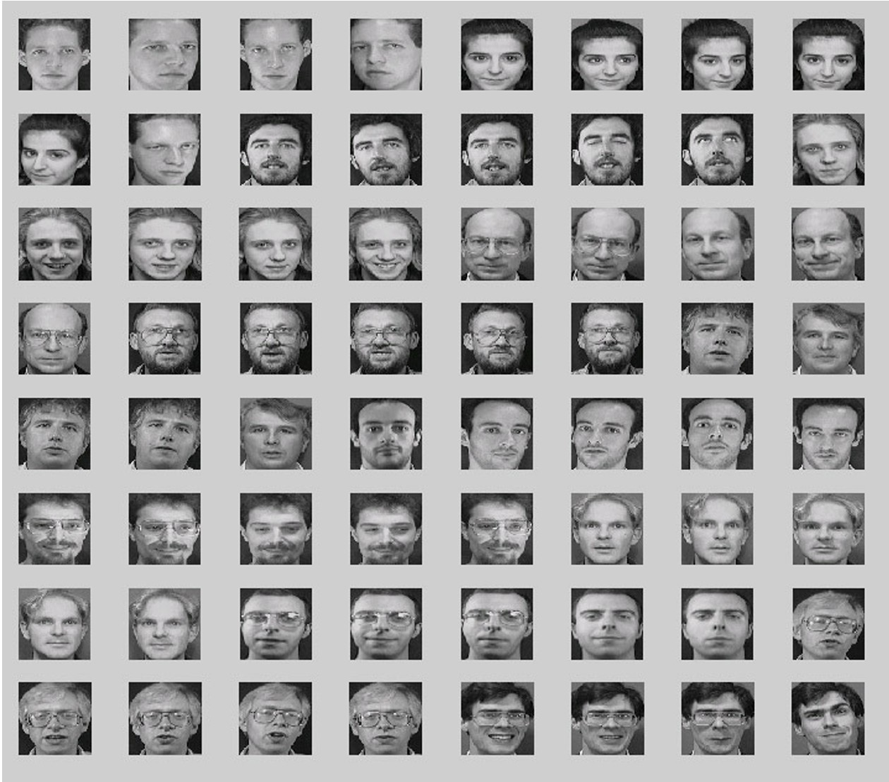
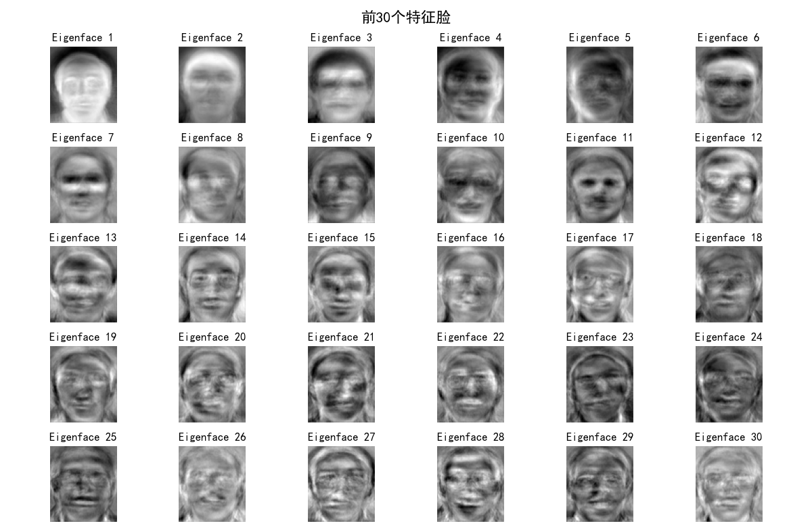

# K均值(K-means)聚类
输入：$n$个数据（无任何标注信息）   
输出：$k$个聚类结果   
目的：将$n$个数据聚类到$k$个集合（也称为类簇）   
应用：可用于图像分类、文本分类等 
## 定义与算法描述
+ $n$个$m$维数据$\{\mathrm{x}_1, \mathrm{x}_2, … , \mathrm{x}_n\},\mathrm{x}_i\in\mathbb{R}^m(1\leq i \leq n)$
+ 两个$m$维数据之间的欧氏距离为
  $$
  d(\mathrm{x}_i,\mathrm{x}_j)=\sqrt{(\mathrm{x}_{i1}-\mathrm{x}_{j1})^2+(\mathrm{x}_{i2}-\mathrm{x}_{j2})^2+\cdots+(\mathrm{x}_{in}-\mathrm{x}_{jn})^2}
  $$
  $d(\mathrm{x}_i,\mathrm{x}_j)$值越小，表示$\mathrm{x}_i$和$\mathrm{x}_j$越相似；反之越不相似
+ 聚类集合数目$k$
+ 问题：如何将$n$个数据依据其相似度大小将它们分别聚类到$k$个集合，使得每个数据仅属于一个聚类集合。
## 算法步骤
### 初始化聚类质心
+ 初始化$k$个聚类质心$c=\{c_1,c_2,\cdots,c_k\},c_j\in\mathbb{R}^m(1\leq j\leq k)$
+ 每个聚类质心$c_j$所在集合记为$G_j$
### 对数据进行聚类
+ 计算待聚类数据$x_i$和质心$c_j$之间的欧氏距离$d(x_i,c_j)(1\leq i\leq n,1\leq j\leq k)$
+ 将每个$x_i$放入与之距离最近聚类质心所在聚类集合中，即$\arg\min\limits_{c_{j}\in C}d(x_{i},c_{j})$
### 更新聚类质心
+ 根据每个聚类集合中所包含的数据，更新该聚类集合质心值，即$c_j=\frac{1}{|G_j|}\sum_{x_i\in G_j}x_i$
### 继续迭代
+ 在新聚类质心基础上，根据欧氏距离大小，将每个待聚类数据放入唯一一个聚类集合中
+ 根据新的聚类结果、更新聚类质心
+ 聚类迭代满足如下任意一个条件，则聚类停止：
  + 已经达到了迭代次数上限
  + 前后两次迭代中，聚类质心基本保持不变
## 另一个视角：最小化每个类簇的方差
+ 方差：用来计算变量（观察值）与样本平均值之间的差异：
  $$
  \arg\min_G\sum_{i=1}^k\sum_{x\in G_i}||x-G_i||^2=\arg\min_G\sum_{i=1}^k|G_i|\mathrm{Var}(G_i)
  $$
  其中$\operatorname*{Var}(G_i)=\sum_{x\in G_i}||x-G_i||^2$为第$i$个类簇的方差
+ 欧氏距离与方差量纲相同
+ 最小化每个类簇方差将使得最终聚类结果中每个聚类集合中所包含数据呈现出来差异性最小。
## K均值聚类算法的不足
+ 需要事先确定聚类数目，很多时候我们并不知道数据应被聚类的数目
+ 需要初始化聚类质心，初始化聚类中心对聚类结果有较大的影响
+ 算法是迭代执行，时间开销非常大
+ 欧氏距离假设数据每个维度之间的重要性是一样的
# 主成分分析(Principle Component Analysis,PCA)
+ 主成分分析是一种特征降维方法，即“化繁为简”
## 前置概念：方差，协方差与相关系数
+ 详见[概率论Cheat Sheet](/posts/mathematics/概率论-cheat-sheet/概率论-cheat-sheet/)。
## 算法动机：保证样本投影后方差最大
+ 在降维之中，需要尽可能将数据向方差最大方向进行投影，使得数据所蕴含信息没有丢失，彰显个性。
+ 主成分分析思想是将$n$维特征数据映射到$l$维空间（$n\gg l$），去除原始数据之间的冗余性（通过去除相关性手段达到这一目的）。
+ 将原始数据向这些数据方差最大的方向进行投影。一旦发现了方差最大的投影方向，则继续寻找保持方差第二的方向且进行投影。
+ 将每个数据从$n$维高维空间映射到$l$维低维空间，每个数据所得到最好的$k$维特征就是使得每一维上样本方差都尽可能大。
## 算法描述
### 映射矩阵
+ 假设有$n$个$d$维样本数据所构成的集合$D=\{x_1,x_2, \cdots,x_n\}$ ，其中$x_i(1\leq i \leq n) \in \mathbb{R}^d$。则集合$D$可以表示成一个$n\times d$的矩阵$\mathbf{X}$。
+ 假定每一维度的特征均值均为零（已经标准化）。主成分分析的目的是求取一个且使用一个$d\times l$的映射矩阵$\mathbf{W}$。
+ 给定一个样本$x_i$，可将$x_i$从$d$维空间如下映射到$l$维空间：$(x_i)_{1\times d}(\mathbf{W})_{d\times l}$
+ 将所有降维后数据用$\mathbf{Y}$表示，有$\mathbf{Y}_{n\times l}=\mathbf{X}_{n\times d}\mathbf{W}_{d\times l}$。 
+ 降维后$n$个$l$维样本数据$\mathbf{Y}$的方差为：
  $$
  \begin{aligned}
  \mathrm{var}(\mathbf{Y})=\frac{1}{n-1}\operatorname*{trace}(\mathbf{Y}^\mathbf{T}\mathbf{Y}) \\
  =\frac{1}{n-1}\operatorname*{trace}(\mathbf{W}^\mathbf{T}\mathbf{X}^\mathbf{T}\mathbf{X}\mathbf{W}) \\
  =\operatorname*{trace}(\mathbf{W}^\mathbf{T}\frac{1}{n-1}\mathbf{X}^\mathbf{T}\mathbf{X}\mathbf{W})
  \end{aligned}
  $$
### 转化为最优化问题
+ 降维前$n$个$d$维样本数据$\mathbf{X}$的协方差矩阵记为：$\Sigma=\frac{1}{n-1}\mathbf{X}^\mathbf{T}\mathbf{X}$   
  主成分分析的求解目标函数为$\operatorname*{max}\limits_\mathbf{W}\operatorname*{trace}(\mathbf{W}^\mathbf{T}\Sigma\mathbf{W})$    
  满足约束条件：$\mathbf{w}_i^T\mathbf{w}_i =1 \quad i\in\{1,2,\cdots,l\}$（目的是保证降维后结果正交以去除相关性(即冗余度)）
### 最优化问题求解
+ 所有带约束的最优化问题，可通过拉格朗日乘子法将其转化为无约束最优化问题
+ 定义拉格朗日函数$L(\mathbf{W},\lambda)=\operatorname*{trace}(\mathbf{W}^T\mathbf{\Sigma}\mathbf{W})-\sum_{i=1}^l\lambda_i(\mathbf{w}_i^T\mathbf{w}_i-1)$   
  其中$\lambda_i(1\leq i \leq l)$为拉格朗日乘子，$\mathbf{w}_i$为矩阵$\mathbf{W}$第$i$列。
+ 对上述拉格朗日函数中变量$\mathbf{w}_i$求偏导并令导数为零，得到：$\Sigma \mathbf{w}_i=\lambda_i\mathbf{w}_i$。这表明：每一个$\mathbf{w}_i$都是$n$个$d$维样本数据$\mathbf{X}$的协方差矩阵$\Sigma$的一个特征向量，$\lambda_i$是这个特征向量所对应的特征值。于是有下述等式：
  $$
  trace(\mathbf{W}^T\mathbf{\Sigma}\mathbf{W})=\sum_{i=1}^l\mathbf{w}_i^T\mathbf{\Sigma}\mathbf{w}_i=\sum_{i=1}^l\lambda_i
  $$
+ 可见，在主成分分析中，最优化的方差等于原始样本数据$\mathbf{X}$的协方差矩阵$\Sigma$的特征根之和。要使方差最大，我们可以求得协方差矩阵$\Sigma$的特征向量和特征根，然后取前$l$个最大特征根所对应的特征向量组成映射矩阵$\mathbf{W}$即可。
+ 注意，每个特征向量$\mathbf{w}_i$与原始数据$\mathbf{x}_i$的维数是一样的，均为$d$。
## 其他常用降维方法
+ 非负矩阵分解（non-negative matrix factorization, NMF）
+ 多维尺度法(Metric multidimensional scaling, MDS) 
+ 局部线性嵌入（Locally Linear Embedding, LLE）   

这里不多赘述。
# 主成分分析应用1：特征人脸方法
## 算法动机
+ 特征人脸方法是一种应用主成份分析来实现人脸图像降维的方法，其本质是用一种称为“特征人脸(eigenface)”的特征向量按照线性组合形式来表达每一张原始人脸图像，进而实现人脸识别。
+ 由此可见，这一方法的关键之处在于如何得到特征人脸。
## 算法描述（参考PCA）
+ 输入： $n$个$1024$维人脸样本数据所构成的矩阵$\mathbf{X}$，降维后的维数$l$
+ 输出：映射矩阵$\mathbf{W}=\{\mathbf{w}_1, \mathbf{w}_2, \cdots , \mathbf{w}_l\}$ （其中每个$\mathbf{w}_j(1 \leq j \leq l)$是一个特征人脸）
+ 算法步骤：
  1. 对于每个人脸样本数据$x_i$进行中心化处理： $x_i=x_i-\mu,\mu=\frac{1}{n}\sum_{i=1}^nx_j$
  2. 计算原始人脸样本数据的协方差矩阵：$\Sigma=\frac{1}{n-1}\mathbf{X}^\mathbf{T}\mathbf{X}$
  3. 对协方差矩阵$\Sigma$进行特征值分解，对所得特征根从到小排序：$\lambda_1\geq\lambda_2\geq\cdots\geq\lambda_d$
  4. 取前$l$个最大特征根所对应特征向量$\mathbf{w}_1, \mathbf{w}_2, \cdots , \mathbf{w}_l$组成映射矩阵$\mathbf{W}$
  5. 将每个人脸图像$x_i$按照如下方法降维：$(x_i)_{1\times d}(\mathbf{W})_{d\times l}=1\times l$
+ 每个人脸特征向量$\mathbf{w}_1$与原始人脸数据$x_i$的维数是一样的，均为$1024$。
+ 可将每个特征向量还原为$32\times 32$的人脸图像，称之为特征人脸，因此可得到$l$个特征人脸。
  示意图如下：
  原始图像（源自ORL Database of Faces，kaggle链接：[kaggle-ORL](https://www.kaggle.com/datasets/tavarez/the-orl-database-for-training-and-testing)）
  
  

  
特征图像（<Text type="red">比较猎奇，谨慎观看</Text>）

  

    
  

  

## 基于特征人脸的降维
+ 将每幅人脸分别与每个特征人脸做矩阵乘法，得到一个相关系数
+ 每幅人脸得到$l$个相关系数$\Longrightarrow$每幅人脸从$1024$维约减到$l$维
+ 由于每幅人脸是所有特征人脸的线性组合，因此就实现人脸从“像素点表达”到“特征人脸表达”的转变。
+ 这样就可以通过特征人脸表示向量的比较达到人脸识别的作用。
## 其他人脸表达方法
+ 聚类表示：用待表示人脸最相似的聚类质心来表示。
+ 非负矩阵人脸分解方法表示：通过若干个特征人脸的线性组合来表达原始人脸数据 $x_i$ ，体现了“部分组成整体”
# 主成分分析应用2：潜在语义分析
## 算法动机
+ 潜在语义分析是一种从海量文本数据中学习单词-单词、单词-文档以及文档-文档之间隐性关系，进而得到文档和单词表达特征的方法。
+ 该方法的基本思想是综合考虑某些单词在哪些文档中同时出现，以此来决定该词语的含义与其他的词语的相似度。
+ 潜在语义分析思想：潜在语义分析先构建一个单词-文档（term-document）矩阵A，进而寻找该矩阵的低秩逼近（low rank approximation）（[Markovsky 2012](https://imarkovs.github.io/book/book2e-2x1.pdf)），来挖掘单词-单词、单词-文档以及文档-文档之间的关联关系。
## 算法步骤
1. 计算单词-文档矩阵$\mathbf{A}$
2. 对单词-文档矩阵进行奇异值分解
3. 重建矩阵：选取合适的$k$，即选取最大的前若干个特征根及其对应的特征向量对矩阵进行重建，得到新矩阵$\mathbf{A}_k$。
4. 挖掘语义关系：基于单词-文档矩阵$\mathbf{A}$与重建单词-文档矩阵$\mathbf{A}_k$，可以计算任意两个文档之间的皮尔逊相关系数，从而得到两个文档-文档相关系数矩阵。
  + 通过观察两个相关系数矩阵可以发现，基于重建单词-文档矩阵$\mathbf{A}_k$.得到的相关系数矩阵中单词-单词之间的相关关系更加明确，在同一文档中出现过的单词之间相关系数趋近为1，没有同时出现在同一文档中的单词之间相关系数趋近为-1。
  + 可以看出，隐性语义分析对原始单词-文档矩阵中所蕴含关系进行了有效挖掘，能刻画单词-单词、单词-文档以及文档-文档之间语义关系。
# 期望最大化算法
注：这里会用到大量概率论与数理统计相关概念。
## 模型参数估计
### 最大似然估计
+ 假设由$n$个数据样本构成的集合$\mathcal{D}=\{x_1,x_2,\cdots,x_n\}$从参数为$\Theta$的某个模型（如高斯模型等）以一定概率独立采样得到。于是，可以通过 **最大似然估计算法(maximum likelihood estimation，MLE)** 来求取参数$\Theta$，使得在参数为$\Theta$的模型下数据集$\mathcal{D}$出现的可能性最大，即
  $$\widehat\Theta=\operatorname*{argmax}\limits_\Theta P(\mathcal{D}|\Theta)
  $$
### 最大后验估计
+ 或者也可利用最大后验估计 **（maximum a posteriori estimation，MAP）** 从数据集$\mathcal{D}$来如下估计参数$\Theta$：
  $$\widehat{\Theta}=\underset{\Theta}{\operatorname*{\operatorname*{argmax}}}P(\Theta|\mathcal{D})=\underset{\Theta}{\operatorname*{\operatorname*{argmax}}}\frac{P(\mathcal{D}|\Theta)P(\Theta)}{P(\mathcal{D})}
  $$
  由于$P(\mathcal{D})$与$\Theta$无关，则可得
  $$
  \underset{\Theta}{\operatorname*{\operatorname*{argmax}}}\frac{P(\mathcal{D}|\Theta)P(\Theta)}{P(\mathcal{D})}=\underset{\Theta}{\operatorname*{\operatorname*{argmax}}}P(\mathcal{D}|\Theta)P(\Theta)
  $$
  对这个式子取对数，得到
  $$
  \underset{\Theta}{\operatorname*{\operatorname*{argmax}}}\log P(\mathcal{D}|\Theta)+\log P(\Theta)
  $$
  可见，最大后验估计与最大似然估计相比，增加了⼀项与$\Theta$相关的先验概率$P(\Theta)$。
### 比较
+ 无论是最大似然估计算法或者是最大后验估计算法，都是充分利用已有数据，在参数模型确定（只是参数值未知）情况下，对所优化目标中的参数求导，令导数为$0$，求取模型的参数值。
+ 在解决一些具体问题时，难以事先就将模型确定下来，然后利用数据来求取模型中的参数值。在这样情况下，无法直接利用最大似然估计算法或者最大后验估计算法来求取模型参数。
+ 为解决这一问题，我们采用期望最大化算法（由Dempster，Laird和Rubin于1977年提出，论文链接：[EM-algorithm](https://www.ece.iastate.edu/~namrata/EE527_Spring08/Dempster77.pdf)）
## 期望最大化（expectation maximization, EM）
+ EM算法是⼀种重要的用于解决含有隐变量（latent variable）问题的参数估计方法。
+ EM算法分为求取期望（E步骤，expectation）和期望最大化（M步骤，maximization）两个步骤。
+ 在EM算法的E步骤时，先假设模型参数的初始值，估计隐变量取值；在EM算法的M步骤时，基于观测数据、模型参数和隐变量取值一起来最大化“拟合”数据，更新模型参数。基于所更新的模型参数，得到新的隐变量取值（EM算法的 E 步），然后继续极大化“拟合”数据，更新模型参数（EM算法的 M 步）。以此类推迭代，直到算法收敛，得到合适的模型参数。
## 二硬币投掷例子
+ 假设有$A$和$B$两个硬币，进行五轮掷币实验：在每一轮实验中，先随机选择一个硬币，然后用所选择的硬币投掷十次，将投掷结果作为本轮实验观测结果。$H$代表硬币正面朝上、$T$代表硬币反面朝上。
+ 数据如下表所示：   

| 轮次  |   |   |   |   |   |   |   |   |   |  |
| :-----: | :-: | :-: | :-: | :-: | :-: | :-: | :-: | :-: | :-: | :-: |
| **1** | H  | T  | T  | T  | H  | H  | T  | H  | T  | H  |
| **2** | H  | H  | H  | H  | T  | H  | H  | H  | H  | H  |
| **3** | H  | T  | H  | H  | H  | H  | H  | T  | H  | H  |
| **4** | H  | T  | H  | T  | T  | T  | H  | H  | T  | T  |
| **5** | T  | H  | H  | H  | T  | H  | H  | H  | T  | H  |
从这十轮观测数据出发，计算硬币$A$或硬币$B$被投掷为正面的概率。记硬币$A$或硬币$B$被投掷为正面的概率为$\theta=\{\theta_A, \theta_B\}$
### 求取期望（E步骤，Expectation）
初始化每⼀轮中硬币$A$和硬币$B$投掷为正面的概率为$\widehat\Theta_A^{(0)}=0.60$和$\widehat\Theta_B^{(0)}=0.50$。基于“$HTTTHHTHTH$”这10次投掷结果，由硬币$A$投掷所得概率为：
$$
\begin{array}{l}
\displaystyle
P(\text{选择硬币A投掷硬币}|\text{投掷结果},\Theta)\\[1.2ex]
\displaystyle
=\frac{P(\text{选择硬币A投掷硬币}\text{投掷结果}|\Theta)}{P(\text{选择硬币A投掷硬币},\text{投掷结果}|\Theta)+P(\text{选择硬币B投掷硬币},\text{投掷结果}|\Theta)}\\[1.2ex]
\displaystyle
=\frac{(0.6)^5\times(0.4)^5}{(0.6)^5\times(0.4)^5+(0.5)^{10}}=0.45
\end{array}
$$
这$10$次结果由硬币$B$投掷所得概率为：
$$
\begin{array}{l}
\displaystyle
P(\text{选择硬币B投掷硬币}|\text{投掷结果},\Theta)\\[1.2ex]
\displaystyle
=1-P(\text{选择硬币A投掷硬币}|\text{投掷结果},\Theta)\\[1.2ex]
=0.55
\end{array}
$$
类似地，可以得到每一轮中两个硬币被选择概率以及投掷正面/反面的次数，如下表所示（以下数据均保留两位小数）：
| 轮次     | 选硬币A概率 | 选硬币B概率     | 硬币A为正面期望次数 | 硬币A为反面期望次数 | 硬币B为正面期望次数 | 硬币B为反面期望次数 |
| ------ | ------ | ------ | ---------- | ---------- | ---------- | ---------- |
| 1     | 0.45  | 0.55   |  2.25 |  2.25 | 2.75 | 2.75 |
| 2     | 0.80  | 0.20   | 7.24  |  0.80 | 1.76 | 0.20 |
| 3     | 0.73  |0.27    | 5.87  | 1.47  | 2.13 | 0.53 |
| 4     | 0.35  |0.65    | 1.41  | 2.11  | 2.59 |3.89  |
| 5     | 0.65  |0.35    |4.53   |1.94   |2.47  | 1.07 |
| **合计**   |   |    | 21.30    | 8.57  | 11.70 | 8.43 |

+ 在上面的计算中，通过初始化硬币$A$和硬币$B$投掷得到正面概率$\widehat\Theta_A^{(0)}$和$\widehat\Theta_B^{(0)}$，得到每一轮中选择硬币$A$和选择硬币$B$概率这一“隐变量”，进而可计算得到每一轮中硬币$A$和硬币$B$投掷正面次数。
+ 在这些信息基础上，可更新得到硬币A和硬币B投掷为正面的概率，从而得到新的模型参数：
$$
\widehat\Theta_A^{(1)}=\frac{21.30}{21.30+8.57}=0.713\hspace{2em} \widehat\Theta_B^{(1)}=\frac{11.70}{11.70+8.43}=0.581
$$
+ 接下来，可在新的概率值基础上继续计算每一轮投掷中选择硬币$A$或硬币$B$
的概率，进而计算得到五轮中硬币$A$和硬币$B$投掷正面的总次数，从而得到硬币$A$和硬币$B$投掷为正面的更新概率值$\widehat\Theta_A^{(2)}$和$\widehat\Theta_B^{(2)}$。上述算法不断迭代，直至算法收敛，最终得到硬币$A$和硬币$B$投掷为正面的概率$\Theta=\{\Theta_A,\Theta_B\}$。
### 隐变量
每⼀轮选择硬币$A$还是选择硬币$B$来完成$10$次投掷是一个隐变量，硬币$A$和硬币$B$投掷结果为正面的概率$\Theta=\{\Theta_A,\Theta_B\}$称为模型参数。
### 计算隐变量（EM算法的E步）、最大化似然函数和更新模型参数（EM算法的M步）
+ EM算法使用迭代方法来求解模型参数$\Theta=\{\Theta_A,\Theta_B\}$：
  先初始化模型参数，然后计算得到隐变量（EM算法的E步），接着基于观测投掷结果和当前隐变量值一起来最大化似然函数（即使得模型参数能够更好拟合观测结果），更新模型参数（EM算法的M步）。
+ 基于当前得到的模型参数，继续更新隐变量（EM算法的E步），然后继续最大化似然函数，更新模型参数（EM算法的M步）。
+ 以此类推，不断迭代下去，直到模型参数基本无变化，算法收敛。
## 三硬币投掷例子
+ 假设有三枚质地材料不均匀的硬币（即每枚硬币投掷出现正反两面的概率不⼀定相等），这三枚硬币分别被标记为$0$，$1$，$2$。约定出现正面记为$H$（Head，头），出现反面记为$T$（Tail，尾），⼀次试验的过程如下：首先掷硬币$0$，如果硬币$0$投掷结果为$H$，则选择硬币$1$投掷三次，如果硬币$0$投掷结果为$T$，则选择硬币$2$投掷三次。观测结果中仅记录硬币$1$和硬币$2$的投掷结果，不出现硬币$0$的投掷结果。因为硬币$0$的投掷结果没有被记录，所以是未观测到的数据（隐变量）。
+ 未观测数据取值集合记为$C_Z=\{H,T\}$ ，观测数据取值集合记为$C_X=\{HHH, TTT, HTT, THH, HHT, TTH, HTH, THT\}$，模型参数集合（三枚硬币
分别出现正面的概率）为$\Theta=\{\lambda,p_1,p_2\}$。在$n$次试验中，未观测到的数据序列记为$z$，观测到的数据序列记为$x$，观测到的数据序列中有$h$次为正面朝上，$t$次为反面朝上。
+ 易知有下面的式子成立：
$$
P(x,z|\Theta)=P(z|\Theta)P(x|z,\Theta)
$$
其中
$$
P(z|\Theta)=
\begin{cases}
\lambda & \mathrm{if} \hspace{0.3em}z=H \\
1-\lambda & \mathrm{if}\hspace{0.3em}z=T & & 
\end{cases}
P(x|z,\Theta)=
\begin{cases}
p_1^h(1-p_1)^t & \mathrm{if}\hspace{0.3em}z=H \\
p_2^h(1-p_2)^t & \mathrm{if}\hspace{0.3em}z=T & & 
\end{cases}
$$
+ 在硬币$0$掷出正面后，选择硬币$1$投掷三次所得“反正反”这一结果的概率如下计算：
$$
P(x=THT,z=H|\Theta)=\lambda p_1(1-p_1)^2
$$
+ 在硬币$0$掷出反面后，选择硬币$2$投掷三次所得“反正反”这一结果的概率如下计算：
$$
P(x=THT,z=H|\Theta)=(1-\lambda)p_2(1-p_2)^2
$$
+ 如果某次观测得到“反正反”这一投掷结果，则该投掷结果发⽣的概率如下计算：
$$
\begin{array}{l}
P(x=THT|\Theta) \\[1.2ex]
=P(x=THT,z=H|\Theta)+P(x=THT,z=T|\Theta) \\[1.2ex]
=\lambda p_1(1-p_1)^2+(1-\lambda)p_2(1-p_2)^2
\end{array}
$$
+ 如果某次观测得到“反正反”这⼀投掷结果，这一结果是由硬币$0$投掷为正面（未观测的数据）所促发的概率计算如下：
$$
\begin{array}{l}
P(z=H|x=THT,\Theta)\\[1.2ex]
\displaystyle
=\frac{P(x=THT,z=H|\Theta)}{P(x=THT|\Theta)}\\[2ex]
\displaystyle
=\frac{\lambda p_1(1-p_1)^2}{\lambda p_1(1-p_1)^2+(1-\lambda)p_2(1-p_2)^2}
\end{array}
$$
+ 这样，可以从观测数据来推测未观测数据的概率分布，即从硬币正面和反面观测结果来推测硬币$0$投掷为正面或反面这一隐变量。（这有点后验概率的意思）
+ 在上述对隐变量概率估计基础上，则可估计参数$\Theta$的更新值（期望最大化步骤）：    
（设样本总数为$N$，样本为$\{x_i\}_{i=1}^N$，$h_i$为样本$x_i$中出现正面的次数,$z_i$为$x_i$对应硬币$0$的投掷结果）
$$
\begin{array}{l}
\displaystyle
\hat{\lambda}=\frac{\sum_{i=1}^NP(z_i=H\mid x_i,\Theta)}{N} \\[2ex]
\displaystyle
\widehat{p_{1}}=\frac{\sum_{i=1}^Nh_iP(z_i=H\mid x_i,\Theta)}{3\sum_{i=1}^NP(z_i=H\mid x_i,\Theta)}\\[3ex]
\displaystyle
\widehat{p_{2}}=\frac{\sum_{i=1}^Nh_iP(z_i=T\mid x_i,\Theta)}{3\sum_{i=1}^NP(z_i=T\mid x_i,\Theta)}
\end{array}
$$
## EM算法一般形式
+ 对于$n$个相互独立的样本$X=\{x_1, x_2,\cdots,x_n\}$及其对应的隐变量$Z=\{z_1, z_2,\cdots,z_n\}$，在假设样本的模型参数为$\Theta$前提下，观测数据$𝑥_i$的概率为$P(x|\Theta)$，完全数据$(x_i, z_i)$的似然函数为$P(x_i, z_i|\Theta)$。
+ 在上面的表示基础上，优化目标为求解合适的$\Theta$和$Z$使得对数似然函数最大：
$$
(\Theta,Z)=\argmax\limits_{\Theta,Z}L(\Theta,Z)=\argmax\limits_{\Theta,Z}\sum_{i=1}^n\log\sum_{z_i}P(x_i,z_i|\Theta)
$$
但是，优化求解含有未观测数据Z的对数似然函数$L(\Theta,Z)$十分困难，EM算法不断构造对数似然函数$L(\Theta,Z)$的一个下界（E步骤），然后最大化这个下界（M步骤），以迭代方式逼近模型参数所能取得极大似然值。
### EM算法的E步骤
$$
\begin{aligned}
\sum_{i=1}^{n}\log\sum_{z_{i}}P(x_{i},z_{i}|\Theta) & =\sum_{i=1}^{n}\log\sum_{z_{i}}Q_{i}(z_{i})\frac{P(x_{i},z_{i}|\Theta)}{Q_{i}(z_{i})} \\
 & \geq\underbrace{\sum_{i=1}^{n}\sum_{z_{i}}Q_{i}(z_{i})\log\frac{P(x_{i},z_{i}|\Theta)}{Q_{i}(z_{i})}}_{\text{对数似然函数下界}}
\end{aligned}
$$
在上式中，$Q_{i}(z_{i})$是隐变量分布，满足：$\sum_{z_i}Q_i(z_i)=1(0\leqslant Q_i(z_i))$。
+ 上述不等式中使用了Jensen不等式 (Jensen's inequality)。对于凹函数$f$，Jensen不等式使得下面不等式成立：
$$
\log(\mathrm{E}(f))\geq\mathrm{E}(\log(f)),\text{其中}\mathrm{E}(f)=\sum_i\lambda_if_i,\lambda_i\geq0,\quad\sum_i\lambda_i=1
$$
令$f_i=\frac{P(x_i,z_i|\Theta)}{Q_i(z_i)}$，则根据Jensen不等式的定义，可将$\frac{P(x_i,z_i|\Theta)}{Q_i(z_i)}$视为第$i$个样本，$Q_{i}(z_{i})$为第$i$个样本的权重。按照这样的约定，可得到如下式子：
$$
\mathrm{E}\left(\log\frac{P\left(x_i,z_i|\Theta\right)}{Q_i\left(z_i\right)}\right)=\sum_{z_i}\underbrace{Q_i\left(z_i\right)}_{\text{权重}}\underbrace{\log\frac{P\left(x_i,z_i|\Theta\right)}{Q_i\left(z_i\right)}}_{\text{样本值}}
$$
+ 于是，为了最大化$\sum_{z_{i}}Q_{i}(z_{i})\log\frac{P(x_{i},z_{i}|\Theta)}{Q_{i}(z_{i})}$这一对数似然函数，只需最大化其下界$\sum_{i=1}^{n}\sum_{z_{i}}Q_{i}(z_{i})\log\frac{P(x_{i},z_{i}|\Theta)}{Q_{i}(z_{i})}$这个下界实际上是$\log\frac{P(x_{i},z_{i}|\Theta)}{Q_{i}(z_{i})}$的加权求和；
+ 由于权重$Q_{i}(z_{i})$累加之和为1，因此$\sum_{z_{i}}Q_{i}(z_{i})\log\frac{P(x_{i},z_{i}|\Theta)}{Q_{i}(z_{i})}$就是$\log\frac{P(x_{i},z_{i}|\Theta)}{Q_{i}(z_{i})}$的加权平均，也就是所谓的期望，这就是EM算法中Expectation这一单词的来源。
+ 于是，EM算法就是不断最大化这一下界（M步骤），从而通过迭代的方式逼近模型参数的极大似然估计值。
### EM算法的M步骤
+ 显然，当$\Theta$取值给定后，对数似然函数的下界只与$P(x_i, z_i)$和$Q_{i}(z_{i})$相关。于是，通过调整$P(x_i, z_i)$和$Q_{i}(z_{i})$的取值，使得似然函数下界不断逼近似然函数真实值。
+ 那么，当不等式取等式时，调整后的似然函数下界等于似然函数真实值。当每个样本取值均相等时（也就是每个样本取值为同⼀个常数），Jensen 不等式中的等式成立。
+ 于是令$\frac{P(x_{i},z_{i}|\Theta)}{Q_{i}(z_{i})}=c$（$c$为常数），得到$P(x_{i},z_{i}|\Theta)=cQ_{i}(z_{i})$。由于$\sum_{z_i}Q_{i}(z_i)=1$，可知$\sum_{z_i}P(x_{i},z_{i}|\Theta)=c$。
+ 于是，$Q_i(z_i)=\frac{P(x_i,z_i|\Theta)}{c}=\frac{P(x_i,z_i|\Theta)}{\sum_{z_i}P(x_i,z_i|\Theta)}=\frac{P(x_i,z_i|\Theta)}{P(x_i|\Theta)}=P(z_i|x_i,\Theta)$也就是说，只要$Q_{i}(z_{i})=P(z_i|x_i,\Theta)$，就能够保证对数似然函数最大值与其下界相等。
+ 从上面的阐述可知，固定参数$\Theta$后，只要从观测数据$x_i$和参数$\Theta$出发，令$Q_{i}(z_{i})=P(z_i|x_i,\Theta)$，
则可以得到对数似然函数最大值的下界，这就是EM算法中的E步骤。然后，固定$Q_{i}(z_{i})$，调整$\Theta$，再去极大化对数似然函数最大值的下界，这就是EM算法的M步骤。
## 算法总结
+ 输入：观测所得样本数据$X$及其对应的隐变量$Z$(即无法观测数据)、联合分布$P(X,Z|\Theta)$。   
输出：模型参数$\Theta$。
+ 算法步骤：
  1. 初始化参数取值$\Theta^0$。
  2. 求取期望步骤(E步骤):计算$Q(\Theta|\Theta^t)=\sum_{i=1}^{n}\sum_{z_i}P(z_{i}|x_{i},\Theta)\log P(x_{i},z_{i}|\Theta)$。其含义是对数似然函数$\log P(x_{i},z_{i}|\Theta)$在已观测数据$X$和当前参数$\Theta^t$下去估计隐变量$Z$的条件概率分布$P(z_i|x_i,\Theta)$。
  3. 期望最大化步骤(M步骤):$\Theta^{t+1}=\underset{\Theta}\argmax Q(\Theta|\Theta^t)$.
  4. 重复第2步和第3步，直到收敛。
+ 广义EM算法中，E步骤是固定参数来优化隐变量分布，M步骤是固定隐变量分布来优化参数，两者不同交替迭代。至此，证明了EM算法能够通过不断最大化下界来逼近最⼤似然估计值。
+ 同样可以证明EM算法能够保证似然度取值单调增长，即EM算法能够稳定收敛（证明略）。
# 总结
无监督学习从非标注样本出发来学习数据的分布，这是一个异常困难的工作。由于无法利用标注信息，因此无监督学习只能利用假设数据具有某些结构来进行学习。正如拉普拉斯所言“概率论只不过是把常识用数学公式表达了出来”,无监督学习就是把预设数据具有某种结构作为一种“知识”来指导模型的学习。