# 深度学习的历史发展
+ 1943年，神经科学家Warren McCulloch和逻辑学家Walter Pitts合作提出了“**McCulloch-Pitts (MCP) neuron**”的思想。MCP可对输入信号进行线性加权组合，再用符号函数来输出组合结果。MCP是最早的神经网络雏形。
+ 1949年，心理学家唐纳德·赫布(Donald Hebb)提出了著名的**赫布理论(Hebbian theory)**。指出“神经元之间持续重复经验刺激可导致突触传递效能增加”,“神经元之间突触的强弱变化是学习与记忆的生理学基础”。这一理论为联结主义人工智能研究提供了认知神经心理学基础。
+ 1958年，David Hubel和Torsten Wiesel发现了一种被称为“**方向选择性细胞(orientation selective cell)**”的神经元细胞，从而揭示了“视觉系统信息分层处理”这一机制。（即在处理不同信息时调动不同区域的神经元）
+ 神经网络研究的突破来自于Frank Rosenblatt在20世纪50年代所提出的“**感知机(perceptron)**”模型。感知机模型是一个仅包含输入层和输出层的两层神经网络。对于一个线性可分二分类问题，从理论上可证明感知机能且一定能将线性可分的两类数据区分开来。与MCP不同，感知机中的连接权重和符号函数阈值可以从数据中进行学习，且不再要求输入数据是二值化结果。
+ 由于感知机中没有包含非线性变换操作的隐藏层，因此感知机表达能力较弱（如无法解决异或问题）。如果在感知机中**加入多个隐藏层**，那么所形成的 **多层感知机(multilayer perceptron,MLP)** 则具备更强表达能力，只是一旦增加了隐藏层，需要有效的计算方法来解决深度神经网络模型中参数的优化训练问题。
+ 最早由Werbos提出,并且由Rumelhar和Hinton等人完善的**误差反向传播(error back propagation)算法**解决了多层感知机中参数优化这一难题。在多层感知机中，由于隐藏层中每个神经元均包含具备非线性映射能力的激活函数(如sigmoid),因此其可用来构造复杂的非线性分类函数。
+ 2006年，Hinton在Science等期刊上发表了论文，首次提出了“**深度信念网络(deep belief network)**”模型,在相关分类任务上取得的性能超过了传统浅层学习模型(如支持向量机),使得深度架构引起了大家的关注。
+ 深度学习的兴起推动了不同类型深度学习网络模型的研究：如循环神经网络（RNN），手写体识别的卷积神经网络LeNet，用于图像分类任务的卷积神经网络AlexNet，词向量模型（word2vec），BERT(bidirectional encoder representations from transformers)模型等。
## 浅层学习与深度学习的区别
+ 浅层学习采用的是分段学习的手段：  
  以图像分类为例，浅层学习的流程为：图像$\longrightarrow$稠密信息点$\longrightarrow$信息点表达$\longrightarrow$聚类形成视觉词典$\longrightarrow$用视觉单词表达图像$\longrightarrow$用金字塔模型获取空间结构$\longrightarrow$形成视觉直方图，将图像从像素点空间转化为向量形式$\longrightarrow$进行图像识别与分类     
  上述不同阶段的数据分析处理的手段可以单独改造，优化算法，得到更好的结果。
+ 深度学习采用的是端到端的学习手段：
  标注数据从输入端出发，通过卷积、池化和误差反向传播等手段，进行特征学习，逐层抽象，得到原始数据的特征表达，在输出端得到视觉对象（即将像素点空间映射到语义空间）   
  这也导致深度学习的可解释性变弱。
# 前馈神经网络（FNN）
下面先引入一些基本概念：
## 神经元
+ 基于生物学中的神经元的结构特性与信息传递方式（神经元具有兴奋与抑制两种状态。大多数神经元细胞在正常情况下处于抑制状态，一旦某个神经元受到刺激并且电位超过一定的阈值后，这个神经元细胞就被激活，处于兴奋状态，并向其他神经元传递信息），在1943年MCP模型被提出，并成为人工神经网络中的最基本结构。
+ MCP模型结构图如下：
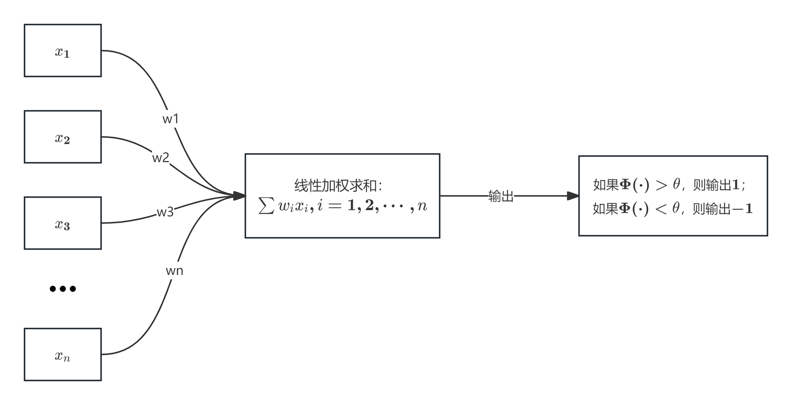
给定$n$个二值化（$0$或$1$）的输入数据$x_i(1\leq i\leq n)$与连接参数$w_i(1\leq i\leq n)$，MCP神经元模型对输入数据线性加权求和，然后使用函数$\Phi(⋅)$将加权累加结果映射为$0$或$1$，以完成两类分类的任务：
$$
y=\Phi(\sum_{i=1}^nw_ix_i)
$$
其中$w_i$为预先设定的连接权重值（一般在$0$和$1$中一个值或者$1$和$-1$中取一个值），用来表示其所对应输入数据对输出结果的影响（即权重）。$\Phi(⋅)$将输入端数据与连接权重所得线性加权累加结果与预先设定阈值$\theta$进行比较，根据比较结果输出$1$或$0$。
## 激活函数
+ 神经网络使用非线性函数作为激活函数(activation function),通过对多个非线性函数进行组合，来实现**对输入信息的非线性变换**。为了能够使用梯度下降方法来训练神经网络参数，激活函数必须是连续可导的。
### 常用的激活函数
|名称|函数|图像|导数|值域|
|:---:|:---:|:---:|:--------:|:---:|
|**sigmoid**|$f(x)=\frac{1}{1+e^{-x}}$|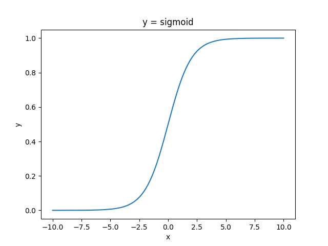|$f'(x)=f(x)(1-f(x))$|$(0,1)$|
|**tanh**|$f(x)=\frac{1-e^{-2x}}{1+e^{-2x}}$|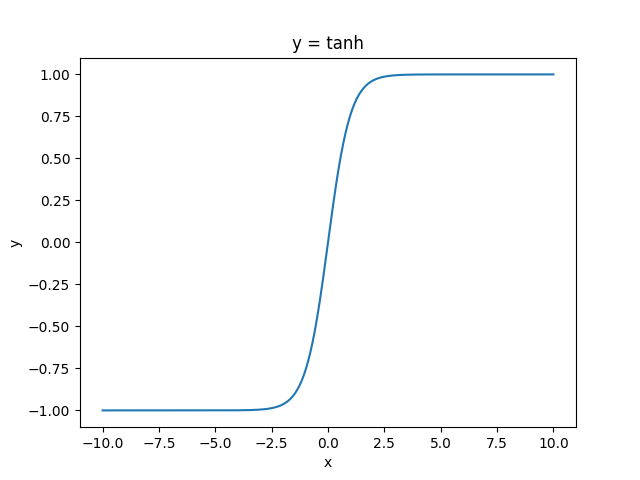|$f'(x)=1-f^2(x)$|$(-1,1)$|
|**ReLU(rectified linear unit,修正线性单元)**|$f(x)=\begin{cases} 0 & for\hspace{0.3em}x\leq 0 \\x & for\hspace{0.3em}x>0 & & \end{cases}$|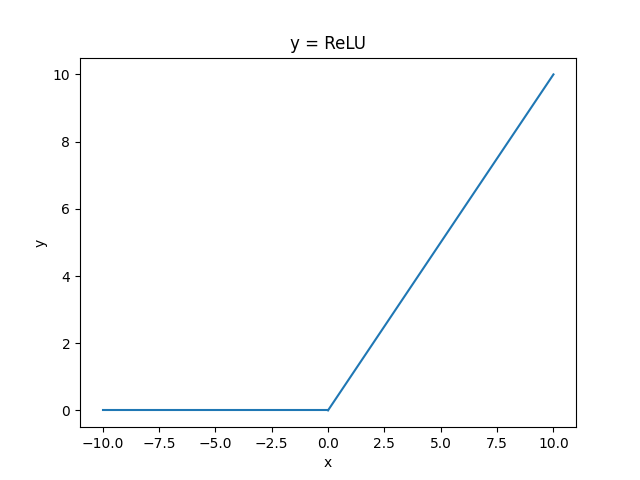|$f'(x)=\begin{cases} 0 & for\hspace{0.3em}x\leq 0 \\1 & for\hspace{0.3em}x>0 & & \end{cases}$|$[0,\infty)$|
+ sigmoid函数的优点：值域为$(0,1)$使sigmoid函数输出可视为概率值；单调递增，有界且非线性变化。
+ 然而，由于sigmoid函数的导数小于$1$，当把sigmoid函数作为激活函数时，在使用反向传播算法更新参数过程中易出现导数过于接近$0$的情况，即 **梯度消失(vanishing gradient)** 的问题，并且这个问题会随着网络深度的增加而变得愈发严重。梯度消失这一问题使得在神经网络中已很少使用sigmoid函数作为激活函数。
+ 相较于sigmoid函数，tanh函数在坐标原点附近的梯度更大。在实际的使用中，使用tanh函数的神经网络更容易收敛。但是tanh函数同样会面临梯度消失的问题。
+ 目前使用较普遍的激活函数为ReLU函数：当输入$x\geq 0$时，ReLU的导数为常数，这样可有效克服梯度消失这一问题。当$x<0$时，ReLU的梯度总是$0$,使得神经网络中若干参数取值为$0$,即参与分类等任务的神经元稀疏，这在一定程度上可克服机器学习中经常出现的过拟合问题。
### Softmax函数
Softmax函数一般用于多分类问题中，其将输入数据$x_i$映射到第$i$个类别的概率$y_i$如下计算：
$$y_i=\mathrm{softmax}(x_i)=\frac{e^{x_i}}{\sum_{j=1}^ke^{x_j}}
$$
由于Softmax输出结果的值累加起来为$1$，因此可将输出概率最大的作为分类目标。
## 损失函数
损失函数（Loss Function）又称为代价函数（Cost Function），用来计算模型预测值与真实值之间的误差。损失函数是神经网络设计中的一个重要组成部分。通过定义与任务相关的良好损失函数，在训练过程中可根据损失函数来计算神经网络的误差大小，进而优化神经网络参数。
### 常用的损失函数
+ **均方误差（MSE）损失函数**：均方误差损失函数通过计算预测值和实际值之间距离（即误差）的平方来衡量模型优劣。假设有$n$个训练数据$x_i$，每个训练数据$x_i$的真实输出为$y_i$，模型对$x_i$的预测值为$\hat y_i$。该模型在$n$个训练数据下所产生的均方误差损失可定义如下：
  $$
  \mathrm{MSE}=\frac{1}{n}\sum_{i=1}^n(y_i-\hat y_i)^2
  $$
+ **交叉熵损失函数**：交叉熵（cross entropy）是信息论中的重要概念，主要用来度量两个概率分布间的差异。假定$p$和$q$是数据$x$的两个概率分布，通过$q$来表示$p$的交叉熵可如下计算：
  $$
  H(p,q)=-\sum_xp(x)\times \log q(x)
  $$
  交叉熵刻画了两个概率分布之间的距离，旨在描绘通过概率分布$q$来表达概率分布$p$的困难程度。根据公式不难理解，交叉熵越小，两个概率分布$p$和$q$越接近。（更多关于交叉熵与KL散度、熵的联系可参见：[熵、交叉熵和KL散度](https://www.cnblogs.com/outs/p/19051442)）   
  记数据$x$的实际类别分布概率为$y$，$\hat y$代表模型预测所得类别分布概率。那么对于数据$x$而言，其实际类别分布概率$y$和模型预测类别分布概率$\hat y$的交叉熵损失函数定义为：
  $$
  \mathrm{cross\hspace{0.3em}entropy}=-\sum y\times\log\hat y
  $$
  很显然，一个良好的神经网络要尽量保证对于每一个输入数据，神经网络所预测类别分布概率与实际类别分布概率之间的差距越小越好，即交叉熵越小越好。于是，可将交叉熵作为损失函数来训练神经网络。    
  在实际应用中，Softmax和交叉熵损失函数相互结合，可以为偏导计算带来极大便利。偏导计算使得损失误差从输出端向输入端传递，来对模型参数进行优化。在这里，交叉熵与Softmax函数结合在一起，因此也叫Softmax损失（Softmax with cross-entropy loss）。
## 感知机模型：单层感知机
+ 1957年，Frank Rosenblatt提出（论文链接：[THE PERCEPTRON](https://www.ling.upenn.edu/courses/cogs501/Rosenblatt1958.pdf)）一种简单的人工神经网络，被称为“感知机”。早期的感知机结构和MCP模型相似，由一个输入层和一个输出层构成，因此也被称为“单层感知机”。感知机的输入层负责接收实数值的输入向量，输出层则能输出$1$或$-1$两个值。   
+ 单层感知机可作为一种两类线性分类模型，结构如下图所示：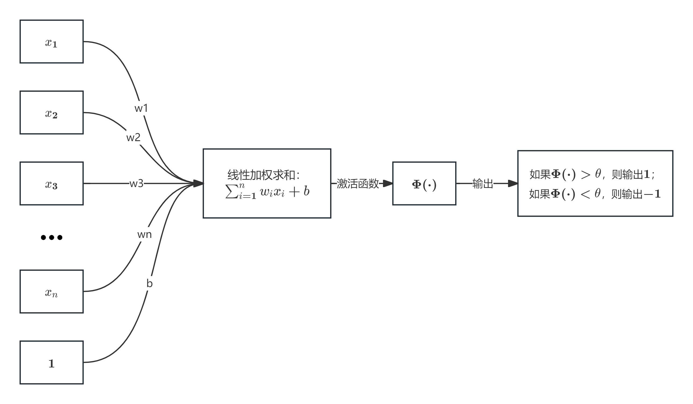
  其中$b$为偏置项(bias)。    
+ 单层感知机与MCP模型在连接权重设置上是不同的，即感知机中连接权重参数并不是预先设定好的，而是通过多次迭代训练得到的。具体而言，单层感知机构建损失函数，来计算模型预测值与数据真实值之间的“误差”，通过最小化损失函数取值，来优化模型参数。
+ 单层感知机可被用来区分线性可分数据。例如，在下图中，逻辑与(AND)、逻辑与非(NAND)和逻辑或(OR)为线性可分函数，所以可利用单层感知机来模拟这些逻辑函数。但是，由于逻辑异或（XOR）是非线性可分的逻辑函数，因此单层感知机无法模拟逻辑异或函数的功能。
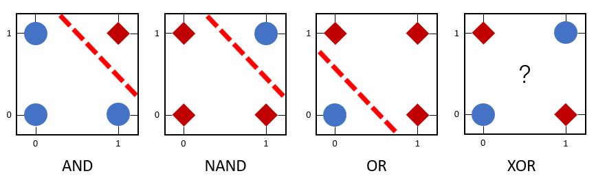
## 感知机模型：多层感知机
+ 多层感知机由输入层、输出层和至少一层的隐藏层构成。网络中各个隐藏层中神经元可接收相邻前序隐藏层中所有神经元传递而来的信息，经过加工处理后将信息输出给相邻后续隐藏层中所有神经元。
+ 各个神经元接受前一级的输入，并输出到下一级，模型中没有反馈。
+ 层与层之间通过“全连接”进行链接，即两个相邻层之间的神经元完全成对连接，但层内的神经元不相互连接。
具体结构图如下：
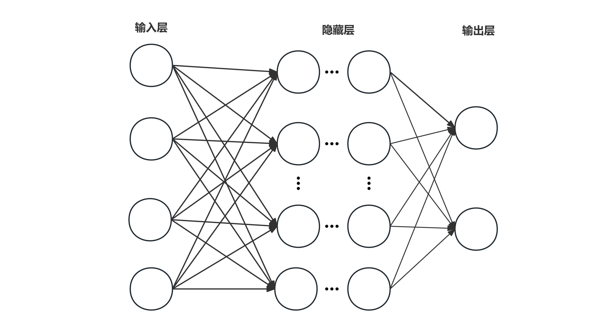
## 参数优化与学习
+ 对于神经网络层数为$n$,每层中神经元个数为$m$的神经网络，其总共有$(n-1)\times m^2$个连接权重参数$w_{i}$。对于这些参数，需要进行优化学习，以使得神经网络能够将给定输入数据映射到所期望的输出语义空间(如将一幅像素点构成的图像数据映射为人脸),完成分类识别等任务。
+ 具体而言，模型会利用反向传播算法将损失函数计算所得误差从输出端出发，由后向前传递给神经网络中的每个单元，然后通过梯度下降算法对神经网络中的参数进行更新。   
  随着迭代的进行，模型预测所得$\hat y_i$与真实值$y_i$之间的误差逐步缩小，模型预测准确率逐步提升，预测的能力逐步增强，当迭代经过一定轮次或准确率达到一定水平时，则可认为模型参数已被优化完毕。   
下面是一些基本的参数优化方法：
### 梯度下降（Gradient Descent）
梯度下降算法是一种使得损失函数最小化的方法。
+ 在多元函数中，梯度是对每一变量所求导数组成的向量。梯度的反方向是函数值下降最快的方向（在华东师大第五版数学分析下册P120中亦有记载，故证明过程省略），因此是损失函数求解的方向。（具体而言，对于损失函数$f(x)$，当$\cos(\nabla f(x),\Delta x)=-1$时，$f(x+\Delta x)-f(x)=-||\Delta x||\cdot||\nabla f(x)||$，此时损失误差下降最多、下降最快，犹如从山峰处沿着最陡峭路径可快速走到山谷）
+ 由于忽略了损失函数的二阶导数以及其高阶导数的取值，因此在实际中引入步长$\eta$，用$x-\eta\nabla f(x)$来更新$x$（在具体实现时$\eta$可取一个定值）。
+ 对于优化问题来说，凸函数具有一个良好性质：凸函数的局部最优解即是全局最优解。因此对于凸函数而言，梯度下降法总是能够找到函数的全局最小值。为了达到这一目的，损失函数一般采用凸函数。
### 误差反向传播 (error back propagation, BP)
+ BP算法是一种将输出层误差反向传播给隐藏层进行参数更新的方法。
+ 将误差从后向前传递，将误差分摊给各层所有单元，从而获得各层单元所产生的误差，进而依据这个误差来让各层单元负起各自责任、修正各单元参数。
具体结构图如下：
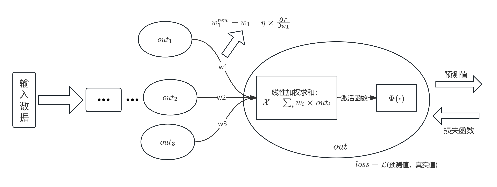  
+ 在此图中，$out$是一个神经单元，其在神经网络中完成两个任务：
  1. 将相邻前序神经元传递而来的信息线性加权累加，得到结果$\mathcal{X}$，即$\mathcal{X}=\sum_i w_i\times out_i$（这里$1\leq i\leq 3$）。$out_i$和$w_i$分别是与$out$前序相连的第$i$个神经元传递信息及第$i$个神经元与$out$之间的连接权重系数；
  2. 使用激活函数对加权累加结果进行非线性变换。
+ 另外，模型预测结果与真实结果之间的损失误差$loss$由所定义的损失函数$\mathcal{L}$计算得到。现在的问题是如何根据这个误差来优化调整连接权重系数$w_i$；(以及按照同样的模式来调整图中未出现的神经网络其他参数)，使得训练得到的模型尽可能输出预期结果。
+ 以计算$w_1$为例：为了使损失函数$\mathcal{L}$取值减少（从而保证模型预测结果与实际结果之间的差距越来越小），需要求取损失函数$\mathcal{L}$相对于$w_1$的偏导，然后按照损失函数梯度的反方向选取一个微小的增量，来调整$w_1$的取值，就能够保证损失函数取值减少。即将$w_1$变为$w_1-\eta\frac{\partial\mathcal{L}}{\partial w_1}$后，能使得损失误差减少。这里$\frac{\partial\mathcal{L}}{\partial w_1}$为损失函数$\mathcal{L}$对$w_1$的偏导。
+ 由于$w_1$与加权累加函数$\mathcal{X}$和激活函数函数$\Phi(\cdot)$均有关，因此$\frac{\partial\mathcal{L}}{\partial w_1}=\frac{\partial\mathcal{L}}{\partial\Phi}\frac{\partial\Phi}{\partial\mathcal{X}}\frac{\partial\mathcal{X}}{\partial w_1}$。在这个链式求导中：$\frac{\partial\mathcal{L}}{\partial\Phi}$与损失函数的定义有关；$\frac{\partial\Phi}{\partial\mathcal{X}}$是对激活函数求导；$\frac{\partial\mathcal{X}}{\partial w_1}$是加权累加函数$w_1\times out_1+w_2\times out_2+w_3\times out_3$对$w_1$求导，结果为$out_1$。
+ 于是，参数$w_1$在下一轮迭代中的取值被调整为：
  $$ w_1^{new}=w_1-\eta\times\frac{\partial\mathcal{L}}{\partial w_1}=w_1-\eta\times\frac{\partial\mathcal{L}}{\partial\Phi}\frac{\partial\Phi}{\partial\mathcal{X}}\frac{\partial\mathcal{X}}{\partial w_1}=w_1-\eta\times\frac{\partial\mathcal{L}}{\partial\Phi}\times\Phi'(\mathcal{X})\times out_1
  $$
+ 按照同样的方法，可调整$w_2$、$w_3$以及其它图中未显示参数的取值。经过这样的调整，在模型参数新的取值作用下，损失函数$\mathcal{L}(\theta)$会以最快下降方式逐渐减少，直至减少到最小值（即全局最小值）。
#### 一个例子
下面以一个包含一个隐藏层的多层感知机作为示例，阐释误差反向传播与参数更新的原理：
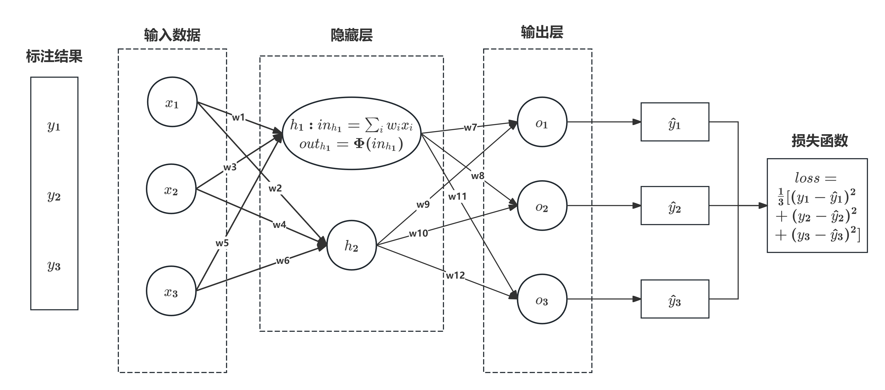
其中隐藏层由两个神经元构成。网络使用Sigmoid函数作为神经元的激活函数，使用均方损失函数MSE来计算网络输出值与实际值之间的误差。    
假设样本数据输入为$(x_1,x_2,x_3)$,其标注信息为$(y_1,y_2,y_3)$。在三分类问题中，对于输入数据$(x_1,x_2,x_3)$,$y_1$、$y_2$和$y_3$中只有一个取值为$1$,其余两个取值为$0$。   
下表给出此神经网络中各神经元的计算结果：    
|单元|相邻前序神经元传递信息线性累加（输入）|非线性变换（输出）|
|---|----------------------------------|-----------------|
|$h_1$|$In_{h_1}=w_1\times x_1+w_3\times x_2+w_5\times x_3$|$Out_{h_1}=sigmoid(In_{h_1})$|
|$h_2$|$In_{h_2}=w_2\times x_1+w_4\times x_2+w_6\times x_3$|$Out_{h_2}=sigmoid(In_{h_2})$|
|$o_1$|$In_{o_1}=w_7\times Out_{h_1}+w_{10}\times Out_{h_2}$|$\widehat{y_1}=Out_{o_1}=sigmoid(In_{o_1})$|
|$o_2$|$In_{o_2}=w_8\times Out_{h_1}+w_{11}\times Out_{h_2}$|$\widehat{y_2}=Out_{o_2}=sigmoid(In_{o_2})$|
|$o_3$|$In_{o_3}=w_9\times Out_{h_1}+w_{12}\times Out_{h_2}$|$\widehat{y_3}=Out_{o_3}=sigmoid(In_{o_3})$|
+ 一旦神经网络在当前参数下给出了预测结果$(\widehat{y_1},\widehat{y_2},\widehat{y_3})$后，通过均方误差损失函数来计算模型预测值与真实值$(y_1,y_2,y_3)$之间的误差，记为$loss=\frac{1}{3}\sum_{i=1}^3(\hat y_i-y_i)^2$。
+ 接下来通过梯度下降和误差反向传播方法，沿着损失函数梯度的反方向来更改参数变量取值，使得损失函数快速下降到其最小值。由于损失函数对$w_7\sim w_{12}$的偏导计算相似，在此以$w_7$为例来介绍如何更新$w_7$这一参数取值。记损失函数为$\mathcal{L}(w)$，$\mathcal{L}(w)=\frac{1}{3}\sum_{i=1}^3(\hat y_i-y_i)^2$。
+ 损失函数$\mathcal{L}$对参数$w_7$的偏导可如下计算：
  $$
  \delta_7=\frac{\partial\mathcal{L}}{\partial w_7}=\frac{\partial\mathcal{L}}{\partial \widehat{y_1}}\times\frac{\partial\widehat{y_1}}{\partial In_{o_1}}\times\frac{\partial In_{o_1}}{\partial w_7}
  $$
  上述公式中每一项结果如下：
  $$
  \begin{aligned}
  \frac{\partial\mathcal{L}}{\partial \widehat{y_1}}=\frac{2}{3}(\widehat{y_1}-y_1)\\
  \frac{\partial\widehat{y_1}}{\partial In_{o_1}}=\widehat{y_1}\times(1-\widehat{y_1})\\
  \frac{\partial In_{o_1}}{\partial w_7}=Out_{h_1}
  \end{aligned}
  $$
+ 利用链式求导法则，可计算得到损失函数相对于$w_1\sim w_{6}$的偏导结果。下面以$w_1$为例介绍损失函数$\mathcal{L}$对$w_1$的偏导$\delta_1$：
  $$
  \begin{array}{l}
  \displaystyle
  \delta_1=\frac{\partial\mathcal{L}}{\partial w_1}\\[1.2em]
  \displaystyle
  =\frac{\partial\mathcal{L}}{\partial\widehat{y_1}}*\frac{\partial\widehat{y_1}}{\partial w_1}+\frac{\partial\mathcal{L}}{\partial\widehat{y_2}}*\frac{\partial\widehat{y_2}}{\partial w_1}+\frac{\partial\mathcal{L}}{\partial\widehat{y_3}}*\frac{\partial\widehat{y_3}}{\partial w_1}\\[1.2em]
  \displaystyle
  =\frac{\partial\mathcal{L}}{\partial\widehat{y_1}}*\frac{\partial\widehat{y_1}}{\partial In_{o_1}}*\frac{\partial In_{o_1}}{\partial Out_{h_1}}*\frac{\partial Out_{h_1}}{\partial In_{h_1}}*\frac{\partial In_{h_1}}{\partial w_1}\\[1.2em]
  \displaystyle
  \hspace{2ex}+\frac{\partial L}{\partial\widehat{y_2}}*\frac{\partial\widehat{y_2}}{\partial In_{o_2}}*\frac{\partial In_{o_2}}{\partial Out_{h_1}}*\frac{\partial Out_{h_1}}{\partial In_{h_1}}*\frac{\partial In_{h_1}}{\partial w_1}\\[1.2em]
  \displaystyle
  \hspace{2ex}+\frac{\partial L}{\partial\widehat{y_3}}*\frac{\partial\widehat{y_3}}{\partial In_{o_3}}*\frac{\partial In_{o_3}}{\partial Out_{h_1}}*\frac{\partial Out_{h_1}}{\partial In_{h_1}}*\frac{\partial In_{h_1}}{\partial w_1}\\[1.2em]
  \displaystyle
  =(\delta_7+\delta_8+\delta_9)*\frac{\partial Out_{h_1}}{\partial In_{h_1}}*\frac{\partial In_{h_1}}{\partial w_1}
  \end{array}
  $$
+ 在计算得到所有参数相对于损失函数𝓛的偏导结果后，利用梯度下降算法，通过$w_1^{new}=w_1-\eta\times\delta_i$来更新参数取值。然后不断迭代，直至模型参数收敛，此时损失函数减少到其最小值。
# 卷积神经网络（convolution neural network,CNN）
在前馈神经网络中，输入层的输入数据直接与第一个隐藏层中所有神经元相互连接。如果输入数据是一幅图像，需要把灰度图像（二维矩阵）或彩色图像（三维矩阵）转换为向量形式。如果图像的像素较大，则输入层到第一个隐藏层之间待训练参数数目会非常巨大，这不仅会占用大量计算机内存，同时也使神经网络模型变得难以训练收敛。   
对此，1980年Kunihiko Fukishima（福岛邦彦）将神经科学所发现的结构进行了计算机模拟，提出通过级联方式（cascade，即逐层滤波）来实现一种满足平移不变性的网络[Neocognitron](https://www.rctn.org/bruno/public/papers/Fukushima1980.pdf)，这就是卷积神经网络的前身。20世纪90年代，LeCun（杨立昆）等人设计了一种被称为[LeNet-5](http://yann.lecun.com/exdb/publis/pdf/lecun-01a.pdf)的卷积神经网络用于手写体识别，初步确立了卷积神经网络的基本结构。
+ 图像中像素点具有很强的空间依赖性，**卷积（convolution）** 就是针对像素点的空间依赖性来对图像进行处理的一种技术。
+ 在图像卷积计算中，需要定义一个**卷积核（kernel）**。卷积核是一个二维矩阵，矩阵中数值为对图像中与卷积核同样大小的子块像素点进行卷积计算（即矩阵对应元素相乘再累加）时所采用的权重。
+ 卷积核中的权重系数$w_i$是通过数据驱动机制学习得到，其用来捕获图像中某像素点及其邻域像素点所构成的特有空间模式。一旦从数据中学习得到权重系数，这些权重系数就刻画了图像中像素点构成的空间分布不同模式。
+ 关于卷积的数学理论，可参见：[什么是卷积？](https://www.bilibili.com/video/BV1Vd4y1e7pj)
## 卷积操作
先举一个简单的例子：
+ 给定一个权重分别为$w_i(1\leq i\leq 9)$、大小为$3\times 3$的卷积核以及一个$5\times 5$大小灰度图像$\{a_{ij}\}(1\leq i,j\leq 5)$。该卷积核对图像的卷积操作就是分别以图像中$\{a_{ij}\}(2\leq i,j\leq 4)$所在像素点位置为中心，形成一个$3\times 3$大小的图像子块区域，然后用卷积核所定义权重$w_i$对图像子块区域内每个像素点进行加权累加，所得结果即为图像子块区域中心像素点被卷积后（即滤波后）的结果。   
+ 滤波也可视为在给定卷积核权重前提下，记住了邻域像素点之间的若干特定空间模式、忽略了某些空间模式。卷积滤波结果在卷积神经网络中被称为**特征图(feature map)**。   
+ 卷积过程中需要留意如下三点：
  1. 由于无法以被卷积图像边界像素点为中心，形成卷积核大小的图像子块区域，因此边界像素点无法参与卷积计算；（如上述例子中$a_{1.},a_{5.},a_{.1},a_{.5}$无法参与卷积计算）
  2. 图像卷积计算对图像进行了 **下采样(down sampling)** 操作。（如上述卷积图像中像素由$5\times 5$变为$3\times 3$）这样被卷积图像就被“约减”了，对卷积得到的图像结果不断卷积滤波，则原始图像就会被“层层抽象、层层约减”,从而使得蕴涵在图像中的重要信息显露出来；
  3. 卷积核中的权重系数$w_i$,是通过数据驱动机制学习得到，其用来捕获图像中某像素点及其邻域像素点所构成的特有空间模式。
### 高斯模糊与图像平滑
+ 权重系数具有如下特点的卷积核被称为高斯卷积核：   
  + 卷积核中心位置权重系数的取值最大，从中心位置向四周边缘扩散过程中，权重系数的取值逐渐减少；
  + 所有权重系数累加之值为$1$。
+ 如果卷积核中心位置的权重系数越小且与其它卷积权重系数差别越小，则卷积所得到图像滤波结果越模糊，这被称为图像平滑操作。
### 感受野
+ 神经科学家发现，人的视觉神经细胞对不同的视觉模式具有特征选择性。基于这一理论，不同卷积核可被用来刻画视觉神经细胞对外界信息感受时的不同选择性。同时也可以看到，卷积所得结果中，每个输出点的取值仅依赖于其在输入图像中该点及其邻域区域点的取值，与这个区域之外的其他点取值均无关，该区域被称为**感受野（receptive field）**。
+ 在卷积神经网络中，感受野是卷积神经网络每一层输出的特征图（feature map）上的像素点在输入图像上映射的区域大小。也就是说，感受野是特征图上一个点对应输入图像上的区域。
### Padding（填充）与Striding（步长）
+ **Padding**：在边缘像素点周围填充“$0$”(即$0$填充),使得可以以边缘像素点为中心而形成与卷积核同样大小的图像子块区域。注意，在这种Padding机制下，卷积后的图像分辨率将与卷积前图像分辨率一致，不存在下采样。
+ **Striding**：通过改变卷积核在被卷积图像中移动步长大小来跳过一些像素，进行卷积滤波。
## 池化操作
+ 由于图像中存在较多冗余，在图像处理中，可用某一区域子块的统计信息（如最大值或均值等）来刻画该区域中所有像素点呈现的空间分布模式，以替代区域子块中所有像素点取值，这就是卷积神经网络中池化(pooling)操作。池化操作对卷积结果特征图进行约减，实现了下采样，同时保留了特征图中主要信息。
+ 对于输入的海量标注数据，通过多次迭代训练，卷积神经网络在若干次卷积操作、接着对卷积所得结果进行激活函数操作和池化操作下，最后通过全连接层来学习得到输入数据的特征表达，即**分布式向量表达(distributed vector representation)**。具体结构可参考下图（图源：[springer](https://link.springer.com/article/10.1007/s00024-019-02152-0)）：
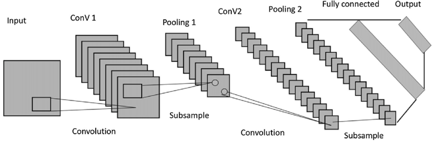
### 常见的池化操作
+ **最大池化(max pooling)**:从输入特征图的某个区域子块中选择值最大的像素点作为最大池化结果。
+ **平均池化(average pooling)**:计算区域子块包含的所有像素点的均值，将均值作为平均池化结果。
+ **K最大池化(K-max pooling)**:对输入特征图的区域子块中的像素点取前K个最大值，常用于自然语言处理中的文本特征提取。
## 正则化
+ 由于卷积神经网络中具有大量参数，为了缓解神经网络在训练过程中出现的过拟合问题，需要采取一些正则化技术来提升神经网络的泛化能力(generalization)。
+ 常用的正则化方法包括：
  1. Dropout（随机丢掉一部分神经元）
  2. L1/L2正则化
  3. 批归一化(Batch-Normalization)  

这里不详细展开。
+ 最后给一段卷积神经网络的示例代码：
```python
class CNN(nn.module):
  def __init__(self,num_classes=16):
    super().__init__()
    # 4个卷积层
    self.conv1=nn.Conv2d(3,32,kernel_size=3,padding=1)
    self.conv2=nn.Conv2d(32,64,kernel_size=3,padding=1)
    self.conv3=nn.Conv2d(64,128,kernel_size=3,padding=1)
    self.conv4=nn.Conv2d(128,256,kernel_size=3,padding=1)

    # 全局平均池化+全连接层
    self.fc=nn.linear(256,num_classes)
  
  def forward(self,x):
    x=F.relu(self.conv1(x))
    x=F.max_pool2d(x,2)

    x=F.relu(self.conv2(x))
    x=F.max_pool2d(x,2)

    x=F.relu(self.conv3(x))
    x=F.max_pool2d(x,2)
```
# 循环神经网络（Recurrent Neural Network,RNN）
+ 循环神经网络是一类处理**序列数据**（如文本句子、视频帧等）时所采用的网络结构。先前所介绍的前馈神经网络或卷积神经网络所需要处理的输入数据一次性给定，难以处理存在前后依赖关系的数据。
+ 循环神经网络的本质是希望模拟人所具有的记忆能力，在学习过程中记住部分已经出现的信息，并利用所记住的信息影响后续结点输出。循环神经网络在自然语言处理，例如语音识别、情感分析、机器翻译等领域有重要应用。
## 循环神经网络模型
循环神经网络结构及其展开形式示意图如下：
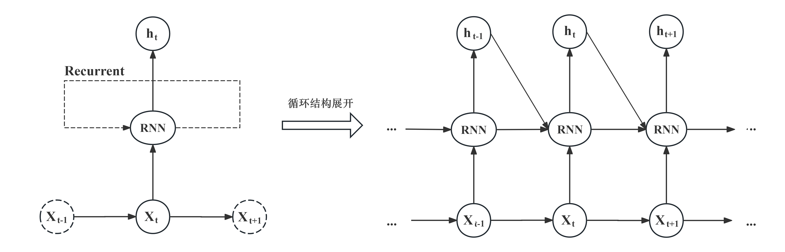
+ 由“循环”两字可知，循环神经网络在处理数据过程中构成了一个循环体。对于一个序列数据，在每一时刻$t$，循环神经网络单元会读取当前输入数据$X_t$和前一时刻输入数据$X_{t-1}$所对应的隐式编码结果$h_{t-1}$，一起生成$t$时刻的隐式编码结果$h_t$。接着将$h_t$后传，去参与生成$t+1$时刻输入数据$X_{t+1}$的隐式编码$h_{t+1}$。
+ 时刻𝑡所得到的隐式编码ℎ𝑡是由上一时刻隐式编码$h_{t−1}$和当前输入$X_t$共同参与生成的，这可认为隐式编码$h_{t-1}$已经“记忆”了$t$时刻之前的时序信息，或者说前序时刻信息影响了后续时刻信息的处理。与前馈神经网络和卷积神经网络在处理时需要将所有数据一次性输入不同，这体现了**循环神经网络可刻画序列数据存在时序依赖**这一重要特点。
+ 在时刻$t$，一旦得到当前输入数据$X_t$，循环神经网络会结合前一时刻$t-1$得到的隐式编码$h_{t-1}$，如下产生当前时刻隐式编码$h_t$：
  $$
  h_t=\Phi(U\times X_t+W\times h_{t-1})
  $$
+ 这里$\Phi(\cdot)$是激活函数，一般可为Sigmoid或者Tanh激活函数，使模型能够忘掉无关的信息，同时更新记忆内容。$U$与$W$为模型参数。从这里可看出，当前时刻的隐式编码输出$h_t$不仅仅与当前输入数据$X_t$相关，与网络已有的“记忆”$h_{t-1}$也有着密不可分的联系。（这比较像时序逻辑电路的状态方程&全加器）
+ 按照时间将循环神经网络展开后，可以得到一个和前馈神经网络相似的网络结构。这个网络结构可利用反向传播算法和梯度下降算法来训练模型参数，这种训练方法称为“**沿时间反向传播算法（backpropagation through time，BPTT）**”。由于循环神经网络每个时刻都有一个输出，所以在计算循环神经网络的损失时，通常需要将所有时刻（或者部分时刻）上的损失进行累加。
+ 在循环神经网络中，根据输入序列数据与输出序列数据中所包含“单元”的多寡，循环神经网络可以实现：
  + “多对多”（即输入和输出序列数据中包含多个单元，常用于机器翻译）；
  + “多对一”（即输入序列数据包含多个单元，输出序列数据只包含一个单元，常用于文本的情感分类）；
  + “一对多”（即输入序列数据包含一个单元，输出序列数据包含多个单元，常用于图像描述生成）三种模式。
+ 下面给出循环神经网络的示例代码：
```python
class RNNmodel(nn.Module):
  def __init__(self,vocab_size,embed_dim=128,hidden_size=256,num_layers=1,bidirectional=False,num_classes=2):
    super().__init__()
    self.embedding=nn.Embedding(vocab_size,embed_dim,padding_idx=1)#将整数token映射为向量
    self.rnn=nn.RNN(
      input_size=embed_dim,
      hidden_size=hidden_size,
      num_layers=num_layers,
      batch_first=True,
      bidirectional=bidirectional
    )
    self.num_directions=2 if bidirectional else 1
    self.fc=nn.Linear(hidden_size*self.num_directions,num_classes)
  
  def forward(self,x):
    embed=self.embedding(x)
    out,h=self.rnn(embed)
    last_layer_h = h[-self.num_directions:]        # shape: (num_directions, batch, hidden_size)
    last_h = last_layer_h.transpose(0,1).reshape(x.size(0), -1)
    logits=self.fc(last_h)
    return logits
```
## 梯度消失(gradient vanishing)与梯度爆炸(gradient exploding)
+ 下图以词性标注为例给出了一个输入序列数据$(X_1,\cdots,X_{t-1},X_t,X_{t+1},\cdots,X_T)$被循环神经网络处理的示意图：
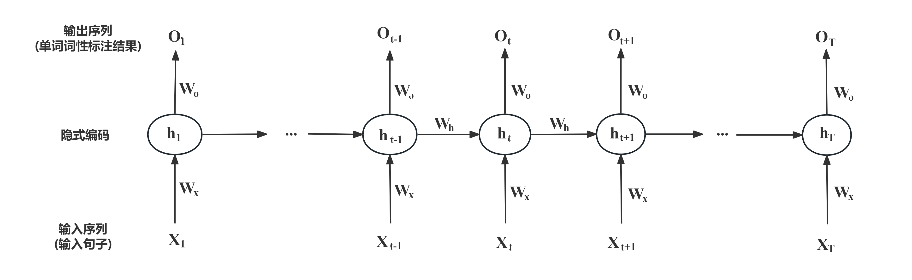
+ 在此图中，时刻$t$输入数据$X_t$（文本中的单词）的隐式编码为$h_t$、其真实输出为$y_t$（单词词性）、模型预测$X_t$的词性是$O_t$。参数$W_X$将$X_t$映射为隐式编码$h_t$、参数$W_o$将$h_t$映射为预测输出$O_t$、$h_{t-1}$通过参数$W_h$参与$h_t$的生成。图中$W_X$、$W_o$和$W_h$是复用参数。
+ 假设时刻$t$隐式编码如下得到：$h_t = \tanh(W_XX_t + W_hh_{t−1}+b)$。用交叉熵损失函数计算时刻$t$预测输出与实际输出的误差$E_t$。显然，整个序列产生的误差为：$E=\sum_{t=1}^TE_t$（原书上还有一个系数$\frac{1}{2}$，个人认为没必要加）。
+ 下面介绍如何根据时刻$t$所得误差来更新参数$W_X$。在时刻$t$计算所得$O_t$不仅涉及到了时刻$t$的$W_X$，而且也涉及了前面所有时刻的$W_X$，按照链式求导法则，$E_t$在对$W_X$求导时候，也需要对前面时刻的$W_X$依次求导，然后再将求导结果进行累加，即：
  $$
  \frac{\partial E_t}{\partial W_X}=\sum_{i=1}^t\frac{\partial E_t}{\partial O_t}\frac{\partial O_t}{\partial h_t}(\prod_{j=i+1}^t\frac{\partial h_j}{\partial h_{j-1}})\frac{\partial h_i}{\partial W_X}
  $$
  其中
  $$
  \prod_{j=i+1}^t\frac{\partial h_j}{\partial h_{j-1}}=\prod_{j=i+1}^t(\tanh)'\times W_h
  $$
  （这里可以结合上面的示意图：从$t$时刻开始，$E_t\rightarrow O_t$，然后从$O_t$到所有$X_i(1\leq i\leq t)$链式求导）
+ 由于$\tanh$函数的导数取值位于$0$到$1$区间，对于长序列而言，若干多个$0$到$1$区间的小数相乘，会使得参数求导结果很小，引发**梯度消失问题**。$E_t$对$W_h$的求导类似，这里就不列出了。为了解决梯度消失问题， **长短时记忆模型（Long Short-Term Memory，LSTM）** 被提出。
+ 另外，当权重参数初始化的值过大，会导致反向传播时梯度增长过快，产生梯度爆炸问题。
## 长短时记忆网络(LSTM)
+ 由Sepp Hochreiter和Jürgen Schmidhuber在1997年提出。论文：[LSTM](https://deeplearning.cs.cmu.edu/S23/document/readings/LSTM.pdf)
+ 与简单的循环神经网络结构不同，长短时记忆网络（Long Short-Term Memory，LSTM）中引入了内部记忆单元（internal memory cell）和门（gates）两种结构来对当前时刻输入信息以及前序时刻所生成信息进行整合和传递。在这里，内部记忆单元中信息可视为对“历史信息”的累积。
+ 常见的LSTM模型中有**输入门(input gate)**、**遗忘门(forget gate)** 和 **输出门(output gate)** 三种门结构。对于给定的当前时刻输入数据$x_t$和前一时刻隐式编码$h_{t-1}$，输入门、遗忘门和输出门通过各自参数对其编码，分别得到三种门结构的输出$i_t$、$f_t$和$o_t$。
+ 在此基础上，再进一步结合前一时刻内部记忆单元信息$c_{t-1}$来更新当前时刻内部记忆单元信息$c_t$，最终得到当前时刻的隐式编码$h_t$。   
+ 下表对长短时记忆网络中所需符号及其含义进行列举：

|符号|含义及表达式|
|:----:|:---------:|
|$X_t$|时刻$t$的输入数据|
|$i_t$|输入门的输出：$i_t=\operatorname*{sigmoid}(W_{Xi}X_t+W_{hi}h_{t-1}+b_i)$（$W_{Xi},W_{hi}$和$b_i$为输入门参数）|
|$f_t$|遗忘门的输出：$f_t=\operatorname*{sigmoid}(W_{Xf}X_t+W_{hf}h_{t-1}+b_f)$（$W_{Xf},W_{hf}$和$b_f$为遗忘门参数）|
|$o_t$|输出门的输出：$o_t=\operatorname*{sigmoid}(W_{Xo}X_t+W_{ho}h_{t-1}+b_o)$（$W_{Xo},W_{ho}$和$b_o$为输出门参数）|
|$c_t$|内部记忆单元的输出：$c_t=f_t\odot c_{t-1}+i_t\odot \tanh(W_{Xc}X_t+W_{hc}h_{t-1}+b_c)$（$W_{Xc},W_{hc}$和$b_c$为记忆单元的参数）|
|$h_t$|时刻$t$输入数据的隐式编码：$h_t=o_t\odot\tanh(c_t)=o_t\odot\tanh(f_t\odot c_{t-1}+i_t\odot \tanh(W_{Xc}X_t+W_{hc}h_{t-1}+b_c))$（输入门、遗忘门和输出门的信息$i_t,f_t,o_t$一起参与得到$h_t$）|
|$\odot$|两个向量中对应元素按位相乘（element-wise product）|
+ 输入门、遗忘门和输出门通过各自参数对当前时刻输入数据$X_t$和前一时刻隐式编码$h_{t-1}$处理后，利用sigmoid对处理结果进行非线性映射，因此三种门结构的输出$i_t$、$f_t$和$o_t$值域为$(0,1)$。正是由于三个门结构的输出值为位于0到1之间的向量，因此其在信息处理中起到了“调控开关”的“门”作用。三个门结构所输出向量的维数、内部记忆单元的维数和隐式编码的维数均相等。
+ 模型示意图如下：
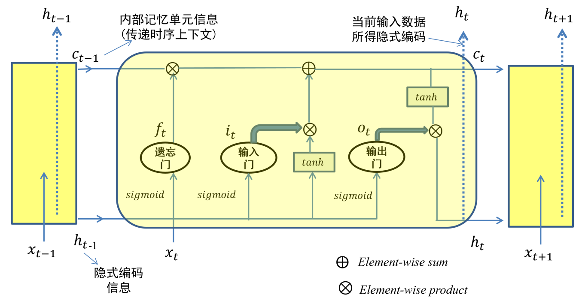   
在每个时刻$t$中只有内部记忆单元信息$c_t$和隐式编码$h_t$这两种信息起到了对序列信息进行传递的作用。每个时刻$t$只有$h_t$作为本时刻的输出以用于分类等处理。
+ 在内部记忆单元和隐式编码中，使用了tanh这一非线性映射函数而没有继续使用sigmoid非线性映射函数，其原因在于tanh函数的值域为$(−1,1)$，使得tanh函数在进行信息整合时可起到信息“增（为正）”或“减（为负）”的效果。
### LSTM如何克服梯度消失
对于$c_t=f_t\odot c_{t-1}+i_t\odot \tanh(W_{Xc}X_t+W_{hc}h_{t-1}+b_c)$，有如下求导结果的存在：
$$
\frac{\partial c_t}{\partial c_{t-1}}=f_t+\frac{\partial f_t}{\partial c_{t-1}}\times c_{t-1}+\cdots
$$
+ 可见，$\frac{\partial c_t}{\partial c_{t-1}}$求导的结果至少大于等于$f_t$，即遗忘门的输出结果。如果遗忘门选择保留旧状态，则这一求导结果就接近$1$（或者接近向量$1$），使得梯度是存在的，从而避免了梯度消失问题。也就是说，LSTM通过引入门结构，在从$t$到$t+1$过程中引入加法来进行信息更新，避免了梯度消失问题。
+ 整体来看，内部记忆单元信息$c_t$和隐式编码$h_t$这两种信息起到了对序列信息进行传递的作用。内部记忆单元信息$c_t$好比人脑的长时记忆、隐式编码$h_t$代表了短时记忆。
+ 下面给出长短时记忆网络的示例代码（与RNN非常类似）：
```python
class LSTMmodel(nn.Module):
  def __init__(self,vocab_size,embed_dim=128,hidden_size=256,num_layers=1,bidirectional=False,num_classes=2):
    super().__init__()
    self.embedding=nn.Embedding(vocab_size,embed_dim,padding_idx=1)
    self.lstm=nn.LSTM(
      input_size=embed_dim,
      hidden_size=hidden_size,
      num_layers=num_layers,
      batch_first=True,
      bidirectional=bidirectional
    )
    self.num_directions=2 if bidirectional else 1
    self.fc=nn.Linear(hidden_size*self.num_directions,num_classes)
  
  def forward(self,x):
    embed=self.embedding(x)
    out,(h,c)=self.lstm(embed)
    last_layer_h = h[-self.num_directions:]        # shape: (num_directions, batch, hidden_size)
    last_h = last_layer_h.transpose(0,1).reshape(x.size(0), -1)
    logits=self.fc(last_h)
    return logits
```
## 门控循环单元(gated recurrent unit,GRU)
+ 于2014年由KyungHyun Cho等人提出。论文：[GRU](https://arxiv.org/pdf/1412.3555)
+ 门控循环单元是一种对LSTM简化的深度学习模型。与长短时记忆网络相比，GRU不再使用记忆单元来传递信息，仅使用隐藏状态来进行信息的传递。因此，相比长短时记忆网络，GRU有更高的计算速度。
+ GRU只包含了更新门(update gate)和重置门(reset gate)两个门结构。与RNN，LSTM结构比较如下图（图源链接：[GRU](https://clay-atlas.com/blog/2020/06/02/machine-learning-cn-gru-note/)）：
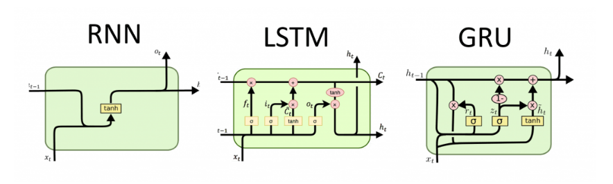

# 深度生成学习
+ 先前介绍的神经网络模型都属于判别模型，即从数据中提取出高层语义在数据中所蕴含的“模式”，并利用这些模式实现对数据的分类和检测等。与之相对的模型类型被称为**生成模型(generative model)**，生成模型需要学习目标数据的分布规律，以合成属于目标数据空间的新数据。（可以类比机器学习中的生成模型）
+ 以面向图像处理的生成模型为例，生成模型对满足标准概率分布(unit probability distribution)的随机变量$z$(如高斯分布或均匀分布)进行采样，通过参数化概率生成模型(如参数为$\theta$的深度神经网络)来生成合成图像，接着优化所得合成图像的概率分布$P_{generated}$与真实图像的概率分布$P_{real}$之间误差，使得两者分布+ 常见的深度生成模型包括变分自编码器(variational auto-encoder, VAE)、自回归模型（Autoregressive models）与生成对抗网络（generative adversarial network，GAN）等。
## 生成对抗网络（GAN）
生成对抗网络是由Ian Goodfellow等人于2014年提出的一种生成模型（论文：[GAN](https://arxiv.org/pdf/1406.2661)）,该模型可视为两个神经网络相互竞争的零和游戏(zero-sum game),“以子之矛，陷子之盾”,最终达到纳什均衡。
+ 生成对抗网络由一个 **生成器（generator，简称G）** 和一个 **判别器（discriminator，简称D）** 组成。GAN的核心是通过生成器和判别器两个神经网络之间的竞争对抗，不断提升彼此水平以使得生成器所生成数据（人为伪造数据）与真实数据相似，判别器无法区分真实数据和生成数据。
+ 模型示意图如下：
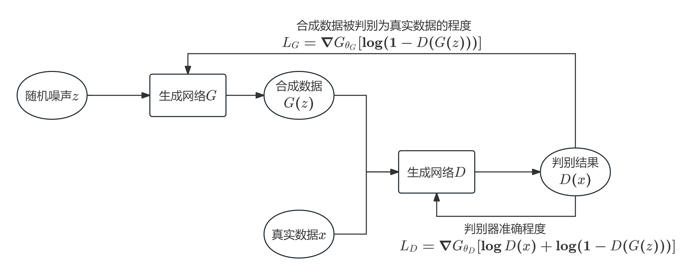
+ 在生成对抗网络中，生成网络$G$的输入$z$来自预定义的噪声分布$p_z(z)$,输出$G(z)$属于样本空间。判别网络$D$被用来判断哪些数据来自真实数据$x$以及哪些数据是合成数据，输出$D(x)$是一个表示$x$来自真实数据分布$p_{data}(x)$的概率。GAN训练的过程就是判别网络$D$和生成网络$G$分别尝试最大化和最小化如下价值函数$V(D,G)$:
$$
\min_G\max_DV(D,G)=\mathbb{E}_{x\sim p_{data}(x)}[\log D(x)]+\mathbb{E}_{z\sim p_z(z)}[\log(1-D(G(z)))]
$$
### 生成对抗网络算法
+ 虽然在理论上判别器$D$始终能够学到最准确的判别方式，但是如果在每轮对抗中都将$D$训练到最优情况，将会耗费大量的时间，而且将不可避免地导致$D$对训练数据产生过拟合现象。因此，在实际实现过程中，每轮对抗中先训练数轮$D$,再训练一轮$G$,如此交替地进行。（则类似于EM算法中的E步与M步交替优化的过程）
+ 具体算法实现如下~~实在懒得敲字了QAQ~~：
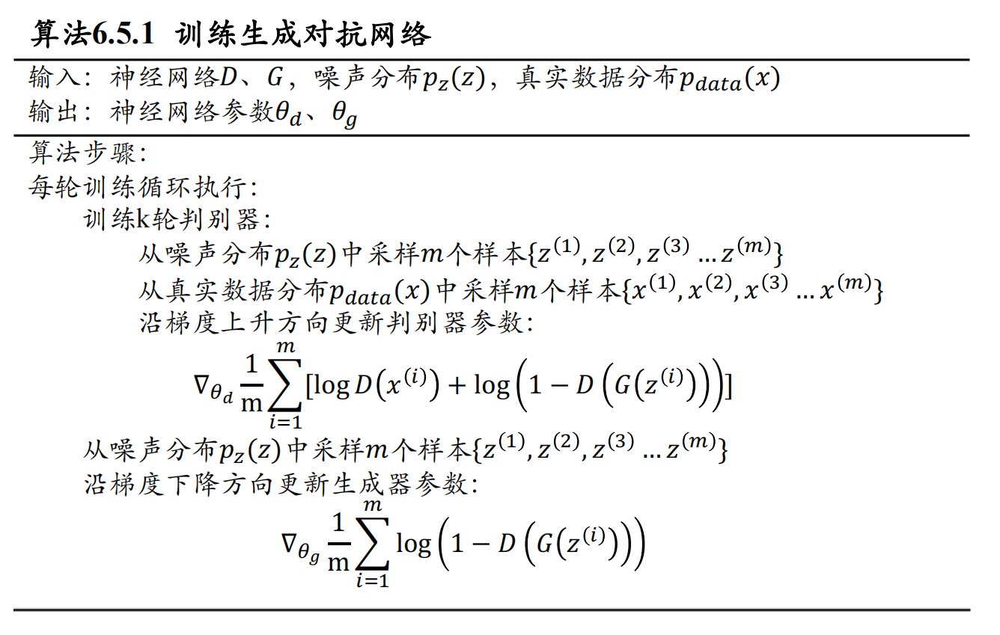
在训练初期，因为生成数据质量较低，判别器$D$可以轻易将其区分，此时$\log(1-D(G(z)))$无法为生成器$G$提供显著的梯度，因此可以使用$-\log D(G(z))$来代替损失函数。这么做并不会影响其能够收敛至最优解的性质，且可以在训练初期提供足够的梯度。
+ 在后续的应用中，发现GAN具有收敛困难，且非常依赖于选择合适的交替训练轮次等不足。为此，Martin Arjovsky等人提出了WassersteinGAN,对模型结构进行了一些修改。在Wasserstein GAN中，模型输出不使用以概率值形式输出的sigmoid激活函数，而是直接根据输出值大小评价其效果。相应地，目标函数中也不需要再取对数：
  $$
  \min_G\max_DV(D,G)=\mathbb{E}_{x\sim p_{data}(x)}[D(x)]+\mathbb{E}_{z\sim p_z(z)}[D(G(z))]
  $$
  此外，在每一轮参数更新后，需要将参数的值截断到绝对值不超过一个设定的常数$\epsilon$以确保网络满足李普希兹(Lipschitz)连续的条件。经过这些修改后的生成对抗网络仍然能在理论上被证明收敛于最优解，同时网络的训练效率得到了极大的提升。
### 条件生成对抗网络(CGAN)
略，前面的路以后再来探索吧。

# 深度学习应用
## 词向量模型(Word2Vec)
为了表达文本，“词袋”（Bag of Words）模型被采用，但是这一模型忽略了文本单词之间的依赖关系，仅仅将文本看作是单词的集合（忽略了单词之间的先后次序）。
+ 在词袋模型中，⼀个单词按照词典序被表示为一个词典维数大小的向量（被称为one-hot vector），向量中该单词所对应位置按照其在文档中出现与否取值为$1$或$0$。$1$表示该单词在文档中出现、$0$表示没有出现。每个单词被表达为单词向量后，以些与自然语言相关工作（如聚类、同义词计算、主题挖掘等）可以依次开展。
+ 使用词袋模型来表示单词时，往往会遭遇维度灾难的问题。除此之外，这种表达方法无法有效计算单词与单词之间的语义相似度。例如，“高兴”与“愉快”两个单词的向量表达会很不相同，虽然其具有很强的语义相似性。
+ 为了刻画不同单词之间的语义相关性，研究人员希望使用一种分布式向量表达(distributed vector representation)来对不同单词进行表达。利用深度学习模型，可将每个单词表征为$N$维实数值的分布式向量。这样一来可以把对文本内容的分析简化为$N$维向量空间中的向量运算，如两个单词在向量空间上所计算结果可用来衡量这两个单词之间的相似度。用深度学习算法生成每个单词的向量表达， **词向量(Word2Vec)** 是较为经典的模型。（于2013年被提出，论文：[word2vec](https://arxiv.org/pdf/1301.3781)）
+ 通常Word2Vec的模型参数有两种训练模式。⼀种是Continuous Bag-of-Words (CBoW)，即根据某个单词所处的上下文单词来预测该单词。另⼀种是Skip-gram，即利用某个单词来分别预测该单词的上下文单词。
+ 具体的模型原理在此省略（以后自然语言处理课程应该会涉及）。
## 图像分类和目标定位
话不多说，直接上图（具体细节同样省略）：
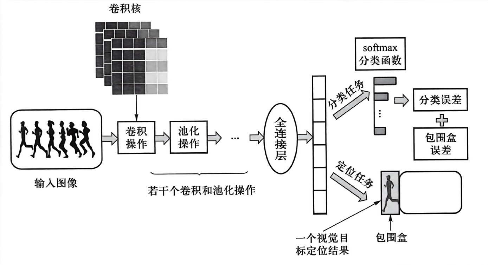

# 小结
+ 与手工构造特征不同，深度学习通过“端到端(end to end)”学习方式来形成对原始数据的有效特征表达，其基本动机在于通过构建多层网络来学习隐含在数据内部的关系，从而使学习得到的特征具有更强的表达能力和泛化能力。
+ 将深度学习应用于语义概念识别和理解时，一般思路是将深度学习得到的特征(如卷积神经网络中最后一个全连接层的输出以及词向量模型中经由隐藏层计算得到隐式编码)输入给分类模型(如softmax函数),然后根据损失函数计算所得“误差”来对模型进行优化。这一犹如“黑盒子”的学习机制使得深度学习结果缺乏解释性，从而难以可信(如易受到对抗样本攻击等)，如何将知识引入学习过程，得到可信安全、解释性更强、较少依赖标注大数据、自适应更好的深度学习方法是目前的研究热点。
