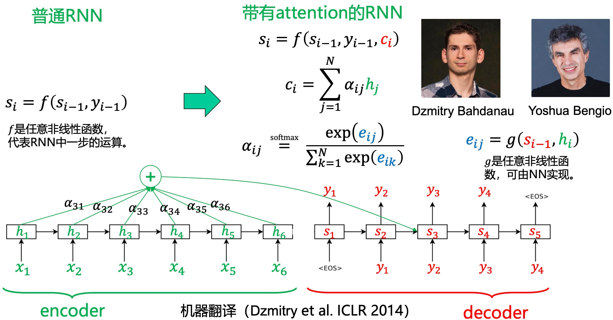
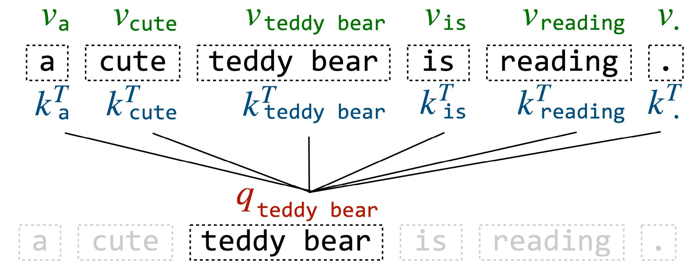
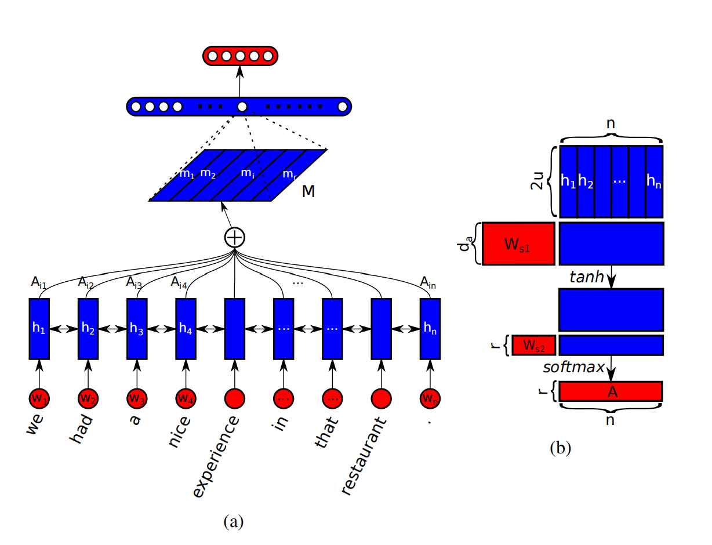
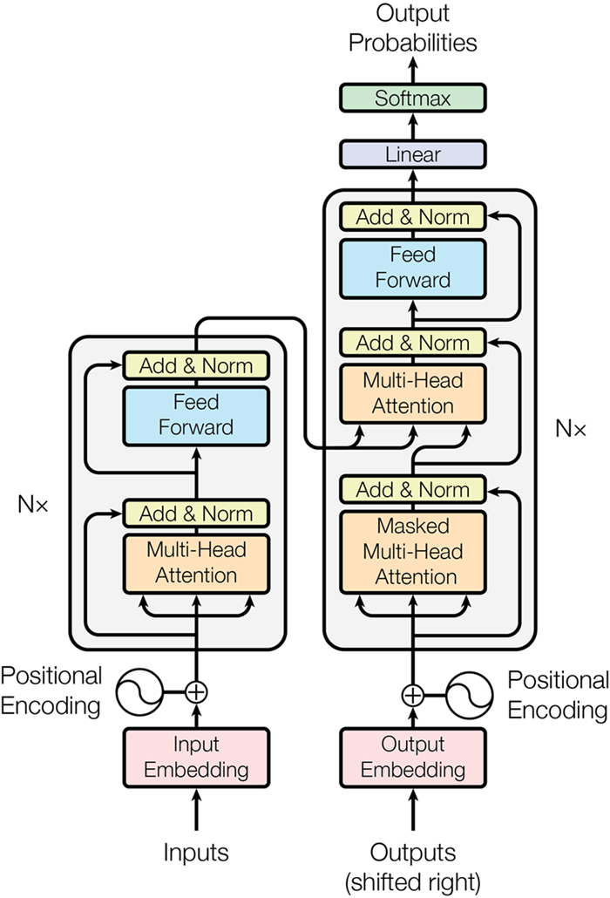
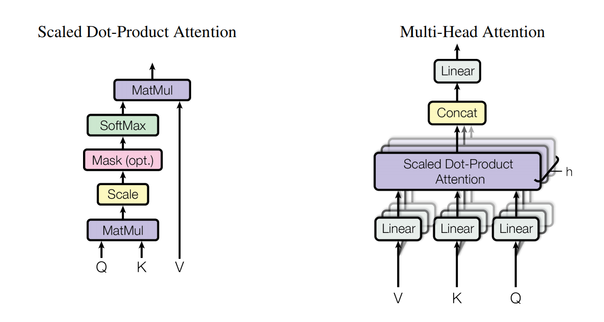
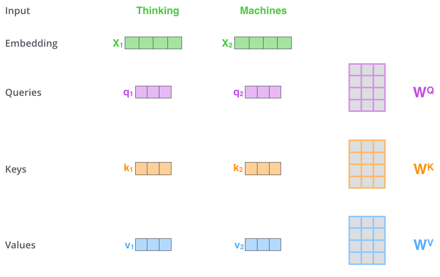
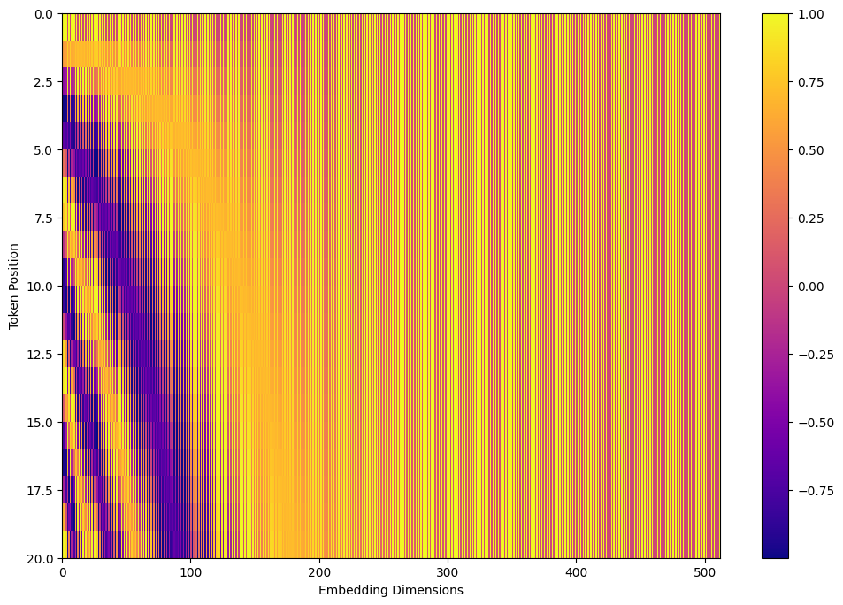
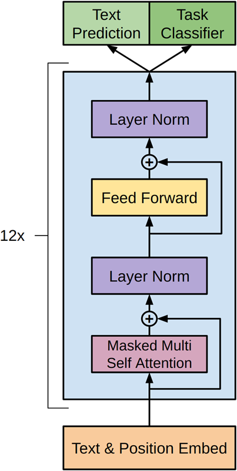

# 神经机器翻译（NMT）——语言模型的基石
+ 传统的**统计机器翻译**（SMT）通过学习**双语平行语料**（源语言+目标语言对照）与**单语语料**，利用极大似然估计函数得到**翻译模型**（源语言与目标语言词汇对应概率）与**语言模型**（源语言内部词汇搭配概率）。由这两个模型组成的翻译引擎通过枚举所有翻译的可能并计算每种可能翻译正确的概率，最终确定翻译结果。
+ SMT的缺点：
  + 需要加入大量人工规则，特征工程复杂，人工成本高
  + 只能看有限上下文，难以捕捉长距离依赖
  + 泛化能力弱，模型对新领域的语料适应性差
+ 因而，在2013年，Nal Kalchbrenner 和 Phil Blunsom 提出了一种用于机器翻译的新型端到端编码器-解码器结构（[RCTM](https://aclanthology.org/D13-1176.pdf)）。该模型可以使用卷积神经网络（[CNN](/posts/computer-science/introduction-to-ai/人工智能导论-ch7-深度学习/#卷积神经网络convolution-neural-networkcnn)）将给定的一段源文本编码成一个连续的向量，然后再使用循环神经网络（[RNN](/posts/computer-science/introduction-to-ai/人工智能导论-ch7-深度学习/#循环神经网络recurrent-neural-networkrnn)）作为解码器将该状态向量转换成目标语言。他们的研究成果可以说是**神经机器翻译**（NMT）的诞生。

## Seq2Seq与编码器-解码器（Encoder-Decoder）架构
+ 2014年，[Sutskever et al.](https://proceedings.neurips.cc/paper_files/paper/2014/file/5a18e133cbf9f257297f410bb7eca942-Paper.pdf) 和 [Cho et al.](https://aclanthology.org/D14-1179.pdf) 开发了一种名叫**序列到序列（Seq2Seq）** 学习的方法（即“先读取一段文本，再根据这段文本生成新的文本”），为 NMT 引入了 [LSTM](/posts/computer-science/introduction-to-ai/人工智能导论-ch7-深度学习/#长短时记忆网络lstm)），梯度爆炸/消失问题得到了控制，从而让模型可以远远更好地获取句子中的“长距依存”。
+ 这种架构通常包含一个Encoder来处理源文本，一个Decoder来生成目标文本。因而也被称为**Encoder-Decoder架构**（如下图所示，图源《动手学深度学习》第二版）。
+ 在上图中，特定的“\<bos\>”表示序列开始词元，“\<eos\>”表示序列结束词元。 一旦输出序列生成此词元，模型就会停止预测。
+ 在Encoder中，隐藏状态向量（图中蓝框）传递到最后一个token时，就得到语义编码向量（设为$C$），并传入Decoder。而在Decoder中，\<bos\>为解码器的输入序列的第一个token，与$C$以及初始隐藏状态一同输入得到第一个翻译的token，之后将上一个token及其隐藏状态和$C$作为输入，再通过激活函数得到输出概率分布，进而得到下一个翻译token，以此类推。用数学符号表示如下：
$$
\begin{gathered}
h_t=f(h_{t-1},y_{t-1},C) \\
P(y_t)=g(h_t,y_{t-1},C)
\end{gathered}
$$
+ 其中$h_t$为$t$时刻的隐藏状态（记$h_0$为初始隐藏状态，通常由Encoder的最后隐藏状态得到）；$y_t$为$t$时刻输出的token（记$y_0$为初始token，即\<bos\>），$P(y_t)$即为概率分布；$f,g$为激活函数。
+ 下面这张图展示了模型训练过程中编码器与解码器输入输出与相互作用的过程。其中FC代表全连接层，即将所有隐藏状态通过前馈神经网络映射到词表空间，得到概率分布。
  
（已经有transformer的雏形了doge）
## Attention机制
+ 虽然使用LSTM/GRU对序列信息进行处理效果已经较好，但仍然存在一些问题：
  + 由于循环神经网络$t$时刻的隐藏状态需要$t-1$时刻的隐藏状态确定，所以当序列文本较长时，训练与推理的速度就会变慢，并行效率低；
  + 远距离信息及梯度仍然需要多步传递，在句子很长时，开头的信息难以影响结尾（如果要减少信息衰减需要增加内存），因而对长句、跨从句语义理解能力有限；
  + Encoder把整句压成一个向量$C$，Decoder只能依赖这个向量生成全部输出，因而导致翻译质量随句长急剧下降。
+ 很多工作试图在RNN中添加各种各样的skip connection，来减少梯度传播所需经过的步数，但最终没有流行起来。
+ 最终，还是注意力机制成为了成功的解决方案。于是，我们终于可以端上——
+ 等一下！其实早在2014年，Dzmitry Bahdanau等人就在论文[NMT](https://arxiv.org/pdf/1409.0473)中首次提出了注意力机制，将其应用于Seq2Seq架构中（也被称为RNN Search模型）。具体实现如下：
  + Decoder在预测输出token时，不光使用前一步的RNN state（$s_{i-1}$），而且使用Encoder的所有RNN state（即$h_1\sim h_N$）的线性组合。
  + 每个$h_i$处所分到的线性组合权重由$s_{i-1}$与$h_i$共同决定。   
  + 示意图： 
  + 在此图中，$e_{ij}$为注意力权重，用于计算当前解码器隐藏状态$s_{i}$与每个编码器隐藏状态$h_j$的相关性（即注意力分数）；$\alpha_{ij}$使用Softmax函数将注意力分数转化为概率分布；$c_{ij}$为加权计算后的上下文向量。
+ ok，铺垫了这么久，现在可以把下面这篇传奇论文端上来了：[Attention is all you need](https://proceedings.neurips.cc/paper_files/paper/2017/file/3f5ee243547dee91fbd053c1c4a845aa-Paper.pdf)（Tips：在阅读下面的内容前，建议先观看3blue1brown对于注意力机制的解读视频：[Transformer](https://www.bilibili.com/video/BV1TZ421j7Ke/)）
  + 在这篇论文中，首先系统阐述了Self-Attention机制，这在机器翻译上效果提升显著。具体而言，其使用了以下概念：
    + **查询（Query）**：表示模型当前需要关注的目标或上下文（也被称为自主性提示）。它通常由解码器的隐藏状态生成，或者在自注意力机制中由输入序列的某个位置生成。Query 的作用是向输入序列“提问”，以找到与当前任务最相关的部分。
    + **键（Key）**：是输入序列中每个元素的特征表示（也被称为非自主性提示），用于与 Query 进行匹配。Key 通常由编码器的隐藏状态生成，或者在自注意力机制中由输入序列的各个位置生成。Key 的作用是作为 Query 的参考，用于判断哪些输入信息与当前任务相关。
    + **值（Value）**：与 Key 对应的具体信息，用于生成最终的输出。Value 的作用是携带输入序列中每个元素的内容信息，模型通过加权求和这些值来生成输出。
  + 示意图：
  + 有了这些概念，我们就可以引出下面这个著名的公式：
  $$
  \operatorname*{Attention}(Q,K,V)=\operatorname*{softmax}(\frac{QK^T}{\sqrt{d_k}})V
  $$
  + 其中$Q,K,V$分别为Query，Key和Value向量构成的矩阵，$d_k$为向量的维度。（关于具体公式的推导在此不详细展开，可参考3blue1brown的视频）
  + 当然，其实上面的RNN Search模型中已经使用了类似概念，其中$s_i$对应查询$q$，$h_j$对应键$k$以及值$v$，$g(s_{i-1},h_j)$对应$QK^T$。
## Self-Attention机制
+ 前面提到，Attention机制用于机器翻译，取得了很大的成功。那么对于文本分类、情感分析这种只有Encoder，没有Decoder的模型，能否应用Attention呢？
+ 在Attention出现之前，文本情感分析通常使用RNN的最后一个输出$h_N$或者在RNN和CNN的中间输出上使用max与mean pooling操作，以提取句子特征。
+ 而[Lin et al.](https://arxiv.org/pdf/1703.03130)在论文中提出可以让模型自己学习一组“固定”的 Query 参数，具体结构图如下：
+ 具体而言，在图(a)中，模型对每一个$h_i$进行加权求和，以取代取最后输出或max与mean pooling操作，其中权值$A_{ij}$由一个两层的全连接NN输出，再通过softmax得到。而注意力权重则使用了图(b)的流程——经过两个全连接层的权重矩阵，中间使用$\tanh$函数进行非线性激活。
+ 另外，论文中也计算了不止一个加权平均，而同时计算了多个（这便是后面会涉及的多头自注意力）
+ 在这个模型的基础上，把底部的RNN完全撤掉，对每一个$h_i$计算一组多头自注意力机制所得到的向量集，利用额外的positional embedding弥补撤掉RNN所引起的位置信息缺失，就得到了Transformer。
### Transformer模型
+ 我们直接用下面这张图进行解释：
   
+ 其中使用到的Attention模块如下：

+ 具体而言，Transformer中的Encoder由N个Self-Attention模块+前向传播层构成，而Decoder在Encoder的基础上增加了Masked Attention模块，这是因为在模型训练时，我们要让当前生成token之后的token不会影响到当前的token（即不会偷看“答案”，影响已经生成的结果）
+ 接下来我们逐步分析Transformer内部架构：
  1. Encoder   
   + 首先，文本先通过词元化(Tokenization)+Embedding转化为向量，输入到第一个Self-Attention层中，再通过三个矩阵$W_Q,W_K,W_V$（这些矩阵通过数据训练不断更新）对每个向量进行变换，分别得到向量$q_i,k_i,v_i$，如下图所示：   
   + 得到三个向量后，对于每个token，模型会计算其他token对当前token的注意力分数（通过其他token的向量$k$与当前token的向量$q$点乘得到）；  
   + 接下来，对注意力分数先除以$\sqrt{d_k}$以防止数值过大可能导致的梯度消失（以及使注意力分数更接近$0$，这样经过softmax后概率区分更明显），再使用softmax转化为$0$到$1$之间的概率权重（可以预见当前token对于自身的softmax权重往往最大）；    
   + 然后，将softmax得到的权重与原始向量相乘，再将所有结果相加，最终得到一个新的向量，并输入到前向传播层中。上述的这些过程示意图如下：   
       
   + 当然，实际操作中，这些向量都是以拼接而成的矩阵形式呈现，那么我们就可以再次写出下面这个公式：$\operatorname*{Attention}(Q,K,V)=\operatorname*{softmax}(\frac{QK^T}{\sqrt{d_k}})V$
  2. 多头注意力机制（Multi-head attention）
  + 在[Attention is all you need](https://proceedings.neurips.cc/paper_files/paper/2017/file/3f5ee243547dee91fbd053c1c4a845aa-Paper.pdf)中，研究者进一步将self-attention模型进行了优化，引入了多头注意力机制。流程示意图如下：
  
  + 通过使用多个Attention Head，对于单个token，模型可以得到多个处理后的向量（这样就可以捕捉到多个相关token的信息）。之后将向量拼接为一个矩阵，再与另一个矩阵$W_o$相乘，重新转化为一个向量。
  + 不过，还有一个问题没有解决：由于token的顺序变化对输出结果没有影响，所以目前的模型本质上仍然是一个bag-of-words模型。为了解决这一问题，在Transformer的Embedding中又加上了**位置编码（Positional Encoding）向量**，以体现token的先后顺序（这与RNN中的时序相对应）。
  + 下面是一段使用正弦与余弦函数的位置编码可视化代码，可以尝试玩一玩：
    ```python
    import numpy as np
    import matplotlib.pyplot as plt
    # Code from https://www.tensorflow.org/tutorials/text/transformer
    def get_angles(pos, i, d_model):
      angle_rates = 1 / np.power(10000, (2 * (i//2)) / np.float32(d_model))
      return pos * angle_rates

    def positional_encoding(position, d_model):
      angle_rads = get_angles(np.arange(position)[:, np.newaxis],
                              np.arange(d_model)[np.newaxis, :],
                              d_model)
      
      # apply sin to even indices in the array; 2i
      angle_rads[:, 0::2] = np.sin(angle_rads[:, 0::2])
      
      # apply cos to odd indices in the array; 2i+1
      angle_rads[:, 1::2] = np.cos(angle_rads[:, 1::2])
        
      pos_encoding = angle_rads[np.newaxis, ...]
        
      return pos_encoding

    tokens = 20 # token数量
    dimensions = 512 # 特征维度

    pos_encoding = positional_encoding(tokens, dimensions)
    print (pos_encoding.shape)

    plt.figure(figsize=(12,8))
    plt.pcolormesh(pos_encoding[0], cmap='viridis')
    plt.xlabel('Embedding Dimensions')
    plt.xlim((0, dimensions))
    plt.ylim((tokens,0))
    plt.ylabel('Token Position')
    plt.colorbar()
    plt.show()
    ```
    结果参考如下：
    
  1. 残差链接（Residual Connection）与归一化（Normalization）
   （这个部分不是特别理解，老师也没讲，还是直接上图）
   
  2. Decoder   
   在了解了Encoder的架构后，其实Decoder的架构和Encoder基本类似。那么就先分析一下Encoder的信息如何传入Decoder中，以及Decoder如何输出：
   + 首先，Encoder的最顶层得到一串带有输入token语义和位置信息的向量，作为$K$和$V$矩阵输入到Decoder的Attention层中（也被称为Cross-Attention），并与Decoder的$Q$矩阵进行运算（$Q$矩阵源自\<bos\>和Decoder输出的再输入）；
   + 得到输出后，Decoder将输出再输入进底层Self-Attention层中，如此循环直到输出\<eos\>（所以这也是为什么Decoder的Self-Attention需要进行Mask操作，让token只能与已经生成的token进行计算）。
  3. Linear+Softmax层
   最后，通过Encoder-Decoder得到的向量组需要转化为文本输出。首先，这些向量会经过一个Linear层（其实就是一个全连接的神经网络），将向量映射到一个**Logits向量**上（这个向量的长度等于所有已知token的数量，或者说词典的单词数）。然后，通过一层Softmax将向量值转化为概率值，并将概率最大值对应的token进行输出。
（注：以上图片、代码及相关内容参考了下面这个网站：[illustrated-transformer](https://jalammar.github.io/illustrated-transformer/)，也推荐读者去看看，最后也提到了Transformer的训练过程）
# Decoder-Only模型与GPT
+ 在OpenAI的论文[Radford, Alec, et al.](https://cdn.openai.com/research-covers/language-unsupervised/language_understanding_paper.pdf)中，GPT直接使用语言模型任务进行预训练，并采用类Transformer Decoder结构（即自回归结构）。具体示意图如下：

+ 与之前的Encoder-Decoder架构不同，在GPT的Masked Self-Attention层中，就已经完成了cross-attention的任务（其$K,V$矩阵均来自于前面已经生成的token），而历史token同时承担了encoder输出和decoder已经输出部分的角色。
+ 因而，GPT在自然语言生成的任务上表现突出，但由于LM任务的限制，只能建模上文信息，不能得到严格意义上的上下文相关词向量，所以不适合自然语言理解相关任务。
# 从GPT-3到ChatGPT
ChatGPT脱胎于GPT-3，是GPT-3的最大号模型经过更进一步的训练而来。该模型体量巨大，含有96层transformer层，每层96个attention heads，每个attention heads有128维。总计1750亿的参数量。
## GPT的训练数据
大部分训练数据来自于[Common Crawl dataset](https://commoncrawl.org/overview) (总计4100亿词), 用于训练的数据总量达到了约5000亿词，也即2~3TB的纯文本。并经过以下步骤的后处理:

## GPT的训练过程
+ **第一阶段：大规模预训练**
  + 其原理就是：让模型阅读一长段（可以达到数千个）文档之后，让他预测紧接着最后一个词的下一个词是什么。
+ **第二阶段：有监督微调、训练奖励模型与PPO**
  + 具体如下图：
  + 首先，利用和真人交互的记录来教会模型学着和人对话的语气。其次，将模型对同一个问句生成的若干不同样本交给真人排序，用排序的结果训一个奖励模型。最后，用奖励模型进一步训练GPT模型。
+ **第三阶段：RLHF**
  + RLHF (Reinforcement Learning from Human Feedback) ，即以强化学习方式依据人类反馈优化语言模型，是从GPT-3转化为对话模型ChatGPT的关键一步。其原理在于使用强化学习的方式直接优化带有人类反馈的语言模型。RLHF使得在通用文本数据语料库上训练的语言模型，能与复杂的人类价值观对齐。  
+ 参考链接：   
[机器翻译、Transformer与大模型](https://gair-nlp.github.io/cs2916/assets/files/lecture04-77ede8af63d20b89a1507d4c456a91cc.pdf)   
[LLM-Book Transformer模型](https://github.com/LLMBook-zh/LLMBook-zh.github.io/blob/main/slides/%E7%AC%AC%E4%BA%8C%E8%AF%BE%20%E6%A8%A1%E5%9E%8B%E6%9E%B6%E6%9E%84/2.1%20Transformer%E6%A8%A1%E5%9E%8B.pdf)
【注：笔者才发现老师课上用的PPT就是这两个的缝合doge】   
[GPT-3 overview](https://dzlab.github.io/ml/2020/07/25/gpt3-overview/)   
[拆解追溯 GPT-3.5 各项能力的起源](https://zhuanlan.zhihu.com/p/607522540)   
