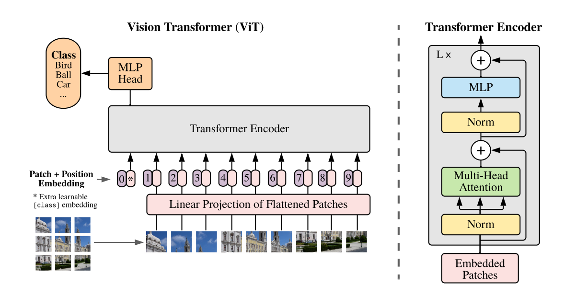
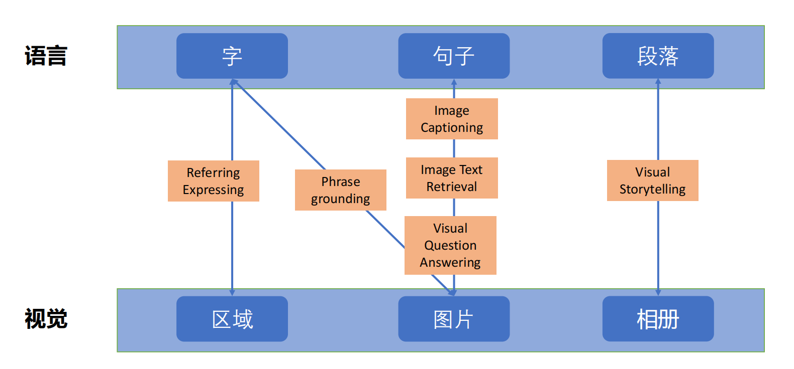
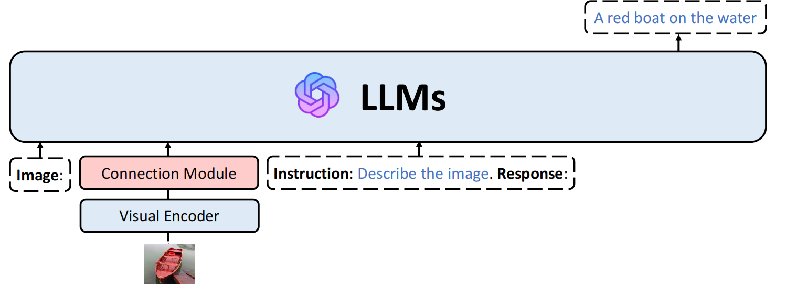
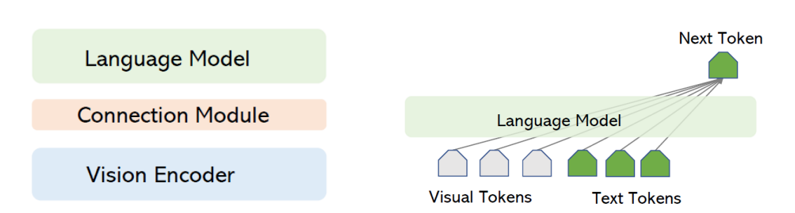
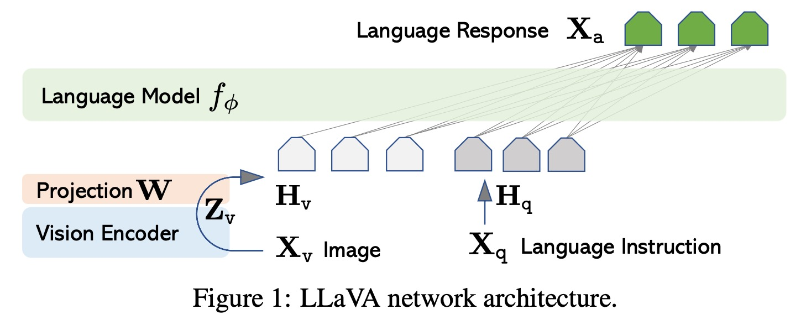
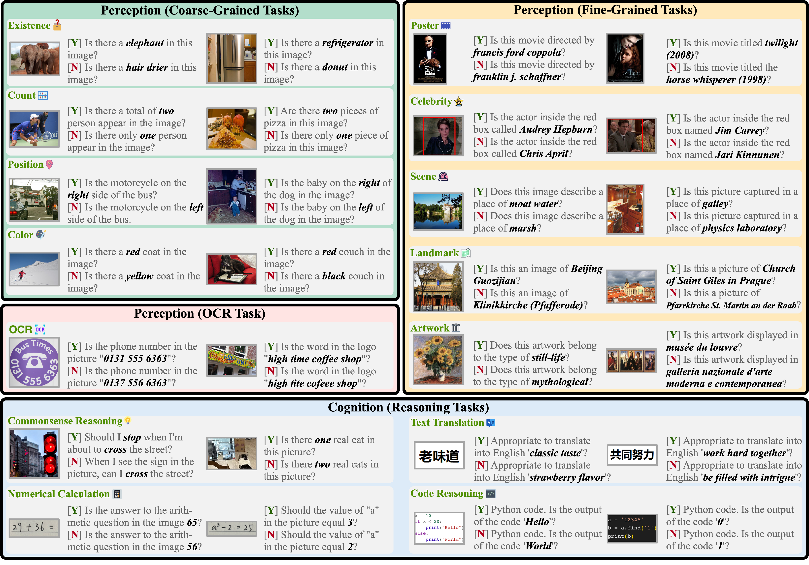

# 多模态大模型的基础——视觉编码器（Vision Transformer, ViT）
+ 回顾1：[卷积神经网络CNN](/posts/computer-science/introduction-to-ai/人工智能导论-ch7-深度学习/#卷积神经网络convolution-neural-networkcnn)
+ 回顾2：[Transformer架构](/posts/computer-science/introduction-to-ai/人工智能导论-ch8-大语言模型/#transformer模型)
+ 在Attention机制出现前，计算机视觉领域主要使用CNN进行图像处理。但是CNN存在以下缺点：
  + 受到归纳偏置的限制：CNN假设图像数据具有局部性和平移不变性，因而其更关注相邻像素间的关系（局部特征），而在处理图像整体特征时存在局限性。
  + 扩展与迁移能力弱：CNN通过多层卷积和池化操作，从低级特征（如边缘）逐步抽象到高级特征（如对象部件、整体物体），而如果要对模型扩展，堆叠网络层会使得优化稳定性降低，因而在处理大规模数据时会受限。
+ 前面提到，Attention机制在自然语言处理中具有显著优势，那么能否将注意力机制应用于计算机视觉领域中？
+ 在2018年，[Wang et al.](https://arxiv.org/pdf/1711.07971v1)对图像处理使用的CNN架构进行了改进，提出“Non-local 块”，与Self-Attention高度相似；而[Zhang et al.](https://proceedings.mlr.press/v97/zhang19d/zhang19d.pdf)则将Self-Attention引入生成对抗网络GAN中（即提出SAGAN），证明其在建模长期依赖方面的有效性。
## ViT的提出
+ 那么能否像Transformer一样直接抛弃传统神经网络架构，而使用纯Self-Attention进行图像（以及音频、视频等多模态）处理呢？
+ 注意：图像与文字不同，没有明显的时序特征，因而无法直接像自然语言处理那样直接将图像数据传入编码器中。那么应该怎么做呢？
+ 2020年，谷歌的研究团队在论文[An Image is Worth 16x16 Words: Transformers for Image Recognition at Scale](https://arxiv.org/pdf/2010.11929)，提出如下结构图：

+ 具体而言，这一模型将图像转化为一个$16\times 16$的patch序列，再将其展平为一个长度为$256$的向量，对其进行线性映射（高维转低维，为进入Encoder做准备），然后加入位置编码，送入Encoder中。另外，在位置编码的过程中，还会单独设立一个分类向量(Class Token)，用于储存图像的整体信息（如果是图像分类任务则可直接用于分类预测）
+ 注意到，在ViT模型中，只使用了Transformer的编码器，并没有使用解码器，这是因为ViT架构的主要任务是进行图像分类。当然，如果最后需要进行图像生成或文本生成，那就需要再加Decoder。
# ChatGPT之前的视觉语言预训练
+ 注：从本节开始，笔记内容主要根据以下课件进行编写：[从多模态联合预训练到多模态大语言模型：架构、训练、评测、趋势概览](http://fudan-disc.com/resource/users/zywei/file/2023-12-03-%E9%AD%8F%E5%BF%A0%E9%92%B0-%E5%A4%9A%E6%A8%A1%E6%80%81%E8%9E%8D%E5%90%88%E7%9A%84%E5%A4%A7%E6%A8%A1%E5%9E%8B%E6%A1%86%E6%9E%B6%E5%92%8C%E8%AF%84%E6%B5%8B-%E5%A4%8D%E6%97%A6%E5%A4%A7%E5%AD%A6.pdf)~~hhh老师又偷懒了~~
## 视觉—语言模态研究的整体框架
+ 底层模态：
  + 视觉层：像素$\Longrightarrow$区域$\Longrightarrow$图片$\Longrightarrow$相册（视频）
  + 语言层：字$\Longrightarrow$短语$\Longrightarrow$句子$\Longrightarrow$段落
+ 中间层模块：
  + 跨模态语义表示（将图像和文本映射到统一的语义空间）、跨模态语义对齐（文字与图像对应）等
+ 顶层任务：
  + 匹配（图文检索）、生成（图像描述、文生图）、推理（视觉问答、多模态推理）、导航（语言引导、路径规划）
## 视觉-语言模态的研究场景
1. 图像文本语义匹配，比如：
   + 给定一张图片，从句子集合中检索语义相关的句子。
   + 给定一个句子，从图片集合中检索语义相关的图片。
2. 视觉检测（Visual Detection）
   + 给定一个语言表达，确定图片中指代的目标物体。
   + 常使用[RefCOCO](https://huggingface.co/datasets/lmms-lab/RefCOCO)数据集
   + 使用重叠比例IoU（Intersection over Union：真实和预测的物体框）作为指标。如果 IoU 超过 0.5, 被认为真，否则为假。
3. 基于视觉的文本生成
   + 图片描述生成
   + 相册故事生成
   + 图片对话生成
4. 视觉语言问答（Visual Question Ansering）
   + 图片+问题——判断
5. 视觉常识推理（Visual Commonsense Reasoning）
   + 任务：给定一张图片、一些目标物体、一个问题、四个答案，   
  （1）让模型选择哪一个描述与图片是一致的   
  （2）让模型选择输出该答案的解释。
6. 视觉常识推理（[Visual COMET](https://visualcomet.xyz/)）
   + 给定一张图片和当前的某一个事件描述以及地点，生成该事件片前的事件，
当前事件的原因，后续时间片的事件。   

总关系图如下：

## 训练-推理统一的多模态预训练框架
+ [VL-BART](https://arxiv.org/pdf/2112.06825) 和 [OFA](https://arxiv.org/pdf/2202.03052) 将所有的任务改造成序列到序列（Seq2Seq）的格式
+ 在预训练阶段收集多个任务的样本（多模态、视觉模态、文本）
+ 扩充词汇表（视觉、文本、位置）

+ 小结（2023年前的预训练多模态模型）：
  + 在训练阶段利用不同粒度的语义对齐完成多模态语义表示学习
  + 在推理阶段使用不同的决策参数进行下游任务推理（初代预训练） 
  + 使用序列到序列的模式规整多种推理任务（OFA）
  + **假设：视觉模态和文本模态是平等的**
## 大视觉语言模型（Large Vision Language Model）
+ 随着2022年底ChatGPT的横空出世，其背后的：
  + 生成式预训练
  + 指令微调
  + 基于人类反馈的强化学习
+ 三阶段训练也引发广泛关注，或许会对视觉-语言等跨模态设定带来启发。比如，大模型从任务特定的微调到指令微调，这使得使语言模型与人类偏好一致，因而具有强大的泛化能力。
+ 那么大语言模型如何帮助多模态模型构建呢？
  + 大语言模型可以充当大脑，处理各种模态的信息（文本，视觉，听觉）；
  + 需要将其它模态信息对齐到大语言模型的语义空间
### 大视觉语言模型的通用解决方案（开源）
+ 使用大语言模型（LLMs）作为骨干+视觉编码器，并通过多模态数据进行生成式预训练+指令微调。示意图如下：

+ 训练步骤：
  1. 预训练
    + 让视觉表征对齐到大预言模型的语义空间
    + 使用图片-文本对进行语义对齐，如：图片描述生成任务
    + 通过自回归语言模型进行训练，最大化生成目标的似然概率
    + 示意图：
  2. 指令微调
    + 指令数据集构建
      + 基于现有有标注数据集合
      + 由ChatGPT/GPT-4辅助生成指令样本
    + 数据形式
      + 仅文本的指令数据集
      + 图文对的指令数据集
    + 指令微调
      + Loss：在回复的部分应用文本生成损失
### 大视觉语言模型的主流架构
+ **视觉编码器（Vision Encoder）**：ViT-L/14，ViT-G/14，ImageBind
+ **大语言模型（Language Model）**：FlanT5，LLaMA，Vicuna，LLaMA-2 Chat
+ **连接模块（Connection Module）**：
  + 线性层(Linear)：
    + 将Vision Encoder的输出经过一个线性层映射到LLM embedding的维度
    + 例：LLaVA, PandaGPT, Shikra
  + 适配器(Adapter)：
    + 将Vision Encoder的输出先降维，经过一个非线性映射后再升维
    + 例：LLaMA-Adapter V2,ImageBind-LLM
  + Q-Former(Query-based Transformer)：
    + 使用Transformer对Vision Encoder数据进行处理
    + 例：BLIP-2, InstructBLIP, MiniGPT-4, Cheetor, BLIVA
  + 感知器(Perceiver)：
    + 用一个固定大小的 latent space，反复“感知”高维输入。
    + 例：Lynx,Multimodal-GPT,mPLUG-Owl
+ 下面介绍LLaVA连接模块（论文：[LLaVA](https://arxiv.org/pdf/2304.08485)）：
  + 示意图：
  + 在这个模块中，视觉与语言数据作为输入，在通过一个矩阵将数据映射到另一个维度，输入进大模型中，最终得到输出；
  + 关于模型的Loss如何优化（预训练方式）：冻结视觉编码器和大语言模型的权重，并且最大化生成目标的似然概率（直接使用LLM的自回归交叉熵损失）
  + 指令微调阶段：
    + 冻结视觉编码器权重
    + 更新线性层和大语言模型
+ 另外补充一般的多模态大模型使用的损失函数：**InfoNCE**
  + 其核心方法为：将图文序列样本按顺序排成一个矩阵，取其对角线元素为正样本，非对角线元素为负样本，使用softmax+交叉熵计算样本相似度，优化目标为正样本距离最小化和负样本距离最大化。
### 多模态大模型指令微调（适配下游任务）
+ 在现实情况中，很难对所有参数（LLM，Visual Encoder，Connection Module）进行监督微调（需要大量数据与算力）。常见的轻量化监督微调（SFT）方式：
  1. 直接不训练（网络参数不变，直接调用大模型API）【但答案往往不符合需求】
  2. Few-Shot Learning（少样本学习）：向模型提供一些案例，让它模仿；
  3. 针对模型本身：
    + 提示词微调（prompt tuning）：将LLM的系统提示词prompt（角色扮演）进行动态更新（更新其参数）；
    + 适配器微调（adapter tuning）：对LLM里的MLP层进行参数更新；
    + LoRA 微调：对LLM的每一个block后加一个LoRA，进一步微调
    + 固定大模型其他参数不变。
# 大视觉语言模型的评测
+ 评测的本质是设立一个评价标准，通过打分检测大模型的训练效果。
+ 大模型评测需要一个全面、可靠且易于使用的评价基准，因而需要考虑以下问题：
  + 评价框架的设定：测试什么能力？
  + 测试集合的构建：使用什么测试样例？（未被训练的数据集）
  + 输出结果的评价：自由文本的输出怎么评估？（不一定有标准答案）
  + 语言模型的其它特性：输出的随机性？
## MME：一个系统化的多模态大模型评测基准
+ 论文：[MME](https://arxiv.org/pdf/2306.13394)
+ 涉及感知和认知，一共包括14个子任务
+ 问题二元形式化：让模型回答 yes [Y] 或 no [N]，示例：
+ 评价策略：
  1. **让模型回答“yes”或“no”**
     + 指令包括两部分，分别是一个简明的问题和一个描述“Please answer yes or no.”
     + 稳定性测试：对于每张测试图片，人工地设计两条指令，两条指令的问题不同，回答分别是“yes”和“no”。
  2. **评价指标**
     + “accuracy”是根据每个问题计算的。
     + “accuracy+”是根据每张图片计算的，其中两个问题都需要被正确回答。
     + 感知分数：是所有感知子任务的分数总和。
     + 认知分数：以相同的方式计算。
## MMBench：一个综合全面的评测基准
+ 论文：[MMBench](https://arxiv.org/pdf/2307.06281)
+ 其使用三个水平的能力维度（L-1到L-3），其中包括20种不同的子能力。（借鉴了心理学的评测维度）示意图：
+ 评价策略：
  + **循环评价策略**：循环评价将问题提供给VLM多次（使用不同的提示，调换答案的位置），并检查VLM是否在所有尝试中都成功解决了问题。
  + **基于ChatGPT的答案抽取**：为了解决VLM自由形式输出的问题，ChatGPT被利用来帮助抽取选择。
## 另一种评估方式：LLM-as-a-Judge
+ 略，直接甩上论文：[LLM-as-a-Judge](https://arxiv.org/pdf/2411.16594)
+ 简单来说就是大模型代替人（专家）评估大模型