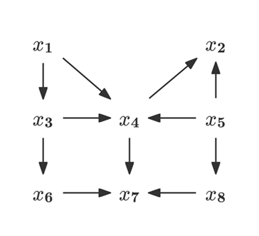
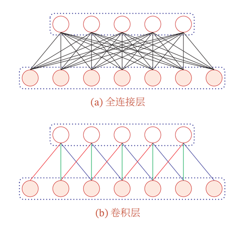
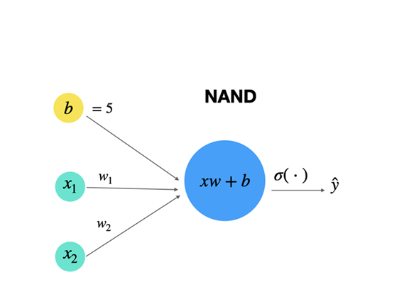
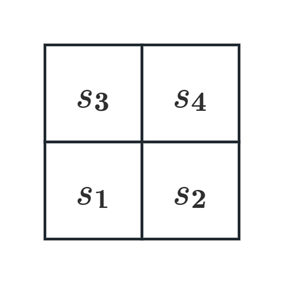
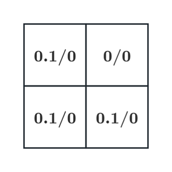

> **说明：** 本题集题源为老师上课课件、练手题以及教材课后习题，仅供参考。<Spoiler title="吐槽">实则为无法预测的命运之舞台doge</Spoiler>
# 逻辑与推理相关题目

  

    

      下面描述的问题哪个不属于因果分析的内容？
      <ul class="quiz-options list-none">
        <li class="quiz-option">如果商品价格涨价一倍，预测销售量（sales）的变化</li>
        <li class="quiz-option">如果广告投入增长一倍，预测销售量（sales）的变化</li>
        <li class="quiz-option">如果放弃吸烟，预测癌症（cancer）的概率</li>
        <li class="quiz-option" data-correct="true">购买了一种商品的顾客是否会购买另外一种商品</li>
      </ul>
      

        A: 属于干预
        B: 属于干预
        C: 属于反事实 
        D: 属于相关性分析（“关联”），未达到因果分析层次。（上面两个阶段才是）
      

    

  

  

    

    应用归结法证明以下命题集是不可满足的：
    $$
    \begin{align}
          \alpha&\lor\beta\\
          \beta&\rightarrow\gamma\\
          \lnot\alpha&\land\lnot\gamma.
    \end{align}
    $$
    

    
 
    
点击查看答案

    

      证明：由$(2)$蕴含消除得
      $$
      \begin{equation}
        \lnot\beta\lor\gamma
      \end{equation}
      $$
      由$(1)$与$(4)$归结得
      $$
      \begin{equation}
        \alpha\lor\gamma
      \end{equation}
      $$
      由$(3)$德摩根定理：
      $$
      \begin{equation}
        \lnot(\alpha\lor\gamma)
      \end{equation}
      $$   
      $(5)$与$(6)$矛盾，故无法同时满足。
    

    

  

  

    

    已知
    $$
    \begin{align}
    &(\forall x)(F(x)\rightarrow G(x)\lor H(x))\\
    &\lnot(\forall x)(F(x)\rightarrow G(x))
    \end{align}
    $$
    试证明$(\exists x)(F(x)\land H(x))$。
    

    
 
    
点击查看答案

    

      证明：
      $$
      \begin{align}
      &\exists(x)\lnot(F(x)\rightarrow G(x))\quad(\text{由}(8)\text{得})\\
      &\exists(x)\lnot(\lnot F(x)\lor G(x))\quad((9)\text{蕴含消除})\\
      &\exists(x)(F(x)\lor\lnot G(x))\quad(\text{由}(10)\text{得})\\
      &F(a)\land\lnot G(a)\quad(\text{由}(11)\text{得})\\
      &F(a)\quad(\text{由}(11)\text{得})\\
      &\lnot G(a)\quad(\text{由}(11)\text{得})\\
      &F(a)\rightarrow G(a)\lor H(a)\quad(\text{由}(7)\text{全称量词消去})\\
      &G(a)\lor H(a)\quad(\text{由}(13)\text{假言推理})\\
      &H(a)\quad(\text{由}(14)\text{与}(16)\text{得})\\
      &F(a)\land H(a) (\text{由}(13)\text{与}(17)\text{得})\\
      &(\exists x)(F(x)\land H(x))(\text{存在量词引入})
      \end{align}
      $$
    

    

  

  

    

    下面的因果图给出了不同变量之间的依赖关系： 
    
 
    （1）请写出图中$8$个变量之间的联合概率形式，并区分哪些变量是内生变量，哪些变量是外生变量；
    
 
    
点击查看答案

    

      $$
      \begin{aligned}
        &P(X_1,X_2,\cdots,X_8)\\
        =&P(X_1)\times P(X_2\mid X_4,X_5)\times P(X_3\mid X_1)\times P(X_4\mid X_1,X_3,X_5)\\
        &\times P(X_5)\times P(X_6\mid X_3)\times P(X_7\mid X_4,X_6,X_8)\times P(X_8\mid X_5)
      \end{aligned}
      $$
      所以外生变量为$X_1$和$X_5$，内生变量为$X_2,X_3,X_4,X_6,X_7,X_8$. 
    

    

    （2）写出$X_6$到$X_8$之间所有路径及其包含的结构，并给出五个可能的限定集$Z$，使其阻塞结点$X_6$和$X_8$。
    
 
    
点击查看答案

    

      节点$X_6$到$X_8$共$9$条路径：  
      $X_6\rightarrow X_7\leftarrow X_8$（包含汇连结构，阻塞需要$X_7$不在$Z$中）；   
      $X_6\leftarrow X_3\rightarrow X_4\rightarrow X_7\rightarrow X_8$（包含链、分连结构，阻塞需要$X_3$或$X_4$或$X_7$在$Z$中）；   
      $X_6\leftarrow X_3\rightarrow X_4\leftarrow X_5\rightarrow X_8$（包含分连、汇连结构，阻塞需要$X_3$或$X_5$在$Z$中，或$X_4$不在$Z$中）；   
      $X_6\leftarrow X_3\rightarrow X_4\rightarrow X_2\leftarrow X_5\rightarrow X_8$（包含链、分连、汇连结构，阻塞需要$X_3$或$X_4$或$X_5$在$Z$中，或$X_2$不在$Z$中）；    
      $X_6\leftarrow X_3\leftarrow X_1\rightarrow X_4\rightarrow X_7\rightarrow X_8$（包含链、分连结构，阻塞需要$X_1$或$X_3$或$X_4$或$X_7$在$Z$中）；  
      $X_6\leftarrow X_3\leftarrow X_1\rightarrow X_4\leftarrow X_5\rightarrow X_8$（结构及阻塞条件略，下同）；  
      $X_6\leftarrow X_3\leftarrow X_1\rightarrow X_4\rightarrow X_2\leftarrow X_5\rightarrow X_8$；  
      $X_6\rightarrow X_7\leftarrow X_4\leftarrow X_5\rightarrow X_8$；  
      $X_6\rightarrow X_7\leftarrow X_4\rightarrow X_2\leftarrow X_5\rightarrow X_8$；   
      综上所述，阻塞$X_6$到$X_8$需要$Z$包含$\{X_3\}$或$\{X_4,X_5\}$且不包含$X_7$（具体列举省略）。
    

    

  

# 机器学习（监督学习）相关题目

  

    

      决策树建立过程中，使用一个属性对某个结点对应的数据集合进行划分后，结果具有高信息熵(high entropy)，对于结果的描述，最贴切的是（）。
      <ul class="quiz-options list-none">
        <li class="quiz-option">纯度高</li>
        <li class="quiz-option" data-correct="true">纯度低</li>
        <li class="quiz-option">有用</li>
        <li class="quiz-option">无用</li>
        <li class="quiz-option">以上描述都不贴切</li>
      </ul>
      

        在决策树中，信息熵用于度量数据的混乱程度，熵值越高表示纯度越低。
      

    

  

  

    

      Adaboosting的迭代中，从第$t$轮到第$t+1$轮，某个被错误分类样本的惩罚增加了，可能因为该样本（ ）。
      <ul class="quiz-options list-none">
        <li class="quiz-option" data-correct="true">被第$t$轮训练的弱分类器错误分类</li>
        <li class="quiz-option">被第$t$轮后的集成分类器（强分类器）错误分类</li>
        <li class="quiz-option">被到第$t$轮为止训练的大多数弱分类器错误分类</li>
        <li class="quiz-option">B和C都正确</li>
        <li class="quiz-option">A,B和C都正确</li>
      </ul>
    

  

  

    

      考虑下面一个数据集，它记录了某学生多次考试的情况，请根据提供的数据按要求构建决策树。
      |是否通过考试|是否认真复习|是否超常发挥|
      |:---------:|:--------:|:---------:|
      |是|是|否|
      |是|是|是|
      |是|是|否|
      |是|是|是|
      |是|是|否|
      |是|否|是|
      |否|否|否|
      |否|否|是|
    

    （1）根据信息增益率选择第一个属性，构建一个深度为$1$的决策树(根结点的深度为$1$)。
    
 
    
点击查看答案

    
  
    先计算整个数据集的信息熵：$S=-\frac{6}{8}\log\frac{6}{8}-\frac{2}{8}\log\frac{2}{8}\approx 0.8113$；  
    再计算特征“是否认真复习”的信息增益：
    $$
    \operatorname*{Gain}(D,A)=0.8113-\left(\frac{5}{8}\times 0+\frac{3}{8}\times 0.9183\right)\approx 0.4669
    $$
    其中$0$和$0.9183$分别为“是否认真复习”被分类为“是”和“否”的信息熵。   
    信息增益率：
    $$
    \operatorname*{Gain-ratio}(D,A)=\frac{0.4669}{-\frac{5}{8}\log\frac{5}{8}-\frac{3}{8}\log\frac{3}{8}}\approx 0.4892
    $$
    类似可得特征“是否超常发挥”的信息增益为$0.8113-\left(\frac{1}{2}\times 0.8113+\frac{1}{2}\times 0.8113\right)=0$，故信息增益率也为$0$。   
    因此第一个属性选择“是否认真复习”，构建决策树：   
    根结点：是否认真复习？   
      若是，则预测“通过考试=是”。  
      若否，则预测“通过考试=否”。  
    

    

    （2）根据信息增益率构建完整的决策树。请回答，这两个决策树的决策结果是否和训练数据一致，并解释说明。
    
 
    
点击查看答案

    
  
    基于第一问结果，构建完整决策树：
      根结点：是否认真复习？  
      若是，则叶结点预测“通过考试=是”。   
      若否，则根据“是否超常发挥”划分：  
      若超常发挥=否，则叶结点预测“通过考试=否”。   
      若超常发挥=是，则叶结点预测类别需确定。由于该分支两个样本类别各半，通常取多数类，但此处平局。若取父结点多数类（否），则预测“通过考试=否”；若取“是”，则预测“通过考试=是”。这里按常见做法取“否”。   
      分析决策结果是否和训练数据一致：对于第一个决策树，有一个错误分类结果（第六行）；对于第二个决策树，无论“认真复习=否”且“超常发挥=是”时分类为“是”或“否”，都会有一个错误分类结果（第八行或第六行）。这是因为样本中属性完全相同时，存在不同的结果，而缺乏进一步划分的属性。
    

    

  

# 机器学习（无监督学习）相关题目

  

    

    结合[掷硬币的例子](/posts/computer-science/introduction-to-ai/人工智能导论-ch6-机器学习下/#二硬币投掷例子)，根据如下$5$轮(每轮投掷$10$次硬币)观测的结果，使用EM算法分别估计硬币$A$和硬币$B$被投掷为正面的概率。  
   |轮次|||||||||||
   |:---:|:---:|:---:|:---:|:---:|:---:|:---:|:---:|:---:|:---:|:---:|
   | 1 | H | H | T | T | T | T | T | H | T | H |
   | 2 | T | T | H | T | H | H | H | H | T | H |
   | 3 | T | T | T | T | T | T | T | T | T | T |
   | 4 | H | T | H | H | H | H | H | H | H | H |
   | 5 | H | T | T | T | H | H | T | H | H | T |
   

    
 
    
点击查看答案

    
  
      参考答案（具体计算略，可参见笔记）：
      初始化两枚硬币的概率为 $0.30$ 和 $0.70$
      | 迭代次数 | 硬币$A$为正面次数 | 硬币$A$为反面次数 | 硬币$B$为正面次数 | 硬币$B$为反面次数 | 硬币$A$投掷正面概率$\theta_A$|硬币$B$投掷正面概率 $\theta_B$ |
      | --- | --- | --- | --- | --- | --- | --- |
      | 1 | 6.82 | 18.19 | 17.18 | 7.81 | 0.27 | 0.69 |
      | 2 | 1.89 | 21.12 | 22.11 | 4.87 | 0.08 | 0.82 |
      | 3 | 1.52 | 15.16 | 22.48 | 10.83 | 0.09 | 0.67 |
      | 4 | 1.09 | 10.36 | 22.91 | 15.64 | 0.09 | 0.59 |
      | 5 | 1.01 | 9.79 | 22.99 | 16.21 | 0.09 | 0.59 |
    

    

  

  

    

    对于高斯混合模型（GMM）的EM算法，M步主要计算（）： 
      <ul class="quiz-options list-none">
        <li class="quiz-option">隐变量$z_n$对应的后验概率$r_{nk}$</li>
        <li class="quiz-option" data-correct="true">混合系数$\pi_k$、均值$\mu_k$、协方差$\Sigma_k$的闭式更新</li>
        <li class="quiz-option">模型最优簇数$k$的确定值</li>
        <li class="quiz-option">样本$x_n$属于各高斯分量的似然概率</li>
      </ul>
      

        A: 属于E步计算内容   
        B: 这些都是模型的参数，在M步被重新计算，使得期望似然函数最大化   
        C: 属于超参数，在EM算法前给定   
        D: 属于E步计算内容   
      

    

  

  

    

    EM算法和K-均值聚类算法有着非常相似的迭代结构，可以说K-均值聚类算法是EM算法的一种特殊实现。如果将K-均值聚类中的聚类质心作为隐变量，试从EM算法角度来解释K-均值聚类算法，即描述K-均值聚类算法的E步骤和M步骤。
    

    
 
    
点击查看答案

    
  
    k-means算法可以被看做EM算法的一种特殊实现，其隐变量即为各聚类中心。  
    在E步骤中，通过欧氏距离来估计各数据点最有可能归属于哪个聚类中心；  
    在M步骤中，通过计算均值更新聚类中心位置来最大化这些数据点属于该聚类中心的可能性。  
    

    

  

# 深度学习相关题目

  

    

      以下哪一项不是深度学习存在的问题？（）
      <ul class="quiz-options list-none">
        <li class="quiz-option">可解释性差</li>
        <li class="quiz-option">需要大量标注数据</li>
        <li class="quiz-option">环境适应能力差</li>
        <li class="quiz-option" data-correct="true">需要手动选择特征</li>
      </ul>
      

        A: 深度学习的“黑箱模型”是其解释性差的原因；   
        B: 这是深度学习训练的瓶颈（需要大量高质量样本训练）；    
        C: 深度学习模型特征高度依赖环境，迁移学习难度较大；  
        D: 这恰恰是深度学习与传统机器学习的区别：深度学习的能够自动进行特征学习，不再依赖人工特征工程。 
      

    

  

  

    

      下面对误差反向传播(error back propagation,BP)描述不正确的是（）。
      <ul class="quiz-options list-none">
        <li class="quiz-option">BP算法是一种将输出层误差反向传播给隐藏层进行参数更新的方法</li>
        <li class="quiz-option">BP算法将误差从后向前传递，获得各层单元所产生误差，进而依据这个误差来让各层单元修正各单元参数</li>
        <li class="quiz-option">对前馈神经网络而言，BP算法可调整相邻层神经元之间的连接权重大小</li>
        <li class="quiz-option" data-correct="true">在BP算法中，每个神经元单元可包含不可偏导的映射函数</li>
      </ul>
      

        映射函数必须可导，否则反向传播无法进行。
      

    

  

  

    

      下列对感知机的描述哪个是错误的？( )
      <ul class="quiz-options list-none">
        <li class="quiz-option">感知机的参数包括权重和偏置</li>
        <li class="quiz-option">感知机可以表示与、或、非逻辑电路</li>
        <li class="quiz-option">$2$层感知机可以表示异或门</li>
        <li class="quiz-option" data-correct="true">理论上感知机不能近似所有实数空间中的有界闭集函数</li>
      </ul>
      

        A: ✅️    
        B: 这三种逻辑对应的问题都是线性可分的（即可以用一条直线将正负样本分开）   
        C: 虽然异或门属于非线性可分问题，但$2$层感知机可以用一层隐藏层将其转化为几个线性可分问题的组合（如$x_1\oplus x_2=(x_1\lor x_2)\land\lnot(x_1\land x_2)$）    
        D: 根据[通用近似定理](https://zh.wikipedia.org/wiki/%E9%80%9A%E7%94%A8%E8%BF%91%E4%BC%BC%E5%AE%9A%E7%90%86)（Universal Approximation Theorem），一个两层的前馈神经网络（只要隐藏层足够大，且使用非线性激活函数），就可以逼近任意连续函数。
      

    

  

  

    

      关于sigmoid激活函数，下列描述正确的是( )。
      <ul class="quiz-options list-none">
        <li class="quiz-option">它是凸函数，凸函数无法解决非凸问题</li>
        <li class="quiz-option">它可以有负值</li>
        <li class="quiz-option">它无法配合交叉熵损失函数使用</li>
        <li class="quiz-option" data-correct="true">当输入值过大或者过小时，梯度趋近于$0$，容易造成梯度消失问题</li>
      </ul>
      

        A: sigmoid函数在$(-\infty,0)$上为凸函数，而在$(0,\infty)$上为凹函数   
        B: sigmoid函数的值域为$(0,1)$   
        C: 二者完全可以结合使用（sigmoid的输出作为交叉熵的概率输入）   
        D: 因为sigmoid导数$\sigma'(x)=\sigma(x)(1-\sigma(x))$，所以当$|x|\to\infty$时，$\sigma'(x)\to 0$，因而易造成梯度消失问题
      

    

  

  

    

      下面对前馈神经网络这种深度学习方法描述不正确的是( )。
      <ul class="quiz-options list-none">
        <li class="quiz-option">是一种端到端学习的方法</li>
        <li class="quiz-option">是一种监督学习的方法</li>
        <li class="quiz-option">实现了非线性映射</li>
        <li class="quiz-option" data-correct="true">隐藏层数目大小对学习性能影响不大</li>
      </ul>
      

        A: 原始输入直接到输出（无人工特征设计）  
        B: 训练数据带标签，常用于分类/回归（注：基础的神经网络（CNN,RNN,GAN）均属于监督学习，无监督学习的神经网络包括VAE，对比学习模型等）  
        C: 非单层感知机均属于非线性映射     
        D: 隐藏层数目太少会导致欠拟合，太多可能会导致梯度消失/爆炸或过拟合   
      

    

  

  

    

      以下全连接层和卷积层，各自的参数为多少？ 
      (a) 35。
      (b) 3。  
      

        (a)全连接层参数为$7\times 5=35$；     
        (b)卷积层参数为$3$（对应红、绿、蓝三条线权重）   
      

    

  

 
  

    

      请写出卷积维度计算公式（给定输入维度$W$，卷积核维度$F$，步长$S$，填充维度$P$）$N=$$\lfloor\frac{W+2P-F}{S}\rfloor+1$。
    

  

  

    

    考虑神经网络中的一个神经元（如下图）： 
       
    其接收两个输入$x_1,x_2\in\{0,1\}^2$，计算其线性组合，并进入激活函数$\sigma(z)$，具体如下：
    $$
    \sigma(z)=\left\{
        \begin{aligned}
          &1,\hspace{1em} z\geq 0\\
          &0,\hspace{1em} \mathrm{otherwise}.
        \end{aligned}
    \right.
    $$
    偏置$b=5$。现需要用这个神经元实现与非门功能（当且仅当$x_1$与$x_2$均为$1$时，输出$0$）。请给出一组合适的权重$w_1$与$w_2$取值。
    

    
 
    
点击查看答案

    
  
      由题目要求可知，$w_1$与$w_2$需满足以下条件：
      $$
      \begin{aligned}
         w_1+w_2+5< 0\\
         w_1+5\geq 0\\
         w_2+5\geq 0
      \end{aligned}
      $$
      故$-5\leq w_1< 0,-5\leq w_2< -5-w_1$.（取$w_1=w_2=-3$即可）
    

    

  

  

    

      关于长短时记忆网络的详细结构（可见[LSTM](/posts/computer-science/introduction-to-ai/人工智能导论-ch7-深度学习/#长短时记忆网络lstm)），如下描述正确的是( )。
      <ul class="quiz-options list-none">
        <li class="quiz-option">如果输入$x_t$为$0$向量，则$h_t=h_{t-1}$ </li>
        <li class="quiz-option">如果$f_t$非常小或者为$0$,则误差不会被反向传播到较早的时间节点 </li>
        <li class="quiz-option" data-correct="true">$f_t,i_t$和$o_t$的输出是非负数</li>
        <li class="quiz-option">$f_t,i_t$和$o_t$的输出可以被看作是概率分布，其输出为非负数且和为$1$</li>
      </ul>
      

        A: $h_t=o_t\odot\tanh(c_t)=o_t\odot\tanh(f_t\odot c_{t-1}+i_t\odot \tanh(W_{Xc}X_t+W_{hc}h_{t-1}+b_c))$，$X_t=0$时$h_t=h_{t-1}$并不成立；   
        B: 如果$f_t$非常小或者为$0$，$c_{t}$到$c_{t-1}$的梯度流确实会被切断，但误差仍可通过其他门控单元回传至$h_{t-1}$及更早状态；    
        C: 因为这些门控单元都经过一个sigmoid函数；     
        D: 这三个门相互独立，没有和的限制   
      

    

  

# 强化学习相关题目

  

    

      下面对强化学习、监督学习和深度卷积神经网络学习的描述正确的是（  ）。
      <ul class="quiz-options list-none">
        <li class="quiz-option" data-correct="true">评估学习方式、有标注信息学习方式、端到端学习方式</li>
        <li class="quiz-option">有标注信息学习方式、端到端学习方式、端到端学习方式</li>
        <li class="quiz-option">评估学习方式、端到端学习方式、端到端学习方式</li>
        <li class="quiz-option">无标注学习、有标注信息学习方式、端到端学习方式</li>
      </ul>
      

        A: 原始输入直接到输出（无人工特征设计）    
        B: 训练数据带标签，常用于分类/回归（注：基础的神经网络（CNN,RNN,GAN）均属于监督学习，无监督学习的神经网络包括VAE，对比学习模型等）   
        C: 非单层感知机均属于非线性映射      
        D: 隐藏层数目太少会导致欠拟合，太多可能会导致梯度消失/爆炸或过拟合   
      

    

  

  

    

      在强化学习中，通过哪两个步骤的迭代，来学习得到最佳策略？（）。
      <ul class="quiz-options list-none">
        <li class="quiz-option" data-correct="true">价值函数计算与动作-价值函数计算</li>
        <li class="quiz-option">动态规划与Q-Learning</li>
        <li class="quiz-option">贪心策略优化与Q-learning</li>
        <li class="quiz-option">策略优化与策略评估</li>
      </ul>
      

        策略迭代由策略优化与策略评估两个步骤交替组成，策略评估指在当前策略下，计算或估计每个状态的价值
        （即价值函数计算与动作-价值函数的计算，包括动态规划、蒙特卡洛采样、时序差分算法）；   
        策略优化是根据评估出的价值函数，对策略进行调整（常使用贪心策略优化，如Q-learning）。   
      

    

  

  

    

      与马尔可夫奖励过程相比，马尔可夫决策过程引入了哪一个新的元素？（）
      <ul class="quiz-options list-none">
        <li class="quiz-option" data-correct="true">反馈</li>
        <li class="quiz-option">动作</li>
        <li class="quiz-option">终止状态</li>
        <li class="quiz-option">概率转移矩阵</li>
      </ul>
      

        $MRP=\{S,Pr,R,\gamma\},MDP=\{S,A,Pr,R,\gamma\}$，其中$A$即为动作（Action），代表智能体与环境的交互。 
      

    

  

  

    

    将[机器人寻路问题](/posts/computer-science/introduction-to-ai/人工智能导论-ch10-强化学习/#马尔科夫决策过程)简化为下面的$2\times 2$的网格：  
       
    假设有位于位置的机器人拟从$s_1$这一初始位置向$s_4$这一目标位置移动。
    机器人每次只能向上或者向右移动一个方格，到达目标位置$s_4$则会获得奖励且游戏终止，机器人在移动过程中如果越出方格（$s_d$）则会被惩罚且被损坏，并且游戏终止。
    奖励值定义如下：当$S_{t+1}=s_4$时奖励值为$1$，当$S_{t+1}=s_d$时惩罚值为$-1$，其他情况下奖励值为$0$。
    若折扣因子$\gamma=0.99$，智能体在$s_1,s_2,s_3$的策略都初始化为上，终止状态$s_4,s_d$的价值函数定义为$0$，试通过联立贝尔曼方程给出状态$s_1,s_2,s_3$的价值函数。
    

    
 
    
点击查看答案

    
  
    根据价值函数的贝尔曼方程联立方程组：
    $$
      \left\{
         \begin{aligned}
           & V_\pi(s_1)=R(s_1,\text{上},s_3)+\gamma V_\pi(s_3)=0+0.99\times V_\pi(s_3)\\
           & V_\pi(s_2)=R(s_2,\text{上},s_4)+\gamma V_\pi(s_4)=1+0.99\times V_\pi(s_4)\\
           & V_\pi(s_3)=R(s_3,\text{上},s_d)+\gamma V_\pi(s_d)=-1+0.99\times V_\pi(s_d)\\
           & V_\pi(s_4)=0\\
           & V_\pi(s_d)=0\\
         \end{aligned}
      \right.
    $$
    解得：
    $$
      \left\{
         \begin{aligned}
           & V_\pi(s_1)=-0.99\\
           & V_\pi(s_2)=1\\
           & V_\pi(s_3)=-1\\
         \end{aligned}
      \right.
    $$
    

    

  

  
  

    

    在上题中，若每个状态的价值函数都初始化为$0$，试优化智能体在状态$s_3$的策略。（提示：使用策略优化定理）
    

    
 
    
点击查看答案

    
 
    首先计算状态$s_3$选择上/右动作后分别所得动作-价值函数取值：
    $$
      \begin{aligned}
      q_{\pi}(s_{3},\text{上}) & =\sum_{s'\in S}P(s'|s_{3},\text{上})\left[R(s_{3},\text{上},s')+\gamma V_{\pi}(s')\right] \\
      & =1\times(-1+0.99\times 0)+0\times\cdots= -1 \\
      q_{\pi}(s_{3},\text{右}) & =\sum_{s'\in S}P(s'|s_{3},\text{右})\left[R(s_{3},\text{右},s')+\gamma V_{\pi}(s')\right] \\
      & =1\times(1+0.99\times 0)+0\times\cdots=1
      \end{aligned}
    $$
    根据动作-价值函数取值比较，智能体在$s_3$应选择向右一个方格的动作，以获得更大回报。
    于是，经过策略优化后，状态$s_3$处的新策略为$\pi'(s_3)=\argmax_aq_π(s_3,a)=\text{右}$，则将$s_3$处的策略从“上”更新为“右”。
    

    

  

  

    

    在上上题中，设下图表示算法的初始状态：    
    其中$a/b$表示对应状态的动作-价值函数的取值，斜线左侧的$a$表示$q_\pi(s,\text{上})$,斜线右侧的$b$表示$q_\pi(s,\text{右})$。  
    若$\alpha=0.5$,试给出Q-learning算法的一个片段的执行过程，并给出执行完该片段后每个状态的策略。
    

    
 
    
点击查看答案

    
 
    根据Q-learning算法，$s_1$为初始状态，根据当前策略求出智能体应该采取的动作$a=\argmax_aq_\pi(s_1,a)=\text{上}$，执行这个动作，得到奖励$R=0$和进入下一状态$s'=s_3$，因此可如下更新对应的动作-价值函数：
    $$
      \begin{aligned}
      q_{\pi}(s_{1},\text{上}) & \leftarrow q_\pi(s_1,\text{上})+\alpha[R+\gamma\max_{a'}q_\pi(s',a')-q_\pi(s_{1},\text{上})] \\
      & =0.1+0.5\times[0+0.99\times\max\{0,0.1\}-0.1]=0.0995
      \end{aligned}
    $$
    此时$s_1$状态的q函数更新为$0.0995/0$。接着，令当前状态为$s_3$，此时智能体应该采取的动作$a=\argmax_aq_\pi(s_3,a)=\text{上}$，执行这个动作，得到奖励$R=-1$和进入下一状态$s'=s_d$，因此可如下更新对应的动作-价值函数：
    $$
    \begin{aligned}
      q_{\pi}(s_{3},\text{上}) & \leftarrow q_\pi(s_3,\text{上})+\alpha[R+\gamma\max_{a'}q_\pi(s',a')-q_\pi(s_{3},\text{上})] \\
      & =0.1+0.5\times[-1+0.99\times\max\{0,0\}-0.1]=-0.45
      \end{aligned}
    $$
    此时算法达到终止状态$s_d$，该片段结束。此时$s_3$状态的q函数更新为$-0.45/0$，最终q函数为：
    |$-0.45/0$|$0/0$|
    |:-:|:-:|
    |$0.0995/0$|$0.1/0$|   

    此时每个状态的策略为：
    |$\rightarrow$|   |
    |:-:|:-:|
    |$\uparrow$|$\uparrow$|
    

    

  

