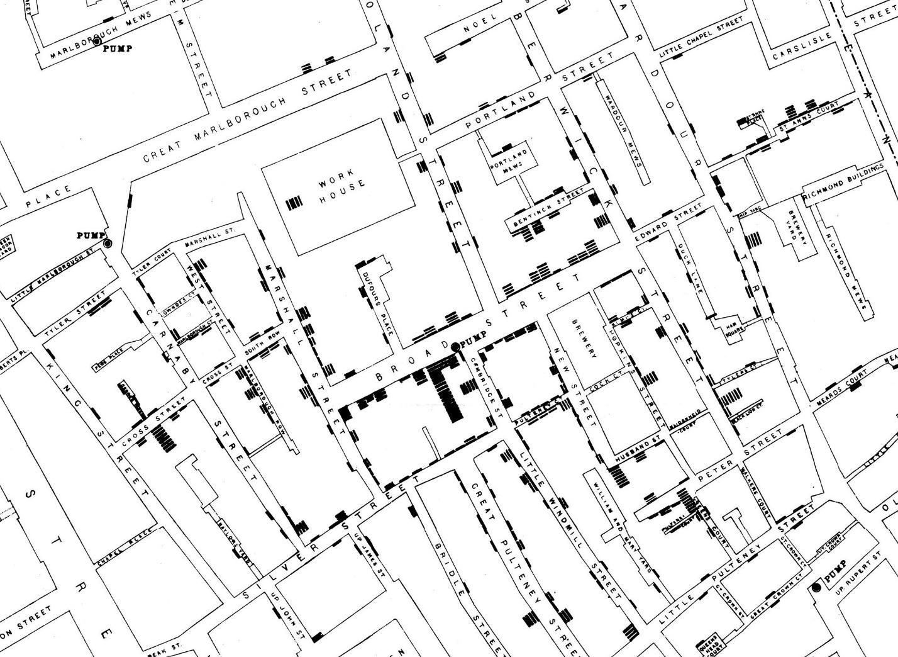
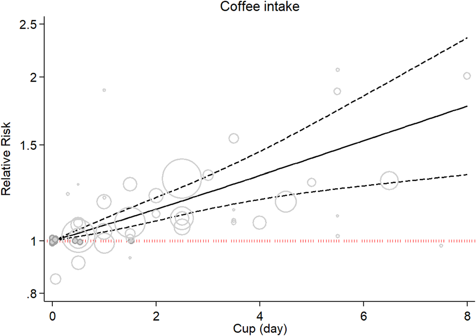

# 因果关系（Cause and effect）

- 在生活中，对于某些现象，我们往往希望能分析出其背后的原因。这时，我们可以通过对相关数据的分析得出因果关系。下面给出一些基本概念：
  1. **观察性研究（observational study）**：指研究者只观察数据、而没有直接参与数据产生的研究；与之相对的是**干预性研究（interventional study）**，即对研究对象施加某种特定的干预措施，以评估该措施对研究对象产生的效应或影响的研究。
  2. **处理（Treatment）**：可以理解为影响 **结果（Outcome）** 的可能因素。因果关系的核心问题就是处理是否对结果有影响。
  3. **个体（Individual）**：研究对象的基本单位。最常见的个体就是人。
- **因果关系（Causality）** 是在 **关联性（association）** 的基础上进一步得到的关系；关联性通常通过将研究对象分为对照组（control group）与处理组（treatment group）进行结果比较；因果关系还涉及到事件发生的先后顺序（“前因后果”）。
- 下面通过一个著名的例子进行阐释：

## 一个例子

- 在19世纪50年代，伦敦城市里的一些贫困地区霍乱（cholera）肆虐。当时的人们普遍认为，疾病产生的罪魁祸首是城市里的“瘴气”，即难闻的气味（如从腐烂物质发出的气味）。为了防止接触到瘴气，当时的人们或是用好闻的气味掩盖鼻子，或是取获取新鲜的空气。
- 然而，当时一位名叫约翰·斯诺（John Snow）的医生对这一看法持怀疑态度。因为他发现，有时一家人全部因霍乱死亡，其邻居却完全不受影响，即使他们暴露与同样的瘴气中。另一方面，他发现霍乱的症状往往伴随呕吐与腹泻，所以他怀疑疾病与人们吃喝的东西有关，于是他首先怀疑是饮用水的问题。
- 1854年8月底，斯诺开始记录伦敦街区因霍乱死亡的情况，并基于此绘制出一张分布地图（数据可视化雏形）：
  
  每个黑条代表一人因霍乱死亡。同时他也标注了街区水泵的位置。斯诺研究地图后发现，死亡病例集中于布罗德街水泵（Broad Street Pump）附近。具体而言：
  1. 一些死亡病例的地方虽然离鲁珀特街水泵相对更近，但由于鲁珀特街水泵位于一处死胡同，故这些人更常使用布罗德街水泵；
  2. 布罗德街上的啤酒厂（Brewery）没有死亡病例，这可能是因为厂里的工人有自己独立的水井饮水；
  3. 即使是离布罗德街水泵很远的死亡案例，经过调查发现他们也曾经饮用过布罗德街水泵的水。
- 之后的调查发现，原来是离布罗德街水泵只有几英尺远的化粪池发生了泄露，这才导致水泵里的水被污染了；斯诺通过证据说服当地政府将水泵的把手拆掉，虽然后续霍乱疫情整体呈下降趋势，但这一举措确实避免了更多可能的死亡。斯诺的研究为后续其他传染病疫情的防控提供了重要的参考。

## 从关联到因果关系

- 虽然地图为控制霍乱的传播提供了重要依据，但是斯诺仍然需要通过进一步的研究（比较对照组与处理组的结果）确定被污染水与霍乱的因果关系。
- 斯诺在之后的一段时间收集了两个供水公司（Lambeth 和 Southwark and Vauxhall (S&V)）供水区域的霍乱死亡数据。Lambeth的水源为泰晤士河上游，其受污水影响较小，而S&V的水源为下游，其受污水影响较大。
- 斯诺主要研究两家公司均有供水的区域，这样就能最大程度地控制其他条件相同（如房屋分布、经济情况等），只有供水不同。他得到的结果如下表：
  |供水区域 |房屋数量 |霍乱死亡人数 |每万户人家的霍乱死亡人数 |
  |:-----:|:------------:|:------------------:|:----------:|
  | S&V| 40,046 | 1,263 | 315 |
  | Lambeth | 26,107 | 98 | 37 |
  | Rest of London | 256,423 | 1,422 | 59 |

  结果很明显，S&V的供水有问题。最终，在1883年，罗伯特·科赫分离出了霍乱弧菌，正是这种细菌进入人体小肠才会引起霍乱。

- 斯诺在这个研究中的另一大贡献是在分析因果关系时使用了对照组与处理组的概念，这在一定程度上促进了 **流行病学（epidemiology）** 的发展。

## 混杂因素（Confounding）

- 在上面的例子中，有一个结论非常重要：在观察性研究中，如果处理组和对照组除了处理（treatment）外还存在其他差异，就难以得出关于因果关系的结论。
- 有时一些差异由于各种因素没有被控制，那么它们就会变为混杂因素影响最终得出的结论。

### 一个经典的例子：咖啡与肺癌

- 给出一张咖啡摄入量与肺癌风险的关系图（[图源](https://pmc.ncbi.nlm.nih.gov/articles/PMC11217372/)）：
  
- 在早期的研究中，看到这张图，研究者往往会直接得出喝咖啡会导致肺癌。然而，这个因果关系并不成立，因为这其中还有混杂因素——比如吸烟。喝大量咖啡的人可能也会吸烟，而吸烟的人可能会得肺癌。所以，这种关系图只能得出相关性，而不能得出因果性。
- 在观察性研究中，排除混杂因素的干扰也是非常重要的一部分。

## 随机化（Randomization）

- 不止观察性研究，干预性研究中同样需要排除混杂因素的影响。一个常用的方法是将个体随机分为对照组和处理组，再对处理组进行处理。除此之外，保证两组个体在别的方面相似。
- 上述方法也被称为**随机对照试验（randomized controlled trial, RCT）**。另外，为保证实验中个体不会感知到自己被分配到哪个组导致结果出现偏差，还会引入盲实验（blind experiment），即对个体施予药品或安慰剂，其中安慰剂外表与药品完全一样，但没有作用效果。【注：有时为了排除实验者的主观影响，还会使用双盲实验，即实验者也不知道个体属于处理组还是对照组】
- 这种实验常常用于医学领域，如今也拓展到了其他领域（如经济学）。

### 随机化的好处

- 在斯诺的研究中（虽然是观察性研究，但也可以用RCT），对照组与处理组的分配是没有经过研究对象自主选择的，但随机化的关键不止于此。实际上，随机化需要非常仔细地进行，其涉及到一些概率模型及定理。
- 这样随机化后的结果才能用数学语言明确解释（比如量化对照组与处理组结果存在巨大差异的可能性、对差异进行数学描述等），从而得出有效的结论。
- 当然，有时对处理组不容易直接进行处理（可能结果对其有害），那么就只能进行观察性研究，此时就需要更加注意混杂因素的影响。

## 总结

- 在后续课程将会详细介绍如何实施和分析自己的随机实验。目前，只需关注主要思想：尝试建立因果关系，如果可能的话，实施一个随机对照实验。
- 进行一项观察性研究时，你或许能够建立关联性，但要建立因果关系会更困难。
- 在根据观察性研究得出因果结论之前，务必对混杂因素保持极其谨慎。

参考资料：

- [The strange case of the Broad Street pump: John Snow and the mystery of cholera.](https://psycnet.apa.org/record/2006-23239-000)
- [Poor economics](https://dn790000.ca.archive.org/0/items/HistoryOfTheoriesAndIdeologiesThatGotUsInTheTurmoil/%5BAbhijit_Banerjee%2C_Esther_Duflo%5D_Poor_Economics.pdf)
